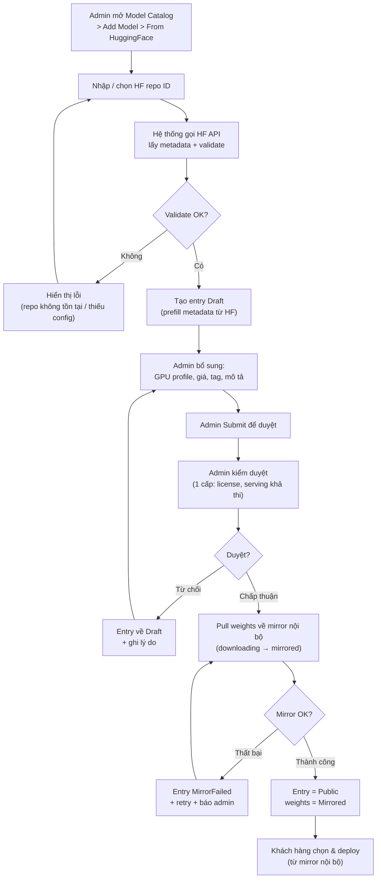
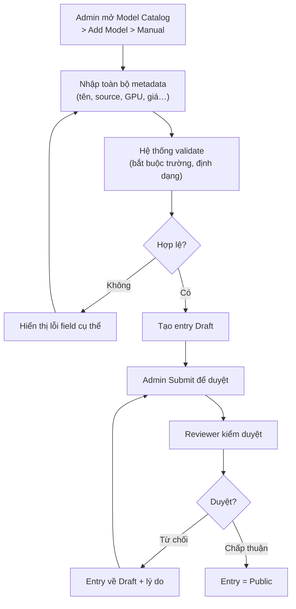
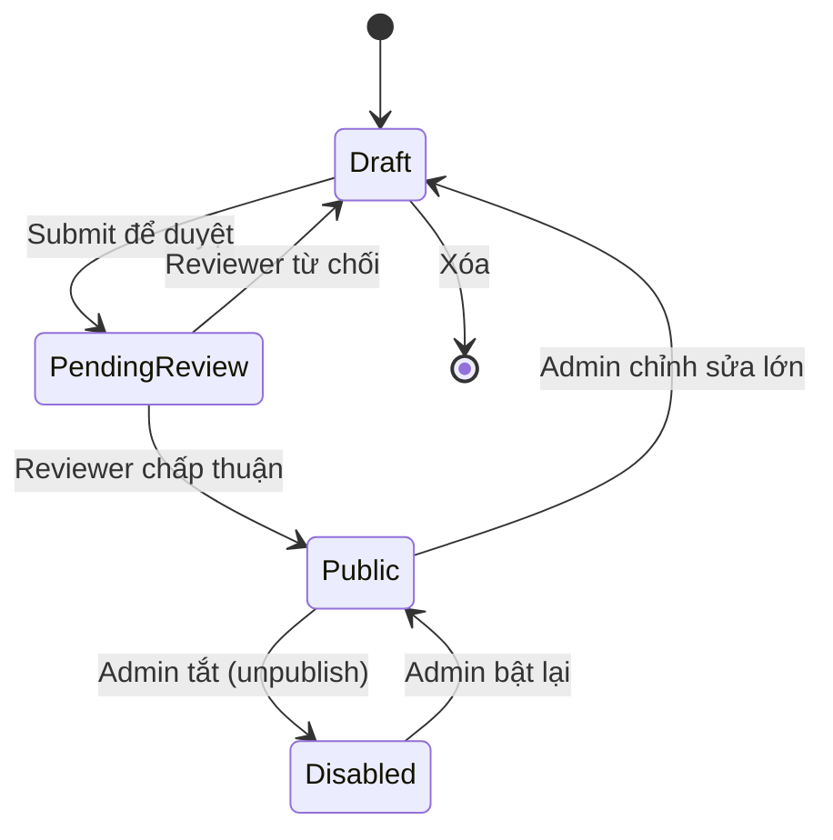

# BRD — Hệ thống Admin khai báo Model Catalog cho Dedicated Inference (DDI)

**Phiên bản:** 1.1
**Ngày:** 27/08/2026
**Trạng thái:** Draft — chờ duyệt phương án
**Chủ sở hữu:** Thuan Luu Thi (BA/PO)
**Phạm vi:** Phân tích phương án + yêu cầu cho màn hình/quy trình admin khai báo **Model Catalog** (danh mục model có sẵn để deploy dedicated)
**Liên quan:** `docs/market-research-fpt-ddi.md`, `docs/srs-ddi-my-endpoints.md`, `docs/product/spec-mvp.md`
**Nguồn API:** Postman collection "Portal Core DDI v2 (BFF) - 2026-06-23 Copy" (folder 9. Model Catalog (Admin))

---

## 1. Giới thiệu

### 1.1 Mục đích

Tài liệu này phân tích **các phương án** để đưa model vào **Model Catalog** của dịch vụ **Dedicated Inference (DDI)**, và xác định yêu cầu cho **hệ thống admin** quản lý catalog đó. Mục tiêu là trả lời câu hỏi:

> **"Làm sao để một model xuất hiện trong Model Catalog (cho khách hàng chọn và deploy)?"**

Hiện tại Model Catalog là danh mục model có sẵn do nền tảng cung cấp (xem `market-research-fpt-ddi.md` §"Model Catalog & Hạ tầng GPU"). Tài liệu này mở rộng phần đó: định nghĩa cách admin **thêm / sửa / xóa / kiểm duyệt** model trong catalog.

### 1.2 Người dùng mục tiêu

| Vai trò | Mô tả |
|---------|-------|
| **Catalog Admin (nội bộ FPT)** | Khai báo, kiểm duyệt, bật/tắt model trong catalog |
| **Platform Ops / MLOps** | Nhập model từ nguồn bên ngoài (HF Hub), gắn GPU profile, cấu hình serving |
| **Product Owner / Pricing** | Quyết định model nào public, giá, nhãn (tag), danh mục |

### 1.3 Thuật ngữ

| Thuật ngữ | Định nghĩa |
|-----------|------------|
| **Model Catalog** | Danh mục model có sẵn, hợp lệ để deploy dedicated |
| **Catalog Entry** | Một bản ghi model trong catalog (metadata + cấu hình deploy) |
| **Source (nguồn)** | Nơi lấy weights/config của model (HF Hub, S3, registry nội bộ) |
| **HF Hub** | Hugging Face Hub — kho model công khai (huggingface.co) |
| **GPU Profile** | Cấu hình GPU hỗ trợ model (H100, H200, B300, A30) kèm VRAM/TP |
| **Public / Draft / Disabled** | Trạng thái hiển thị của entry trong catalog |
| **BYOM** | Bring-Your-Own-Model — model do khách tự mang (ngoài phạm vi tài liệu này) |

---

## 2. Các phương án khai báo Model Catalog

Người dùng yêu cầu xem xét **2 phương án chính** (feed từ HF, tự khai báo bằng admin). Tài liệu này mở rộng thành **4 phương án** để so sánh đầy đủ, kèm khuyến nghị hybrid.

### Phương án A — Khai báo thủ công bằng Admin UI (Manual)

Admin nhập toàn bộ thông tin model bằng tay trên giao diện admin: tên, nhà phát hành, source path, GPU profile, tag, giá, mô tả…

| Ưu điểm | Nhược điểm |
|---------|-----------|
| Kiểm soát hoàn toàn nội dung, chất lượng metadata | Tốn công sức, dễ sai sót khi nhập tay |
| Không phụ thuộc nguồn bên ngoài | Khó mở rộng khi catalog lớn (hàng trăm model) |
| Linh hoạt cho model nội bộ / độc quyền | Metadata có thể lỗi thời so với model thật trên HF |
| Triển khai nhanh, chi phí thấp | Thiếu validation tự động (VRAM, config…) |

### Phương án B — Feed tự động từ Hugging Face Hub (Auto-import)

Admin chọn model từ HF Hub (hoặc nhập repo ID), hệ thống **tự động lấy metadata** (tên, tags, license, config.json, tokenizer.json, số params, VRAM ước tính) và tạo entry trong catalog.

| Ưu điểm | Nhược điểm |
|---------|-----------|
| Nhanh, chính xác, metadata đồng bộ với HF | Phụ thuộc API HF (rate limit, downtime, thay đổi schema) |
| Mở rộng tốt cho catalog lớn | License/pháp lý cần kiểm duyệt thủ công |
| Giảm lỗi nhập tay | Không phải model nào cũng serving được (cần whitelist) |
| Hỗ trợ auto-sync cập nhật revision | Cần quy trình duyệt (approval) trước khi public |

### Phương án C — Import hàng loạt qua file (CSV/YAML/JSON)

Admin upload file chứa danh sách model (CSV/YAML/JSON), hệ thống parse và tạo nhiều entry cùng lúc.

| Ưu điểm | Nhược điểm |
|---------|-----------|
| Phù hợp khởi tạo catalog ban đầu / batch | Không phải người dùng cuối thao tác trực tiếp |
| Dễ kiểm soát phiên bản (file trong git) | Cần định nghĩa schema chuẩn + validation |
| Kết hợp tốt với pipeline CI/CD | Ít tương tác, khó sửa từng entry |

### Phương án D — Hybrid (khuyến nghị)

Kết hợp **B làm nguồn nhập chính** (nhanh, chính xác) + **A cho chỉnh sửa/kiểm duyệt** + **C cho batch/khởi tạo**. Quy trình: *Nhập từ HF → kiểm duyệt thủ công → bổ sung GPU profile/giá → public*.

| Ưu điểm | Nhược điểm |
|---------|-----------|
| Tận dụng tốc độ + chính xác của HF, giữ kiểm soát của admin | Phức tạp hơn, nhiều bước quy trình hơn |
| Validation tự động + duyệt thủ công song song | Cần thiết kế rõ luồng trạng thái (state machine) |
| Đáp ứng cả catalog lớn và model độc quyền | Phạm vi triển khai lớn hơn A/B đơn lẻ |

### 2.1 Ma trận so sánh

| Tiêu chí | A. Manual | B. HF feed | C. Batch file | D. Hybrid |
|----------|:--------:|:----------:|:-------------:|:---------:|
| Tốc độ nhập 1 model | Chậm | Nhanh | Rất nhanh (batch) | Nhanh |
| Độ chính xác metadata | Thấp | Cao | Trung bình | Cao |
| Kiểm soát nội dung | Cao | Trung bình | Cao | Cao |
| Khả năng mở rộng | Thấp | Cao | Cao | Cao |
| Phụ thuộc nguồn ngoài | Không | Cao | Không | Trung bình |
| Chi phí triển khai | Thấp | Trung bình | Thấp | Cao |
| Phù hợp model độc quyền | ✅ | ❌ | ✅ | ✅ |
| Phù hợp catalog lớn | ❌ | ✅ | ✅ | ✅ |
| **Khuyến nghị** | Bổ trợ | **Nguồn chính** | Bổ trợ | **✅ CHÍNH** |

---

## 3. Khuyến nghị

**Chọn Phương án D — Hybrid**, trong đó:
- **HF Hub là nguồn nhập chính** cho model công khai (open-weight): admin nhập repo ID, hệ thống tự lấy metadata + validate.
- **Admin UI cho phép chỉnh sửa thủ công** mọi entry (bao gồm model độc quyền không có trên HF).
- **Batch import (CSV/YAML)** dùng cho khởi tạo catalog ban đầu và đồng bộ hàng loạt.
- **Quy trình kiểm duyệt (approval workflow)** bắt buộc trước khi entry chuyển sang trạng thái **Public**.

Lý do: cân bằng giữa **tốc độ + độ chính xác** (HF) và **kiểm soát + pháp lý** (admin duyệt), đồng thời đáp ứng cả hai nhu cầu "feed từ HF" và "tự khai báo bằng admin" mà người dùng nêu.

---

## 3.1 Hệ thống API Model Catalog hiện có (đã tồn tại)

> **Nguồn:** Postman collection "Portal Core DDI v2 (BFF) - 2026-06-23 Copy", folder **9. Model Catalog (Admin)**.

### 3.1.1 Kiến trúc

- **Loại:** BFF (Backend-for-Frontend).
- **Pattern URL:** `POST {{BFF}}/ddi/{ORG}/workspaces/{WS}/{ddi-action}` với `{{BFF}} = https://ai-v2-api-dev.fci.vn/api/bff/v1`.
- **Body:** bọc trong `{ "payload": { ... } }`.
- **Xác thực:** Cookie `auth_token={{JWT}}` + header `X-Region`. Khi gặp 401 → gọi `auth/token/refresh` để lấy JWT mới.

### 3.1.2 Endpoint hiện có

| # | Endpoint (ddi-action) | Mô tả | Payload chính |
|---|----------------------|-------|---------------|
| 1 | `model-catalog-category-list` | Danh sách category | `{}` |
| 2 | `model-catalog-category-create` | Tạo category | `code`, `display_name`, `sort_order` |
| 3 | `model-catalog-category-update` | Sửa category | `code`, `display_name`, `sort_order` |
| 4 | `model-catalog-category-delete` | Xóa category | `code` |
| 5 | `model-catalog-list` | Danh sách model | `status`, `category_code`, `query`, `limit` |
| 6 | `model-catalog-get` | Chi tiết model | `id` |
| 7 | `model-catalog-create` | Tạo model | full model object |
| 8 | `model-catalog-update` | Sửa model | full model object |
| 9 | `model-catalog-delete` | Xóa model | `id` |

### 3.1.3 Schema model entry hiện có (từ `model-catalog-create`)

| Field | Ví dụ | Bắt buộc |
|-------|-------|:--------:|
| `id` | `llama-3-3-70b-instruct-fp8` | ✅ |
| `hf_model_id` | `nvidia/Llama-3.3-70B-Instruct-FP8` | ✅ |
| `display_name` | `Llama 3.3 70B Instruct` | ✅ |
| `short_description` | text | ✅ |
| `parameters_display` | `70B dense` | ✅ |
| `context_length_display` | `128K` | ✅ |
| `license` | `llama3.3` | ✅ |
| `badge_code` | `new` | ◻ |
| `sort_order` | `4` | ◻ |
| `from_price` | `3.29` | ◻ |
| `status_code` | `active` | ✅ |
| `categories[]` | `["chat"]` | ✅ |
| `benchmarks[]` | `[{benchmark_name, score, max_score, sort_order}]` | ◻ |
| `hardware_profiles[]` | `[{gpu_sku_code, gpus_per_instance, is_recommended, per_gpu_hourly_price_usd_micros, sort_order, precision, vram_required_gb}]` | ✅ |

### 3.1.4 Đối chiếu BRD ↔ API hiện có (Reuse vs. Gap)

| BRD Requirement | API hiện có | Kết luận |
|-----------------|-------------|----------|
| FR-MC-001 (danh sách entry) | `model-catalog-list` + `-get` | ✅ **Tái sử dụng** |
| FR-MC-002 (nhập từ HF) | `model-catalog-create` (có `hf_model_id`) | ⚠️ **Tái sử dụng + bổ sung** (cần auto-fetch metadata từ HF) |
| FR-MC-003 (khai báo thủ công) | `model-catalog-create` | ✅ **Tái sử dụng** |
| FR-MC-004 (batch import) | Không có | 🔴 **Gap** (cần thêm endpoint batch) |
| FR-MC-005 (approval 1 cấp) | Chỉ có `status_code` | 🔴 **Gap** (chưa có trạng thái Draft/PendingReview) |
| FR-MC-006 (bật/tắt/xóa) | `model-catalog-update` (`status_code`) + `-delete` | ✅ **Tái sử dụng** (disable = set status) |
| FR-MC-007 (GPU profile) | `hardware_profiles[]` | ✅ **Đã có sẵn** |
| FR-MC-008 (audit log) | Không có | 🔴 **Gap** |
| FR-MC-009 (tách catalog độc quyền) | Chưa có trường catalog | 🔴 **Gap** (cần thêm field/flag) |
| FR-MC-010 (giá thủ công) | `from_price` + `per_gpu_hourly_price_usd_micros` | ✅ **Đã có sẵn** |
| FR-MC-011 (auto-sync revision) | Không có | 🔴 **Gap** |
| FR-MC-012 (pull mirror) | Không có | 🔴 **Gap** |
| FR-MC-013 (trạng thái weights) | Không có | 🔴 **Gap** |

### 3.1.5 Kết luận về kiến trúc

- **Core CRUD catalog đã tồn tại đầy đủ** (category + model, kèm GPU profile, giá, benchmarks, license, status). Hệ thống admin **phải tái sử dụng** các endpoint này, không xây lại.
- **Các gap cần bổ sung:** approval workflow (trạng thái draft/pending), tách catalog độc quyền, batch import, auto-sync revision, pull mirror, audit log.
- **Cơ chế xác thực:** dùng JWT cookie qua BFF (không phải API key riêng cho admin). Cần xác nhận quyền admin được cấp qua JWT claims hay qua role riêng.

---

## 4. Luồng nghiệp vụ (BPMN)

### 4.1 Luồng nhập model từ HF Hub (Phương án B — happy path)

> **Lưu ý:** Theo quyết định mirror nội bộ, weights **phải** được pull về S3/registry FPT trước khi entry Public; khách deploy từ mirror, không tải trực tiếp từ HF.

### 4.2 Luồng khai báo thủ công (Phương án A)

### 4.3 State machine của Catalog Entry

---

## 5. Yêu cầu chức năng (Functional Requirements)

> Ký hiệu module: **MC** (Model Catalog). Áp dụng cho Phương án D (hybrid).

### FR-MC-001: Danh sách Catalog Entry (quản trị)

**Ưu tiên:** Must Have

#### Mô tả
Hệ thống **phải** cung cấp màn hình admin liệt kê toàn bộ catalog entry với trạng thái, nguồn nhập, người tạo, ngày cập nhật.

#### Yêu cầu con
- **FR-MC-001.1**: Hiển thị tối thiểu các cột: Tên model, Nhà phát hành, Source (HF/Manual/Batch), Trạng thái, GPU profile, Ngày tạo, Ngày cập nhật, Hành động.
- **FR-MC-001.2**: Hỗ trợ lọc theo trạng thái (Draft / PendingReview / Public / Disabled).
- **FR-MC-001.3**: Hỗ trợ tìm kiếm theo tên model hoặc repo ID.
- **FR-MC-001.4**: Hỗ trợ phân trang khi số entry > 20/trang.

#### Tiêu chí chấp nhận
1. Admin mở màn hình catalog → thấy đúng danh sách entry (không lộ entry bị xóa).
2. Lọc theo trạng thái trả về đúng subset tương ứng.
3. Tìm kiếm theo tên/repo ID trả về đúng entry khớp.

---

### FR-MC-002: Nhập model từ Hugging Face Hub

**Ưu tiên:** Must Have

#### Mô tả
Hệ thống **phải** cho phép admin nhập một HF repo ID, gọi HF API để lấy metadata và tạo entry Draft với các trường được prefill.

#### Yêu cầu con
- **FR-MC-002.1**: Hệ thống **phải** gọi HF Hub API để lấy metadata (tên, nhà phát hành, tags, license, số params, `config.json`, `tokenizer.json`).
- **FR-MC-002.2**: Hệ thống **phải** validate repo tồn tại và chứa `config.json`; nếu thiếu → trả lỗi rõ ràng ≤ 5 giây.
- **FR-MC-002.3**: Hệ thống **phải** prefill các trường metadata vào entry Draft, admin có thể sửa trước khi submit.
- **FR-MC-002.4**: Hệ thống **phải** lưu `repo_id` + `revision` (SHA) làm nguồn gốc truy xuất.
- **FR-MC-002.5**: Hệ thống **phải** xử lý rate limit của HF API (queue/backoff) khi vượt giới hạn.

#### Tiêu chí chấp nhận
1. Nhập repo ID hợp lệ → entry Draft được tạo với metadata prefill đúng từ HF.
2. Nhập repo ID không tồn tại → hiển thị lỗi ≤ 5s, không tạo entry.
3. Repo thiếu `config.json` → bị chặn với thông báo rõ ràng.
4. Khi HF API trả rate-limit → hệ thống retry tự động, không mất dữ liệu đã nhập.

---

### FR-MC-003: Khai báo thủ công (Manual)

**Ưu tiên:** Must Have

#### Mô tả
Hệ thống **phải** cho phép admin tạo entry bằng tay cho model không có trên HF (model độc quyền, nội bộ).

#### Yêu cầu con
- **FR-MC-003.1**: Form nhập tối thiểu: Tên model*, Nhà phát hành*, Loại (LLM/Embedding/Image…), Source path (HF/S3/internal)*, GPU profile*, Trạng thái ban đầu=Draft.
- **FR-MC-003.2**: Hệ thống **phải** validate các trường bắt buộc (*) và định dạng (URL hợp lệ).
- **FR-MC-003.3**: Cho phép nhập model nội bộ với source là S3 hoặc registry nội bộ (không bắt buộc HF).
- **FR-MC-003.4**: Cho phép nhập giá, tag, mô tả, mức cam kết hỗ trợ (on-demand/reserved).

#### Tiêu chí chấp nhận
1. Nhập đủ trường bắt buộc hợp lệ → tạo entry Draft thành công.
2. Thiếu trường bắt buộc → hiển thị lỗi field cụ thể, không lưu.
3. Source là S3/internal → entry vẫn tạo được mà không cần gọi HF.

---

### FR-MC-004: Import hàng loạt (Batch file)

**Ưu tiên:** Should Have

#### Mô tả
Hệ thống **phải** cho phép admin upload file CSV/YAML/JSON chứa nhiều model để tạo hàng loạt entry Draft.

#### Yêu cầu con
- **FR-MC-004.1**: Hệ thống **phải** hỗ trợ định dạng CSV, YAML, JSON với schema chuẩn (có template tải về).
- **FR-MC-004.2**: Hệ thống **phải** validate từng dòng; dòng lỗi được báo cáo riêng, không làm hỏng các dòng hợp lệ.
- **FR-MC-004.3**: Hệ thống **phải** trả báo cáo kết quả (N thành công / M lỗi kèm lý do).
- **FR-MC-004.4**: Giới hạn tối đa 500 model/lần import.

#### Tiêu chí chấp nhận
1. Upload file hợp lệ → tạo đúng số entry Draft tương ứng.
2. File có dòng lỗi → các dòng hợp lệ vẫn được tạo, báo cáo liệt kê dòng lỗi + lý do.
3. File vượt 500 dòng → bị từ chối với thông báo rõ ràng.

---

### FR-MC-005: Quy trình kiểm duyệt (Approval workflow — 1 cấp Admin)

**Ưu tiên:** Must Have

#### Mô tả
Hệ thống **phải** đảm bảo entry chỉ chuyển sang **Public** sau khi được **một Admin** chấp thuận (**1 cấp duyệt** — theo quyết định đã chốt). Không tách thành nhiều cấp (kỹ thuật/pháp lý).

#### Yêu cầu con
- **FR-MC-005.1**: Người tạo (creator) **phải** submit entry để chuyển từ Draft → PendingReview.
- **FR-MC-005.2**: Một **Admin** (vai trò duyệt) **phải** có quyền chấp thuận hoặc từ chối kèm lý do bắt buộc khi từ chối.
- **FR-MC-005.3**: Entry chỉ chuyển sang Public khi được chấp thuận; không có đường tắt bỏ qua duyệt.
- **FR-MC-005.4**: Hệ thống **phải** ghi nhật ký (audit log) mọi hành động duyệt (ai, khi nào, kết quả, lý do).
- **FR-MC-005.5**: Người tạo entry **không được** tự duyệt entry do chính mình tạo (segregation of duties), trừ khi chỉ có một admin duy nhất trong hệ thống — khi đó hệ thống **phải** ghi rõ cảnh báo tự-duyệt trong audit log.

#### Tiêu chí chấp nhận
1. Entry ở PendingReview, admin chấp thuận → entry = Public, xuất hiện cho khách.
2. Admin từ chối → entry về Draft, ghi lý do, creator thấy được lý do.
3. Trong trường hợp có ≥2 admin: người tạo entry không thể tự duyệt entry của mình.
4. Mọi thao tác duyệt đều có audit log truy vấn được.

---

### FR-MC-006: Chỉnh sửa, bật/tắt, xóa entry

**Ưu tiên:** Must Have

#### Mô tả
Hệ thống **phải** cho phép admin quản lý vòng đời entry sau khi public.

#### Yêu cầu con
- **FR-MC-006.1**: Cho phép chỉnh sửa metadata của entry (không đổi `repo_id`/`revision` gốc khi entry đang có endpoint active).
- **FR-MC-006.2**: Cho phép **Disabled** (unpublish) entry — entry biến mất khỏi catalog khách nhưng **không** xóa endpoint đang chạy.
- **FR-MC-006.3**: Chỉ cho phép **xóa** entry ở trạng thái Draft; entry Public/Disabled chỉ unpublish, không xóa.
- **FR-MC-006.4**: Hệ thống **phải** cảnh báo khi disable/xóa entry đang có endpoint active.

#### Tiêu chí chấp nhận
1. Disable entry → không còn hiển thị cho khách, endpoint hiện có vẫn hoạt động.
2. Cố xóa entry Public → bị chặn, chỉ cho phép unpublish.
3. Disable entry có endpoint active → hiển thị cảnh báo xác nhận trước khi thực hiện.

---

### FR-MC-007: GPU Profile & cấu hình serving

**Ưu tiên:** Must Have

#### Mô tả
Hệ thống **phải** cho phép gắn GPU profile và cấu hình serving cho từng entry.

#### Yêu cầu con
- **FR-MC-007.1**: Hỗ trợ danh sách GPU profile có sẵn (H100, H200, B300, A30) kèm VRAM, tensor-parallel size.
- **FR-MC-007.2**: Hệ thống **phải** cảnh báo khi GPU profile có VRAM không đủ cho model (dựa trên params + precision).
- **FR-MC-007.3**: Cho phép cấu hình serving engine args (ví dụ vLLM/TGI) theo entry.

#### Tiêu chí chấp nhận
1. Gắn GPU profile hợp lệ → lưu thành công.
2. Chọn GPU VRAM không đủ → cảnh báo rõ ràng trước khi lưu.
3. Engine args được lưu và truyền đúng vào quá trình deploy.

---

### FR-MC-008: Audit log & traceability

**Ưu tiên:** Should Have

#### Mô tả
Hệ thống **phải** ghi lại toàn bộ thay đổi trên catalog entry để truy vết.

#### Yêu cầu con
- **FR-MC-008.1**: Ghi log mọi hành động CRUD (ai, khi nào, trường nào đổi từ → sang).
- **FR-MC-008.2**: Cho phép xem lịch sử thay đổi của từng entry trong UI admin.
- **FR-MC-008.3**: Log **không được phép** chỉnh sửa/xóa bởi người dùng.

#### Tiêu chí chấp nhận
1. Sửa metadata → log ghi rõ trường cũ/mới, người sửa, thời gian.
2. Admin mở lịch sử entry → thấy đầy đủ chuỗi thay đổi.
3. Người dùng không có quyền xóa log.

---

### FR-MC-009: Tách catalog model độc quyền (Proprietary) riêng

**Ưu tiên:** Must Have

#### Mô tả
Theo quyết định đã chốt, model độc quyền/nội bộ **phải** nằm trong **catalog riêng**, tách khỏi catalog model công khai (HF). Hai catalog **không được** trộn lẫn.

#### Yêu cầu con
- **FR-MC-009.1**: Hệ thống **phải** cung cấp 2 catalog riêng biệt: **Public Catalog** (model HF/open-weight) và **Proprietary Catalog** (model độc quyền/nội bộ).
- **FR-MC-009.2**: Entry **phải** được gán vào đúng catalog ngay khi tạo; không cho phép chuyển entry giữa 2 catalog.
- **FR-MC-009.3**: Màn hình admin **phải** có bộ lọc/tab phân biệt 2 catalog.
- **FR-MC-009.4**: Khách hàng chỉ thấy **Public Catalog**; **Proprietary Catalog** chỉ hiển thị cho khách được cấp quyền truy cập riêng (whitelist/contract).

#### Tiêu chí chấp nhận
1. Tạo entry model độc quyền → entry chỉ xuất hiện trong Proprietary Catalog.
2. Không có thao tác nào chuyển entry giữa 2 catalog.
3. Khách không có quyền → không thấy bất kỳ entry nào của Proprietary Catalog.
4. Khách được cấp quyền → chỉ thấy đúng subset model độc quyền được cấp.

---

### FR-MC-010: Giá model khai báo thủ công

**Ưu tiên:** Must Have

#### Mô tả
Theo quyết định đã chốt, giá model do **admin khai báo thủ công** theo từng entry, không dùng bảng giá chuẩn tự động theo GPU/giờ.

#### Yêu cầu con
- **FR-MC-010.1**: Admin **phải** nhập giá thủ công cho từng entry (theo GPU profile và mức cam kết: on-demand / reserved 7-30d / 91-180d).
- **FR-MC-010.2**: Hệ thống **phải** hỗ trợ nhập giá theo đơn vị USD/giờ và cho phép nhập 0 (miễn phí/dùng thử).
- **FR-MC-010.3**: Hệ thống **phải** validate giá ≥ 0 và định dạng số hợp lệ.
- **FR-MC-010.4**: Giá là trường bắt buộc trước khi entry chuyển sang Public.

#### Tiêu chí chấp nhận
1. Nhập giá hợp lệ cho từng GPU profile → lưu thành công.
2. Nhập giá âm → bị chặn với thông báo rõ ràng.
3. Entry Public thiếu giá → không cho phép (giá bắt buộc).
4. Giá hiển thị đúng cho khách khi chọn GPU/cam kết lúc deploy.

---

### FR-MC-011: Auto-sync revision từ Hugging Face theo lịch

**Ưu tiên:** Should Have

#### Mô tả
Theo quyết định đã chốt, hệ thống **phải** tự động kiểm tra và cập nhật revision mới từ HF Hub theo lịch định kỳ cho các entry nguồn HF.

#### Yêu cầu con
- **FR-MC-011.1**: Hệ thống **phải** chạy tác vụ định kỳ (mặc định hàng ngày) kiểm tra revision mới của từng entry nguồn HF.
- **FR-MC-011.2**: Khi phát hiện revision mới, hệ thống **phải** tạo bản ghi **PendingUpdate** (không tự động thay đổi revision đang dùng).
- **FR-MC-011.3**: Admin **phải** xem xét và chấp thuận/từ chối cập nhật revision trước khi áp dụng.
- **FR-MC-011.4**: Hệ thống **phải** ghi audit log mọi lần sync (thời điểm, revision cũ → mới, kết quả).
- **FR-MC-011.5**: Tác vụ sync **không được** ảnh hưởng đến endpoint đang chạy (chỉ cập nhật metadata/revision của entry).

#### Tiêu chí chấp nhận
1. Đến giờ sync → hệ thống kiểm tra revision HF và tạo PendingUpdate nếu có revision mới.
2. Revision đang dùng không đổi cho đến khi admin chấp thuận.
3. Admin từ chối → entry giữ revision cũ, không có thay đổi.
4. Mọi lần sync đều có audit log truy vấn được.
5. Endpoint đang chạy không bị gián đoạn khi sync.

---

### FR-MC-012: Pull weights về mirror nội bộ

**Ưu tiên:** Must Have

#### Mô tả
Theo quyết định đã chốt (mirror nội bộ), hệ thống **phải** tải (pull) weights của model nguồn HF về hạ tầng lưu trữ nội bộ của FPT trước khi entry sẵn sàng deploy.

#### Yêu cầu con
- **FR-MC-012.1**: Hệ thống **phải** tải toàn bộ weights + config của model (theo `repo_id` + `revision`) từ HF Hub về mirror nội bộ (S3/registry FPT).
- **FR-MC-012.2**: Tác vụ pull **phải** được kích hoạt khi entry được chấp thuận (chuyển sang Public) hoặc theo lịch cho entry đã Public.
- **FR-MC-012.3**: Hệ thống **phải** theo dõi tiến trình pull (queued → downloading → mirrored → failed) và hiển thị cho admin.
- **FR-MC-012.4**: Khi pull thất bại, hệ thống **phải** ghi lỗi, retry theo chính sách (mặc định 3 lần), và thông báo admin.
- **FR-MC-012.5**: Entry **không được** cho phép deploy cho đến khi weights đã mirrored thành công.
- **FR-MC-012.6**: Hệ thống **phải** lưu đường dẫn mirror (`mirror_path`) và checksum để đảm bảo toàn vẹn dữ liệu.

#### Tiêu chí chấp nhận
1. Entry được chấp thuận → hệ thống tự động bắt đầu pull weights về mirror.
2. Trong lúc pull, entry không thể deploy (nút deploy bị chặn / trả lỗi).
3. Pull thành công → entry sẵn sàng deploy, lưu đúng `mirror_path` + checksum.
4. Pull thất bại → retry 3 lần, ghi lỗi, thông báo admin.
5. Checksum sau pull khớp với checksum từ HF.

---

### FR-MC-013: Trạng thái sẵn sàng deploy (Mirrored)

**Ưu tiên:** Must Have

#### Mô tả
Hệ thống **phải** bổ sung trạng thái phản ánh mức độ sẵn sàng weights của entry, đảm bảo chỉ deploy được khi weights đã có trong mirror.

#### Yêu cầu con
- **FR-MC-013.1**: Entry nguồn HF **phải** có trạng thái weights: `NotMirrored` / `Mirroring` / `Mirrored` / `MirrorFailed`.
- **FR-MC-013.2**: Entry chỉ hiển thị cho khách (Public) khi trạng thái weights = `Mirrored`.
- **FR-MC-013.3**: Entry `MirrorFailed` **phải** được hiển thị rõ cho admin với lý do lỗi; không hiển thị cho khách.
- **FR-MC-013.4**: Khi admin chấp thuận update revision mới (FR-MC-011), hệ thống **phải** reset trạng thái weights về `Mirroring` và pull lại trước khi áp dụng revision mới.

#### Tiêu chí chấp nhận
1. Entry weights = `Mirrored` → hiển thị Public, khách deploy được.
2. Entry weights ≠ `Mirrored` → không hiển thị cho khách.
3. Entry `MirrorFailed` → admin thấy lý do lỗi, khách không thấy.
4. Chấp thuận revision mới → weights về `Mirroring`, sau khi pull xong mới áp dụng revision mới.

---

## 6. Yêu cầu phi chức năng (Non-Functional Requirements)

| ID | Yêu cầu | Tiêu chí chấp nhận |
|----|---------|--------------------|
| **NFR-MC-001** | Hiệu năng: màn hình danh sách catalog tải ≤ 2 giây với ≤ 5.000 entry | Đo bằng tool; p95 < 2s |
| **NFR-MC-002** | Độ khả dụng: admin ≥ 99,9% trong giờ hành chính | Monitor uptime |
| **NFR-MC-003** | Bảo mật: chỉ admin/reviewer có quyền truy cập; phân quyền RBAC theo vai trò | Test phân quyền; user không có quyền → 403 |
| **NFR-MC-004** | Bảo mật: audit log không thể chỉnh sửa (append-only) | Test nỗ lực sửa log bị chặn |
| **NFR-MC-005** | Tích hợp HF: xử lý rate limit, timeout HF API ≤ 10s | Test mô phỏng rate-limit/timeout |
| **NFR-MC-006** | Toàn vẹn dữ liệu: mọi entry có trạng thái hợp lệ, không entry Public thiếu GPU profile | Validate dữ liệu khi lưu |
| **NFR-MC-007** | Khả năng mở rộng: hỗ trợ ≥ 5.000 entry catalog | Load test |
| **NFR-MC-008** | Tuân thủ: ghi nhận license model (MIT/Apache/etc.) bắt buộc trước khi public | Field license bắt buộc ở bước duyệt |

---

## 7. Data Dictionary (trích)

| Field | Kiểu | Bắt buộc | Mô tả | Nguồn |
|-------|------|:--------:|-------|-------|
| `entry_id` | UUID | ✅ | Khóa chính entry | Hệ thống |
| `catalog` | Enum | ✅ | `public` / `proprietary` (tách riêng) | Hệ thống |
| `name` | String | ✅ | Tên hiển thị model | HF / Manual |
| `publisher` | String | ✅ | Nhà phát hành | HF / Manual |
| `model_type` | Enum | ✅ | LLM / Embedding / Image / Audio | Manual |
| `source_type` | Enum | ✅ | `hf` / `s3` / `internal` | Hệ thống |
| `repo_id` | String | ĐK | HF repo ID (bắt buộc nếu source=hf) | HF |
| `revision` | String | ĐK | SHA revision (nếu source=hf) | HF |
| `mirror_path` | String | ĐK | Đường dẫn weights trong mirror nội bộ (S3/registry) | Hệ thống |
| `mirror_checksum` | String | ĐK | Checksum weights sau khi pull | Hệ thống |
| `weight_status` | Enum | ✅ | NotMirrored / Mirroring / Mirrored / MirrorFailed | Hệ thống |
| `license` | String | ✅ | License model (bắt buộc khi public) | HF / Manual |
| `params_billions` | Float | ◻ | Số tham số (tỷ) | HF |
| `gpu_profile` | Array | ✅ | GPU profile hỗ trợ | Manual |
| `engine_args` | JSON | ◻ | Serving engine args (vLLM/TGI) | Manual |
| `tags` | Array | ◻ | Tag phân loại | Manual |
| `price` | JSON | ✅ | Giá khai báo thủ công theo GPU profile + cam kết (USD/h) | Manual |
| `status` | Enum | ✅ | Draft / PendingReview / Public / Disabled | Hệ thống |
| `created_by` | String | ✅ | Người tạo | Hệ thống |
| `created_at` | Timestamp | ✅ | Thời điểm tạo | Hệ thống |
| `updated_at` | Timestamp | ✅ | Thời điểm cập nhật | Hệ thống |

---

## 8. Ma trận truy vết (RTM)

| Requirement | Priority | Phương án | Tài liệu liên quan |
|-------------|:--------:|:---------:|--------------------|
| FR-MC-001 | Must | D | `srs-ddi-my-endpoints.md` (pattern list screen) |
| FR-MC-002 | Must | B (core) | HF Hub API |
| FR-MC-003 | Must | A | — |
| FR-MC-004 | Should | C | — |
| FR-MC-005 | Must | D | Segregation of duties |
| FR-MC-006 | Must | D | `srs-ddi-my-endpoints.md` (endpoint lifecycle) |
| FR-MC-007 | Must | D | `technical-note-a30-model-serving.md` |
| FR-MC-008 | Should | D | — |
| FR-MC-009 | Must | D | Quyết định: tách catalog độc quyền |
| FR-MC-010 | Must | D | Quyết định: giá khai báo thủ công |
| FR-MC-011 | Should | D | Quyết định: auto-sync revision theo lịch |
| FR-MC-012 | Must | D | Quyết định: mirror nội bộ (pull weights) |
| FR-MC-013 | Must | D | Quyết định: mirror nội bộ (trạng thái weights) |
| NFR-MC-001..008 | — | D | — |

---

## 9. Phạm vi ngoài (Out of Scope)

- **BYOM** (model do khách tự mang) — đã có luồng riêng trong `spec-mvp.md`.
- Tự động deploy/test serving khi thêm model (chỉ khai báo metadata + cấu hình).
- Marketplace/public portal cho khách (chỉ hệ thống admin nội bộ).
- Thanh toán/hóa đơn theo model.

---

## 10. Quyết định đã chốt (Confirmed Decisions)

| # | Câu hỏi | Quyết định | Ghi chú |
|---|---------|-----------|---------|
| 1 | Nguồn HF trực tiếp hay mirror nội bộ | **Mirror nội bộ (cache về S3/registry FPT)** | Pull weights về trước, deploy từ mirror |
| 2 | Số cấp duyệt | **1 cấp — Admin duyệt** | Reviewer = Admin; không tách kỹ thuật/pháp lý |
| 3 | Model độc quyền chung hay tách catalog | **Tách riêng** | 2 catalog riêng biệt: HF-public và Proprietary |
| 4 | Giá model | **Tự khai báo thủ công** | Admin nhập giá theo entry |
| 5 | Auto-sync revision từ HF | **Có — theo lịch** | Cập nhật revision mới định kỳ |

### 10.1 Quyết định nguồn HF — Mirror nội bộ (đã chốt)

**Quyết định:** Weights của model nguồn HF **phải** được tải (pull) về hạ tầng lưu trữ nội bộ của FPT (S3/registry) trước khi sẵn sàng deploy. Runtime serving deploy **từ mirror nội bộ**, **không** tải trực tiếp từ HF Hub tại thời điểm deploy.

**Lý do:** DDI định vị "dedicated + data residency + ổn định" — tránh phụ thuộc uptime/bandwidth của HF lúc deploy, kiểm soát bandwidth, đáp ứng yêu cầu data residency.

**Hệ quả:** Cần bổ sung tác vụ **pull weights về mirror** (xem FR-MC-012) và trạng thái mới cho entry (xem FR-MC-013).

---

## 11. Next steps

1. Xác nhận **Phương án D (Hybrid)** và trả lời Open Questions (§10).
2. Viết **SRS chi tiết** cho từng màn hình admin (danh sách, form nhập HF, form manual, batch import, approval).
3. Thiết kế **data model** cho Catalog Entry + audit log.
4. Tách task breakdown + ước công (tham chiếu `spec-mvp.md`).