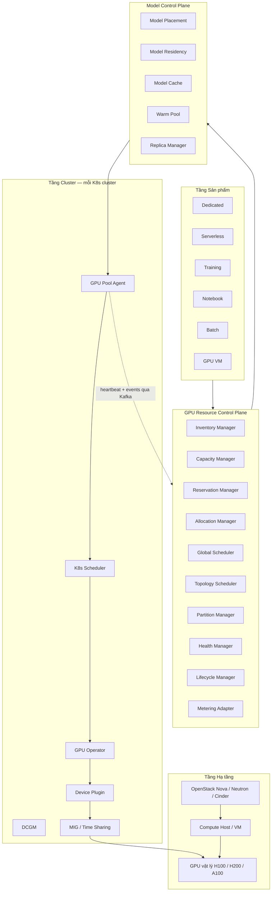
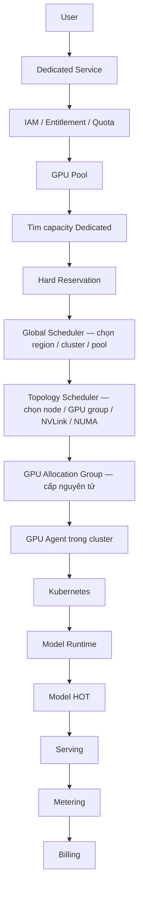
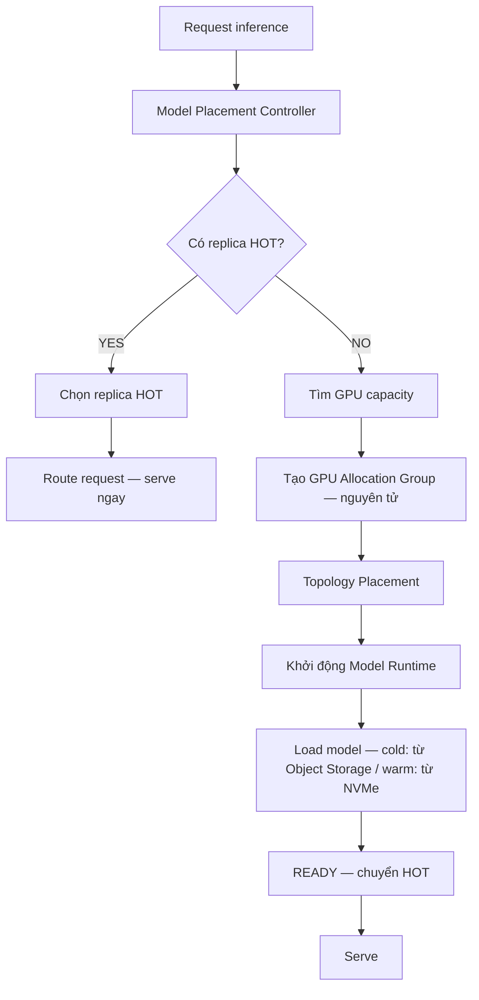
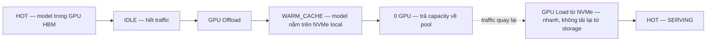
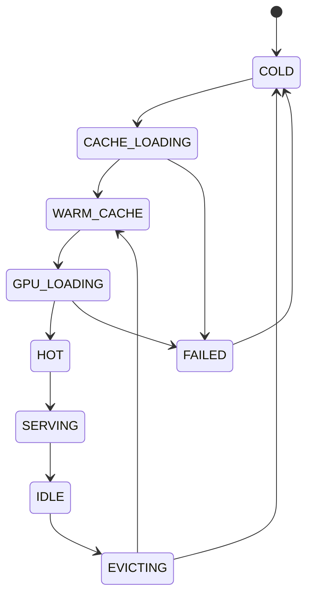
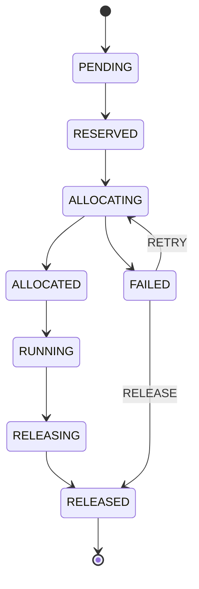
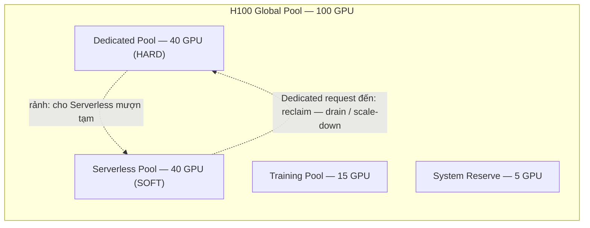
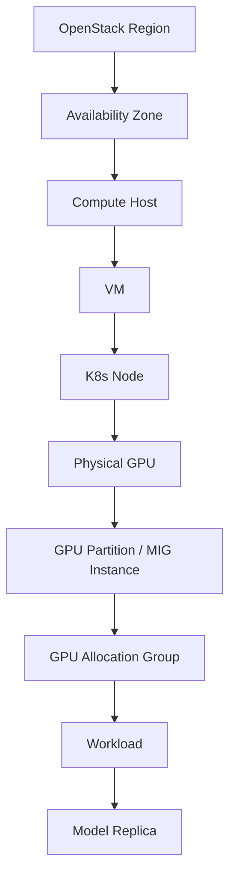

# GPU Pool Arc42 v0.3 — Tóm tắt, Sơ đồ & Phân tích Rủi ro

> Nguồn: `gpu-pool-arc42-v0.3.md` (High-Level Architecture / Draft, 2.254 dòng)
> Mục đích: tài liệu truyền đạt kiến trúc cho team BA/PM + bộ câu hỏi mở để review với kiến trúc sư
> Ngày: 2026-08-28

---

# PHẦN 1 — TÓM TẮT KIẾN TRÚC

## 1.1 GPU Pool là gì (1 câu)

> **GPU Pool là control plane toàn cục cho tài nguyên GPU + residency của model**, trừu tượng hóa GPU vật lý, GPU partition, capacity reservation, topology multi-GPU và vòng đời model xuyên suốt nhiều cluster Kubernetes và hạ tầng OpenStack.

Hình ảnh: **tháp điều khiển sân bay** — workload không tự ý "hạ cánh" (dùng GPU), phải xin slot (allocation); tháp phân bổ theo ưu tiên; khi tháp "ngủ" thì workload đang bay vẫn bay tiếp.

## 1.2 Vì sao cần

AI Factory có 7+ sản phẩm cùng tranh GPU: **Dedicated, Serverless Inference, Training, Fine-tuning, Notebook, Batch, GPU VM** — rải trên nhiều cluster K8s, nhiều region OpenStack, nhiều loại card (H100/H200/A100). Nếu mỗi sản phẩm tự quản GPU:

- Cháy GPU chỗ này, thừa chỗ kia (không có bức tranh toàn cục)
- Dedicated không được bảo đảm (Serverless "ăn" capacity)
- Model lớn (8–32 GPU) không đặt được vì không ai lo topology

GPU Pool đóng vai **người cho thuê duy nhất**: mọi sản phẩm xin GPU qua cùng một "ngôn ngữ" (resource class).

## 1.3 Tầng lớp kiến trúc (từ trên xuống)

```
Sản phẩm (Dedicated / Serverless / Training / Notebook / Batch / GPU VM)
        ↓ xin tài nguyên
GPU Resource Control Plane   ← "bộ não" 1: inventory, capacity, reservation,
        ↓                       allocation, scheduler, health, metering
Model Control Plane          ← "bộ não" 2: model placement, residency,
        ↓                       cache, warm pool, replica
GPU Agent (mỗi cluster K8s chạy 1 agent — gọi outbound ra CP)
        ↓
K8s + GPU Operator + Device Plugin + MIG/Time Sharing
        ↓
OpenStack (Nova/Neutron/Cinder → VM/Node) → GPU vật lý
```

Điểm then chốt: **agent chủ động gọi ra** control plane (outbound) → không cần mở API K8s ra ngoài → an toàn, mở rộng được multi-region.

## 1.4 Six primitives cốt lõi (bộ từ vựng)

| # | Primitive | Ý nghĩa | Ví dụ |
|---|-----------|---------|-------|
| 1 | **GPU Resource** | GPU vật lý / MIG / shared — dịch vụ xin theo **resource class** | `h100-full`, `h100-mig-1g`, `h100-shared` |
| 2 | **Capacity Reservation** | Chia hồ capacity: HARD (Dedicated, không ai đụng) / SOFT (cho mượn tạm, thu hồi khi cần) | 100 H100 = 40 Dedicated + 40 Serverless + 15 Training + 5 Reserve |
| 3 | **GPU Allocation Group** | Đơn vị cấp phát **nguyên tử**: 8 GPU cho 1 model = 1 group, không cấp lẻ rồi ghép | 1/2/4/8/16/32+ GPU |
| 4 | **GPU Topology** | Vị trí GPU quan trọng với model lớn: cùng node → NVLink → NUMA → cùng cluster | 8-GPU LLM ưu tiên node có NVLink |
| 5 | **Model Residency** | **GPU được cấp ≠ model nằm trong GPU**. 3 mức: COLD (object storage) / WARM (NVMe local) / HOT (GPU HBM) | Scale-to-zero: HOT → offload → WARM → 0 GPU |
| 6 | **Model Replica** | 1 bản chạy = model + allocation group + runtime + residency | Llama-70B: replica ở HN (HOT) + replica ở HCM (HOT) |

## 1.5 Ba bộ điều độ (3 scheduling domains)

| Scheduler | Chọn gì |
|-----------|---------|
| **Global GPU Scheduler** | Region, cluster, capacity pool |
| **GPU Topology Scheduler** | Node, GPU group, MIG layout, NVLink, NUMA |
| **Model Placement Controller** | Replica nào, residency warm/cold, warm-up, unload, eviction |

Có thể cùng 1 service ban đầu nhưng phải giữ **3 trách nhiệm logic riêng**.

## 1.6 Hai luồng chính

**Dedicated** (dài ngày, được bảo đảm, không bị evict):
User → IAM/Quota → GPU Pool → Hard Reservation → Global Scheduler → Topology Scheduler → Allocation Group → Agent → K8s → Runtime → HOT → Serving → Metering → Billing.

**Serverless** (thu theo request):
- **Warm path**: request → model đã HOT → route thẳng (gần như không chờ)
- **Cold path**: model chưa HOT → xin GPU → topology placement → load model → serve
- **Scale-out**: 1 replica (4 GPU) → 2 (8) → 4 (16), mỗi replica là 1 group nguyên tử
- **Scale-to-zero**: hết traffic → offload GPU → WARM (NVMe) → 0 GPU; traffic về → load từ NVMe (nhanh, không tải lại từ storage)

## 1.7 Reliability & 7 bất biến

- **CP chết** → workload đang chạy vẫn chạy; CP sống → agent re-sync + reconcile (inventory/allocation/residency)
- **Cluster mất heartbeat** → STALE → không cấp allocation mới, workload cũ không đụng
- **GPU hỏng** (DCGM XID/ECC) → QUARANTINE → không cấp mới

| Invariant | Nội dung |
|-----------|----------|
| I1 | Không bao giờ cấp 1 GPU exclusive cho 2 allocation cùng lúc |
| I2 | Multi-GPU phải cấp nguyên tử (1 group) |
| I3 | Workload lớn phải tôn trọng topology |
| I4 | Capacity HARD của Dedicated không bị Serverless tiêu |
| I5 | CP failure không được giết workload đang chạy |
| I6 | Mọi lúc phải biết model đang COLD/WARM/LOADING/HOT/SERVING/EVICTING/FAILED |
| I7 | Mọi allocation truy vết được: Workspace → Service → Reservation → Group → Cluster → Node → GPU → Workload → Model Replica |

## 1.8 Data stores & events

- **PostgreSQL**: state bền vững (cluster, pool, resource class, reservation, allocation, residency, replica)
- **Redis**: state thay đổi nhanh (capacity hiện tại, scheduler cache, distributed locks, short-lived reservation)
- **Kafka**: event backbone (GPU/capacity/allocation/health/residency/metering events)

## 1.9 Roadmap 5 pha

1. **Nền tảng** — cluster registration, discovery, inventory, pool, reservation, allocation, agent, health, metering → *Dedicated GPU*
2. **Partitioning** — MIG, time-slicing → *Serverless model nhỏ/vừa*
3. **Multi-GPU + Topology** — allocation group, NVLink/NUMA aware → *LLM lớn, Training, Fine-tuning*
4. **Model Residency** — cache, warm pool, scale-to-zero, replica → *Serverless production*
5. **Tối ưu toàn cục** — predictive scaling, cost-aware, spot GPU, preemption, multi-region

## 1.10 ADRs chính

- **ADR-001** Control plane toàn cục tập trung (multi-cluster view, global scheduling, centralized reservation)
- **ADR-002** Cluster Agent (không expose K8s API, cluster tự chủ, reconcile cục bộ)
- **ADR-003** Scheduling 2 tầng (Global chọn cluster; K8s chọn node/GPU)
- **ADR-004** Allocation Group nguyên tử cho multi-GPU
- **ADR-005** GPU Partition (MIG) là tài nguyên cấp 1 (kinh tế serverless cần chia sẻ)
- **ADR-006** Capacity Reservation bảo vệ Dedicated
- **ADR-007** Model Residency tách khỏi GPU allocation (warm/cold/offload/scale-to-zero)
- **ADR-008** OpenStack qua provider abstraction (độc lập hạ tầng)

---

# PHẦN 2 — SƠ ĐỒ (Mermaid)

## 2.1 Kiến trúc tổng thể (5 tầng)



## 2.2 Luồng Dedicated end-to-end



## 2.3 Luồng Serverless — warm path & cold path



## 2.4 Scale-to-zero (tiết kiệm GPU khi hết traffic)



## 2.5 Vòng đời Model Residency



## 2.6 Vòng đời GPU Allocation



## 2.7 Capacity pool & cơ chế SOFT reservation (reclaim)



## 2.8 Xử lý sự cố (3 kịch bản)

```mermaid
flowchart TD
    subgraph F1["Kịch bản 1 — Control Plane DOWN"]
        A1["Workload đang chạy: VẪN CHẠY"] --> A2["CP recovery"]
        A2 --> A3["Cluster Agent re-sync"]
        A3 --> A4["Reconciliation: inventory / allocation / residency"]
    end

    subgraph F2["Kịch bản 2 — Mất cluster"]
        B1["Heartbeat lost"] --> B2["Cluster STALE"]
        B2 --> B3["Không cấp allocation mới"]
        B3 --> B4["Workload cũ: không đổi"]
    end

    subgraph F3["Kịch bản 3 — GPU hỏng"]
        C1["DCGM XID / ECC error"] --> C2["GPU UNHEALTHY"]
        C2 --> C3["QUARANTINE"]
        C3 --> C4["Không cấp allocation mới"]
    end
```



## 2.9 Hierarchical topology (OpenStack → GPU)



---

# PHẦN 3 — PHÂN TÍCH RỦI RO & CÂU HỎI MỞ CỦA BẢN V0.3

> Góc nhìn: cloud infrastructure + Well-Architected (Reliability, Performance, Cost, Security).
> Mức độ: **CRITICAL** (ảnh hưởng đúng đắn hệ thống) → **HIGH** → **MEDIUM** → **LOW** (lỗ hổng tài liệu).

## 3.1 CRITICAL

### R1 — Mô hình nhất quán "không cấp trùng" (I1) chưa định nghĩa source of truth

- Capacity hiện tại nằm ở **Redis** (nhanh), state bền ở **PostgreSQL**. Scheduler đọc capacity từ Redis rồi commit allocation vào Postgres.
- **Rủi ro**: nếu cache Redis lệch với Postgres (invalidation bug, CP failover, agent báo capacity sai) → **cùng 1 GPU bị cấp cho 2 allocation** — vi phạm I1, sự cố nặng nhất có thể xảy ra.
- **Câu hỏi mở**: Cơ chế commit là gì? Khuyến nghị: **Postgres là source of truth duy nhất cho exclusive resources** (row-level lock / optimistic concurrency trên bảng allocation), Redis chỉ là cache đọc + distributed lock ngắn hạn. Tài liệu cần nêu rõ protocol này.

### R2 — Atomicity multi-GPU khi K8s bind thất bại một phần (I2)

- Scheduling 2 tầng: Global chọn cluster → Topology chọn node → **K8s scheduler + device plugin bind GPU thực tế**. Nếu 3/8 GPU bind được, GPU thứ 4 fail (device plugin drift, GPU vừa hỏng), allocation group bị **phân nửa**.
- **Rủi ro**: "allocation là nguyên tử" mới đúng ở tầng logic; tầng vật lý chưa có **rollback/compensation protocol**.
- **Câu hỏi mở**: Ai phát hiện partial bind? Ai thu hồi 3 GPU đã bind (saga pattern)? Timeout bao lâu? Cần trạng thái `PARTIALLY_ALLOCATED` + tự động compensate.

### R3 — Race condition trong SOFT reservation reclaim (I4)

- Kịch bản: 2 Dedicated request đến đồng thời + capacity đang được Serverless mượn. Cả hai đều trigger reclaim → **over-commit** (reclaim một lần nhưng hứa hai lần).
- **Rủi ro**: Dedicated bị hứa capacity không tồn tại → vi phạm SLA doanh nghiệp.
- **Câu hỏi mở**: Reclaim có dùng distributed lock không (Redis có lock nhưng chưa mô tả)? Grace period drain Serverless bao lâu? Nếu Dedicated request không chờ được thì fallback gì (chuyển cluster khác / từ chối / queue)? **Preemption chỉ xuất hiện ở Phase 5** nhưng SOFT reservation đã hàm ý preemption từ Phase 1–2 — đây là **gap giữa roadmap và thiết kế**.

## 3.2 HIGH

### R4 — Control Plane HA chưa thiết kế

- I5 bảo vệ workload cũ, nhưng **mọi allocation mới bị chặn** khi CP down. Tài liệu không nói:
  - CP chạy mấy replica? Leader election thế nào?
  - **RTO/RPO** của CP là bao nhiêu?
  - Allocation đang ở trạng thái `ALLOCATING` khi CP chết → ai reconcile (agent hay CP mới)?
- **Khuyến nghị**: CP multi-replica (≥3), state machine idempotent, agent có quyền reconcile cục bộ allocation in-flight theo last-known intent.

### R5 — Race giữa scale-to-zero và request đến

- Request đến đúng lúc eviction đang chạy: eviction thắng → user chịu cold start; request thắng → hủy eviction.
- **Câu hỏi mở**: Cần cơ chế **pin/reservation ngắn TTL** khi router đã chọn replica nhưng model đang IDLE — giữ model không bị evict trong thời gian route. Chưa có trong tài liệu.

### R6 — MIG reconfiguration chưa có coordination

- Đổi layout MIG (VD: 1g+1g+2g+4g → 2g+2g) **yêu cầu reset GPU, evict toàn bộ tenant** của GPU đó, mất vài phút.
- **Câu hỏi mở**: Partition Manager ai trigger reconfig? Coordination với workload đang chạy (drain trước, đổi layout, schedule lại)? Bin-packing layout MIG theo thời gian là bài toán khó — cần chính sách (VD: chỉ reconfig khi GPU idle > N phút).

### R7 — Idempotency & ordering cho lệnh Agent ↔ CP

- Agent nhận lệnh allocation từ CP qua kênh outbound. Chưa mô tả:
  - **Idempotency key** cho lệnh (CP failover resend → agent chạy 2 lần?)
  - Lệnh stale sau failover (allocation đã release nhưng lệnh create còn trong queue)
  - Heartbeat flapping (mạng chập chờn) → cluster bật tắt STALE → **allocation thrashing**
- **Câu hỏi mở**: Grace period heartbeat bao lâu? Backoff thế nào?

## 3.3 MEDIUM

### R8 — Billing attribution cho time-slicing

- Metering qua Kafka có `GPU_USAGE_RECORDED`, nhưng **GPU chia sẻ mềm (time-slicing) không có cách chuẩn để chia usage về từng tenant** (MIG thì dễ — per-instance metrics; time-slice thì DCGM per-container không chính xác).
- **Câu hỏi mở**: Granularity billing (giây/phút)? Cơ chế đo usage per-tenant trên shared GPU? Đây là rủi ro **khiếu nại hóa đơn** về sau.

### R9 — Chi phí warm pool chưa kiểm soát

- HOT replica nằm idle = **trả tiền GPU không có doanh thu**. Warm pool sizing chỉ có ở Phase 5 (predictive scaling) — trước đó chi phí warm pool **không có chính sách**.
- **Khuyến nghị**: Ngay Phase 4 cần warm pool policy tối thiểu: max idle GPU cho warm pool, TTL theo priority, cost cap per model.

### R10 — Model artifact cross-region chưa định nghĩa

- Ví dụ replica Llama-70B ở cả HN và HCM (mục 21) — nhưng **artifact model (vài chục–vài trăm GB) replicates giữa region bằng cách nào?** Object storage đơn region hay multi-region? Chi phí egress?
- **Câu hỏi mở**: Chiến lược artifact replication + checksum verification khi cache (ModelCache có checksum — tốt — nhưng chưa có quy trình verify khi load).

### R11 — Không có auto-provisioning node

- Toàn bộ thiết kế giả định **capacity cố định** theo cluster. Khi pool cạn → không có cơ chế thêm node GPU (mở VM qua Nova chỉ có trong GPU VM flow, không phải node scaling).
- **Câu hỏi mở**: "Capacity Forecasting" (Phase 5) có bao gồm auto-scale node không? Nếu không, Dedicated request khi pool cạn sẽ queue vô hạn.

### R12 — Model loading dài + fail giữa chừng

- Load model 100GB+ mất vài phút. CP/agent chết giữa chừng → state kẹt `LOADING`, cache NVMe có thể **hư một nửa**.
- **Câu hỏi mở**: Recovery flow cho partial load? (Khuyến nghị: write-to-temp + atomic rename + verify checksum trước khi đánh dấu WARM).

## 3.4 LOW — Lỗ hổng tài liệu (Arc42 completeness)

| # | Thiếu | Gợi ý bổ sung |
|---|-------|---------------|
| L1 | **Quality scenarios không có số đo** | Thêm: allocation latency p99 < Xs; CP availability 99.9%; cold start target per model size; RTO/RPO |
| L2 | **Không có ADR cho data stores** | Vì sao Postgres+Redis+Kafka thay vì Temporal/etcd/NATS? Trade-off event sourcing vs event-as-notification |
| L3 | **Kafka semantics chưa rõ** | At-least-once + idempotent consumer? Retention bao lâu? Events là notification-only (reconciliation là safety net — hợp lý, cần ghi rõ) |
| L4 | **Security multi-tenancy chưa sâu** | Time-slicing = chia sẻ HBM mềm → side-channel risk; agent RBAC cần namespace/service-account per tenant; OpenStack scoped credential cần enforce granularity trong adapter |
| L5 | **Deployment view mỏng** | §35 liệt kê service nhưng không có topology HA (replica, zone distribution, DB failover) |

## 3.5 Bảng tổng hợp rủi ro

| ID | Rủi ro | Mức | Invariant liên quan | Phase ảnh hưởng |
|----|--------|-----|--------------------|-----------------|
| R1 | Double allocation do Redis/Postgres lệch | CRITICAL | I1 | 1+ |
| R2 | Multi-GPU bind một phần, không có rollback | CRITICAL | I2 | 3+ |
| R3 | Reclaim SOFT race → over-commit Dedicated | CRITICAL | I4 | 1–2 |
| R4 | CP HA + in-flight allocation recovery | HIGH | I5 | 1+ |
| R5 | Scale-to-zero vs request race | HIGH | I6 | 4 |
| R6 | MIG reconfig evict tenant không coordination | HIGH | I1, I3 | 2+ |
| R7 | Agent command idempotency / heartbeat flapping | HIGH | I1, I7 | 1+ |
| R8 | Billing attribution time-slicing | MEDIUM | I7 | 2+ |
| R9 | Warm pool cost không kiểm soát | MEDIUM | — | 4 |
| R10 | Artifact cross-region replication | MEDIUM | I6 | 3–4 |
| R11 | Không có node auto-provisioning | MEDIUM | I4 | 5 |
| R12 | Partial model load recovery | MEDIUM | I6 | 4 |

## 3.6 Top 5 câu hỏi nên đặt với kiến trúc sư khi review

1. **Source of truth cho allocation exclusive là Redis hay Postgres?** Protocol commit cụ thể là gì để đảm bảo I1?
2. **Khi allocation group 8-GPU bind được 3/8 rồi fail — rollback flow ra sao?** Ai chịu trách nhiệm compensate?
3. **SOFT reclaim: Dedicated request đến mà Serverless không drain kịp trong SLA thì xử lý thế nào?** Preemption policy ở Phase nào?
4. **CP failover: allocation đang ALLOCATING được reconcile bằng cơ chế nào?** RTO mục tiêu là bao nhiêu?
5. **Time-slicing: usage per-tenant đo bằng gì để billing?** Có chấp nhận sai số bao nhiêu?

---

## Phụ lục — Gợi ý cho BA

Khi viết user story từ tài liệu GPU Pool, luôn gắn mỗi story vào:
1. **1 trong 6 primitives** (GPU Resource / Reservation / Allocation Group / Topology / Residency / Replica)
2. **1 trong 2 luồng** (Dedicated / Serverless)
3. **Kiểm tra I1–I7** — story không được vi phạm bất biến nào
4. **Ghi rõ phase roadmap** (1–5) để ước lượng timeline