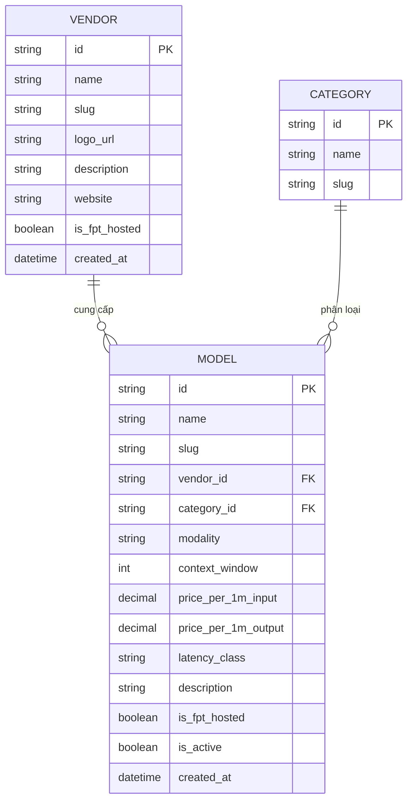

# Data Dictionary
## Redesign Homepage FPT AI Marketplace

**Phiên bản:** 1.0
**Ngày:** 17/08/2026
**Trạng thái:** Draft
**Liên quan:** SRS v1.0

---

## 1. Tổng quan mô hình dữ liệu

---

## 2. Entity: Vendor (Nhà cung cấp)

**Mô tả:** Đơn vị phát triển/cung cấp model. Đây là entity mới cần bổ sung để hỗ trợ FR-VENDOR-001/002/003.

| Thuộc tính | Kiểu dữ liệu | Bắt buộc | Mô tả | Ví dụ |
|-----------|--------------|----------|-------|-------|
| `id` | string (UUID) | ✓ | Khóa chính | `ven_001` |
| `name` | string (100) | ✓ | Tên nhà cung cấp | `Google`, `Alibaba`, `FPT` |
| `slug` | string (100) | ✓ | Định danh URL | `google`, `alibaba` |
| `logo_url` | string (URL) | ✓ | Đường dẫn logo | `https://cdn.../google.svg` |
| `description` | string (500) | ✗ | Mô tả ngắn | `Frontier AI models from Google DeepMind` |
| `website` | string (URL) | ✗ | Website chính thức | `https://deepmind.google` |
| `is_fpt_hosted` | boolean | ✓ | Model chạy trên hạ tầng FPT | `true` |
| `created_at` | datetime | ✓ | Thời điểm tạo | `2026-01-01T00:00:00Z` |

**Business Rules:**
- `slug` phải duy nhất, dùng cho URL `/en/vendors/{slug}`.
- `logo_url` phải trỏ đến ảnh SVG/PNG ≤ 256KB.

**Danh sách vendor hiện tại (tham chiếu từ khảo sát):**

| Vendor | Slug | FPT-hosted |
|--------|------|------------|
| FPT | `fpt` | ✓ |
| Google | `google` | ✗ |
| Alibaba | `alibaba` | ✗ |
| DeepSeek | `deepseek` | ✗ |
| Z.AI (Zhipu) | `z-ai` | ✗ |
| MiniMax | `minimax` | ✗ |
| Anthropic | `anthropic` | ✗ |
| OpenAI | `openai` | ✗ |

---

## 3. Entity: Category (Danh mục / Modality)

**Mô tả:** Phân loại model theo modality. Tương ứng với filter hiện có (All, Vision Language Model, Text to Speech...).

| Thuộc tính | Kiểu dữ liệu | Bắt buộc | Mô tả | Ví dụ |
|-----------|--------------|----------|-------|-------|
| `id` | string (UUID) | ✓ | Khóa chính | `cat_llm` |
| `name` | string (100) | ✓ | Tên danh mục | `Large Language Model` |
| `slug` | string (100) | ✓ | Định danh | `llm` |

**Danh sách category:**

| Slug | Tên | Ví dụ model |
|------|-----|-------------|
| `llm` | Large Language Model | `gemma-4-31B`, `deepseek-v4-flash` |
| `vlm` | Vision Language Model | `Qwen2.5-VL-7B-Instruct` |
| `tts` | Text to Speech | `FPT.AI-VITs` |
| `stt` | Speech to Text | `whisper-large-v3-turbo` |
| `embedding` | Embedding | `Vietnamese_Embedding` |

---

## 4. Entity: Model

**Mô tả:** Mô hình AI được bán trên marketplace. Mở rộng thêm các thuộc tính kỹ thuật để hỗ trợ FR-MODEL-001.

| Thuộc tính | Kiểu dữ liệu | Bắt buộc | Mô tả | Ví dụ |
|-----------|--------------|----------|-------|-------|
| `id` | string (UUID) | ✓ | Khóa chính | `mod_001` |
| `name` | string (150) | ✓ | Tên model | `gemma-4-31B-it` |
| `slug` | string (150) | ✓ | Định danh URL | `gemma-4-31b-it` |
| `vendor_id` | string (FK) | ✓ | Nhà cung cấp | `ven_google` |
| `category_id` | string (FK) | ✓ | Danh mục | `cat_vlm` |
| `modality` | enum | ✓ | Loại model | `LLM` / `VLM` / `TTS` / `STT` / `Embedding` |
| `context_window` | integer | ✓ | Context window (token) | `131072` (128K), `1048576` (1M) |
| `price_per_1m_input` | decimal(10,4) | ✓ | Giá USD/1M tokens input | `0.4500` |
| `price_per_1m_output` | decimal(10,4) | ✓ | Giá USD/1M tokens output | `1.3500` |
| `latency_class` | enum | ✓ | Phân loại latency | `Fast` / `Medium` / `Slow` |
| `description` | string (1000) | ✗ | Mô tả | `Multimodal reasoning model` |
| `is_fpt_hosted` | boolean | ✓ | Chạy trên hạ tầng FPT | `true` |
| `is_active` | boolean | ✓ | Còn bán | `true` |
| `created_at` | datetime | ✓ | Thời điểm tạo | `2026-01-01T00:00:00Z` |

**Business Rules:**
- `modality` ∈ {`LLM`, `VLM`, `TTS`, `STT`, `Embedding`}.
- `latency_class` ∈ {`Fast`, `Medium`, `Slow`}.
- `context_window` hiển thị dạng rút gọn: 128K, 1M.
- `price_per_1m_input`/`output` bắt buộc cho quyết định modeling (FR-MODEL-001.4).
- Mỗi model phải có đúng 1 `vendor_id` (BR-01).

**Dữ liệu tham chiếu hiện tại (khảo sát 12/08/2026):**

| Model | Vendor | Modality |
|-------|--------|----------|
| gemma-4-31B-it | Google | VLM |
| glm-5.2 | FPT/Z.AI | LLM |
| deepseek-v4-flash | FPT/DeepSeek | LLM |
| minimax-m3-vn | MiniMax | LLM |
| Qwen2.5-VL-7B-Instruct | Alibaba | VLM |
| whisper-large-v3-turbo | OpenAI | STT |
| FPT.AI-VITs | FPT | TTS |
| Vietnamese_Embedding | FPT | Embedding |

> Ghi chú: Cần xác nhận chính xác `vendor_id` cho từng model với team dữ liệu (một số model do FPT host nhưng nguồn gốc từ vendor khác).

---

## 5. Entity: CompareSession (Phiên so sánh — phiên tạm)

**Mô tả:** Trạng thái tạm thời lưu các model được chọn để so sánh (FR-MODEL-002). Lưu phía client (localStorage) hoặc session.

| Thuộc tính | Kiểu dữ liệu | Bắt buộc | Mô tả |
|-----------|--------------|----------|-------|
| `selected_model_ids` | array[string] | ✓ | Danh sách tối đa 4 model id |
| `updated_at` | datetime | ✓ | Thời điểm cập nhật |

**Business Rules:**
- Tối đa 4 model (BR-04).
- Xóa khi kết thúc phiên hoặc user clear.

---

## 6. Entity: AnalyticsEvent (Sự kiện đo lường)

**Mô tả:** Sự kiện theo dõi để đo KPI (NFR-OBS-001).

| Thuộc tính | Kiểu dữ liệu | Mô tả |
|-----------|--------------|-------|
| `event_name` | string | `cta_start_free`, `cta_explore`, `search`, `filter_vendor`, `compare_add`, `compare_view`, `vendor_view` |
| `user_id` | string | Người dùng (nếu đã đăng nhập) |
| `session_id` | string | Phiên |
| `payload` | JSON | Dữ liệu bổ sung (vendor, model, query...) |
| `timestamp` | datetime | Thời điểm |

---

## 7. Quan hệ giữa các entity

| Quan hệ | Cardinality | Mô tả |
|---------|-------------|-------|
| Vendor → Model | 1 : N | Một vendor cung cấp nhiều model |
| Category → Model | 1 : N | Một category chứa nhiều model |
| Model ↔ CompareSession | N : M | Nhiều model trong một phiên so sánh (≤4) |
| User → AnalyticsEvent | 1 : N | Một user sinh nhiều sự kiện |