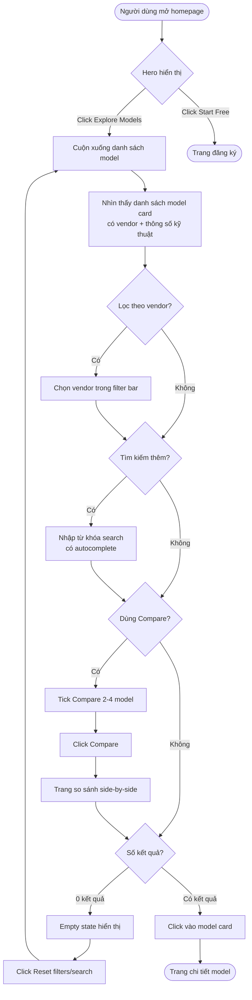
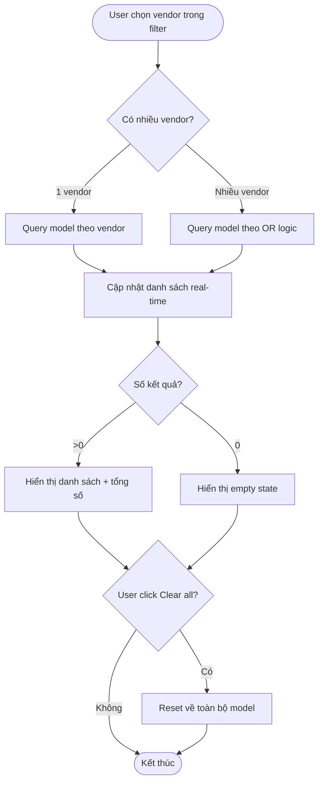
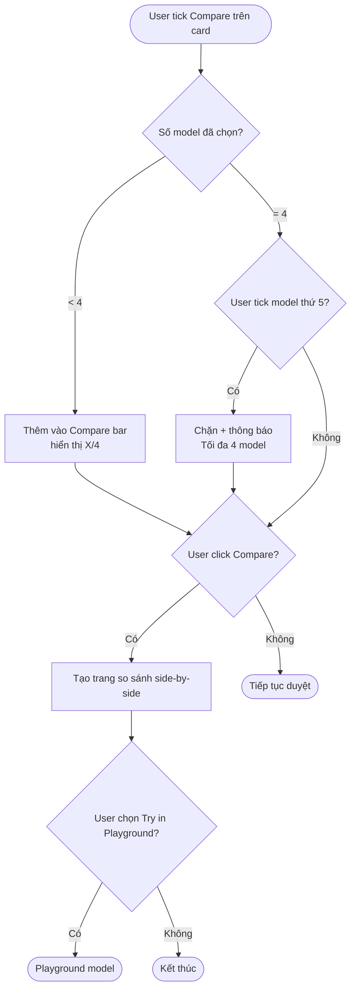
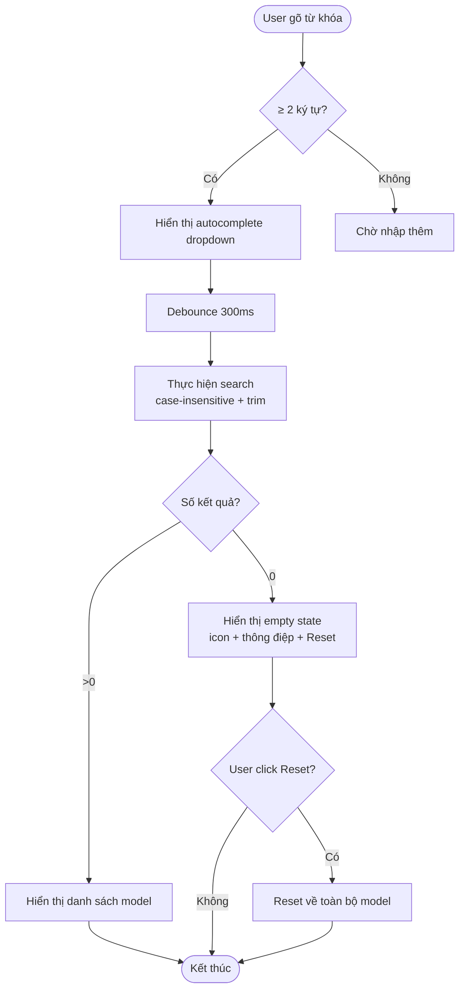
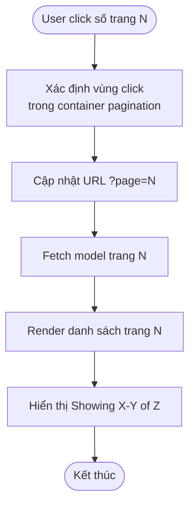

# Process Flows (BPMN Notation)
## Redesign Homepage FPT AI Marketplace

**Phiên bản:** 1.0
**Ngày:** 17/08/2026
**Trạng thái:** Draft
**Liên quan:** SRS v1.0, User Stories v1.0

> Lưu ý: Các sơ đồ dưới đây dùng ký pháp BPMN được biểu diễn bằng Mermaid (flowchart), phù hợp để render trong preview.

---

## 1. Quy trình: Khách hàng chọn model để modeling

**Mô tả:** Luồng chính của một người dùng kỹ thuật (BA/Developer) từ lúc vào homepage đến khi chọn được model phù hợp để tích hợp.

**Actors:**
- **Người dùng (User):** Khách ghé thăm / nhà phát triển
- **Hệ thống (System):** FPT AI Marketplace

### Flow



**Business Rules:**
- BR-01: Mỗi model gắn đúng 1 vendor.
- BR-02: Multi-select vendor dùng OR logic.
- BR-04: Compare tối đa 4 model.

**Exceptions:**
- Không có kết quả → empty state (FR-SEARCH-002).
- Chọn model thứ 5 trong compare → chặn + thông báo.

---

## 2. Quy trình: Bộ lọc theo nhà cung cấp

**Mô tả:** Luồng xử lý khi người dùng lọc model theo vendor.



**Business Rules:**
- BR-02: OR logic cho multi-select.
- Tổng số kết quả cập nhật real-time (FR-VENDOR-002.4).

---

## 3. Quy trình: So sánh model (Compare)

**Mô tả:** Luồng so sánh tối đa 4 model cạnh nhau.



**Business Rules:**
- BR-04: Giới hạn 4 model.

---

## 4. Quy trình: Tìm kiếm với Empty State

**Mô tả:** Luồng xử lý search và trường hợp không có kết quả.



**Business Rules:**
- FR-SEARCH-001.3: Case-insensitive, trim whitespace.
- FR-SEARCH-001.2: Autocomplete khi ≥ 2 ký tự.
- Debounce 300ms, phản hồi ≤ 500ms.

---

## 5. Quy trình: Điều hướng Pagination (Fix bug)

**Mô tả:** Luồng pagination chuẩn, khắc phục BUG-001.



**Business Rules:**
- FR-NAV-001: Click số trang KHÔNG được redirect sang trang chi tiết model.
- Hiển thị "Showing X–Y of Z models".

**Exceptions:**
- Nếu click nhầm vào vùng model card (ngoài pagination) → hành vi mở trang chi tiết là đúng; phải phân biệt vùng click bằng selector cụ thể.

---

## 6. Sơ đồ tổng quan kiến trúc trang (Wireframe mức cao)

```mermaid
flowchart LR
    subgraph Homepage
        H[Header: Logo, Nav, Login]
        HE[Hero: Headline + Benefit + CTA + Trusted Vendors]
        SB[Search Bar + Filter Bar<br/>Vendor | Modality | Context | Price]
        GR[Grid Model Cards<br/>Vendor badge + thông số kỹ thuật]
        PG[Pagination + Showing X-Y of Z]
        FT[Footer]
    end
    GR --> CB[(Compare Bar<br/>nổi bottom)]
    CB --> CP[Trang Compare]
    GR --> MD[Trang chi tiết model]
    HE --> RG[Trang đăng ký]
```