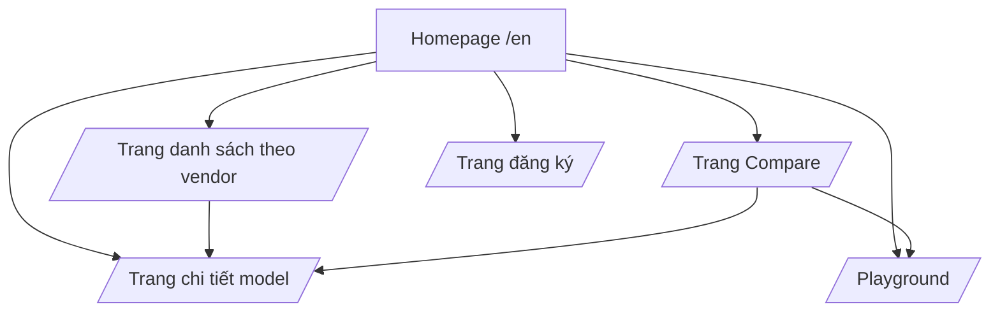
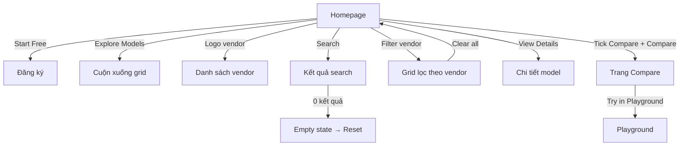

# Prototype Wireframe — Redesign Homepage FPT AI Marketplace

**Phiên bản:** 1.0
**Ngày:** 17/08/2026
**Trạng thái:** Draft — chờ review
**Loại:** Low-fidelity wireframe + click-through prototype (dạng tài liệu)
**Liên quan:** BRD v1.0, SRS v1.0, User Stories v1.0

> **Ghi chú:** Đây là prototype dạng wireframe (tài liệu BA), dùng để chốt bố cục, luồng điều hướng và các trạng thái màn hình trước khi team UI/Dev dựng bản hi-fi. Mỗi section có: wireframe ASCII, annotation, và mô tả tương tác.

---

## 1. Bản đồ màn hình (Site Map)



**Luồng chính:** Homepage → (search/filter) → Model card → Detail / Compare → Playground.

---

## 2. Wireframe tổng thể (Desktop 1440px)

```
┌──────────────────────────────────────────────────────────────────────┐
│ LOGO FPT AI MARKETPLACE   Products ▾   Pricing   Docs    [Sign in]   │ ← Header
├──────────────────────────────────────────────────────────────────────┤
│                                                                      │
│   One API. Every Frontier AI Model.                                  │ ┐
│   Truy cập Anthropic, OpenAI, Google, Alibaba, DeepSeek, FPT...      │ │
│   qua một API serverless duy nhất.                                   │ │ Hero
│                                                                      │ │
│   [ ✓ $100 free credit 30 ngày ] [ ✓ 1 API mọi model ]               │ │
│   [ ✓ Chi phí tối ưu ]                                               │ │
│                                                                      │ │
│   [ Start Free → ]   [ Explore Models ↓ ]                            │ │
│                                                                      │ ┘
│   Trusted vendors:  ◈FPT  ◈Google  ◈Alibaba  ◈DeepSeek  ◈Z.AI  ◈MiniMax│
├──────────────────────────────────────────────────────────────────────┤
│  🔍 Search models, vendors, modalities...            [Layout: ⊞ ▤]  │ ← Search+Filter bar
│  Vendor: [▢ All][▢ FPT][▢ Google][▢ Alibaba][▢ DeepSeek] [Clear all]│
│  Modality: [▢ All][▢ LLM][▢ VLM][▢ TTS][▢ STT][▢ Embedding]         │
├──────────────────────────────────────────────────────────────────────┤
│  Showing 1–12 of 19 models                                           │ ← Result count
│                                                                      │
│ ┌─────────────┐ ┌─────────────┐ ┌─────────────┐                     │
│ │ ◈Google     │ │ ◈Alibaba    │ │ ◈FPT        │                     │
│ │ gemma-4-31B │ │ Qwen2.5-VL  │ │ FPT.AI-VITs │                     │
│ │ [VLM]       │ │ [VLM]       │ │ [TTS]       │                     │
│ │ ctx 128K    │ │ ctx 128K    │ │ ctx 32K     │                     │
│ │ $0.45/1M    │ │ $0.30/1M    │ │ $0.12/1M    │                     │
│ │ ●Fast       │ │ ●Fast       │ │ ●Medium     │                     │
│ │ [☐ Compare] │ │ [☐ Compare] │ │ [☐ Compare] │                     │
│ └─────────────┘ └─────────────┘ └─────────────┘                     │
│ ┌─────────────┐ ┌─────────────┐ ┌─────────────┐                     │
│ │ ◈FPT        │ │ ◈OpenAI     │ │ ◈MiniMax    │                     │
│ │ glm-5.2     │ │ whisper...  │ │ minimax-m3  │                     │
│ │ [LLM]       │ │ [STT]       │ │ [LLM]       │                     │
│ │ ctx 1M      │ │ ctx 128K    │ │ ctx 256K    │                     │
│ │ $0.80/1M    │ │ $0.10/1M    │ │ $0.60/1M    │                     │
│ │ ●Medium     │ │ ●Fast       │ │ ●Fast       │                     │
│ │ [☐ Compare] │ │ [☐ Compare] │ │ [☐ Compare] │                     │
│ └─────────────┘ └─────────────┘ └─────────────┘                     │
│                                                                      │
│              ‹ Prev   1   2   Next ›                                 │ ← Pagination
├──────────────────────────────────────────────────────────────────────┤
│  FOOTER: About | Pricing | Docs | Contact | © 2026 FPT Smart Cloud   │
└──────────────────────────────────────────────────────────────────────┘
```

**Annotation:**
- **Header:** Giữ nav hiện tại, thêm link "Products" trỏ về homepage.
- **Hero:** 3 benefit badges + 2 CTA + khu "Trusted vendors" (logo thật).
- **Search+Filter bar:** Search box + filter vendor (mới) + filter modality (giữ nguyên).
- **Model card:** Thêm badge vendor, context, giá, latency, checkbox Compare.
- **Pagination:** Container riêng biệt, có "Showing X–Y of Z".

---

## 3. Wireframe Model Card (chi tiết)

```
┌─────────────────────────────────┐
│ ◈ Google                    ☐   │  ← logo vendor (24px) + checkbox Compare
│ gemma-4-31B-it                 │  ← tên model
│ [ VLM ]                        │  ← modality tag
│                                │
│  ⧉ Context   128K             │  ← icon + giá trị
│  ₿ Input     $0.45 / 1M tok   │
│  ⚡ Latency   Fast             │
│  🏷 FPT-hosted [nếu có]        │  ← badge data residency
│                                │
│  [ View Details → ]            │  ← CTA chính
└─────────────────────────────────┘
```

**Trạng thái card:**
| Trạng thái | Mô tả |
|-----------|-------|
| Default | Hiển thị đủ thông số |
| Hover | Border highlight, shadow, CTA rõ hơn |
| Selected (Compare) | Viền xanh + checkbox ticked |
| Disabled (thiếu dữ liệu) | Thông số hiển thị "—" |
| Loading | Skeleton shimmer |

---

## 4. Compare Bar (nổi bottom)

```
┌────────────────────────────────────────────────────────────────────┐
│  Compare (2/4)   [gemma-4-31B-it] [glm-5.2]          [Compare →]  │
└────────────────────────────────────────────────────────────────────┘
```

**Tương tác:**
- Tick checkbox → model xuất hiện trong bar, đếm X/4.
- Tick model thứ 5 → toast "Tối đa 4 model để so sánh".
- Click "Compare →" → mở trang so sánh.
- Click "✕" trên chip → bỏ chọn model.
- Scroll xuống → bar dính bottom (sticky).

---

## 5. Trang Compare (side-by-side)

```
┌──────────────────────────────────────────────────────────────────┐
│  Compare Models                                    [Back ←]      │
│  gemma-4-31B-it      glm-5.2      Qwen2.5-VL      minimax-m3-vn │
├────────────┬─────────┬───────────┬───────────────┬───────────────┤
│ Vendor     │ Google  │ FPT       │ Alibaba       │ MiniMax       │
│ Modality   │ VLM     │ LLM       │ VLM           │ LLM           │
│ Context    │ 128K    │ 1M        │ 160K          │ 256K          │
│ Input $/1M │ 0.45    │ 0.80      │ 0.30          │ 0.60          │
│ Output$/1M │ 1.35    │ 2.40      │ 0.90          │ 1.80          │
│ Latency    │ Fast    │ Medium    │ Fast          │ Fast          │
│ Capability │ Vision  │ Reasoning │ Vision+OCR    │ Multilingual  │
│ FPT-hosted │ ✗       │ ✓         │ ✗             │ ✗             │
├────────────┴─────────┴───────────┴───────────────┴───────────────┤
│  [Try in Playground] [Try in Playground] [Try in Playground] ... │
└──────────────────────────────────────────────────────────────────┘
```

**Responsive mobile:** Bảng cuộn ngang (horizontal scroll), hàng đầu cố định (sticky first column).

---

## 6. Các trạng thái màn hình

### 6.1 Empty State (search/filter 0 kết quả)

```
┌──────────────────────────────────────────────┐
│                                              │
│                🔍 (icon)                     │
│       Không tìm thấy model phù hợp           │
│   Thử đổi từ khóa hoặc bỏ bớt bộ lọc.       │
│                                              │
│           [ Reset filters/search ]           │
│                                              │
└──────────────────────────────────────────────┘
```

### 6.2 Autocomplete dropdown (search)

```
┌──────────────────────────────────────┐
│ 🔍 gem                          ×    │
├──────────────────────────────────────┤
│  Models                             │
│  · gemma-4-31B-it            [VLM]  │
│  · gemma-4-26B-A4B-it        [VLM]  │
│  Vendors                             │
│  · Google                           │
└──────────────────────────────────────┘
```

### 6.3 Toast thông báo

```
┌──────────────────────────────────────┐
│ ⚠ Tối đa 4 model để so sánh          │  ← hiển thị 3s, tự ẩn
└──────────────────────────────────────┘
```

---

## 7. Click-through Map (luồng điều hướng)



---

## 8. Checklist chốt prototype (dành cho review)

| # | Hạng mục | Trạng thái |
|---|----------|-----------|
| 1 | Hero: headline, 3 badges, 2 CTA, trusted vendors | ☐ |
| 2 | Search + autocomplete | ☐ |
| 3 | Filter vendor (multi-select OR) | ☐ |
| 4 | Filter modality (giữ nguyên) | ☐ |
| 5 | Model card: vendor + context + giá + latency | ☐ |
| 6 | Badge FPT-hosted | ☐ |
| 7 | Checkbox Compare + Compare bar (max 4) | ☐ |
| 8 | Trang Compare side-by-side | ☐ |
| 9 | Pagination + "Showing X–Y of Z" | ☐ |
| 10 | Empty state | ☐ |
| 11 | Responsive mobile (320/768/1440) | ☐ |
| 12 | Accessibility (focus, alt, contrast) | ☐ |

---

## 9. Việc cần làm tiếp theo

1. **Review wireframe** — BA/PO + UX xác nhận bố cục từng section.
2. **Xác nhận dữ liệu** — team dữ liệu cung cấp `vendor`, `context_window`, `giá`, `latency` cho từng model (GAP-1/2).
3. **Dựng hi-fi prototype** — team UI dựng bản hi-fi (Figma/HTML) dựa trên wireframe này.
4. **Test case** — viết test case cho các tính năng mới (Compare, filter vendor, empty state).

> Nếu bạn muốn bản **hi-fi prototype chạy được (HTML clickable)**, việc đó thuộc phạm vi team Frontend/Dev (ngoài vai trò BA chỉ làm tài liệu). Tôi có thể hỗ trợ bằng cách chốt đầy đủ nội dung, nội dung text và luồng để team dựng nhanh.