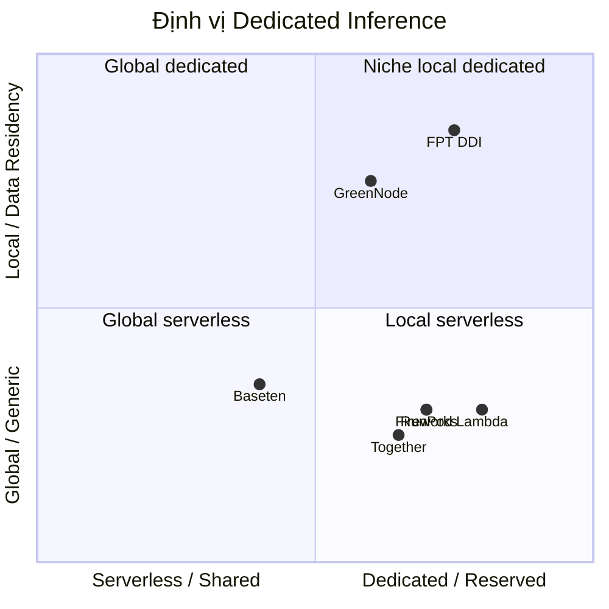

# Market Research — Dedicated Inference (GPU Reserved, Always-On)

**Phiên bản:** 1.0
**Ngày:** 18/08/2026
**Trạng thái:** Draft
**Chủ sở hữu:** Thuan Luu Thi (PO)
**Phạm vi:** Nghiên cứu thị trường cho mô hình **Dedicated Inference** — deploy model trên GPU dedicated/reserved, always-on, không shared capacity, không rate limits, phù hợp traffic nghiêm túc hơn serverless.
**Định vị sản phẩm:**
> *"Deploy an AI model running on dedicated, reserved GPUs. Always on, no shared capacity, and no rate limits. Better suited for serious traffic than serverless."*

**Liên quan:** `docs/market-research-fpt-ddi.md`, `docs/srs-ddi-my-endpoints.md`, `docs/competitive-analysis-ddi-gpu-container-k8s-vm.md`, `docs/technical-note-a30-model-serving.md`

---

## 1. Executive Summary

| Câu hỏi | Trả lời |
|---------|---------|
| **Sản phẩm là gì?** | Dedicated Inference: deploy model trên GPU **dedicated/reserved**, always-on, không shared capacity, không rate limits |
| **Khác serverless thế nào?** | Serverless = chia sẻ hạ tầng, pay-per-token, có cold-start & rate limits. Dedicated = tài nguyên riêng, trả theo GPU/giờ, hiệu năng ổn định |
| **Phù hợp ai?** | Traffic nghiêm túc (production, enterprise), latency ổn định, bảo mật tách biệt, workload dự đoán được |
| **Thị trường** | AI inference toàn cầu ~$117,8 tỷ (2026), GPU ~35,3%; cloud là phân khúc tăng nhanh nhất |
| **Đối thủ** | Together AI, Fireworks, Baseten, Lambda, RunPod, CoreWeave, Replicate, DeepInfra |
| **Cơ hội FPT** | "Dedicated + data residency VN + tiếng Việt" — khoảng trống chưa ai chiếm |
| **Khuyến nghị** | Định vị dedicated cho enterprise/production, pricing theo GPU/giờ (neo-cloud), highlight always-on + không rate limits |

---

## 2. Dedicated Inference là gì?

### 2.1 Định nghĩa & Định vị

**Dedicated Inference** là mô hình deploy model trên **GPU được cấp phát riêng (dedicated/reserved)** cho một khách hàng/tenant duy nhất. Tài nguyên GPU **always-on** (luôn sẵn sàng), **không chia sẻ capacity** với tenant khác, và **không có rate limits** — trái ngược với serverless (chia sẻ hạ tầng, có giới hạn).

### 2.2 Dedicated vs Serverless — So sánh

| Tiêu chí | **Dedicated (FPT DDI)** | **Serverless** |
|----------|:---:|:---:|
| **Tài nguyên GPU** | Riêng (reserved, không chia sẻ) | Chia sẻ (shared pool) |
| **Trạng thái** | Always-on | Scale-to-zero / cold-start |
| **Rate limits** | ❌ Không có | ✅ Có |
| **Hiệu năng** | Ổn định, dự đoán được | Dao động theo load |
| **Latency** | Thấp, nhất quán | Có thể tăng khi cold-start |
| **Định giá** | GPU/giờ (reserved) | Pay-per-token |
| **Bảo mật tách biệt** | ✅ Hoàn toàn | ⚠️ Chia sẻ hạ tầng |
| **Phù hợp** | **Traffic nghiêm túc, production, enterprise** | Traffic thưa, spike, prototype |
| **Tối ưu chi phí** | Workload liên tục, tải cao | Workload không thường xuyên |

### 2.3 Khi nào chọn Dedicated (so với Serverless)

| Tình huống | Chọn Dedicated | Chọn Serverless |
|------------|:---:|:---:|
| Traffic ổn định, cao, liên tục | ✅ | |
| Yêu cầu latency nhất quán (production) | ✅ | |
| Bảo mật tách biệt, data residency | ✅ | |
| Không chấp nhận rate limits | ✅ | |
| Workload spike không dự đoán được | | ✅ |
| Prototype / thử nghiệm | | ✅ |
| Chi phí thấp cho tải thấp | | ✅ |

> **Nguyên tắc:** **Dedicated = dành cho "serious traffic"** — workload sản xuất cần hiệu năng ổn định, bảo mật và không giới hạn. Serverless phù hợp workload thưa/không dự đoán được.

---

## 3. Thị trường toàn cầu

### 3.1 Quy mô & tăng trưởng

| Chỉ số | Giá trị | Nguồn |
|--------|---------|-------|
| AI inference toàn cầu | ~$117,8 tỷ (2026) | Fortune Business Insights |
| Phân khúc GPU | ~35,3% thị phần AI inference | Fortune Business Insights |
| AI data center GPU | $12,83 tỷ (2026) → $77,15 tỷ (2035), CAGR ~22% | Precedence Research |
| Cloud deployment | Phân khúc tăng trưởng nhanh nhất (2026–2035) | SNS Insider |
| Tổng chi tiêu AI | ~$2,52 nghìn tỷ (2026) | — |

### 3.2 Xu hướng quan trọng cho Dedicated

1. **Serverless → Dedicated migration**: khi workload ổn định, khách hàng chuyển từ serverless sang dedicated để tối ưu chi phí & hiệu năng — **đây là động lực chính cho DDI**
2. **Break-even self-hosting**: ~2M tokens/ngày hoặc GPU utilization 22–48% → dedicated khả thi về kinh tế
3. **Enterprise ưu tiên data residency & compliance**: tài chính, y tế, chính phủ cần hạ tầng riêng
4. **OpenAI-compatible API thành chuẩn**: giảm chi phí chuyển đổi từ serverless sang dedicated
5. **GPU thế hệ mới (Blackwell)**: B200/B300 tăng hiệu năng, nhưng nguồn cung hạn chế → cơ hội cho ai có sớm

---

## 4. Thị trường Việt Nam

| Chỉ số | Giá trị | Nguồn |
|--------|---------|-------|
| AI Việt Nam | ~$1 tỷ (2026); CAGR ~39% đến 2031 | Statista |
| Cloud & data center | ~$1,5 tỷ (2026) | — |
| Doanh nghiệp dùng AI | 93% | — |
| Chiến lược quốc gia | 250.000 GPU, 6% GDP, 500K chuyên gia (2030) | — |
| FPT × NVIDIA | $200M AI Factory, 43 dịch vụ cloud AI, NVIDIA đầu tư $4–4,5 tỷ | — |

> **Insight:** Doanh nghiệp Việt Nam (ngân hàng, tài chính, chính phủ) có nhu cầu **data residency + dedicated** rất cao do quy định (Nghị định 13/2023) — đây là phân khúc khách hàng chính của DDI.

---

## 5. Bối cảnh cạnh tranh — Dedicated Inference

### 5.1 Đối thủ chính (dedicated / reserved GPU)

| Provider | Mô hình Dedicated | Pricing GPU/giờ (tham chiếu) | Điểm mạnh |
|----------|-------------------|------------------------------|-----------|
| **Together AI** | GPU Clusters (reserved), Dedicated Container Inference | H100 ~$2–3 | Container + k8s + VM trọn gói |
| **Fireworks AI** | Dedicated deployments, Virtual Cloud, BYOC | B200 $9 | Engine tối ưu, BYOC |
| **Baseten** | Dedicated + serverless, cross-cloud autoscale | — | Autoscaling đa cloud |
| **Lambda** | 1-Click Clusters, MK8s | B200 $3,49 | Giá rẻ, price transparency |
| **RunPod** | Dedicated GPU Pods | H100 $2,89 | Compute utility, linh hoạt |
| **CoreWeave** | Kubernetes-native, reserved | B200 reserved | Training + inference |
| **Replicate** | Custom model deployment | Per-second | Multi-modal, UX |
| **DeepInfra** | Serverless (chủ yếu) | Rẻ nhất | Không phải dedicated chính |

### 5.2 Đối thủ khu vực

- **GreenNode (VN)**: hợp tác NVIDIA, GPU cloud tại VN — đối thủ nội địa trực tiếp
- **BytePlus (ByteDance)**: AI cloud, cạnh tranh SEA
- **Viettel**: hạ tầng cloud & AI tiềm năng

### 5.3 Định vị FPT DDI

> **Vị trí FPT:** góc **"niche local dedicated"** — dedicated + data residency Việt Nam. Khoảng trống chưa đối thủ nào chiếm giữ mạnh.

---

## 6. Pricing Benchmark (Dedicated GPU/giờ, 2026)

| GPU | Range on-demand | Provider thấp | Hyperscaler cao |
|-----|-----------------|---------------|-----------------|
| **H100** | $1,99 – $14,90 | Vast $1,60 · GMI $2,00 · RunPod $2,89 | AWS ~$6,16 |
| **H200** | $1,99 – $13,78 | GMI $2,60 · Jarvislabs $3,99 | AWS $7,91 · Azure $10,60 |
| **B200** | $3,20 – $16,11 | Runcrate $3,20 · Lambda $3,49 | AWS $14,24 · GCP $16,11 |
| **A30** | Entry-level (thấp hơn H100 đáng kể) | — | — |

**Insights pricing:**
- **Neo-cloud (chuyên GPU)** định giá thấp hơn hyperscaler **40–60%** — FPT nên theo nhóm này
- **Reserved/dedicated** rẻ hơn on-demand khi cam kết dài hạn
- **A30** = entry-point giá rẻ thu hút SME, upsell lên H100/H200/B300

---

## 7. Phân khúc khách hàng mục tiêu

| Phân khúc | Nhu cầu | Sản phẩm phù hợp | Ưu tiên |
|-----------|---------|------------------|---------|
| **Enterprise VN** (ngân hàng, tài chính, y tế, chính phủ) | Data residency, compliance, SLA, bảo mật tách biệt | Dedicated H100/H200 + SLA | 🔴 Cao |
| **Startup GenAI VN** | Chi phí thấp, triển khai nhanh, không rate limits | A30/H100 dedicated | 🔴 Cao |
| **Enterprise Nhật/Hàn** | Dedicated, latency thấp, hỗ trợ địa phương | Dedicated H200/B300 | 🟠 Trung |
| **ISV / Agency** | Tích hợp API, white-label, SLA | API + SDK | 🟠 Trung |
| **Dev / Research** | Model catalog rộng | Serverless + dedicated | 🟡 Thấp |

---

## 8. SWOT

### Strengths
- Hạ tầng tự chủ tại VN, quan hệ chiến lược NVIDIA (AI Factory H100/H200)
- **Data residency + compliance** — lợi thế độc nhất cho enterprise
- **Always-on, không rate limits** — phù hợp production traffic
- Model tiếng Việt FPT.AI, hiểu văn hóa địa phương
- Đa dạng GPU: A30 → H100 → H200 → B300

### Weaknesses
- Brand awareness toàn cầu thấp hơn Together/Fireworks/Baseten
- Model catalog có thể hẹp hơn đối thủ
- Nguồn cung GPU thế hệ mới (B300) hạn chế
- Năng lực vận hành GPU quy mô lớn còn mới

### Opportunities
- Thị trường inference ~$117,8 tỷ, CAGR cao; cloud tăng nhanh nhất
- Xu hướng serverless → dedicated migration
- Chiến lược AI quốc gia VN (250K GPU, 6% GDP)
- Khoảng trống "dedicated + data residency VN" chưa ai chiếm
- NVIDIA đầu tư $4–4,5 tỷ vào VN

### Threats
- Đối thủ toàn cầu giàu funding ($1,3–2 tỷ) mở rộng nhanh
- GreenNode/Viettel cạnh tranh nội địa
- Biến động giá GPU & nguồn cung
- Cuộc đua giảm giá inference làm giảm margin
- Phụ thuộc NVIDIA (chuỗi cung ứng, chính sách xuất khẩu)

---

## 9. Chiến lược Go-To-Market

### 9.1 Định vị sản phẩm (Positioning Statement)

> **"FPT DDI — Deploy an AI model running on dedicated, reserved GPUs. Always on, no shared capacity, and no rate limits. Better suited for serious traffic than serverless."**

**Ba trụ cột khác biệt:**
1. **Dedicated & Always-on** — tài nguyên GPU riêng, luôn sẵn sàng, không shared capacity, không rate limits
2. **Data residency Việt Nam** — dữ liệu nằm tại VN, tuân thủ Nghị định 13/2023
3. **Tiếng Việt & địa phương** — model FPT.AI, hỗ trợ bản địa, latency thấp

### 9.2 Chiến lược giá

| GPU | Định giá đề xuất (dedicated/giờ) | So với thị trường |
|-----|----------------------------------|-------------------|
| **A30** | Entry-point rẻ, thu hút SME | Cạnh tranh nhất |
| **H100** | Ngang neo-cloud ($2–3/giờ) | Cạnh tranh |
| **H200** | Ngang GMI/Jarvislabs ($2,6–4/giờ) | Cạnh tranh |
| **B300** | Premium, reserved | Cao hơn, dành enterprise |

> **Nguyên tắc:** định giá theo **neo-cloud chuyên GPU** (thấp hơn hyperscaler 40–60%), **reserved dài hạn ưu đãi** để giữ chân enterprise. Highlight "no rate limits" như giá trị cộng thêm so với serverless.

### 9.3 Kênh phân phối
- **Trực tiếp**: đội sales enterprise FPT (ngân hàng, tài chính, chính phủ)
- **Đối tác**: NVIDIA ecosystem, ISV, agency, hệ sinh thái FPT Smart Cloud
- **Digital**: self-serve portal, model catalog, free trial, API playground
- **Khu vực**: Việt Nam (core) → Nhật Bản, Hàn Quốc (mở rộng)

---

## 10. Lộ trình đề xuất (Roadmap)

| Giai đoạn | Trọng tâm | KPI chính |
|-----------|-----------|-----------|
| **Phase 1 — Foundation (0–6 tháng)** | Ra mắt dedicated trên H100/A30, model catalog cốt lõi, API chuẩn, portal self-serve | ≥20 model, ≥10 khách hàng pilot |
| **Phase 2 — Scale (6–12 tháng)** | Thêm H200/B300, SLA cam kết, BYOM, enterprise onboarding, data residency cert | ≥50 model, ≥50 khách hàng, 99,9% uptime |
| **Phase 3 — Expansion (12–24 tháng)** | Mở rộng Nhật/Hàn, multi-region, fine-tuning platform | ≥100 model, ≥200 khách hàng |

---

## 11. KPI & Success Metrics

| Loại | Metric | Mục tiêu |
|------|--------|----------|
| **Adoption** | Số model trong catalog | ≥20 → 50 → 100 |
| **Adoption** | Số khách hàng dedicated active | ≥10 → 50 → 200 |
| **Usage** | GPU utilization trung bình | ≥60% |
| **Performance** | Uptime SLA (always-on) | ≥99,9% |
| **Performance** | Time-to-first-token / latency | Theo benchmark model |
| **Revenue** | Revenue từ dedicated | Milestone theo phase |
| **Satisfaction** | NPS / retention | NPS ≥40, retention ≥90% |

---

## 12. Khuyến nghị tổng hợp

### Must (bắt buộc)
1. **Định vị rõ "dedicated + always-on + data residency VN"** — khác biệt cốt lõi
2. **Cam kết "no shared capacity, no rate limits"** trong SLA — đúng định vị
3. **Hoàn thiện model catalog** với model tiếng Việt FPT làm điểm nhấn
4. **OpenAI-compatible API + SDK** — chuẩn ngành, giảm chi phí chuyển đổi từ serverless

### Should (nên)
5. **Pricing theo neo-cloud** (thấp hơn hyperscaler 40–60%), reserved ưu đãi
6. **Portal self-serve + free trial** — giảm ma sát onboarding
7. **Tận dụng quan hệ NVIDIA** — ưu tiên nguồn cung H200/B300
8. **Enterprise compliance pack** — data residency, audit, region selection

### Could (có thể)
9. **BYOM (bring-your-own-model)** — giá trị enterprise
10. **Fine-tuning platform** tích hợp — upsell từ inference
11. **Multi-region** (Nhật, Hàn) — mở rộng quốc tế

### Won't (không làm ngay)
12. Không cạnh tranh giá rẻ nhất serverless commodity với DeepInfra — tập trung dedicated value

---

## 13. Top đối thủ cần theo dõi sát

1. **Lambda** — benchmark giá GPU/giờ rẻ nhất, dedicated capacity, price transparency
2. **Fireworks AI** — benchmark dedicated inference + engine tối ưu + pricing B200
3. **GreenNode (VN)** — đối thủ nội địa trực tiếp, cùng hợp tác NVIDIA
4. **Together AI** — benchmark model catalog + dedicated container
5. **Baseten** — benchmark serverless→dedicated transition

---

## PHỤ LỤC — Nguồn dữ liệu

- Fortune Business Insights, Precedence Research, SNS Insider — market size (2026)
- Statista — AI market Việt Nam, cloud market
- Digital in Asia, Báo Đầu Tư, VnEconomy, Lao Động — thị trường AI/GPU cloud VN, FPT × NVIDIA
- FPT Software, FPT Cloud — AI Factory, NVIDIA partnership
- Traxcn, PitchBook — funding/valuation đối thủ
- GMI Cloud, RunPod, Lambda, Jarvislabs, Spheron, AWS/Azure/GCP — GPU pricing benchmark (2026)
- vLLM, Local AI Master, GigaGPU — VRAM requirements (A30 serving)

> **Lưu ý:** Số liệu thị trường là ước tính từ nguồn công khai (2026), có thể thay đổi. Nên xác minh lại trước khi trình bày chính thức.