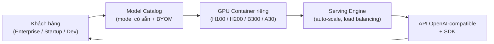
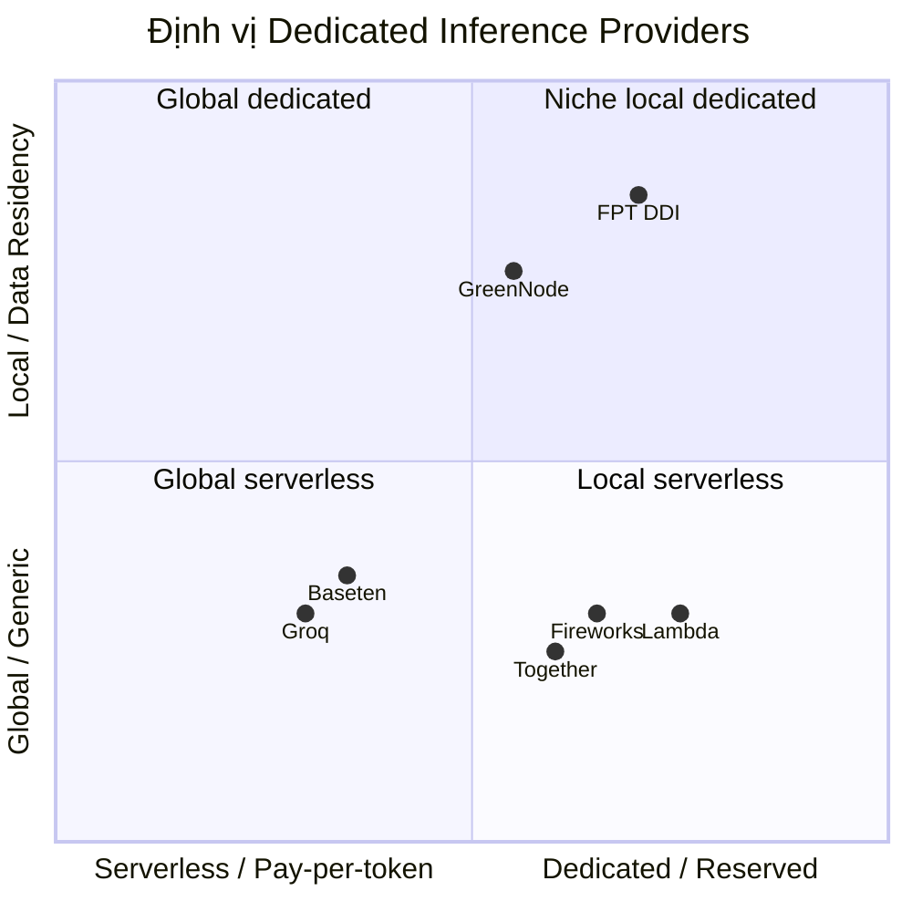

# Market Research — FPT Dedicated Inference (DDI) Service

**Phiên bản:** 1.0
**Ngày:** 18/08/2026
**Trạng thái:** Draft
**Chủ sở hữu:** Thuan Luu Thi (BA/PO)
**Phạm vi:** Nghiên cứu thị trường & chiến lược cạnh tranh cho dịch vụ **Dedicated Inference (DDI)** — nền tảng serving model tự động trên hạ tầng GPU container (NVIDIA H100, H200, B300, A30)

---

## 1. Executive Summary

| Câu hỏi | Trả lời ngắn gọn |
|---------|------------------|
| **Sản phẩm là gì?** | Dịch vụ dedicated inference: serving model AI trên GPU container riêng (dedicated), model catalog có sẵn, tự động triển khai |
| **Hạ tầng** | NVIDIA H100 · H200 · B300 · A30 trên GPU container cloud |
| **Thị trường** | AI inference toàn cầu ~$117,8 tỷ (2026), GPU chiếm ~35,3%; tăng trưởng mạnh đến 2035 |
| **Thị trường Việt Nam** | AI Việt Nam ~$1 tỷ (2026), CAGR ~39% đến 2031; cloud/data center ~$1,5 tỷ (2026) |
| **Đối thủ chính** | Together AI, Fireworks AI, Baseten, Groq, Lambda, Replicate, DeepInfra, SiliconFlow |
| **Lợi thế FPT** | Hạ tầng tự chủ tại Việt Nam · data residency · quan hệ chiến lược NVIDIA · model tiếng Việt |
| **Khuyến nghị chính** | Định vị "dedicated + data residency + tiếng Việt", cạnh tranh bằng giá GPU/giờ + SLA, mở rộng model catalog |

---

## 2. Tổng quan sản phẩm — FPT DDI

### 2.1 Định nghĩa

**Dedicated Inference (DDI)** là dịch vụ suy luận AI chuyên dụng: khách hàng được cấp **tài nguyên GPU container riêng** (không chia sẻ với tenant khác), nền tảng **tự động serving model** từ một **model catalog** có sẵn. Khác với serverless inference (pay-per-token, chia sẻ hạ tầng), DDI mang lại **hiệu năng ổn định, bảo mật tách biệt, và khả năng tinh chỉnh** cho workload sản xuất.

### 2.2 Hạ tầng GPU

| GPU | VRAM | Phù hợp | Vai trò trong DDI |
|-----|------|---------|--------------------|
| **NVIDIA H100** | 80GB HBM3 | Workload LLM chuẩn, training/inference | Dòng phổ thông, giá cạnh tranh |
| **NVIDIA H200** | 141GB HBM3e | Model 100B+, context dài, batch lớn | Dòng chủ lực cho LLM lớn |
| **NVIDIA B300** | HBM3e (thế hệ Blackwell Ultra) | Frontier model, hiệu năng cao nhất | Dòng cao cấp, hiệu năng đỉnh |
| **NVIDIA A30** | 24GB HBM2 | Model nhỏ, inferencing nhẹ, chi phí thấp | Entry-level, phù hợp SME |

> **Ghi chú:** B300 thuộc thế hệ Blackwell Ultra của NVIDIA — thị trường B200/B300 vẫn đang trong giai đoạn triển khai hạn chế (mid-2026), thường yêu cầu hợp đồng doanh nghiệp hoặc waitlist. Đây là cơ hội cạnh tranh cho FPT nếu có sớm nguồn cung.

### 2.3 Kiến trúc dịch vụ (WHAT — không phải HOW)

**Các thành phần chức năng:**
- **Model Catalog**: danh mục model có sẵn (Llama, Qwen, Gemma, DeepSeek, model tiếng Việt FPT...) + hỗ trợ BYOM (bring-your-own-model)
- **Provisioning tự động**: cấp phát GPU container theo yêu cầu, tự động triển khai model
- **Dedicated tenancy**: tài nguyên riêng, không sharing, bảo mật tách biệt
- **API chuẩn**: OpenAI-compatible API + SDK, giảm chi phí chuyển đổi
- **Giám sát & SLA**: uptime, latency, throughput được cam kết

---

## 3. Thị trường toàn cầu — AI Inference

### 3.1 Quy mô & tăng trưởng

| Chỉ số | Giá trị | Nguồn |
|--------|---------|-------|
| Thị trường AI inference toàn cầu | ~$117,8 tỷ (2026) | Fortune Business Insights |
| Phân khúc GPU | ~35,3% thị phần AI inference (2026) | Fortune Business Insights |
| AI data center GPU market | $12,83 tỷ (2026) → $77,15 tỷ (2035), CAGR ~22% | Precedence Research |
| Triển khai cloud | Phân khúc tăng trưởng nhanh nhất (2026–2035) | SNS Insider |
| Tổng chi tiêu AI toàn cầu | ~$2,52 nghìn tỷ (2026) | — |

### 3.2 Động lực tăng trưởng

1. **Bùng nổ LLM & GenAI**: nhu cầu serving model sản xuất tăng vọt, không chỉ training
2. **Chi phí inference giảm**: từ $60/1M tokens (2021) → $0,06/1M tokens (2026) — mở rộng thị trường
3. **Self-hosting khả thi hơn**: break-even ~2M tokens/ngày hoặc GPU utilization 22–48%
4. **Open-source models phổ biến**: Llama, Qwen, Gemma, DeepSeek — nhiều provider host cùng model
5. **Cloud deployment tăng nhanh nhất**: doanh nghiệp chuyển từ on-prem sang cloud inference

### 3.3 Xu hướng quan trọng

- **Serverless → Dedicated**: khi workload ổn định, khách hàng chuyển sang dedicated để tối ưu chi phí & hiệu năng
- **OpenAI-compatible API trở thành chuẩn**: hầu hết provider hỗ trợ — giảm chi phí chuyển đổi
- **Data residency & compliance** trở thành yếu tố quyết định cho enterprise (đặc biệt tài chính, y tế, chính phủ)
- **GPU thế hệ mới (Blackwell)**: B200/B300 tăng hiệu năng/inference, nhưng nguồn cung hạn chế

---

## 4. Thị trường Việt Nam

### 4.1 Quy mô

| Chỉ số | Giá trị | Nguồn |
|--------|---------|-------|
| Thị trường AI Việt Nam | ~$1 tỷ (2026); $932M (2025) → $6,91 tỷ (2031), **CAGR ~39%** | Statista |
| Thị trường cloud & data center | ~$1,5 tỷ (2026); dự báo $6,98 tỷ (2030), CAGR ~10,9% | — |
| Doanh nghiệp ứng dụng AI | 93% doanh nghiệp VN dùng ít nhất 1 công cụ AI | — |
| Xếp hạng | VN trong top 10 thị trường data center & cloud tăng trưởng nhanh nhất thế giới | — |

### 4.2 Chiến lược AI quốc gia

| Mục tiêu (đến 2030) | Giá trị |
|---------------------|---------|
| Đóng góp của AI vào GDP | ~6% |
| Triển khai GPU | 250.000 GPU |
| Mô hình AI tiếng Việt | 5 mô hình |
| Đào tạo chuyên gia AI | 500.000 chuyên gia |

### 4.3 Hệ sinh thái FPT × NVIDIA

| Yếu tố | Chi tiết |
|--------|----------|
| Quan hệ đối tác | Hợp tác chiến lược toàn diện (4/2024) |
| Đầu tư | FPT đầu tư $200M xây "Nhà máy AI" tại Việt Nam (H100, H200 + NVIDIA AI Enterprise) |
| Vai trò FPT | NVIDIA Cloud Partner + Global System Integrator; vận hành AI Factory tại VN & Nhật Bản |
| Dịch vụ | 43 dịch vụ cloud AI; mục tiêu 6.000 kỹ sư AI (2028) |
| Đầu tư NVIDIA vào VN | Cam kết $4–4,5 tỷ trong 4 năm; 2 trung tâm AI; mua lại VinBrain |
| Thị trường trọng điểm | Việt Nam, Nhật Bản, Hàn Quốc |

> **Insight:** FPT là một trong những doanh nghiệp chủ chốt vận hành AI Factory do NVIDIA cung cấp tại VN & Nhật. DDI là sản phẩm tự nhiên tận dụng hạ tầng này — lợi thế "first mover" tại thị trường Việt Nam.

---

## 5. Bối cảnh cạnh tranh

### 5.1 Đối thủ toàn cầu (dedicated inference / GPU cloud)

| Provider | Trụ sở | Mô hình | Hạ tầng | Định giá | Funding/Valuation |
|----------|--------|---------|---------|----------|-------------------|
| **Together AI** | SF (2022) | GPU cloud + inference API | Tự chủ (H100/A100) | Instant/reserved clusters | $1,33B · $3,3B |
| **Fireworks AI** | Redwood City (2022) | GenAI PaaS, inference | Tự chủ, engine tối ưu | Serverless + dedicated (B200 $9/GPU/hr) | $1,81B · $4B |
| **Baseten** | SF (2019) | MLOps, model serving | Serverless multi-cloud | Serverless + dedicated | $2,08B · $5B |
| **Groq** | Mountain View (2016) | Hardware inference (LPU ASIC) | Tự chủ (LPU) | GroqCloud API | $1B+ · $3,5B |
| **Lambda** | — | GPU cloud | Tự chủ | B200 $3,49/GPU/hr on-demand | Private |
| **Replicate** | — | Serverless + custom model | Tự chủ | Pay-per-second | — |
| **DeepInfra** | — | Serverless inference | Tự chủ | $0,02–0,30/1M tok (rẻ nhất) | — |
| **SiliconFlow** | Trung Quốc | All-in-one AI cloud | Tự chủ (China+global) | Pay-per-token | — |

### 5.2 Đối thủ khu vực / tiềm năng

- **BytePlus (ByteDance)**: nền tảng AI cloud, model hosting, cạnh tranh tại SEA
- **GreenNode (VN)**: hợp tác NVIDIA, GPU cloud tại Việt Nam — đối thủ trực tiếp nội địa
- **Viettel**: hạ tầng cloud & AI, tiềm năng GPU-as-a-service
- **Hyperscalers (AWS/Azure/GCP)**: có GPU instance nhưng định giá cao, ít tập trung dedicated inference niche

### 5.3 Ma trận định vị cạnh tranh

> **Vị trí FPT:** góc "niche local dedicated" (dedicated + data residency Việt Nam) — khoảng trống chưa ai chiếm giữ mạnh tại thị trường Việt Nam/SEA.

---

## 6. Pricing Benchmark (GPU/giờ, 2026)

| GPU | Range on-demand | Provider tham chiếu (thấp) | Hyperscaler (cao) |
|-----|-----------------|---------------------------|-------------------|
| **H100** | $1,99 – $14,90 | Vast $1,60 · GMI $2,00 · RunPod $2,89 | AWS ~$6,16 · Azure/GCP cao hơn |
| **H200** | $1,99 – $13,78 | GMI $2,60 · Jarvislabs $3,99 | AWS $7,91 · Oracle $10 · Azure $10,60 · GCP $10,85 |
| **B200** | $3,20 – $16,11 | Runcrate $3,20 · Lambda $3,49 · Spheron $3,70 | AWS $14,24 · GCP $16,11 |
| **A30** | (entry-level, thấp hơn H100 đáng kể) | — | — |

**Insights pricing:**
- Neo-cloud (chuyên GPU) định giá **thấp hơn hyperscaler 40–60%** — FPT nên định vị theo nhóm này
- **Reserved/dedicated** thường rẻ hơn on-demand đáng kể khi cam kết dài hạn
- Fireworks dedicated B200: $9/GPU/hr; Lambda B200 on-demand: $3,49/GPU/hr → biên độ rộng, FPT có dư địa cạnh tranh
- A30 là entry-point giá rẻ để thu hút SME, upsell lên H100/H200/B300

---

## 7. Phân khúc khách hàng mục tiêu

| Phân khúc | Nhu cầu | Sản phẩm phù hợp | Ưu tiên |
|-----------|---------|------------------|---------|
| **Enterprise Việt Nam** (tài chính, ngân hàng, y tế, chính phủ) | Data residency, compliance, SLA, bảo mật | Dedicated H100/H200 + SLA | 🔴 Cao |
| **Startup GenAI VN** | Chi phí thấp, triển khai nhanh | A30/H100 on-demand + model catalog | 🔴 Cao |
| **Doanh nghiệp Nhật Bản/Hàn Quốc** | Dedicated, độ trễ thấp, hỗ trợ địa phương | Dedicated H200/B300 | 🟠 Trung |
| **Dev/Research** | Model catalog rộng, API chuẩn | Serverless + dedicated | 🟡 Thấp |
| **Agency/ISV** | Tích hợp API, white-label | API + SDK | 🟠 Trung |

---

## 8. Phân tích SWOT

### Strengths (Điểm mạnh)
- Hạ tầng tự chủ tại Việt Nam, quan hệ chiến lược NVIDIA (AI Factory, H100/H200)
- Data residency + compliance — lợi thế độc nhất so với đối thủ nước ngoài
- Model tiếng Việt riêng (FPT.AI), hiểu văn hóa/ngôn ngữ địa phương
- Hệ sinh thái FPT rộng (FPT Smart Cloud, 43 dịch vụ cloud AI, 6.000 kỹ sư AI)
- Đa dạng GPU: A30 → H100 → H200 → B300, phủ mọi phân khúc

### Weaknesses (Điểm yếu)
- Brand awareness toàn cầu thấp hơn Together/Fireworks/Baseten
- Model catalog có thể hẹp hơn đối thủ (1000+ của Replicate)
- Nguồn cung GPU thế hệ mới (B300) có thể hạn chế
- Năng lực vận hành hạ tầng GPU quy mô lớn còn mới so với hyperscaler

### Opportunities (Cơ hội)
- Thị trường AI inference tăng trưởng ~$117,8 tỷ (2026), CAGR cao
- Chiến lược AI quốc gia VN: 250.000 GPU, 6% GDP, 500.000 chuyên gia
- NVIDIA đầu tư $4–4,5 tỷ vào VN — thúc đẩy hệ sinh thái
- Khoảng trống "dedicated + data residency" tại VN/SEA chưa ai chiếm
- Doanh nghiệp VN chuyển từ serverless → dedicated khi workload ổn định

### Threats (Thách thức)
- Đối thủ toàn cầu giàu funding ($1,3–2 tỷ) mở rộng nhanh
- GreenNode/Viettel cạnh tranh nội địa
- Biến động giá GPU & nguồn cung (Blackwell hạn chế)
- Cuộc đua giảm giá inference làm giảm margin
- Phụ thuộc NVIDIA (chuỗi cung ứng, chính sách xuất khẩu chip)

---

## 9. Chiến lược Go-To-Market

### 9.1 Định vị
> **"FPT DDI — Dedicated Inference với Data Residency tại Việt Nam, vận hành trên hạ tầng NVIDIA AI Factory."**

Ba trụ cột khác biệt:
1. **Dedicated** — hiệu năng ổn định, bảo mật tách biệt (không serverless chung)
2. **Data residency** — dữ liệu nằm tại Việt Nam, tuân thủ pháp luật & compliance
3. **Tiếng Việt & địa phương** — model tiếng Việt, hỗ trợ bản địa, độ trễ thấp

### 9.2 Chiến lược giá (đề xuất)

| GPU | Định giá đề xuất (dedicated/giờ) | So với thị trường |
|-----|----------------------------------|-------------------|
| **A30** | Entry-point rẻ, thu hút SME | Cạnh tranh nhất |
| **H100** | Ngang neo-cloud ($2–3/giờ) | Cạnh tranh |
| **H200** | Ngang GMI/Jarvislabs ($2,6–4/giờ) | Cạnh tranh |
| **B300** | Premium, cam kết reserved | Cao hơn, dành enterprise |

> **Nguyên tắc:** định giá theo nhóm **neo-cloud chuyên GPU** (thấp hơn hyperscaler 40–60%), không theo hyperscaler. Reserved dài hạn ưu đãi để giữ chân enterprise.

### 9.3 Kênh phân phối
- **Trực tiếp**: đội sales enterprise FPT (tài chính, ngân hàng, chính phủ)
- **Đối tác**: NVIDIA ecosystem, ISV, agency, hệ sinh thái FPT (Smart Cloud)
- **Digital**: self-serve portal, model catalog, API playground, free trial
- **Khu vực**: Việt Nam (core) → Nhật Bản, Hàn Quốc (mở rộng)

---

## 10. Lộ trình đề xuất (Roadmap)

| Giai đoạn | Trọng tâm | KPI chính |
|-----------|-----------|-----------|
| **Phase 1 — Foundation (0–6 tháng)** | Ra mắt DDI trên H100/A30, model catalog cốt lõi, API chuẩn, portal self-serve | ≥20 model, ≥10 khách hàng pilot |
| **Phase 2 — Scale (6–12 tháng)** | Thêm H200/B300, SLA cam kết, BYOM, enterprise onboarding, data residency cert | ≥50 model, ≥50 khách hàng, 99,9% uptime |
| **Phase 3 — Expansion (12–24 tháng)** | Mở rộng Nhật/Hàn, multi-region, fine-tuning platform, marketplace | ≥100 model, ≥200 khách hàng, revenue milestone |

---

## 11. KPI & Success Metrics (đề xuất)

| Loại | Metric | Mục tiêu |
|------|--------|----------|
| **Adoption** | Số model trong catalog | ≥20 → 50 → 100 |
| **Adoption** | Số khách hàng active (dedicated) | ≥10 → 50 → 200 |
| **Usage** | GPU utilization trung bình | ≥60% |
| **Performance** | Uptime SLA | ≥99,9% |
| **Performance** | Time-to-first-token / latency | Theo benchmark model |
| **Revenue** | Revenue từ DDI | Milestone theo phase |
| **Satisfaction** | NPS / retention | NPS ≥40, retention ≥90% |

---

## 12. Khuyến nghị tổng hợp

### Must (bắt buộc)
1. **Định vị rõ "dedicated + data residency VN"** — khác biệt cốt lõi, chưa ai chiếm
2. **Hoàn thiện model catalog** với model tiếng Việt FPT làm điểm nhấn độc nhất
3. **OpenAI-compatible API + SDK** — chuẩn ngành, giảm chi phí chuyển đổi
4. **SLA & benchmark công khai** (latency, uptime) — học Groq/Fireworks, tạo niềm tin

### Should (nên)
5. **Pricing theo neo-cloud** (thấp hơn hyperscaler 40–60%), reserved ưu đãi
6. **Portal self-serve + free trial** — giảm ma sát onboarding
7. **Tận dụng quan hệ NVIDIA** — ưu tiên nguồn cung H200/B300, đồng marketing
8. **Enterprise compliance pack** — data residency, audit, region selection

### Could (có thể)
9. **BYOM (bring-your-own-model)** — giá trị enterprise
10. **Fine-tuning platform** tích hợp — upsell từ inference
11. **Multi-region** (Nhật, Hàn) — mở rộng quốc tế

### Won't (không làm ngay)
12. Không cạnh tranh trực diện giá rẻ nhất với DeepInfra ở phân khúc serverless commodity

---

## 13. Top đối thủ cần theo dõi sát

1. **Lambda** — benchmark giá GPU/giờ rẻ nhất, dedicated capacity, price transparency
2. **Fireworks AI** — benchmark dedicated inference + engine tối ưu + pricing B200
3. **GreenNode (VN)** — đối thủ nội địa trực tiếp, cùng hợp tác NVIDIA
4. **Together AI** — benchmark model catalog + ecosystem
5. **Baseten** — benchmark MLOps/serverless-to-dedicated transition

---

## PHỤ LỤC A — Outline Slide Deck (sẵn sàng dựng)

> Outline này ánh xạ trực tiếp nội dung nghiên cứu thành bộ slide market research (24 slides). Khi môi trường cho phép sinh HTML/PDF/PPTX, dùng outline này làm cấu trúc.

| # | Slide | Nội dung chính |
|---|-------|----------------|
| 1 | **Cover** | FPT DDI · Market Research & Chiến lược cạnh tranh |
| 2 | **Agenda** | 6 phần chính |
| 3 | **Executive Summary** | Bảng tóm tắt câu hỏi/trả lời |
| 4 | **DDI là gì** | Định nghĩa, dedicated vs serverless |
| 5 | **Model Catalog & Hạ tầng GPU** | Bảng H100/H200/B300/A30 |
| 6 | **Value Proposition** | 3 trụ cột: dedicated · data residency · tiếng Việt |
| 7 | **Thị trường AI inference toàn cầu** | $117,8 tỷ, GPU 35,3%, CAGR |
| 8 | **Động lực tăng trưởng** | 5 động lực chính |
| 9 | **Thị trường Việt Nam** | $1 tỷ, CAGR 39%, 93% DN dùng AI |
| 10 | **Chiến lược AI quốc gia** | 250K GPU, 6% GDP, 500K chuyên gia |
| 11 | **Hệ sinh thái FPT × NVIDIA** | $200M AI Factory, 43 dịch vụ, $4–4,5 tỷ |
| 12 | **Bối cảnh cạnh tranh toàn cầu** | Bảng 8 provider |
| 13 | **Đối thủ khu vực** | GreenNode, BytePlus, Viettel |
| 14 | **Ma trận định vị** | Quadrant chart (dedicated × data residency) |
| 15 | **Pricing Benchmark** | Bảng GPU/giờ H100/H200/B200/A30 |
| 16 | **Insights pricing** | Neo-cloud vs hyperscaler, reserved |
| 17 | **Phân khúc khách hàng** | 5 segment + ưu tiên |
| 18 | **SWOT** | 4 ô Strengths/Weaknesses/Opportunities/Threats |
| 19 | **Cơ hội & Thách thức** | Chi tiết hóa từ SWOT |
| 20 | **Chiến lược GTM** | Định vị + chiến lược giá + kênh |
| 21 | **Lộ trình (Roadmap)** | 3 phase + KPI |
| 22 | **KPI & Success Metrics** | Bảng metric |
| 23 | **Khuyến nghị** | Must/Should/Could/Won't |
| 24 | **Closing / Thank you** | Liên hệ, next steps |

---

## PHỤ LỤC B — Nguồn dữ liệu

- Fortune Business Insights — AI inference market size (2026)
- Precedence Research — AI data center GPU market (2026–2035)
- SNS Insider — AI inference infrastructure, cloud deployment trend
- Statista — AI market Việt Nam (2025–2031), cloud market
- Digital in Asia, Báo Đầu Tư, VnEconomy, Lao Động — thị trường AI/GPU cloud VN, FPT × NVIDIA
- FPT Software, FPT Cloud — AI Factory, 43 dịch vụ cloud AI, NVIDIA partnership
- Traxcn, PitchBook — funding/valuation đối thủ (Together, Fireworks, Baseten, Groq)
- GMI Cloud, RunPod, Lambda, Jarvislabs, Spheron, AWS/Azure/GCP — GPU pricing benchmark (2026)

> **Lưu ý:** Các số liệu thị trường là ước tính từ nguồn công khai (2026), có thể thay đổi. Nên xác minh lại trước khi trình bày chính thức với khách hàng.