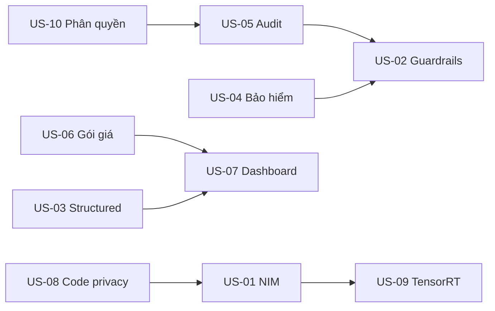

# Ước lượng công việc — Mở rộng FPT DDI với NVIDIA

**Phiên bản:** 1.0
**Ngày:** 25/08/2026
**Trạng thái:** Approved
**Chủ sở hữu:** Thuan Luu Thi (BA/PO)
**Liên quan:** `user-stories-nvidia-partner-expansion.md`, `wireframes-nvidia-partner-expansion.md`

> Ước lượng theo **story points** (Fibonacci) + **ngày công (man-day)**. Quy ước: 1 SP ≈ 1 man-day (đội 3-5 người: 1 BE, 1-2 FE, 1 QA, 1 PO/BA bán thời gian).

---

## 1. Bảng ước lượng theo story

| Story | Mô tả | SP | MD | Phân loại |
|-------|-------|----|----|-----------|
| US-01 | Deploy model NVIDIA NIM 1-click | 8 | 8 | BE+FE |
| US-02 | Guardrails banking (NeMo) | 8 | 8 | BE+FE |
| US-03 | Structured output (JSON Schema) | 5 | 5 | BE |
| US-04 | Trích xuất tài liệu bảo hiểm | 8 | 8 | BE+FE |
| US-05 | Audit trail bất biến | 8 | 8 | BE |
| US-06 | Gói giá theo phân khúc | 5 | 5 | BE+FE |
| US-07 | Dashboard KPI theo phân khúc | 5 | 5 | FE |
| US-08 | Chế độ code privacy | 3 | 3 | BE+FE |
| US-09 | Tối ưu engine TensorRT-LLM | 8 | 8 | BE (infra) |
| US-10 | Phân quyền theo vai trò | 5 | 5 | BE+FE |
| **Tổng** | | **63** | **63** | |

---

## 2. Ước lượng theo pha

### Pha 1 (MVP) — 8-12 tuần

| Hạng mục | SP | MD |
|----------|----|----|
| US-01 NIM deploy | 8 | 8 |
| US-02 Guardrails banking | 8 | 8 |
| US-05 Audit trail | 8 | 8 |
| US-08 Code privacy | 3 | 3 |
| US-10 Phân quyền | 5 | 5 |
| **Tổng pha 1** | **32** | **32** |

Với đội 4 người (1 BE, 2 FE, 1 QA) + buffer 20% → **≈ 10 tuần**.

### Pha 2 — 3-6 tháng

| Hạng mục | SP | MD |
|----------|----|----|
| US-03 Structured output | 5 | 5 |
| US-06 Gói giá | 5 | 5 |
| US-07 Dashboard | 5 | 5 |
| US-09 TensorRT-LLM | 8 | 8 |
| **Tổng pha 2** | **23** | **23** |

Buffer 20% → **≈ 7-8 tuần**.

### Pha 3 — 6-12 tháng

| Hạng mục | SP | MD |
|----------|----|----|
| US-04 Trích xuất bảo hiểm | 8 | 8 |
| **Tổng pha 3** | **8** | **8** |

Buffer 20% → **≈ 2-3 tuần**.

---

## 3. Phân bổ theo vai trò (tổng)

| Vai trò | Pha 1 | Pha 2 | Pha 3 | Tổng |
|---------|-------|-------|-------|------|
| Backend (BE) | 14 | 10 | 4 | 28 |
| Frontend (FE) | 12 | 9 | 3 | 24 |
| QA (kiểm thử) | 6 | 4 | 1 | 11 |
| **Tổng** | **32** | **23** | **8** | **63** |

---

## 4. Rủi ro ảnh hưởng ước lượng

| Rủi ro | Tác động | Điều chỉnh |
|--------|----------|-----------|
| Tích hợp NIM/NGC phức tạp hơn dự kiến | +30% US-01 | PoC trước 1 tuần |
| NeMo Guardrails tuning tốn thời gian | +25% US-02 | Dùng template có sẵn |
| TensorRT-LLM compile model lâu | +40% US-09 | Cache engine, dùng model phổ biến |
| Quy định NHNN thay đổi | Trễ pha 2 | Theo dõi sandbox |
| Thiếu GPU H200/B300 tại VN | Trễ deploy | Fallback H100/A30 |

---

## 5. Phụ thuộc (dependency)

### Ghi chú phụ thuộc
- **US-05 (Audit)** nên làm trước US-02 (Guardrails) vì guardrails cần ghi audit.
- **US-10 (Phân quyền)** nền tảng cho mọi thao tác — làm đầu pha 1.
- **US-01 (NIM)** độc lập, có thể song song với US-05/US-10.
- **US-09 (TensorRT)** phụ thuộc US-01 (cùng infra NIM/engine).

---

## 6. Khuyến nghị lộ trình sprint (Pha 1)

| Sprint | Nội dung | SP |
|--------|----------|----|
| S1 | US-10 Phân quyền + US-05 Audit (setup nền) | 13 |
| S2 | US-01 NIM deploy (PoC + catalog + deploy) | 8 |
| S3 | US-02 Guardrails banking | 8 |
| S4 | US-08 Code privacy + hardening + regression | 3 |
| **Tổng** | | **32** |

> 4 sprints × 2 tuần = 8 tuần (buffer 20% → ~10 tuần).