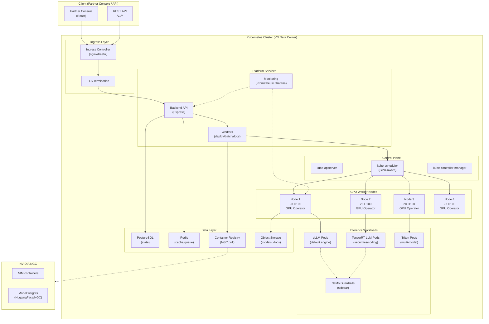
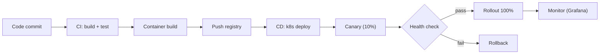

# Kiến trúc k8s — Hạ tầng inference FPT DDI

**Phiên bản:** 1.0
**Ngày:** 25/08/2026
**Trạng thái:** Draft
**Chủ sở hữu:** Thuan Luu Thi (BA/PO)
**Loại tài liệu:** Architecture Design (Kubernetes)
**Liên quan:** `production-readiness-gpu-inference.md`, `adr-engine-inference.md`

> Kiến trúc Kubernetes cho hạ tầng inference GPU. Mô tả topology, resource, và cách scale.

---

## 1. Tổng quan topology



---

## 2. Thành phần chính

### 2.1 GPU Worker Nodes
| Thành phần | Chi tiết |
|------------|----------|
| GPU | 2–4× H100 SXM 80GB / node |
| GPU Operator | NVIDIA GPU Operator (device plugin, DCGM exporter) |
| Container Runtime | containerd + NVIDIA Container Toolkit |
| Node Labels | `nvidia.com/gpu: 2`, `gpu-type: h100` |
| Taints | `nvidia.com/gpu=present:NoSchedule` (chỉ pod GPU mới schedule) |

### 2.2 Inference Workloads
| Workload | Engine | Resource | Ghi chú |
|----------|--------|----------|---------|
| vLLM Pods | vLLM | 1 GPU/pod (hoặc shared) | Default, OpenAI-compatible |
| TensorRT-LLM Pods | TRT-LLM | 1–2 GPU/pod | securities/coding low-latency |
| Triton Pods | Triton | 1+ GPU/pod | multi-model/ensemble |
| NeMo Guardrails | NeMo | CPU (sidecar) | PII/injection guard |

### 2.3 Data Layer
| Thành phần | Purpose |
|------------|---------|
| PostgreSQL | State (endpoint, key, audit, pricing) |
| Redis | Cache, queue (batch, documents) |
| Container Registry | Pull NIM containers từ NGC |
| Object Storage | Model weights, document files |

### 2.4 Platform Services
| Service | Purpose |
|---------|---------|
| Backend API (Express) | REST /v1/*, auth, routing |
| Workers | Deploy endpoint, batch, documents |
| Monitoring | Prometheus + Grafana + DCGM (GPU metrics) |

---

## 3. Resource requests/limits (GPU pods)

### 3.1 vLLM pod (1 GPU)
```yaml
resources:
  requests:
    nvidia.com/gpu: 1
    memory: 100Gi
    cpu: "16"
  limits:
    nvidia.com/gpu: 1
    memory: 120Gi
    cpu: "32"
```

### 3.2 TensorRT-LLM pod (2 GPU)
```yaml
resources:
  requests:
    nvidia.com/gpu: 2
    memory: 200Gi
    cpu: "32"
  limits:
    nvidia.com/gpu: 2
    memory: 240Gi
    cpu: "64"
```

### 3.3 GPU sharing (MIG / time-slicing)
- **MIG (Multi-Instance GPU):** Chia 1 H100 thành 7 instance — cho endpoint nhỏ.
- **Time-slicing:** Chia GPU cho nhiều pod (thấp hơn MIG về isolation).
- Dùng cho endpoint low-volume để tối ưu utilization.

---

## 4. Scaling strategy

### 4.1 Horizontal Pod Autoscaler (HPA)
```yaml
autoscaling/v2:
  metrics:
    - type: Pods
      pods:
        metric: { name: gpu_utilization }
        target: { averageValue: "70" }
  minReplicas: 2
  maxReplicas: 16
```

### 4.2 Cluster Autoscaler
- Scale node khi GPU pending > 5 phút.
- Max 8 node GPU (MVP).

### 4.3 Scaling theo phân khúc
| Phân khúc | Min replicas | Max replicas | Engine |
|-----------|--------------|--------------|--------|
| securities | 4 | 16 | TensorRT-LLM |
| coding | 4 | 12 | vLLM |
| banking | 2 | 8 | vLLM |
| insurance | 2 | 6 | vLLM |

---

## 5. Network & storage

### 5.1 Network
| Thành phần | Chi tiết |
|------------|----------|
| Ingress | nginx/traefik + TLS |
| Service Mesh | (optional) Istio cho mTLS |
| GPU interconnect | NVLink (intra-node), 100GbE (inter-node) |
| Network policy | Isolate GPU pods, restrict egress |

### 5.2 Storage
| Storage | Purpose |
|---------|---------|
| NVMe SSD (local) | Model weights (fast load) |
| Object Storage (S3) | Model archive, documents |
| PVC (Postgres) | State DB |
| ConfigMap/Secret | Config, API keys |

---

## 6. Security

| Control | Chi tiết |
|---------|----------|
| Network policy | GPU pods chỉ nhận traffic từ backend |
| Secret management | API keys, NGC token qua k8s Secret / Vault |
| Image security | Scan NIM images, pin version |
| RBAC | Worker chỉ có quyền deploy, không delete |
| Audit | K8s audit log + application audit_log |
| Data residency | Cluster đặt VN, data không rời VN |

---

## 7. Monitoring

| Metric | Source | Alert |
|--------|--------|-------|
| GPU utilization | DCGM exporter | <30% (lãng phí) / >90% (overload) |
| GPU memory | DCGM | >90% (OOM risk) |
| GPU temperature | DCGM | >85°C (throttle) |
| Inference latency p95 | Backend | >target (securities 500ms) |
| Throughput (tokens/s) | Backend | <baseline |
| Pod restarts | K8s | >3/10min |
| Queue depth (batch/docs) | Redis | >100 (backlog) |

Dashboard: Grafana (GPU + inference + platform).

---

## 8. Deployment pipeline



- **Canary:** Deploy 10% traffic trước, monitor 15 phút, rồi rollout 100%.
- **Rollback:** Tự động nếu error rate > 1% hoặc latency p95 vượt target.

---

## 9. Capacity planning

| Giai đoạn | Node GPU | GPU tổng | Workload |
|-----------|----------|----------|----------|
| MVP (P1) | 4 | 8 H100 | 4 phân khúc cơ bản |
| Growth (P3) | 8 | 32 H100 | Scale + multi-region |
| Scale (future) | 16+ | 64+ H100/B300 | Enterprise, high-volume |

---

## 10. Lưu ý
- Kiến trúc này là **thiết kế mục tiêu** — cần validate khi triển khai thực tế.
- GPU Operator + NVIDIA Container Toolkit là bắt buộc.
- MIG/time-slicing cần test kỹ trước khi production (isolation, performance).
- Multi-region (VN + DR) là phase sau (P3).