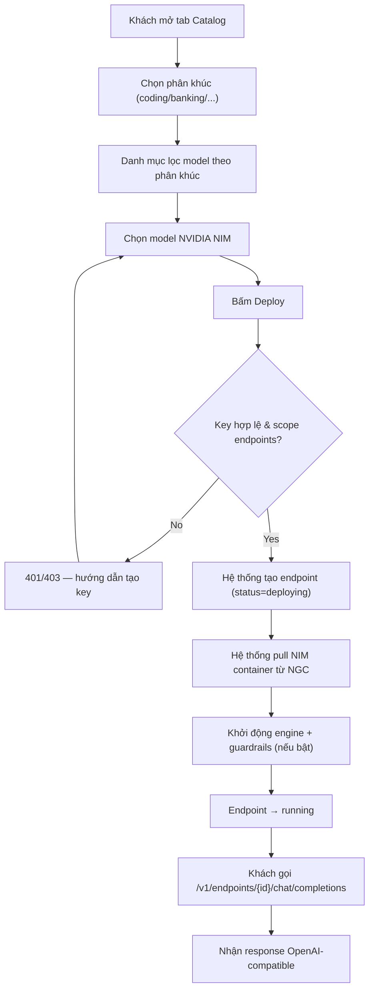
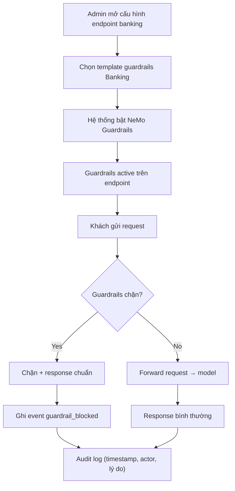
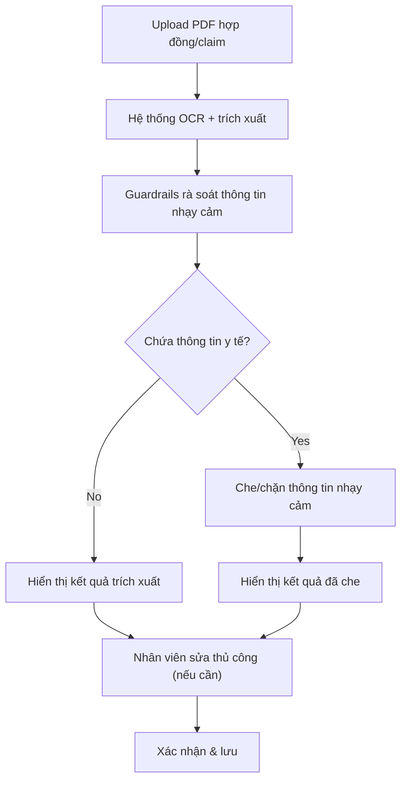
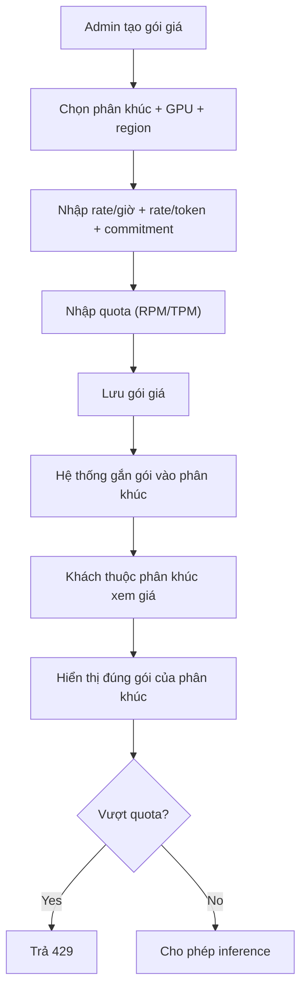
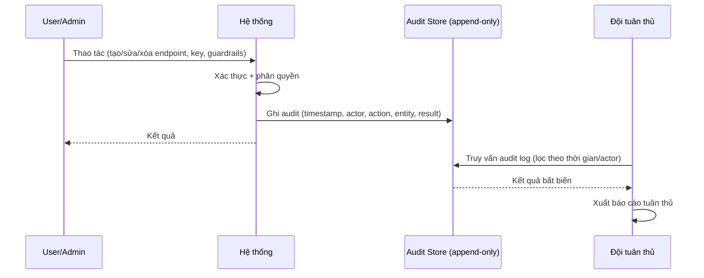
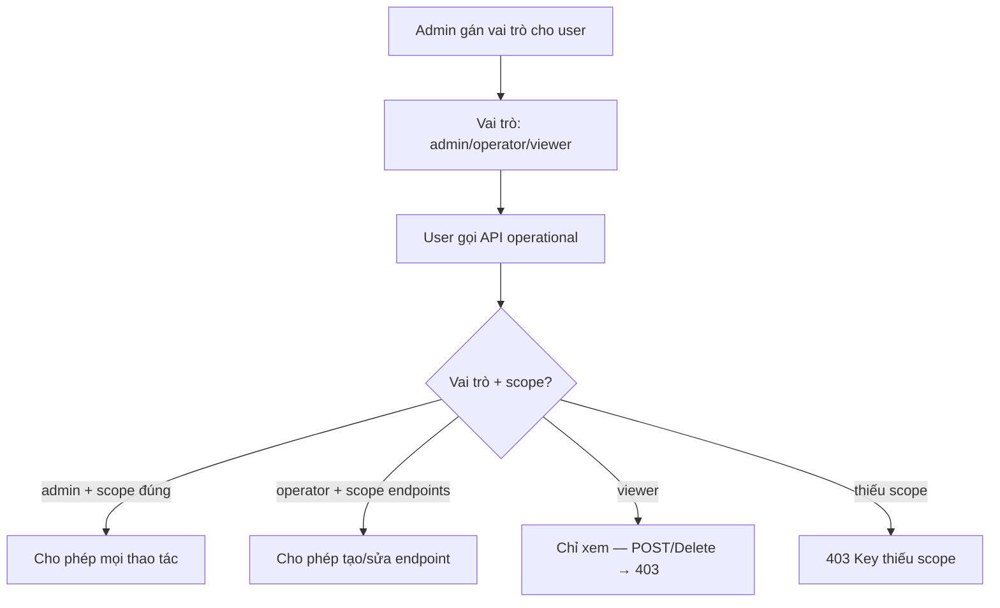

# Process Flows (BPMN) — Mở rộng FPT DDI với NVIDIA

**Phiên bản:** 1.0
**Ngày:** 25/08/2026
**Trạng thái:** Draft
**Chủ sở hữu:** Thuan Luu Thi (BA/PO)
**Liên quan:** `brd-nvidia-partner-expansion.md`, `srs-nvidia-partner-expansion.md`

> Các quy trình được mô tả bằng Mermaid (flowchart/sequenceDiagram). Mỗi quy trình kèm business rules và exception.

---

## PF-01 — Quy trình deploy model NVIDIA NIM (US-01)

### Actors
- **Khách hàng**: kỹ sư AI, có API key scope `endpoints`.
- **Hệ thống FPT DDI**: nền tảng.
- **NVIDIA NGC/NIM**: nguồn catalog model.

### Flow

### Business Rules
- BR-PF01-1: Deploy endpoint NIM phải hoàn tất (running) trong ≤5 phút (FR-NIM-001.3).
- BR-PF01-2: Key phải có scope `endpoints`; thiếu → 403.
- BR-PF01-3: Endpoint NIM hiển thị version NIM (FR-NIM-002.1).

### Exceptions
- EX-PF01-1: NGC không truy cập được → endpoint chuyển `failed`, ghi audit, thông báo khách.
- EX-PF01-2: Model NIM không hỗ trợ engine đã chọn → chặn deploy, hiển thị lỗi.

---

## PF-02 — Quy trình bật guardrails banking (US-02)

### Actors
- **Admin/Giám đốc CNTT**: bật guardrails.
- **Hệ thống**: áp guardrails.
- **Khách hàng cuối**: gọi endpoint.

### Flow

### Business Rules
- BR-PF02-1: Guardrails banking bật mặc định cho endpoint banking (FR-SEG-003.1).
- BR-PF02-2: Chặn PII (CCCD/CMND) theo Nghị định 13/2023/NĐ-CP.
- BR-PF02-3: Mọi sự kiện chặn ghi audit log append-only (FR-COMP-001).

### Exceptions
- EX-PF02-1: Guardrails service lỗi → fail-open hoặc fail-closed tùy cấu hình; mặc định fail-closed cho banking (chặn request) để đảm bảo tuân thủ.

---

## PF-03 — Quy trình trích xuất tài liệu bảo hiểm (US-04)

### Actors
- **Nhân viên underwriting**: upload tài liệu.
- **Hệ thống**: trích xuất + guardrails.

### Flow

### Business Rules
- BR-PF03-1: Độ chính xác trích xuất ≥90% (FR-SEG-005.1).
- BR-PF03-2: Guardrails chặn thông tin y tế nhạy cảm (FR-SEG-005.2).

### Exceptions
- EX-PF03-1: PDF không đọc được (scan kém) → yêu cầu upload lại bản rõ hơn.
- EX-PF03-2: Trích xuất dưới ngưỡng tin cậy → cảnh báo để nhân viên kiểm tra thủ công.

---

## PF-04 — Quy trình tạo gói giá theo phân khúc (US-06)

### Actors
- **Admin FPT**: tạo gói giá.
- **Hệ thống**: lưu + áp dụng.
- **Khách hàng**: xem giá.

### Flow

### Business Rules
- BR-PF04-1: Gói giá gắn với phân khúc + GPU + region (FR-PRICE-001.2).
- BR-PF04-2: Quota áp theo RPM/TPM (FR-PRICE-002.2).
- BR-PF04-3: Vượt quota → 429.

### Exceptions
- EX-PF04-1: Gói giá trùng (cùng phân khúc+GPU+region) → chặn tạo, yêu cầu sửa.

---

## PF-05 — Quy trình audit trail bất biến (US-05)

### Actors
- **User/Admin**: thao tác.
- **Hệ thống**: ghi audit.
- **Đội tuân thủ**: truy vết.

### Flow

### Business Rules
- BR-PF05-1: Audit log append-only, không API xóa/sửa được (FR-COMP-001.2).
- BR-PF05-2: Lưu ≥365 ngày (FR-COMP-001.3).

### Exceptions
- EX-PF05-1: Audit store đầy → cảnh báo admin, không chặn ghi (vòng lặp lưu trữ).

---

## PF-06 — Quy trình phân quyền theo vai trò (US-10)

### Actors
- **Admin**: gán vai trò.
- **Operator**: vận hành.
- **Viewer**: chỉ xem.

### Flow

### Business Rules
- BR-PF06-1: Chỉ admin tạo/sửa key và guardrails (FR-COMP-003.1).
- BR-PF06-2: Viewer chỉ xem (FR-COMP-003.2).

### Exceptions
- EX-PF06-1: User chưa gán vai trò → mặc định viewer.

---

## Tóm tắt quy trình ↔ story

| Quy trình | Story | Module |
|-----------|-------|--------|
| PF-01 | US-01 | NIM |
| PF-02 | US-02 | GRD, COMP |
| PF-03 | US-04 | SEG |
| PF-04 | US-06 | PRICE |
| PF-05 | US-05 | COMP |
| PF-06 | US-10 | COMP |