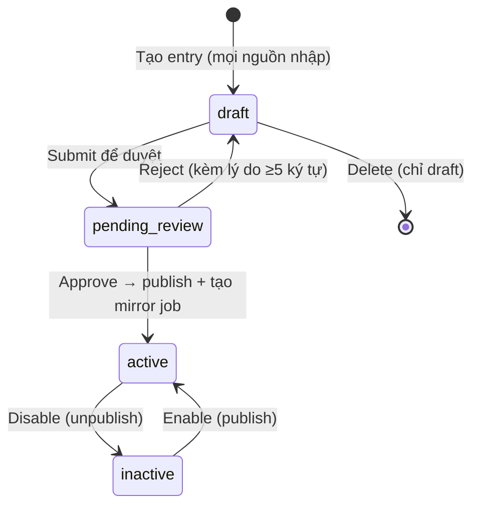
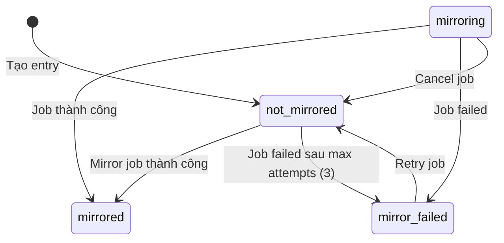
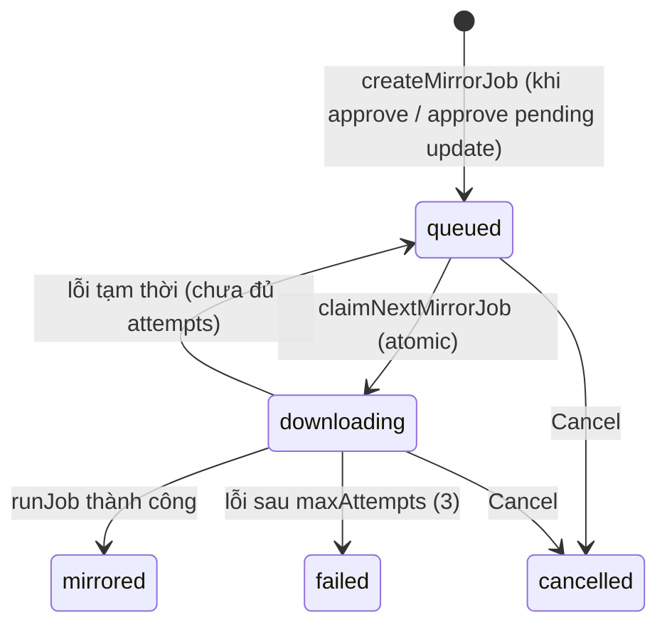
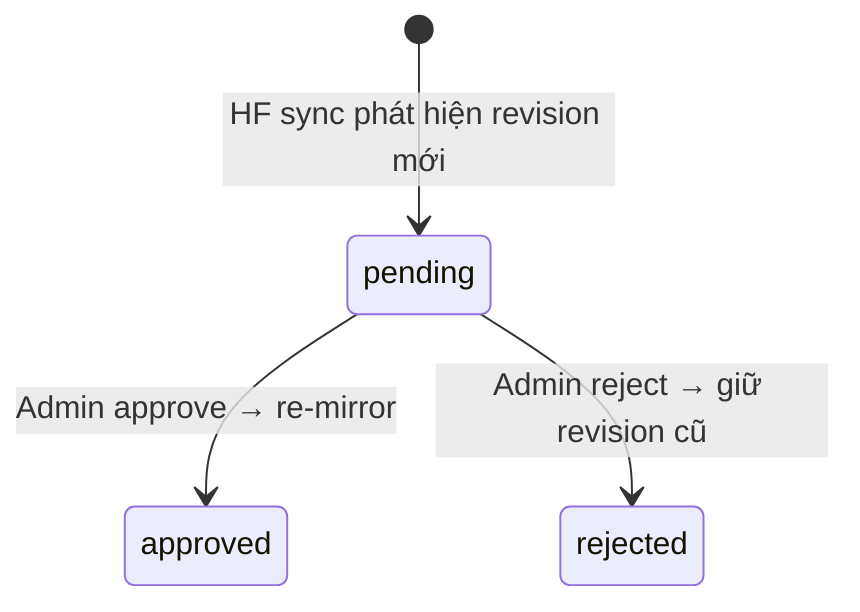
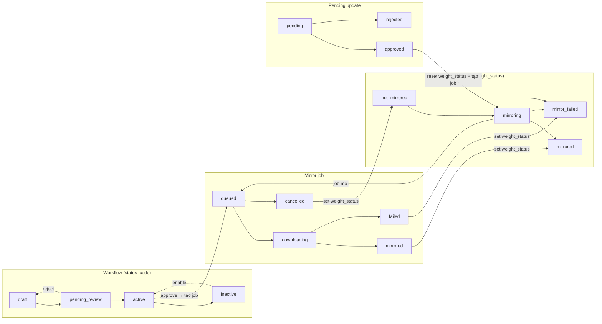
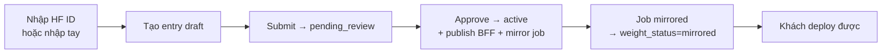
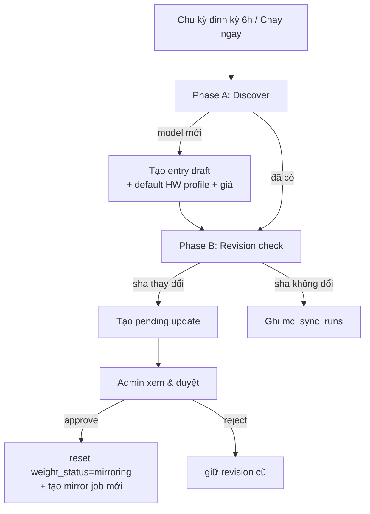

# PRD/SRS — Mô hình trạng thái & 4 chức năng nhập/xuất Model Catalog Admin (DDI)

**Phiên bản:** 1.0
**Ngày:** 01/09/2026
**Trạng thái:** Draft — căn cứ theo implementation hiện tại
**Chủ sở hữu:** Thuan Luu Thi (BA/PO)
**Phạm vi:** (1) Mô hình trạng thái của hệ thống **Admin Model Catalog** và mối quan hệ giữa các trạng thái; (2) 4 chức năng lấy thông tin/đưa dữ liệu vào catalog:
- **A. Upload model theo file** (Import)
- **B. Export file**
- **C. Upload thủ công đơn lẻ** (Manual / HF)
- **D. Sync dữ liệu từ Hugging Face tự động theo định kỳ** (HF Auto-sync)

**Liên quan:** `docs/brd-ddi-model-catalog-admin.md`, `docs/srs-ddi-model-catalog-admin.md`, `docs/model-catalog-import-export-json.md`
**Nguồn code (evidence):** `src/catalog-admin/{store,routes,hfsync,mirror,publish,hf,config}.js`, `db/migrations/015-mc-admin-catalog.sql`, `db/migrations/016-mc-hf-sync.sql`, `admin-console/js/{m1-list,m2-form,m4-detail,m6-sync}.js`

---

## 1. Giới thiệu

### 1.1 Mục đích

Tài liệu này mô tả **mô hình trạng thái (state model)** của hệ thống Admin Model Catalog và **4 chức năng nhập/xuất dữ liệu** mà admin dùng để đưa model vào catalog. Khác với BRD/SRS trước (mô tả phương án + yêu cầu đề xuất), tài liệu này **mô tả theo implementation hiện tại** — trạng thái và luồng đã được mã hóa trong code.

### 1.2 Người dùng mục tiêu

| Vai trò | Mô tả |
|---------|-------|
| **Catalog Admin (role `admin`)** | Tạo/sửa/xóa entry, import/export, submit, approve, disable/enable |
| **Approver (role `approver`)** | Duyệt entry (approve/reject) |
| **Viewer (role `viewer`)** | Chỉ đọc danh sách/chi tiết |

> Phân quyền theo path được enforce ở `server.js` (`pathScope` + `roleRequirement`). Import yêu cầu role `admin`; export mọi role có scope `admin` đọc được.

### 1.3 Thuật ngữ

| Thuật ngữ | Định nghĩa |
|-----------|------------|
| **Entry** | Một bản ghi model trong catalog (`mc_entries`) |
| **status_code** | Trạng thái vòng đời của entry (workflow) |
| **weight_status** | Trạng thái sẵn sàng weights (mirror) của entry |
| **Mirror job** | Tác vụ pull weights từ HF về mirror nội bộ (`mc_mirror_jobs`) |
| **Pending update** | Đề xuất cập nhật revision mới từ HF auto-sync (`mc_pending_updates`) |
| **HF Auto-sync** | Worker định kỳ quét HF tìm model mới + kiểm tra revision (`mc_hf_sync`) |

---

## 2. Mô hình trạng thái (State Model) — TRỌNG TÂM

Hệ thống quản lý **4 nhóm trạng thái độc lập** trên cùng một entry. Chúng bổ trợ nhau, không thay thế nhau:

| Nhóm | Trạng thái | Bảng lưu | Ý nghĩa |
|------|-----------|----------|---------|
| **1. Workflow** (`status_code`) | `draft`, `pending_review`, `active`, `inactive` | `mc_entries` | Vòng đời duyệt & hiển thị |
| **2. Weights** (`weight_status`) | `not_mirrored`, `mirroring`, `mirrored`, `mirror_failed` | `mc_entries` | Mức độ sẵn sàng weights để deploy |
| **3. Mirror job** | `queued`, `downloading`, `mirrored`, `failed`, `cancelled` | `mc_mirror_jobs` | Trạng thái tác vụ pull weights |
| **4. Pending update** | `pending`, `approved`, `rejected` | `mc_pending_updates` | Đề xuất revision mới từ auto-sync |

> Ngoài ra còn 2 thuộc tính **không phải trạng thái** nhưng ảnh hưởng luồng: `catalog_type` (`public`/`proprietary`) và `sync_enabled` (bật/tắt auto-sync theo entry).

### 2.1 State machine — Workflow (`status_code`)



**Quy tắc chuyển trạng thái (enforced trong code):**

| Hành động | Từ | Đến | Điều kiện bắt buộc |
|-----------|----|----|--------------------|
| `createEntry` | — | `draft` | Luôn khởi tạo ở `draft`, `weight_status=not_mirrored` |
| `submit` | `draft` | `pending_review` | Phải có ≥1 hardware profile; phải có giá (`fromPrice` hoặc GPU profile giá >0) |
| `approve` | `pending_review` | `active` | Role `admin`/`approver`; nếu `strictApproval` bật → creator không tự duyệt. Kèm publish BFF + tạo mirror job |
| `reject` | `pending_review` | `draft` | Lý do từ chối bắt buộc ≥5 ký tự |
| `disable` | `active` | `inactive` | Kèm unpublish BFF |
| `enable` | `inactive` | `active` | Kèm publish BFF |
| `delete` | `draft` | *(xóa)* | Chỉ entry `draft` được xóa; entry khác bị chặn |
| `update` | `draft`/`inactive` | *(giữ nguyên)* | `pending_review` và `active` **không** sửa được |

**Hiển thị cho khách:**

| `status_code` | Hiển thị cho khách | Ghi chú |
|---------------|:------------------:|---------|
| `draft` | ❌ | Đang soạn |
| `pending_review` | ❌ | Chờ duyệt |
| `active` | ✅ | Chỉ khi `weight_status = mirrored` |
| `inactive` | ❌ | Đã tắt, endpoint đang chạy vẫn hoạt động |

### 2.2 State machine — Weights (`weight_status`)



**Điều khiển bởi mirror worker** (`mirror.js`):

| Sự kiện | `weight_status` | Nguồn |
|---------|-----------------|-------|
| Entry mới tạo | `not_mirrored` | `createEntry` |
| Approve entry (tạo mirror job) | giữ `not_mirrored` (job chạy nền) | `approve` route |
| Job chạy thành công | `mirrored` + lưu `mirror_path`, `mirror_checksum` | `pollOnce` |
| Job failed sau `maxAttempts` (3) | `mirror_failed` | `pollOnce` |
| Retry job | `not_mirrored` | `retry` route |
| Cancel job | `not_mirrored` | `cancel` route |
| Approve pending update (re-mirror) | `mirroring` + tạo job mới | `pending-updates/:id/approve` |

> **Quy tắc then chốt:** Entry **chỉ deploy được** khi `status_code = active` **VÀ** `weight_status = mirrored`. `weight_status ≠ mirrored` → không hiển thị cho khách dù `status_code = active`.

### 2.3 State machine — Mirror job (`mc_mirror_jobs.status`)



| Trạng thái | Ý nghĩa |
|-----------|---------|
| `queued` | Đang chờ worker nhận |
| `downloading` | Đang pull weights (có `progress_pct`) |
| `mirrored` | Hoàn tất, `finished_at` ghi nhận |
| `failed` | Lỗi sau 3 lần thử, `finished_at` ghi nhận |
| `cancelled` | Bị hủy bởi admin |

- Concurrency tối đa `maxConcurrent` (mặc định 2).
- Job lỗi tạm thời được xếp lại `queued` với backoff `5000 × attempts` ms; sau `maxAttempts` (3) → `failed`.

### 2.4 State machine — Pending update (`mc_pending_updates.status`)



| Trạng thái | Ý nghĩa |
|-----------|---------|
| `pending` | Revision mới chờ admin quyết định |
| `approved` | Đã duyệt → reset `weight_status=mirroring` + tạo mirror job mới |
| `rejected` | Từ chối → entry giữ revision cũ |

- Idempotent: không tạo trùng pending update cho cùng `(entry, new_revision)`.

### 2.5 Mối quan hệ giữa các nhóm trạng thái



**Tóm tắt mối quan hệ:**

1. **Workflow quyết định quyền hiển thị**, **Weights quyết định khả năng deploy** — hai điều kiện **AND** mới cho phép khách dùng model.
2. **Approve entry** (workflow `active`) là **ngòi kích hoạt** tạo mirror job → job chạy → cập nhật `weight_status`.
3. **Approve pending update** (auto-sync) reset `weight_status=mirroring` và tạo mirror job mới → pull revision mới.
4. **Retry/Cancel mirror job** trả `weight_status` về `not_mirrored`.
5. `catalog_type` và `sync_enabled` là **thuộc tính độc lập**, không phải trạng thái: `sync_enabled=false` → entry không bị revision-check trong auto-sync.

---

## 3. Chức năng A — Upload model theo file (Import)

### 3.1 Mô tả

Cho phép admin tạo **nhiều entry cùng lúc** từ file JSON hoặc Markdown. Mọi entry import đều vào trạng thái `draft`.

### 3.2 API

```
POST /v1/admin/catalog/import
Content-Type: application/json
Authorization: Bearer <key-role-admin>
```

**Body — 3 dạng chấp nhận:**

| Dạng | Ví dụ |
|------|-------|
| Mảng entries trực tiếp | `[ {...}, {...} ]` |
| Bọc trong `entries` | `{ "entries": [...] }` |
| Nội dung file dạng text | `{ "content": "<text>", "format": "json"\|"md"\|"auto", "dryRun": true }` |

- `format=md`/`markdown`: parse JSON từ các block `curl ... --data '{...}'`.
- `format=auto`: thử JSON trước, fail thì thử Markdown.
- `dryRun=true`: chỉ kiểm tra, không tạo entry.

**Response:**

```json
{
  "ok": true,
  "data": {
    "total": 2, "created": 1, "skipped": 1, "failed": 0,
    "created":  [{ "id": "...", "displayName": "..." }],
    "skipped":  [{ "id": "...", "reason": "đã tồn tại" }],
    "failed":   [{ "id": "...", "errors": ["thiếu trường bắt buộc: hfModelId"] }]
  }
}
```

### 3.3 Quy tắc xử lý

| Trường hợp | Xử lý |
|---|---|
| Entry hợp lệ, id chưa tồn tại | Tạo mới, `status=draft`, `weight_status=not_mirrored`, `sync_enabled=true` |
| id đã tồn tại | **Skip** (không ghi đè, không upsert) |
| Thiếu trường / sai validate | **Failed** kèm lỗi cụ thể |
| File không phải JSON/mảng | 400 `VALIDATION_FAILED` |
| > 50 entry / lần | 400 `TOO_MANY` |
| Trùng id trong cùng file | Skip (lần thứ 2 trở đi) |

**Validate (dùng chung `validateEntry` với form thủ công):**
- Bắt buộc: `id`, `hfModelId`, `displayName`, `license`
- `catalogType` ∈ `public`/`proprietary` (mặc định `public`)
- `hardwareProfiles`: mảng ≥ 1, **đúng 1** profile `is_recommended=true`, giá ≥ 0
- `categories` phải là mảng; `fromPrice` ≥ 0

> **Import KHÔNG** tạo mirror job, KHÔNG publish, KHÔNG tự submit — chỉ tạo draft. Sau import phải chạy Submit → Approve.

### 3.4 UI

Nút **⇪ Import JSON/MD** trên trang danh sách (chỉ hiện với role `admin`):
1. Chọn file `.json`/`.md` → gọi `dryRun` để xem trước.
2. Modal xác nhận số entry sẽ tạo/skip/lỗi.
3. Gọi import thật → toast kết quả (`X tạo mới, Y bỏ qua, Z lỗi`).

### 3.5 Tiêu chí chấp nhận

1. Import file JSON hợp lệ → tạo đúng số entry `draft`.
2. File có dòng lỗi → dòng hợp lệ vẫn tạo, báo cáo liệt kê lỗi + lý do.
3. id trùng → skip, không ghi đè entry `active`/`pending_review`.
4. File > 50 entry → từ chối với thông báo rõ ràng.

---

## 4. Chức năng B — Export file

### 4.1 Mô tả

Cho phép admin tải catalog hiện tại ra file JSON để lưu trữ / dùng làm template import.

### 4.2 API

```
GET /v1/admin/catalog/export?catalog_type=public|proprietary&status=<status>
```

| Tham số | Bắt buộc | Giá trị |
|---|---|---|
| `catalog_type` | Không | `public` / `proprietary` (theo tab đang chọn) |
| `status` | Không | `draft` / `pending_review` / `active` / `inactive` |

- Trả về tối đa **1000 entry** (server phân trang 200/lot).
- Schema xuất ra là **schema nội bộ (camelCase)** — import chấp nhận đúng schema này (round-trip).
- Export mọi role có scope `admin` đọc được (không bắt buộc role `admin`).

### 4.3 UI

Nút **⇩ Export JSON** trên trang danh sách. File tải về:

```
model-catalog-<catalog_type>-<YYYY-MM-DD>.json
```

Nội dung là mảng entries (trường `data` của response).

### 4.4 Tiêu chí chấp nhận

1. Export theo tab `catalog_type` → file chứa đúng subset.
2. File export import lại được (round-trip) mà không mất dữ liệu.
3. Viewer có scope `admin` export được.

---

## 5. Chức năng C — Upload thủ công đơn lẻ (Manual / HF)

### 5.1 Mô tả

Cho phép admin tạo **một entry** bằng form. Có 2 nguồn:
- **From Hugging Face** (`source=hf`): nhập HF Model ID → hệ thống tự fetch metadata + validate `config.json`, prefill form.
- **Manual** (`source=manual`): nhập toàn bộ thủ công — dùng cho model độc quyền/nội bộ, `hf_model_id` dùng identifier nội bộ `fpt-internal/<model>`.

### 5.2 API

```
POST /v1/admin/catalog/hf-fetch        # (chỉ source=hf) fetch metadata HF
POST /v1/admin/catalog/entries         # tạo entry (luôn draft)
POST /v1/admin/catalog/entries/:id/submit
POST /v1/admin/catalog/entries/:id/approve
```

**`hf-fetch`** — body `{ "hf_model_id": "publisher/model" }`:
- Validate định dạng `publisher/model-name`.
- Gọi HF API lấy metadata (tên, license, params, context, categories gợi ý) + `config.json`.
- Lỗi: `HF_REPO_NOT_FOUND`, `INVALID_REPO_ID`, `HF_MISSING_CONFIG`, `HF_AUTH_FAILED`, `HF_RATE_LIMITED`, `HF_TIMEOUT` (400/502).
- Cache in-memory 24h, backoff khi rate-limit.

**`create entries`** — body entry đầy đủ (camelCase):
- Bắt buộc: `id`, `hfModelId`, `displayName`, `license` + `hardwareProfiles` (≥1, đúng 1 recommended).
- Khác: `shortDescription`, `parametersDisplay`, `contextLengthDisplay`, `catalogType`, `categories`, `fromPrice`, `benchmarks`, `revision`.
- Trả 409 `DUPLICATE_ID` nếu id đã tồn tại.

### 5.3 Quy trình (happy path)



### 5.4 Tiêu chí chấp nhận

1. `source=hf`: nhập repo hợp lệ → metadata prefill đúng, tạo draft thành công.
2. Repo không tồn tại / thiếu config → lỗi rõ ràng, không tạo entry.
3. `source=manual`: nhập đủ trường bắt buộc → tạo draft cho model nội bộ (không cần gọi HF).
4. Thiếu trường → lỗi field cụ thể, không lưu.
5. Submit thiếu hardware/giá → bị chặn.

---

## 6. Chức năng D — Sync dữ liệu từ HF tự động theo định kỳ (HF Auto-sync)

### 6.1 Mô tả

Worker nền chạy **định kỳ** (mặc định **6 giờ/lần**, `MC_HF_SYNC_POLL_MS`) thực hiện 2 pha:
- **(A) Discover**: quét HF tìm model `text-generation` mới → tạo entry `draft` (dedupe theo `hf_model_id`).
- **(B) Revision check**: kiểm tra revision (SHA) của các entry `active` + `sync_enabled` → nếu đổi, tạo **pending update** (không tự áp dụng).

### 6.2 Cấu hình (env)

| Biến | Mặc định | Ý nghĩa |
|------|----------|---------|
| `MC_HF_SYNC_ENABLED` | `true` | Bật/tắt worker |
| `MC_HF_SYNC_POLL_MS` | `21600000` (6h) | Chu kỳ chạy |
| `MC_HF_SYNC_DISCOVER_LIMIT` | `20` | Số model quét mỗi lần |
| `MC_HF_SYNC_DISCOVER_SORT` | `trendingScore` | Tiêu chí sắp xếp HF |
| `MC_HF_SYNC_REVCHECK` | `true` | Bật/tắt pha revision check |
| `MC_HF_SYNC_DEFAULT_GPU` | `h100` | GPU profile mặc định cho model discover |
| `MC_HF_SYNC_DEFAULT_GPU_PRICE_MICROS` | `3700000` | Giá mặc định ($3.70/GPU·h) |
| `MC_HF_SYNC_DEFAULT_PRECISION` | `bf16` | Precision mặc định |
| `MC_HF_SYNC_DEFAULT_VRAM_GB` | `80` | VRAM mặc định |
| `MC_WORKER_ENABLED` | `true` | Bật/tắt toàn bộ worker |

### 6.3 Luồng xử lý



**Chi tiết:**
- **Discover** chỉ nhận model có `config.json` + library hợp lệ (qua `fetchHfMetadata`). Model discover luôn tạo `draft` với `sync_enabled=true`, `hf_discovered=true` — **cần người duyệt**.
- **Revision check** chỉ xét entry `status_code=active AND sync_enabled=true` (`listEntriesForSync`). Khi `sha != revision` → `createPendingUpdate` (idempotent).
- Mỗi chu kỳ ghi **1 bản ghi `mc_sync_runs`** (discovered, new_revisions, errors, detail).

### 6.4 API

```
GET  /v1/admin/catalog/sync-runs          # lịch sử lần chạy
POST /v1/admin/catalog/sync/run-now       # chạy ngay 1 chu kỳ (async)
GET  /v1/admin/catalog/discovered         # danh sách entry draft do HF discover
GET  /v1/admin/catalog/pending-updates    # đề xuất revision chờ duyệt
POST /v1/admin/catalog/pending-updates/:id/approve
POST /v1/admin/catalog/pending-updates/:id/reject
```

### 6.5 UI (tab HF Auto-sync)

- KPI: trạng thái worker, lần chạy cuối, số draft phát hiện.
- Danh sách model mới phát hiện (nút "Xem & duyệt").
- Lịch sử lần chạy.
- Nút **▶ Chạy ngay**.

### 6.6 Tiêu chí chấp nhận

1. Đến giờ sync → quét HF, tạo draft cho model mới, tạo pending update nếu có revision mới.
2. Revision đang dùng **không đổi** cho đến khi admin approve.
3. Admin approve → reset `weight_status=mirroring` + re-mirror revision mới.
4. Admin reject → entry giữ revision cũ.
5. `sync_enabled=false` → entry không bị revision check.
6. Mọi lần sync đều ghi `mc_sync_runs` + audit log.

---

## 7. Tổng hợp 4 chức năng — điểm vào trạng thái

| Chức năng | Tạo entry? | Trạng thái khởi tạo | Có tự publish? | Có tự mirror? | Vai trò |
|-----------|:----------:|--------------------|:--------------:|:-------------:|---------|
| **A. Import file** | ✅ (nhiều) | `draft` | ❌ | ❌ | `admin` |
| **B. Export file** | ❌ (đọc) | — | — | — | scope `admin` |
| **C. Manual/HF** | ✅ (một) | `draft` | ❌ (chờ approve) | ❌ (chờ approve) | `admin` |
| **D. HF Auto-sync** | ✅ (discover) | `draft` | ❌ | ❌ | worker (`hf-sync`) |

> Cả 4 chức năng đều **không bypass approval**: mọi entry mới đều vào `draft` và phải trải qua **Submit → Approve** để lên `active`. Riêng auto-sync chỉ tạo draft (discover) hoặc pending update (revision) — không tự active.

---

## 8. Data Dictionary (trích)

| Field | Kiểu | Bắt buộc | Mô tả |
|-------|------|:--------:|-------|
| `id` | String | ✅ | Khóa chính entry |
| `catalog_type` | Enum | ✅ | `public` / `proprietary` |
| `status_code` | Enum | ✅ | `draft` / `pending_review` / `active` / `inactive` |
| `hf_model_id` | String | ✅ | HF repo ID hoặc identifier nội bộ `fpt-internal/<model>` |
| `revision` | String | ◻ | SHA revision HF |
| `weight_status` | Enum | ✅ | `not_mirrored` / `mirroring` / `mirrored` / `mirror_failed` |
| `mirror_path` | String | ◻ | Đường dẫn weights trong mirror |
| `mirror_checksum` | String | ◻ | Checksum SHA-256 manifest |
| `sync_enabled` | Bool | ◻ | Bật/tắt auto-sync (mặc định true) |
| `hf_discovered` | Bool | ◻ | Entry do HF discover tạo |
| `hf_last_checked_at` | Timestamp | ◻ | Lần cuối kiểm tra HF |
| `version` | Int | ✅ | Số phiên bản (tăng mỗi update/status) |
| `published_at` | Timestamp | ◻ | Lần publish BFF thành công cuối |
| `created_by` | String | ✅ | Người tạo (actor / `hf-sync` / `system`) |

**Bảng phụ:**
- `mc_mirror_jobs`: `id`, `entry_id`, `revision`, `status` (queued/downloading/mirrored/failed/cancelled), `progress_pct`, `attempts`, `error`, `started_at`, `finished_at`.
- `mc_pending_updates`: `id`, `entry_id`, `old_revision`, `new_revision`, `status` (pending/approved/rejected), `detected_at`, `decided_by`, `decided_at`.
- `mc_sync_runs`: `id`, `started_at`, `finished_at`, `discovered`, `new_revisions`, `errors`, `detail`.

---

## 9. Yêu cầu phi chức năng (liên quan 4 chức năng)

| ID | Yêu cầu | Tiêu chí chấp nhận |
|----|---------|--------------------|
| NFR-A-001 | Import tối đa 50 entry/lần, body ≤ 100MB | >50 entry → 400 `TOO_MANY` |
| NFR-B-001 | Export tối đa 1000 entry | Server phân trang 200/lot |
| NFR-C-001 | HF fetch timeout ≤ 10s, rate-limit backoff | Test mô phỏng rate-limit/timeout |
| NFR-D-001 | Auto-sync không ảnh hưởng endpoint đang chạy | Chỉ cập nhật metadata/revision, không đụng runtime |
| NFR-D-002 | Auto-sync chạy nền, không chặn request | Worker `setInterval` + `unref` |
| NFR-001 | Audit log append-only cho mọi chuyển trạng thái | Truy vấn `entryHistory` |

---

## 10. Ma trận truy vết (RTM)

| Chức năng | FR liên quan (BRD/SRS) | Endpoint | File code |
|-----------|------------------------|----------|-----------|
| A. Import | FR-MC-004 | `POST /admin/catalog/import` | `routes.js`, `m1-list.js` |
| B. Export | FR-MC-001 (đọc) | `GET /admin/catalog/export` | `routes.js`, `m1-list.js` |
| C. Manual/HF | FR-MC-002, 003 | `POST /entries`, `/hf-fetch`, `/submit`, `/approve` | `routes.js`, `m2-form.js` |
| D. Auto-sync | FR-MC-011, 012, 013 | `/sync/run-now`, `/sync-runs`, `/pending-updates/*` | `hfsync.js`, `mirror.js`, `m6-sync.js` |
| Workflow status | FR-MC-005, 006 | `/entries/:id/{submit,approve,reject,disable,enable,delete}` | `store.js`, `routes.js` |
| Weights status | FR-MC-012, 013 | `/mirror-jobs/*` | `mirror.js`, `store.js` |

---

## 11. Phạm vi ngoài (Out of Scope)

- **BYOM** (model khách tự mang) — luồng riêng.
- Portal/public catalog cho khách (chỉ hệ thống admin nội bộ).
- Tự động deploy/test serving khi thêm model.
- Thanh toán/hóa đơn theo model.
- Import CSV/YAML (hiện chỉ hỗ trợ JSON + Markdown).

---

## 12. Câu hỏi cần xác nhận (Open Questions)

1. **Import nhiều định dạng:** BRD đề xuất CSV/YAML; implementation hiện tại chỉ JSON + Markdown. Có cần bổ sung CSV/YAML không?
2. **Ngưỡng import:** Implementation giới hạn 50 entry/lần (BRD đề xuất 500). Cần nâng lên 500 không?
3. **Upsert:** Hiện import trùng id → skip (không ghi đè). Có cần chế độ upsert cho trường hợp sửa hàng loạt?
4. **Tần suất auto-sync:** Mặc định 6h. BRD đề xuất hàng ngày. Xác nhận tần suất mong muốn.
5. **Strict approval:** `MC_STRICT_APPROVAL` mặc định `false` (admin tự duyệt entry mình tạo được). Có cần bật chế độ chặt (segregation of duties) cho production?