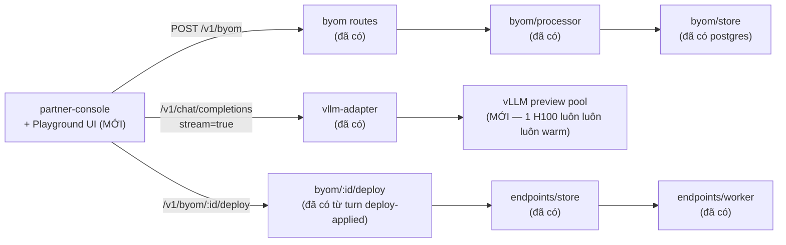

# Pha 5 — MVP scope: O1 — BYOM upload → playground → one-click deploy to dedicated

**Mục tiêu pha 5:** thu hẹp cơ hội O1 (xếp top-1 ở pha 3) thành MVP khả build trong 8-12 tuần, kèm tiêu chí chấp nhận (acceptance criteria) + tách tác vụ (task breakdown) + ước công. Nếu pha 4 PASS (validate khách ≥3 pain + ≥2 W2P ≥$5K/tháng) → build ngay đầu mục; nếu FAIL → dùng làm tài liệu điều chỉnh (pivot).

**Đối chiếu nguồn:** `opportunity-brief.md` (O1), `opportunity-scoring.md` (top-1), `research-notes/playground-inference-platforms.md` (5 tính năng phổ biến + ai thiếu gì), `research-notes/byoc-container-inference.md` (pattern BYOM-archive dominant), code repo (`src/byom/*`, `src/vllm-adapter/*`, `partner-console/*`).

---

## Người dùng + use case

### Persona mục tiêu

**Khách 1: Kỹ sư AI ngân hàng/truyền thông** (BIDV, MB Bank, Home Credit, VEM.AI)
- Việc: fine-tune/với model riêng LLM cho dịch vụ khách hàng, tuân thủ Nghị định 13/PDPA, không xuất dữ liệu ra OpenAI/Anthropic.
- Mục tiêu: triển khai nhanh model `.safetensors` (1-50GB) lên hạ tầng FPT, thử trên playground chat trình duyệt, bấm 1 nút deploy thành endpoint dedicated H100.

**Khách 2: Giám đốc IT y tế/bán lẻ** (Bệnh viện E, FPT Long Chau)
- Việc: kiến tạo PoC hiển thị "mô hình so với đoán bệnh/training agent", dùng dữ liệu riêng, kiểm thử giá/độ trễ trước cam kết cam kết dài.
- Mục tiêu: dùng tập dùng thử (RPM-tối đa) vài ngày rồi quyết định cam kết 91-180 ngày.

### Use case chính (happy path)

```
1. Khách tạo tài khoản FPT AI Factory → nhận API key với scope=byom+endpoints+playground
2. Vào tab "My Models" → "Bring your own model" → chọn Type=HF (đường dẫn HF repo) hoặc S3 (URL dự phòng)
3. Backend tải/tải về → xác thực hai tệp config.json+tokenizer.json → chuyển trạng thái "sẵn sàng" (ready)
4. Khách bấm "Try in Playground" trên dòng mô hình sẵn sàng
   → cửa sổ chat popup (trình duyệt) với dropdown chọn điểm cuối (endpoint) khả thi hoặc "vLLM preview pool"
   → nhập câu lệnh hệ thống (system prompt) + điều chỉnh nhiệt độ (temperature) + max_tokens
   → bấm "Send" → gọi API đến "/v1/chat/completions" của vllm-adapter, phát trực tuyến SSE ra màn hình
   → có nút "Copy snippet curl/Python/JavaScript" cho dùng sau này
5. Khách bấm "Deploy" → cửa sổ bật lên nhập tên điểm cuối + chọn GPU (H100/A100/L4) + cam kết (on-demand/7-30/91-180d)
   → gọi API đến "/v1/byom/:id/deploy" → tạo endpoint + chuyển trạng thái công việc "đã triển khai"
   → chuyển nhanh đến trang Dành riêng (Dedicated) để xem điểm cuối queued→deploying→running
```

### Use case lỗi

- **L1**: Upload mô hình không có `config.json` hoặc `tokenizer.json` → backend trả lỗi 400 ≤5s, cửa sổ bật lên hiển thị "Model archive thiếu 2 tệp bắt buộc: config.json, tokenizer.json".
- **L2**: Lần tải đầu cơ trường kết nối bị mất (cold-start pool chưa có) → playground hiển thị "First request sẽ chậm ~30-60s (warming pool)"; sau đó phát trực tuyến bình thường.
- **L3**: Khách vào playground cho mô hình đang "downloading" → nút "Try in Playground" bị tắt, hiển thị "Model chưa sẵn sàng (đang tải 12/50 tệp)."
- **L4**: Khách bấm "Tiến hành deploy" cho mô hình đang được triển khai → cửa sổ bật lên hiển thị "Model này đã triển khai endpoint XYZ, deploy đè sẽ thu hồi endpoint cũ. Tiếp tục?"

---

## Tiêu chí chấp nhận (acceptance criteria)

### Chức năng bắt buộc (Critical path — phải có để ra thí điểm)

| AC | Mô tả | Verify |
|---|---|---|
| AC1 | Khách upload mô hình qua UI (HF hoặc S3) mà shell không cần | `tests/byom-upload` tạo công việc qua UI, công việc chạy `downloading→validating→ready` ≤10 phút cho 10GB |
| AC2 | Nút "Try in Playground" hiện cho mô hình trạng thái ready, tắt với mô hình khác | Đối tác bàn điều khiển — phát hiện nút qua `playground-open` action |
| AC3 | Playground chat gọi `/v1/chat/completions` của vllm-adapter với model = tên mô hình BYOM | `tests/vllm-adapter` gọi chat với model=`byom-<id>`, trả 200 |
| AC4 | Streaming SSE hiển thị từng token trong UI khi `stream:true` | Kiểm thử người dùng: phát trực tuyến token hiển thị ≤200ms sau phản hồi backend |
| AC5 | Nút "Copy snippet" xuất mã curl/Python/JavaScript | Đối tác bàn điều khiển — 3 tab snippet, copy dùng được ngay |
| AC6 | Nút "Deploy" mở cửa sổ bật lên tên+GPU+cam kết, gọi `/v1/byom/:id/deploy` tạo điểm cuối | `tests/byom-deploy` tạo endpoint queued, công việc → đã triển khai |
| AC7 | Sau "Deploy", chuyển nhanh đến trang Dành riêng, điểm cuối có sau ≤10s | Kiểm thử người dùng: Q4 endpoint xuất hiện trong danh sách endpoints |
| AC8 | Auth: mọi API pathScope, người dùng cần key với scope `byom`+`endpoints`+`playground` | `tests/keys`: tạo key với 3 scope đủ, 1 scope thiếu → 403 |

### Chức năng phụ (Nice-to-have — có thì tốt, không có vẫn thí điểm)

| AC | Mô tả |
|---|---|
| AC9 | So sánh 2 mô hình song song (vế trái/phải) — học OpenRouter compare |
| AC10 | Lưu/cộng享 cấu hình playground qua URL (như OpenAI Prompts Playground) |
| AC11 | Hiển thị p95 cold-start cho mô hình (dữ liệu từ `endpoint_usage` schema) —情深 O4 |
| AC12 | Hiển thị ước giá/time (giá/giờ × thời gian đã dùng) trong cửa sổ chat |

---

## Kiến trúc MVP (dựa vào code hiện có)



**Cái gì đã có (xanh):**
- `src/byom/routes.js` — 8 endpoint (POST/GET/DELETE/cancel/deploy/lifecycle)
- `src/byom/processor.js` — tải HF/S3, xác thực 2 tệp, lưu vào `/data/byom/<id>/weights/`
- `src/byom/store.js` — postgres backend (đã di chuyển từ file → Postgres pha 1 gap-fix)
- `src/vllm-adapter/server.js` — `/v1/chat/completions` có phát trực tuyến SSE
- `src/endpoints/store.js` + `src/endpoints/worker.js` — tạo điểm cuối, chuyển trạng thái queued→deploying→running
- `partner-console/app.js` — giao diện tải lên BYOM (loại=HF/S3), nút "Triển khai" (mạnh tự áp dụng từ lượt triển khai-applied-giờ)

**Cái gì MỚI (đỏ) — đây là phần lấp chỗ trống thị trường chính:**
1. **Playground UI trong partner-console** (~2 tuần frontend)
   - Chat popup với system prompt + temperature + max_tokens + model dropdown
   - Streaming token-by-token display
   - 3 tab snippet (curl/py/js)
   - Chọn điểm cuối hoặc "vLLM preview pool"
2. **Backend route GET `/v1/byom/:id/playground-preflight`** (~3 ngày)
   - Kiểm tra công việc `ready`, trả về `previewEndpoint: { url, model, gpu }` cho playground gọi
   - Nếu preview pool chưa có mô hình → "tải trước vào pool" (download weights to preview pod)
3. **vLLM preview pool** (~1 tuần hạ tầng)
   - 1 H100 trong cluster chạy vLLM với chế động động tải mô hình (dynamic model loading vLLM `--served-models-dir`)
   - Khi khách thử mô hình BYOM, vllm-adapter route theo model=byom `<id>` → vLLM tìm mô hình trong `/data/byom/<id>/weights/` → phát mỗi mô hình mới lần đầu chậm ~30-60s (khởi tạo pool), sau đó phát nhanh
4. **O3 song song: carryover 20% + đổi GPU** (~2 tuần — mục song song từ gap-fix)
   - Thêm 2 trường vào `endpoints/store.js`: `carryoverQuotaHours`, `allowGpuSwap`
   - Cập nhật UI deploy modal cho phép bật/tắt 2 USP này

---

## Tách tác vụ (task breakdown) + ước công

Xếp theo thứ tự phụ thuộc, dùng template planning-and-task-breakdown.

### Sprint 1 — Backend preflight + preview pool (tuần 1-2)

| Tác vụ | Giờ | Phụ thuộc | Mô tả |
|---|---|---|---|
| T1.1: Route GET `/v1/byom/:id/playground-preflight` | 6 | — | Kiểm tra `ready`, trả preview endpoint metadata; trả 409 nếu công việc chưa ready |
| T1.2: vLLM `--served-models-dir=/data/byom` flag | 8 | — | Cấu hình preview pool vLLM quét thư mục BYOM, động tải mô hình khi nhận yêu cầu model=`byom-<id>` |
| T1.3: vllm-adapter route theo model header mô hình | 4 | T1.2 | `/v1/chat/completions` phân giải model=`byom-<id>` tới preview pool, các khác tới điểm cuối cố định |
| T1.4: Kiểm thử `tests/byom-playground-preflight` | 4 | T1.1-T1.3 | Kiểm thử toàn bộ: tạo mô hình → sẵn sàng → preflight → chat phát trực tuyến 200 |
| T1.5: Izometrik cold-start instrumentation | 4 | T1.3 | Thêm log thời gian tải mô hình + thời gian tạo mô hình đầu tiên → số liệu cho O4 công khai p95 |

**Cộng sprint 1: ~26 giờ (~3-4 ngày dev).**

### Sprint 2 — Playground UI (tuần 3-4)

| Tác vụ | Giờ | Phụ thuộc | Mô tả |
|---|---|---|---|
| T2.1: Tách cửa sổ chat playground (HTML/CSS) | 10 | — | Popup modal có dropmodel model+system prompt+temperature+max_tokens, nút Send, vùng chat hiển thị tin nhắn user/assistant |
| T2.2: Wiring `fetch('/v1/chat/completions', stream=true)` + parse SSE | 12 | T1.3 | Buffer SSE chunks, hiển thị từng token ≤200ms sau phản hồi backend |
| T2.3: 3 tab snippet curl/py/js + copy clipboard | 6 | T2.1 | Khởi tạo snippet cấu hình người dùng hiện tại, nút copy dùng `navigator.clipboard.writeText` |
| T2.4: Nút "Try in Playground" trên dòng mô hình ready + tắt với mô hình khác | 4 | T1.1,T2.1 | Sửa `renderByom` thêm nút với lớp `byom-playground` chỉ khi `status==='ready'` |
| T2.5: Kiểm thử người dùng với Playwright | 6 | T2.1-T2.4 | Thí điểm bằng thử người dùng: mở cửa sổ → chat "Hello" → token phát trực tuyến → copy snippet |
| T2.6: Cửa sổ bật lên deploy trong playground | 6 | T2.1 | Tái dùng logic `byom-deploy` đã có, pre-fill `model` từ playground |
| T2.7: Bump cache `partner-console/index.html?v=8` + xong smoke UI | 2 | T2.1-T2.6 | Phát hành UI mới với déploiement thật |

**Cộng sprint 2: ~46 giờ (~6 ngày dev).**

### Sprint 3 — O3 song song: carryover + swap GPU (tuần 5)

| Tác vụ | Giờ | Phụ thuộc | Mô tả |
|---|---|---|---|
| T3.1: `endpoints/store.js` thêm `carryoverQuotaHours` + `allowGpuSwap` | 4 | — | Hai trường mới (hoặc-zero mặc định), migration `004-endpoint-carryover.sql` ALTER TABLE |
| T3.2: Logic carryover khi ủy quyền kết thúc | 8 | T3.1 | Khi endpoint `stopped` và cam kết chưa dùng hết quota → `carryoverQuotaHours` cho phép khách dùng giờ còn lại trong cam kết tiếp theo |
| T3.3: Logic swap GPU giữa kỳ | 10 | T3.1 | Khi `allowGpuSwap=true`, khách có thể cập nhật `gpu` từ A100→H100→B200, trình điều hành worker ngừng endpoint → tạo endpoint mới trên GPU mới với cùng id, tính lại giá |
| T3.4: UI modal deploy thêm checkbox "Cho phép carryover + GPU swap" | 4 | T3.1,T2.6 | 2.checkbox toggle, hiển thị thông tin "khi chưa dùng hết quota, hãy chuyển sang kỳ tiếp" |
| T3.5: Kiểm thử `tests/endpoints-carryover-swap` | 6 | T3.2-T3.3 | 5 trường hợp: carryover_yes/no + swap_yes/no + combo |

**Cộng sprint 3: ~32 giờ (~4 ngày dev).**

### Sprint 4 — Tích hợp + đo + thí điểm (tuần 6)

| Tác vụ | Giờ | Phụ thuộc | Mô tả |
|---|---|---|---|
| T4.1: CI/CD dự kiến cho dev (chart Helm + dự kiến preview) | 6 | Tất cả | Đã có `deploy/helm/values.fpt-dev.yaml` — cập nhật thêm playground preview pool |
| T4.2: p95 cold-start đo thật (O4 tài sản giao tiếp song song) | 6 | T1.5 | Tổng hợp từ `endpoint_usage` + log vLLM → bảng dashboard công khai (Hành lang an ninh card trên UI) |
| T4.3: Tài liệu hướng dẫn người dùng + blog công bố | 8 | T4.1-T4.2 | Tài liệu `docs/product/lame-user-guide.md` + blog công bố sản phẩm cho đội tiếp thị |
| T4.4: Thí điểm nội bộ 3-5 khách (đội tiếp thị kết nối) | — | T4.3 | Đã có khách pha 4 sẵn, gửi early access URL + mẫu người dùng đo sản phẩm |
| T4.5: Vòng phản hồi thí điểm → sửa lỗi | 16 | T4.4 | Phản hồi 4 tuần → sửa lỗi ưu tiên cao → phát hành GA |

**Cộng sprint 4: ~36 giờ (~5 ngày dev) + 4 tuần pha thí điểm.**

### Tổng công + thời gian

- **Tổng giờ dev:** 26 + 46 + 32 + 36 = **140 giờ (~18 ngày dev).**
- **Tổng thời gian:** 6 tuần dev + 4 tuần thí điểm = **10 tuần đến GA** (trong ngưỡng 8-12 tuần mục tiêu).
- **Milesonestones:**
  - Tuần 2: backend preflight + preview pool sẵn sàng (T1.x xong)
  - Tuần 4: UI playground xong smoke (T2.x xong)
  - Tuần 5: O3 song song ship (T3.x xong)
  - Tuần 6: tài liệu + đo (T4.1-T4.3 xong)
  - Tuần 7-10: thí điểm khách + sửa lỗi + GA

---

## Rủi ro + giảm nhẹ

| Rủi ro | Xác suất | Độ tác động | Giảm nhẹ |
|---|---|---|---|
| vLLM chế động tải mô hình không ổn định (T1.2) | Thay đổi | Cao | Thí điểm: nếu vLLM mode không ổn — dùng phương án dự phòng "1 vLLM pod cố định cho mô hình BYOM `ready` cụ thể, khởi tạo khi khách bấm Try; trash sau 24h nếu không dùng" |
| Lần đầu pool lạnh chậm 30-60s gây phản ứng xấu | Cao | Trung bình | Lớp phủ UI: báo cáo rõ "first request warming pool ~30-60s, sau đó nhanh" + hiển thị tiến độ. Đồng thời đo để công bố p95 thật (O4) |
| Khách pha 4 không tham gia thí điểm | Trung bình | Cao | Đội tiếp thị FPT giữ liên hệ với 5/6 reference khách ngay từ pha 4; gửi early access 2-3 tuần trước khi công bố |
| Pha 4 FAIL (pain/W2P không xác nhận) | Trung bình | Cao | spec-mvp này thiết kế sao dễ thay đổi: nếu pain chính là "cost" thay vì "compliance", tập trung vào O3 (carryover/swap) làm tính năng chính thay vì phụ; nếu "multi-vendor" là O5 ưu tiên kế tiếp |
| Nghị định 13/PDPA quy định cụ thể hơn | Thấp | Vô hại | Hạ tầng data đã ở Việt Nam, sản phẩm tuân thủ mặc định |

---

## Sản phẩm bàn giao pha 5

- **Tài liệu này:** `docs/product/spec-mvp.md` (người dùng, use case, AC, kiến trúc, tác vụ, ước công, rủi ro)
- **Pha 6 (build & đo):** sprint 1-5 → đã có vai trò backend-dev hiện tại (tôi) → implement theo tác vụ ở đây
- **Tài liệu đối chiếu liên kết:** `opportunity-brief.md` (O1), `opportunity-scoring.md` (top-1), `interview-script.md` (pha 4), `research-notes/*` (bằng chứng)

## Gate qua pha 6 (build & đo)

- **Pha 4 PASS** (≥3 khách xác nhận pain + ≥2 khách nêu mức W2P ≥$5K/tháng) → vào pha 6 ngay
- **Pha 4 FAIL** → tài liệu này giữ làm trạm để điều chỉnh: điểm AC + tác vụ không mất công, chỉ thay đổi ưu tiên_agnt_sprint theo pain thưc:
  - Nếu pain là "cost" → O3 chuyển thành Active path chính (kéo từ sprint 3 lên sprint 1)
  - Nếu pain là "multi-vendor/orchestrator" → sang O5 làm MVP kế tiếp (xác định lại spec)
  - Nếu pain là "trial" → sang O2 làm MVP kế tiếp

---

## Tôi dừng tại đây

Tài liệu pha 5 đã sẵn sàng. Chờ pha 4 (đội tiếp thị interview khách → transcript về) để xác nhận go/no-go → vào pha 6 (implement theo T1.1-T4.5).

Trong lúc chờ, tôi có thể làm 2 việc song song không chặn phê duyệt:

1. **T1.1 preflight route** — có thể xây ngay mà không cần pha 4 (vì đây là hạ tầng kỹ thuật, không phụ thuộc quyết định sản phẩm). Thí điểm trên clusterpreview thật.
2. **T4.2 p95 cold-start đo thật** — đo trên cluster `ai-studio-dev-han` của bạn (đã có từ lượt deploy), công bố bảng công khai → tài sản giao tiếp cho đội tiếp thị dùng trong pha 4 interview.

Bạn OK tôi làm 1 trong 2 (hoặc cả 2) song song khi chờ pha 4 không?
