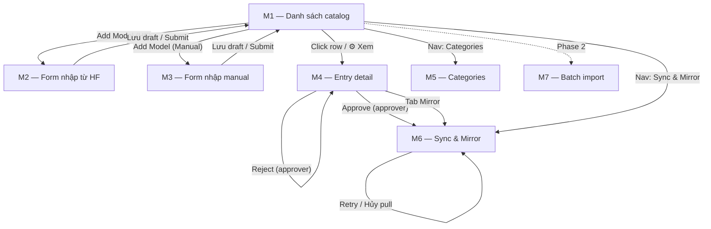
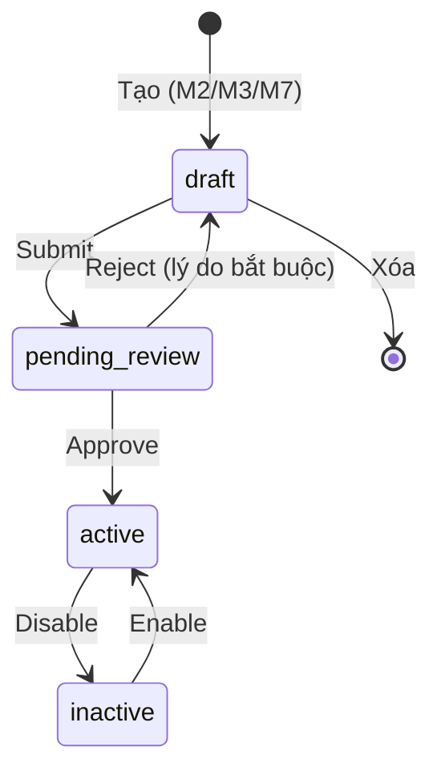

# Prototype (Wireframe) — Admin Model Catalog DDI

**Phiên bản:** 1.0
**Ngày:** 27/08/2026
**Trạng thái:** Draft
**Chủ sở hữu:** Thuan Luu Thi (BA/PO)
**Căn cứ:** `docs/srs-ddi-model-catalog-admin.md`, `docs/task-breakdown-ddi-model-catalog-admin.md`
**Phạm vi:** Prototype low-fi 7 màn hình admin + ma trận quyền theo role + legend trạng thái

---

## 1. Tổng quan

### 1.1 Cấu trúc điều hướng

```
DDI Admin
├── Model Catalog            /admin/ddi/model-catalog              (M1)
│   ├── New Model (HF)       /admin/ddi/model-catalog/new?source=hf   (M2)
│   ├── New Model (Manual)   /admin/ddi/model-catalog/new?source=manual (M3)
│   ├── Entry Detail         /admin/ddi/model-catalog/{id}            (M4)
│   └── Import               /admin/ddi/model-catalog/import          (M7 — Phase 2)
├── Categories               /admin/ddi/model-catalog/categories     (M5)
└── Sync & Mirror            /admin/ddi/model-catalog/sync           (M6)
```

### 1.2 Layout chung (mọi màn hình)

```
┌────────────────────────────────────────────────────────────────────────────┐
│ FPT DDI Admin        [Model Catalog] [Categories] [Sync & Mirror]   [User▼]│
├────────────────────────────────────────────────────────────────────────────┤
│                                                                            │
│  (nội dung màn hình — chiều rộng tối đa 1280px, padding 24px)              │
│                                                                            │
└────────────────────────────────────────────────────────────────────────────┘
```

- **Nav chính:** 3 tab (Model Catalog / Categories / Sync & Mirror).
- **User menu:** hiển thị tên + role hiện tại (`catalog_admin` / `catalog_approver`).
- **Ngôn ngữ UI:** tiếng Việt (label) + tiếng Anh (thuật ngữ kỹ thuật: status, revision…).
- **Nguyên tắc hiển thị:** mọi danh sách có trạng thái phải dùng **badge màu** (legend §1.3).

### 1.3 Legend badge trạng thái

| Badge | Màu | Ý nghĩa |
|-------|-----|---------|
| `draft` | Xám | Đang soạn, chưa submit |
| `pending_review` | Vàng | Chờ admin duyệt |
| `active` | Xanh lá | Đã duyệt, public |
| `inactive` | Xám đậm (gạch ngang) | Đã tắt (unpublish) |
| `NotMirrored` | Xám viền | Chưa pull weights |
| `Mirroring` | Xanh dương (spinner) | Đang pull weights |
| `Mirrored` | Xanh lá | Weights sẵn sàng |
| `MirrorFailed` | Đỏ | Pull thất bại |

### 1.4 Ma trận quyền theo role (applies mọi màn hình)

| Hành động | `catalog_admin` | `catalog_approver` |
|-----------|:---------------:|:------------------:|
| Xem danh sách, chi tiết | ✅ | ✅ |
| Tạo / sửa entry (draft) | ✅ | ❌ |
| Submit entry (draft → pending_review) | ✅ | ❌ |
| Approve / Reject | ❌ | ✅ |
| Disable / Enable (active ↔ inactive) | ✅ | ❌ |
| Delete (chỉ entry draft) | ✅ | ❌ |
| Quản lý category | ✅ | ❌ |
| Theo dõi mirror, retry pull | ✅ | ✅ |
| Duyệt revision mới (Phase 2) | ❌ | ✅ |

> **Quy tắc:** creator không tự approve entry của mình (khi có ≥ 2 admin) — nút Approve bị tắt kèm tooltip "Bạn là người tạo entry này".

---

## 2. M1 — Danh sách Model Catalog

**Route:** `/admin/ddi/model-catalog` · **FR:** FR-MC-001, FR-MC-009.2

```
┌────────────────────────────────────────────────────────────────────────────┐
│ Model Catalog                                    [+ Add Model (HF)]        │
│                                              [+ Add Model (Manual)]        │
├────────────────────────────────────────────────────────────────────────────┤
│ [Public Catalog (12)]  [Proprietary Catalog (3)]        ← tab catalog     │
├────────────────────────────────────────────────────────────────────────────┤
│ Status: [Tất cả ▾]  Category: [Tất cả ▾]  Weight: [Tất cả ▾]              │
│ Tìm: [________________________] [Lọc]                     [⟳ Refresh]     │
├────────────────────────────────────────────────────────────────────────────┤
│ ID                    │ Display name  │ Status        │ Weight │ Price │ ⚙ │
├───────────────────────┼───────────────┼───────────────┼────────┼───────┤───┤
│ llama-3-3-70b-fp8     │ Llama 3.3 70B │ ● active      │●Mirr.  │ $3.29 │⋯ │
│ kimi-k2-7             │ Kimi K2.6     │ ● pending_rev │Mirring │ $29.80│⋯ │
│ fpt-internal-vietgpt1 │ VietGPT v1    │ ● draft       │NotMirr │ $—    │⋯ │
├────────────────────────────────────────────────────────────────────────────┤
│ Trang 1/5   [<] 1 2 3 4 5 [>]   50/trang ▾                              │
└────────────────────────────────────────────────────────────────────────────┘
```

### Cột bảng (FR-MC-001.1)

| Cột | Nguồn field | Ghi chú |
|-----|-------------|---------|
| ID | `id` | Click → mở M4 |
| Display name | `display_name` | + `hf_model_id` nhỏ bên dưới |
| Status | `status_code` | Badge màu |
| Weight | `weight_status` | Badge màu (entry proprietary: "—") |
| Price | `from_price` | Định dạng `$X.XX`, "—" nếu chưa có |
| ⚙ (actions) | — | Dropdown (xem dưới) |

### Dropdown hành động (⚙) — theo status + role

| Status entry | `catalog_admin` | `catalog_approver` |
|--------------|-----------------|--------------------|
| `draft` | Xem · Sửa · **Submit** · Xóa | Xem |
| `pending_review` | Xem | Xem · **Approve** · **Reject** |
| `active` | Xem · Sửa (metadata) · **Disable** | Xem |
| `inactive` | Xem · **Enable** · Sửa | Xem |

### Trạng thái đặc biệt

- **Empty state** (không có entry): icon + "Chưa có model nào trong catalog này" + nút "Add Model (HF)".
- **Loading:** skeleton 5 dòng.
- **Lỗi API:** banner đỏ "Không thể tải danh sách — thử lại" + nút Retry.
- **Cảnh báo disable:** khi bấm Disable entry có endpoint active → modal xác nhận: "Model này đang có N endpoint đang chạy. Disable sẽ ẩn model khỏi catalog nhưng endpoint vẫn hoạt động. Tiếp tục?"

---

## 3. M2 — Add Model từ Hugging Face

**Route:** `/admin/ddi/model-catalog/new?source=hf` · **FR:** FR-MC-002

### Step 1 — Fetch từ HF

```
┌────────────────────────────────────────────────────────────────────────────┐
│ ← Quay lại    Add Model — From Hugging Face                                │
├────────────────────────────────────────────────────────────────────────────┤
│                                                                            │
│  HF Model ID *                                                             │
│  ┌──────────────────────────────────────────────────────────────────────┐  │
│  │ nvidia/Llama-3.3-70B-Instruct-FP8                                    │  │
│  └──────────────────────────────────────────────────────────────────────┘  │
│  Placeholder: "publisher/model-name (ví dụ: nvidia/Llama-3.3-70B…)"        │
│                                                                            │
│  [Fetch from Hugging Face]                                                 │
│                                                                            │
└────────────────────────────────────────────────────────────────────────────┘
```

**Hành vi:**
- Bấm Fetch → button chuyển spinner "Đang lấy metadata từ HF…" (timeout 10s).
- **Thành công:** prefill form Step 2 (scroll xuống), banner xanh "Đã lấy metadata từ HF".
- **Lỗi repo không tồn tại / thiếu config.json:** banner đỏ "Không tìm thấy model hoặc thiếu config.json — kiểm tra lại HF Model ID" (≤ 5s).
- **Rate limit HF:** banner vàng "HF đang giới hạn tốc độ, hệ thống đang thử lại (còn 2 lần)…" — không mất dữ liệu đã nhập.

### Step 2 — Form metadata (prefill, sửa được)

```
┌────────────────────────────────────────────────────────────────────────────┐
│ 1. Metadata model                                                          │
├────────────────────────────────────────────────────────────────────────────┤
│ Display name *        ┌─────────────────────────────────────────────────┐  │
│                       │ Llama 3.3 70B Instruct          (prefill)       │  │
│                       └─────────────────────────────────────────────────┘  │
│ Short description *   ┌─────────────────────────────────────────────────┐  │
│                       │ Meta 70B dense Transformer (GQA)…  (prefill)    │  │
│                       └─────────────────────────────────────────────────┘  │
│ Parameters *          [70B dense        ]   Context length * [128K      ] │
│ License *             [llama3.3         ]   Badge          [new ▾       ] │
│ Catalog type *        ( ) Public Catalog   (•) Proprietary Catalog        │
│ Categories *          [chat ×] [reasoning ×] [+ thêm]                     │
│ Sort order            [4]                                                  │
└────────────────────────────────────────────────────────────────────────────┘
```

### Step 3 — Hardware profiles (GPU)

```
┌────────────────────────────────────────────────────────────────────────────┐
│ 2. Hardware profiles (GPU)                                  [+ Thêm profile]│
├────────────────────────────────────────────────────────────────────────────┤
│ ┌────────────────────────────────────────────────────────────────────────┐ │
│ │ GPU SKU [l40s ▾]  GPUs/instance [1]  Precision [fp8 ▾]                │ │
│ │ VRAM required (GB) [75]   Price/GPU/hour (USD) [3.29]   (•) Recommended│ │
│ │                                                            [X xóa]     │ │
│ └────────────────────────────────────────────────────────────────────────┘ │
│ ⚠ Cảnh báo (nếu VRAM không đủ): "VRAM 75GB có thể không đủ cho model      │
│   70B FP8. Kiểm tra lại hoặc chọn GPU khác."                              │
└────────────────────────────────────────────────────────────────────────────┘
```

- Tối thiểu **1 profile**; đúng **1 profile** đánh dấu `is_recommended`.
- `per_gpu_hourly_price_usd_micros` hiển thị cho admin dạng **USD** (3.29), hệ thống tự nhân 1.000.000 khi gửi API.

### Step 4 — Benchmarks (tuỳ chọn)

```
│ Benchmark name *        │ Score │ Max │ Sort │ ⋯ │
│ SWE-bench Verified      │ 80.2  │ 100 │ 0   │ X │
│ [+ Thêm benchmark]
```

### Footer actions

```
┌────────────────────────────────────────────────────────────────────────────┐
│ [Hủy]                    [Lưu draft]              [Lưu & Submit để duyệt]  │
└────────────────────────────────────────────────────────────────────────────┘
```

- **Lưu draft:** entry `status_code=draft`, về M1.
- **Lưu & Submit:** entry `pending_review` → chờ approver (FR-MC-005).
- Validate: thiếu field bắt buộc → viền đỏ + thông báo field cụ thể, không scroll về đầu.

---

## 4. M3 — Add Model Manual

**Route:** `/admin/ddi/model-catalog/new?source=manual` · **FR:** FR-MC-003

- **Giống M2 Step 2–4** (metadata, hardware profiles, benchmarks, footer).
- **Không có Step 1 fetch HF.**
- Field `hf_model_id` *bắt buộc* với mọi entry (quyết định đã chốt):
  - Model có trên HF: nhập repo ID thật.
  - Model độc quyền không có trên HF: nhập identifier nội bộ, placeholder gợi ý:
    `"fpt-internal/<model-name> (ví dụ: fpt-internal/vietgpt-v1)"`.
- Banner thông tin đầu form: "Mode manual — nhập toàn bộ thông tin thủ công. Model không có trên HF công khai, dùng identifier nội bộ cho hf_model_id."

---

## 5. M4 — Entry Detail + Approval

**Route:** `/admin/ddi/model-catalog/{id}` · **FR:** FR-MC-005, 006, 008, 013

```
┌────────────────────────────────────────────────────────────────────────────┐
│ ← Quay lại   Llama 3.3 70B Instruct   ● active   ● Mirrored               │
│ id: llama-3-3-70b-instruct-fp8 · catalog: Public · tạo bởi: thuanlt 05/08  │
├────────────────────────────────────────────────────────────────────────────┤
│ [Details] [Hardware] [Benchmarks] [History] [Mirror]                       │
├────────────────────────────────────────────────────────────────────────────┤
│                                                                            │
│ (nội dung theo tab — xem dưới)                                             │
│                                                                            │
├────────────────────────────────────────────────────────────────────────────┤
│ ┌─ PANEL DUYỆT (chỉ hiện khi status=pending_review, role=approver) ──────┐ │
│ │ Lý do từ chối (bắt buộc khi Reject):                                   │ │
│ │ ┌────────────────────────────────────────────────────────────────────┐ │ │
│ │ │                                                                    │ │ │
│ │ └────────────────────────────────────────────────────────────────────┘ │ │
│ │ [Reject]                                        [Approve]             │ │
│ └────────────────────────────────────────────────────────────────────────┘ │
└────────────────────────────────────────────────────────────────────────────┘
```

### Tab Details
- Mọi field metadata dạng **read-only table** (field | giá trị).
- Nút [Sửa] (role admin, status draft/inactive) → mở form M2/M3 với dữ liệu hiện có.
- Nút [Disable] / [Enable] theo status + role (modal cảnh báo nếu có endpoint active).
- Nút [Submit] (role admin, status draft).
- Nút [Xóa] (role admin, **chỉ status draft**) — modal xác nhận "Hành động không thể hoàn tác".

### Tab Hardware
- Bảng profile: GPU SKU | GPUs/instance | Precision | VRAM | Price/GPU/h | Recommended | Sort.
- Nút [Sửa] (role admin, status draft/inactive).

### Tab History (audit — FR-MC-008)
```
│ Thời gian          │ Người        │ Hành động   │ Chi tiết                 │
│ 27/08 14:22       │ thuanlt      │ approve     │ draft → active           │
│ 27/08 14:01       │ thuanlt      │ submit      │ draft → pending_review   │
│ 27/08 13:58       │ thuanlt      │ create      │ entry created            │
```
- Read-only, không có nút sửa/xóa (append-only).

### Tab Mirror
```
│ Trạng thái:  ● Mirrored    Revision: 3c0502bf…  Sync: [bật/tắt]          │
│ Mirror path: s3://ddi-models-hanoi/nvidia/Llama-3.3-70B-Instruct-FP8/…  │
│ Checksum:    sha256:9f2c…  (khớp HF ✓)                                   │
│ [Pull lại]  (chỉ role admin)                                             │
```
- Khi `MirrorFailed`: banner đỏ + lý do lỗi + nút [Retry pull].
- Khi `Mirroring`: progress bar + % (nếu API trả được).

### Approval panel — hành vi
- **Approve:** entry → `active`; nếu source=HF và weights chưa mirrored → tự động khởi động pull (FR-MC-012.2), banner "Đã duyệt. Hệ thống đang pull weights về mirror…".
- **Reject:** bắt buộc nhập lý do (≥ 5 ký tự); entry → `draft`, lý do hiện ở tab History + banner vàng trên entry.
- Creator tự duyệt: nút Approve **bị tắt** + tooltip (khi ≥ 2 admin).

---

## 6. M5 — Quản lý Categories

**Route:** `/admin/ddi/model-catalog/categories` · **FR:** FR-MC-014

```
┌────────────────────────────────────────────────────────────────────────────┐
│ Categories                                              [+ Thêm category]  │
├────────────────────────────────────────────────────────────────────────────┤
│ Code             │ Display name        │ Sort │ # Model │ ⚙               │
├──────────────────┼─────────────────────┼──────┼─────────┼──────────────────┤
│ chat             │ Chat & Conversation │ 0    │ 8       │ Sửa · Xóa       │
│ reasoning        │ Reasoning           │ 1    │ 5       │ Sửa · Xóa       │
│ 3d-generation    │ 3D Generation       │ 2    │ 0       │ Sửa · Xóa       │
└────────────────────────────────────────────────────────────────────────────┘
```

- **Modal Thêm/Sửa:** `code`* (slug, chỉ sửa được khi chưa có model dùng), `display_name`*, `sort_order`.
- **Xóa category đang có model:** nút Xóa bị tắt + tooltip "Category đang có N model — chuyển model đi trước".
- Reuse endpoint `model-catalog-category-*` có sẵn.

---

## 7. M6 — Sync & Mirror monitoring

**Route:** `/admin/ddi/model-catalog/sync` · **FR:** FR-MC-012, 013, 011 (Phase 2)

```
┌────────────────────────────────────────────────────────────────────────────┐
│ Sync & Mirror                                                              │
├────────────────────────────────────────────────────────────────────────────┤
│ [Mirror jobs]  [Pending updates (Phase 2)]                                 │
├────────────────────────────────────────────────────────────────────────────┤
│ Model               │ Revision  │ Tiến độ        │ Trạng thái │ ⚙         │
├─────────────────────┼───────────┼────────────────┼────────────┼───────────┤
│ Llama 3.3 70B FP8   │ 3c0502bf  │ ██████████ 100%│ ● Mirrored │ —         │
│ Kimi K2.6           │ 81aa2c1   │ ██████░░░░  62%│ ● Mirroring│ Hủy       │
│ PhoGPT-4B           │ 77e19d0   │ ██░░░░░░░░  21%│ ● MirrorFailed│ Retry  │
└────────────────────────────────────────────────────────────────────────────┘
│ Lỗi gần nhất: PhoGPT-77e19d0 — "connection reset after 2.1GB (retry 3/3)"  │
└────────────────────────────────────────────────────────────────────────────┘
```

- **Retry:** gọi lại pull job, reset progress.
- **Hủy** (chỉ khi Mirroring): dừng pull, về `NotMirrored`.
- **Tab Pending updates (Phase 2):** bảng model | revision cũ → mới | phát hiện lúc | [Approve] [Reject] — approve → reset `weight_status=mirroring` + pull lại (FR-MC-013.4).

---

## 8. M7 — Batch Import (Phase 2)

**Route:** `/admin/ddi/model-catalog/import` · **FR:** FR-MC-004

```
┌────────────────────────────────────────────────────────────────────────────┐
│ Import hàng loạt                                                           │
├────────────────────────────────────────────────────────────────────────────┤
│ [Chọn file CSV/YAML/JSON]  (tối đa 500 model/lần)                          │
│ [Tải template]                                                             │
├────────────────────────────────────────────────────────────────────────────┤
│ Kết quả import:                                                            │
│ ✅ 48 thành công   ❌ 2 lỗi                                                │
│ ┌────────────────────────────────────────────────────────────────────────┐ │
│ │ Dòng 12: thiếu hardware_profiles                                      │ │
│ │ Dòng 37: giá âm (-1.5)                                                │ │
│ └────────────────────────────────────────────────────────────────────────┘ │
└────────────────────────────────────────────────────────────────────────────┘
```

- File có dòng lỗi: dòng hợp lệ vẫn tạo (status `draft`), dòng lỗi liệt kê kèm lý do.
- File > 500 dòng: chặn trước khi import + thông báo.

---

## 9. Luồng điều hướng tổng thể



### Luồng trạng thái entry (nhắc lại)



---

## 10. Edge cases & quy ước hiển thị

| # | Edge case | Xử lý UI |
|---|-----------|----------|
| E1 | Entry `active` có endpoint đang chạy, admin bấm Disable | Modal cảnh báo số endpoint; xác nhận mới thực hiện |
| E2 | Entry `MirrorFailed` | Banner đỏ + lý do + nút Retry; entry vẫn không hiển thị cho khách |
| E3 | Approve entry HF mà weights chưa mirrored | Banner "Đang pull weights…" + link tới M6 |
| E4 | Creator bấm Approve entry của mình (≥ 2 admin) | Nút tắt + tooltip "Bạn là người tạo entry này" |
| E5 | Xóa category đang có model | Nút tắt + tooltip số model |
| E6 | Xóa entry active | Không có nút Xóa (chỉ Disable) |
| E7 | HF fetch timeout > 10s | Banner vàng "HF phản hồi chậm, thử lại sau" |
| E8 | Giá nhập âm hoặc không số | Validate inline, không gửi API |
| E9 | 2 admin cùng edit 1 entry draft | Người lưu sau nhận cảnh báo "Entry đã được X sửa lúc HH:MM — xem lại trước khi lưu" |
| E10 | Session JWT hết hạn (401) | Auto-refresh token; nếu fail → redirect login + giữ form đã nhập |

---

## 11. Checklist nghiệm thu prototype (UAT)

- [ ] M1: lọc status/category/query đúng; tab Public/Proprietary tách biệt; phân trang hoạt động
- [ ] M2: fetch HF repo hợp lệ → prefill đúng; repo sai → lỗi ≤ 5s; rate-limit → retry tự động
- [ ] M2/M3: validate field bắt buộc (kể cả `hf_model_id`); giá âm bị chặn; đúng 1 GPU profile recommended
- [ ] M4: approve/reject đúng quyền; reject bắt buộc lý do; creator không tự duyệt
- [ ] M4: tab History đầy đủ chuỗi thay đổi, không sửa được
- [ ] M5: xóa category đang có model bị chặn
- [ ] M6: retry mirror failed hoạt động; entry chưa Mirrored không deploy được
- [ ] Mọi màn hình: user không có role → 403 + màn hình "Không có quyền truy cập"