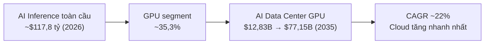
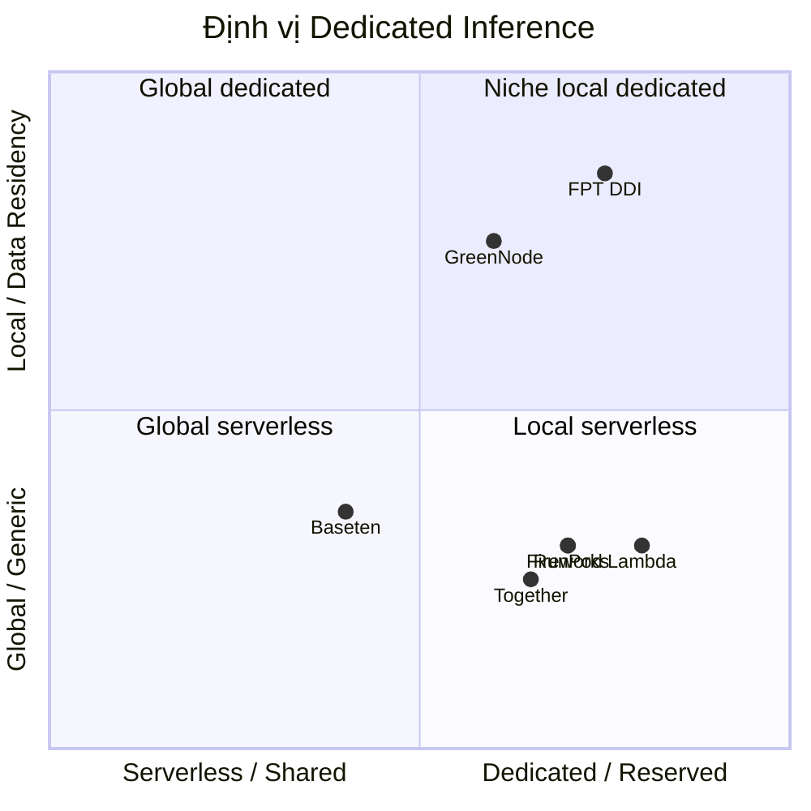

# FPT DDI — Dedicated Inference · Market Research Slides (Rút gọn)

**Bộ slide:** 12 slides · Ngôn ngữ: Tiếng Việt · Phong cách: Consulting (FPT brand)
**Chủ sở hữu:** Thuan Luu Thi (PO)
**Ngày:** 18/08/2026
**Nguồn:** `docs/market-research-dedicated-inference.md`

---

## SLIDE 1 — Cover

# FPT DDI — Dedicated Inference
## Market Research & Chiến lược cạnh tranh

> Deploy an AI model running on dedicated, reserved GPUs. Always on, no shared capacity, and no rate limits. Better suited for serious traffic than serverless.

**FPT · Dedicated Inference · Model Catalog · GPU Container (H100 · H200 · B300 · A30)**

---

## SLIDE 2 — Executive Summary

| Câu hỏi | Trả lời |
|---------|---------|
| **Sản phẩm là gì?** | Dedicated Inference: deploy model trên GPU dedicated/reserved, always-on, không shared capacity, không rate limits |
| **Khác serverless?** | Serverless = chia sẻ hạ tầng, pay-per-token, cold-start & rate limits. Dedicated = tài nguyên riêng, GPU/giờ, hiệu năng ổn định |
| **Phù hợp ai?** | Traffic nghiêm túc (production, enterprise), latency ổn định, bảo mật tách biệt |
| **Thị trường** | AI inference ~$117,8 tỷ (2026), GPU ~35,3%; VN ~$1 tỷ, CAGR ~39% |
| **Cơ hội FPT** | "Dedicated + data residency VN + tiếng Việt" — khoảng trống chưa ai chiếm |

**Presenter notes:** Mở đầu bằng câu hỏi "Vì sao dedicated thay vì serverless?" để dẫn dắt.

---

## SLIDE 3 — Dedicated vs Serverless

| Tiêu chí | **Dedicated (FPT DDI)** | **Serverless** |
|----------|:---:|:---:|
| **Tài nguyên GPU** | Riêng (reserved) | Chia sẻ (shared pool) |
| **Trạng thái** | Always-on | Cold-start |
| **Rate limits** | ❌ Không có | ✅ Có |
| **Hiệu năng** | Ổn định, dự đoán được | Dao động theo load |
| **Định giá** | GPU/giờ (reserved) | Pay-per-token |
| **Bảo mật tách biệt** | ✅ Hoàn toàn | ⚠️ Chia sẻ hạ tầng |
| **Phù hợp** | **Serious traffic, production** | Spike, prototype |

> **Nguyên tắc:** **Dedicated = "serious traffic"**. Serverless phù hợp workload thưa/không dự đoán được. Khi workload ổn định, khách hàng chuyển serverless → dedicated *(động lực chính cho DDI)*.

---

## SLIDE 4 — Thị trường toàn cầu & Việt Nam

| Chỉ số | Toàn cầu | Việt Nam |
|--------|----------|----------|
| **Quy mô AI** | ~$117,8 tỷ (2026) | ~$1 tỷ (2026) |
| **Tăng trưởng** | CAGR ~22% (GPU data center) | CAGR ~39% đến 2031 |
| **Doanh nghiệp dùng AI** | — | 93% |
| **Chiến lược quốc gia** | — | 250K GPU, 6% GDP, 500K chuyên gia (2030) |
| **FPT × NVIDIA** | — | $200M AI Factory, 43 dịch vụ cloud AI, NVIDIA đầu tư $4–4,5 tỷ |

> **Insight:** Doanh nghiệp VN (ngân hàng, tài chính, chính phủ) có nhu cầu **data residency + dedicated** rất cao do Nghị định 13/2023.

---

## SLIDE 5 — Bối cảnh cạnh tranh

| Provider | Mô hình Dedicated | Pricing GPU/giờ (tham chiếu) | Điểm mạnh |
|----------|-------------------|------------------------------|-----------|
| **Together AI** | GPU Clusters, Dedicated Container Inference | H100 ~$2–3 | Container + k8s + VM trọn gói |
| **Fireworks AI** | Dedicated deployments, Virtual Cloud, BYOC | B200 $9 | Engine tối ưu, BYOC |
| **Baseten** | Dedicated + serverless, cross-cloud autoscale | — | Autoscaling đa cloud |
| **Lambda** | 1-Click Clusters, MK8s | B200 $3,49 | Giá rẻ, price transparency |
| **RunPod** | Dedicated GPU Pods | H100 $2,89 | Compute utility, linh hoạt |
| **GreenNode (VN)** | GPU cloud, hợp tác NVIDIA | — | Đối thủ nội địa trực tiếp |

---

## SLIDE 6 — Ma trận định vị

> **Vị trí FPT:** góc **"niche local dedicated"** — dedicated + data residency Việt Nam. Khoảng trống chưa đối thủ nào chiếm giữ mạnh.

---

## SLIDE 7 — Pricing Benchmark (Dedicated GPU/giờ, 2026)

| GPU | Range on-demand | Provider thấp | Hyperscaler cao |
|-----|-----------------|---------------|-----------------|
| **H100** | $1,99 – $14,90 | Vast $1,60 · GMI $2,00 · RunPod $2,89 | AWS ~$6,16 |
| **H200** | $1,99 – $13,78 | GMI $2,60 · Jarvislabs $3,99 | AWS $7,91 · Azure $10,60 |
| **B200** | $3,20 – $16,11 | Runcrate $3,20 · Lambda $3,49 | AWS $14,24 · GCP $16,11 |
| **A30** | Entry-level (thấp hơn H100 đáng kể) | — | — |

**Insights:**
- **Neo-cloud** định giá thấp hơn hyperscaler **40–60%** — FPT nên theo nhóm này
- **Reserved/dedicated** rẻ hơn on-demand khi cam kết dài hạn
- **A30** = entry-point giá rẻ thu hút SME, upsell lên H100/H200/B300

---

## SLIDE 8 — Phân khúc khách hàng & SWOT

**Phân khúc mục tiêu:**

| Phân khúc | Nhu cầu | Ưu tiên |
|-----------|---------|---------|
| **Enterprise VN** (ngân hàng, tài chính, y tế, chính phủ) | Data residency, compliance, SLA | 🔴 Cao |
| **Startup GenAI VN** | Chi phí thấp, không rate limits | 🔴 Cao |
| **Enterprise Nhật/Hàn** | Dedicated, latency thấp | 🟠 Trung |
| **ISV / Agency** | Tích hợp API, white-label | 🟠 Trung |

**SWOT tóm tắt:**
- **Strengths:** Hạ tầng tự chủ VN · quan hệ NVIDIA · data residency · model tiếng Việt
- **Weaknesses:** Brand toàn cầu thấp · model catalog hẹp · vận hành GPU mới
- **Opportunities:** Thị trường $117,8 tỷ · serverless→dedicated migration · chiến lược AI quốc gia
- **Threats:** Đối thủ giàu funding · GreenNode/Viettel · biến động giá GPU

---

## SLIDE 9 — Chiến lược GTM

> **Định vị:** *"FPT DDI — Deploy an AI model running on dedicated, reserved GPUs. Always on, no shared capacity, and no rate limits. Better suited for serious traffic than serverless."*

**Ba trụ cột khác biệt:**
1. **Dedicated & Always-on** — tài nguyên GPU riêng, không shared capacity, không rate limits
2. **Data residency Việt Nam** — tuân thủ Nghị định 13/2023
3. **Tiếng Việt & địa phương** — model FPT.AI, hỗ trợ bản địa, latency thấp

**Chiến lược giá:**

| GPU | Định giá đề xuất | So với thị trường |
|-----|------------------|-------------------|
| **A30** | Entry-point rẻ, thu hút SME | Cạnh tranh nhất |
| **H100** | Ngang neo-cloud ($2–3/giờ) | Cạnh tranh |
| **H200** | Ngang GMI/Jarvislabs ($2,6–4/giờ) | Cạnh tranh |
| **B300** | Premium, reserved | Cao hơn, dành enterprise |

**Kênh:** Sales enterprise FPT · NVIDIA ecosystem · Portal self-serve + free trial · Việt Nam → Nhật/Hàn

---

## SLIDE 10 — Lộ trình (Roadmap)

| Giai đoạn | Trọng tâm | KPI chính |
|-----------|-----------|-----------|
| **Phase 1 — Foundation (0–6 tháng)** | Ra mắt dedicated trên H100/A30, model catalog cốt lõi, API chuẩn, portal self-serve | ≥20 model, ≥10 khách hàng pilot |
| **Phase 2 — Scale (6–12 tháng)** | Thêm H200/B300, SLA cam kết, BYOM, enterprise onboarding, data residency cert | ≥50 model, ≥50 khách hàng, 99,9% uptime |
| **Phase 3 — Expansion (12–24 tháng)** | Mở rộng Nhật/Hàn, multi-region, fine-tuning platform | ≥100 model, ≥200 khách hàng |

**KPI chính:** Số model ≥20→50→100 · Khách hàng ≥10→50→200 · GPU utilization ≥60% · Uptime ≥99,9% · NPS ≥40, retention ≥90%

---

## SLIDE 11 — Khuyến nghị

**Must:**
1. Định vị rõ "dedicated + always-on + data residency VN"
2. Cam kết "no shared capacity, no rate limits" trong SLA
3. Hoàn thiện model catalog (model tiếng Việt FPT làm điểm nhấn)
4. OpenAI-compatible API + SDK — chuẩn ngành, giảm chi phí chuyển đổi

**Should:** Pricing theo neo-cloud (thấp hơn hyperscaler 40–60%) · Portal self-serve + free trial · Tận dụng quan hệ NVIDIA · Enterprise compliance pack

**Could:** BYOM · Fine-tuning platform · Multi-region (Nhật, Hàn)

**Won't:** Không cạnh tranh giá rẻ nhất serverless commodity với DeepInfra — tập trung dedicated value

---

## SLIDE 12 — Closing / Thank you

# Cảm ơn!

**FPT DDI — Dedicated Inference**
*Always on · No shared capacity · No rate limits · Better suited for serious traffic*

**Next steps:** Phê duyệt định vị · Chốt pricing · Khởi động Phase 1 (Foundation)

**Liên hệ:** Thuan Luu Thi (PO)

---

## Ghi chú cho người dựng deck

- **Phong cách:** Consulting, FPT brand (navy #001a4d → #003087 → #0072CE, accent cam #F27123)
- **Logo:** FPT logo trên cover + góc trên phải mỗi slide
- **Mermaid:** Slide 4 (flowchart) & Slide 6 (quadrantChart) cần render thành hình
- **Font:** Hệ thống (system-ui / Noto Sans), cỡ tối thiểu 20px
- **Kích thước:** 1920×1080 mỗi slide, không scroll
- **Slide 8:** dùng layout 2 cột (phân khúc + SWOT)