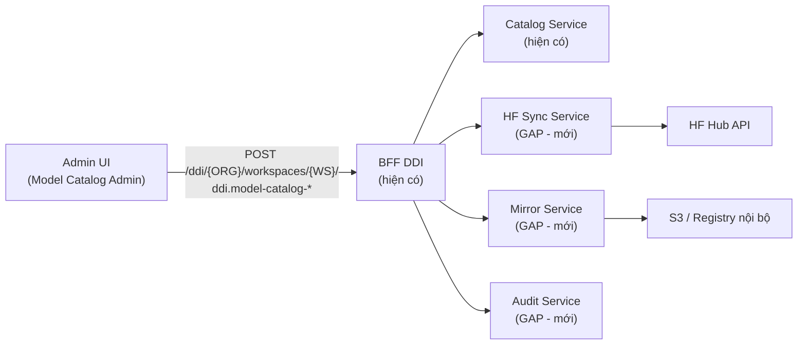

# SRS — Hệ thống Admin quản lý Model Catalog cho Dedicated Inference (DDI)

**Phiên bản:** 1.0
**Ngày:** 27/08/2026
**Trạng thái:** Draft
**Chủ sở hữu:** Thuan Luu Thi (BA/PO)
**Phạm vi:** Màn hình + quy trình admin khai báo/quản lý **Model Catalog**, tái sử dụng API BFF DDI hiện có
**Liên quan:** `docs/brd-ddi-model-catalog-admin.md`, `docs/market-research-fpt-ddi.md`, `docs/srs-ddi-my-endpoints.md`
**Nguồn API:** Postman collection "Portal Core DDI v2 (BFF) - 2026-06-23 Copy"

---

## 1. Giới thiệu

### 1.1 Mục đích

Tài liệu này mô tả yêu cầu chức năng (functional) và phi chức năng (non-functional) cho **hệ thống admin quản lý Model Catalog** của dịch vụ **Dedicated Inference (DDI)**. Hệ thống này cho phép admin **khai báo, nhập từ Hugging Face, kiểm duyệt, bật/tắt, và quản lý vòng đời** các model trong catalog — nguồn model có sẵn để khách hàng chọn và deploy.

Hệ thống **tái sử dụng API BFF DDI hiện có** (folder 9. Model Catalog (Admin)), đồng thời **bổ sung các gap** đã xác định trong BRD §3.1.4.

### 1.2 Người dùng mục tiêu

| Vai trò | Mô tả |
|---------|-------|
| **Catalog Admin (nội bộ FPT)** | Khai báo, nhập từ HF, kiểm duyệt, bật/tắt model |
| **Reviewer / Approver** | Duyệt entry trước khi public (1 cấp) |
| **Platform Ops / MLOps** | Gắn GPU profile, cấu hình serving, theo dõi pull mirror |

### 1.3 Thuật ngữ

| Thuật ngữ | Định nghĩa |
|-----------|------------|
| **Model Catalog** | Danh mục model có sẵn, hợp lệ để deploy dedicated |
| **Entry** | Một bản ghi model trong catalog |
| **BFF** | Backend-for-Frontend — lớp API trung gian (pattern `POST /ddi/{ORG}/workspaces/{WS}/{action}`) |
| **HF Hub** | Hugging Face Hub — kho model công khai |
| **GPU Profile** | Cấu hình GPU hỗ trợ model (SKU, số GPU, VRAM, precision) |
| **Mirror** | Bản sao weights model trong hạ tầng lưu trữ nội bộ FPT (S3/registry) |

---

## 2. Kiến trúc tích hợp

### 2.1 Nguyên tắc tích hợp

- **Toàn bộ thao tác CRUD catalog** **phải** gọi qua API BFF DDI hiện có, **không** xây lại.
- **Xác thực:** dùng Cookie `auth_token={{JWT}}` + header `X-Region`; khi 401 → refresh token.
- **Body request** bọc trong `{ "payload": { ... } }`.
- **Các gap** (approval, mirror, auto-sync, batch, audit, catalog riêng) **phải** được bổ sung ở backend theo cùng pattern BFF.

### 2.2 Sơ đồ tích hợp

---

## 3. Yêu cầu chức năng (Functional Requirements)

> Ký hiệu module: **MC** (Model Catalog). Mỗi FR ghi rõ **Reuse** (tái sử dụng API có sẵn) hay **Gap** (cần bổ sung).

### FR-MC-001: Danh sách Catalog Entry

**Ưu tiên:** Must Have · **Nguồn:** Reuse (`model-catalog-list`, `-get`)

#### Mô tả
Hệ thống **phải** hiển thị danh sách catalog entry trên màn hình admin.

#### Yêu cầu con
- **FR-MC-001.1**: Hiển thị tối thiểu các cột: `id`, `display_name`, `hf_model_id`, `status_code`, `from_price`, `categories`, `sort_order`, Hành động.
- **FR-MC-001.2**: Hỗ trợ lọc theo `status_code` (active / inactive).
- **FR-MC-001.3**: Hỗ trợ tìm kiếm theo `query` (tên/id/hf_model_id).
- **FR-MC-001.4**: Hỗ trợ lọc theo `category_code`.
- **FR-MC-001.5**: Hỗ trợ phân trang qua `limit`.

#### Tiêu chí chấp nhận
1. Gọi `model-catalog-list` với `{status, category_code, query, limit}` → hiển thị đúng danh sách.
2. Lọc theo status/category trả về đúng subset.
3. Tìm kiếm theo query trả về đúng entry khớp.
4. Phân trang hoạt động khi số entry > limit.

---

### FR-MC-002: Nhập model từ Hugging Face Hub

**Ưu tiên:** Must Have · **Nguồn:** Reuse + Gap (cần auto-fetch metadata từ HF)

#### Mô tả
Hệ thống **phải** cho phép admin nhập một HF repo ID, lấy metadata từ HF và tạo entry trong catalog.

#### Yêu cầu con
- **FR-MC-002.1**: Admin nhập `hf_model_id` → hệ thống **phải** gọi HF Hub API để lấy metadata (tên, publisher, license, params, context length).
- **FR-MC-002.2**: Hệ thống **phải** validate repo tồn tại và có `config.json`; nếu thiếu → trả lỗi rõ ràng ≤ 5 giây.
- **FR-MC-002.3**: Metadata từ HF **phải** được prefill vào form tạo entry (`display_name`, `parameters_display`, `context_length_display`, `license`).
- **FR-MC-002.4**: Sau khi admin hoàn thiện, hệ thống **phải** gọi `model-catalog-create` với payload đầy đủ.
- **FR-MC-002.5**: Hệ thống **phải** xử lý rate limit của HF API (backoff/retry).

#### Tiêu chí chấp nhận
1. Nhập repo ID hợp lệ → metadata prefill đúng, tạo entry thành công qua `model-catalog-create`.
2. Repo không tồn tại / thiếu config → lỗi ≤ 5s, không tạo entry.
3. Rate-limit HF → retry tự động, không mất dữ liệu đã nhập.

---

### FR-MC-003: Khai báo thủ công (Manual)

**Ưu tiên:** Must Have · **Nguồn:** Reuse (`model-catalog-create`)

#### Mô tả
Hệ thống **phải** cho phép admin tạo entry bằng tay (model độc quyền, nội bộ, không có trên HF).

#### Yêu cầu con
- **FR-MC-003.1**: Form nhập tối thiểu: `id`*, `display_name`*, `hf_model_id`*, `short_description`*, `parameters_display`*, `context_length_display`*, `license`*, `status_code`*, `categories`*, `hardware_profiles`*.
- **FR-MC-003.5**: `hf_model_id` **bắt buộc** với mọi entry (kể cả `catalog_type=proprietary`), theo quyết định đã chốt. Với model không có trên HF công khai, `hf_model_id` **phải** là identifier nội bộ duy nhất (không bắt buộc là repo HF thật).
- **FR-MC-003.2**: Hệ thống **phải** validate các trường bắt buộc và định dạng (số, URL).
- **FR-MC-003.3**: Cho phép nhập nhiều `hardware_profiles` (gpu_sku_code, gpus_per_instance, precision, vram_required_gb, per_gpu_hourly_price_usd_micros).
- **FR-MC-003.4**: Cho phép nhập `benchmarks[]` (benchmark_name, score, max_score).

#### Tiêu chí chấp nhận
1. Nhập đủ trường bắt buộc hợp lệ → `model-catalog-create` thành công.
2. Thiếu trường bắt buộc → lỗi field cụ thể, không gửi.
3. Hardware profile VRAM không đủ → cảnh báo trước khi lưu.

---

### FR-MC-004: Import hàng loạt (Batch file)

**Ưu tiên:** Could Have (Phase 2 — không nằm trong MVP) · **Nguồn:** Gap (cần endpoint batch)

#### Mô tả
Hệ thống **phải** cho phép admin upload file CSV/YAML/JSON chứa nhiều model để tạo hàng loạt entry.

#### Yêu cầu con
- **FR-MC-004.1**: Hỗ trợ định dạng CSV, YAML, JSON với schema chuẩn (có template tải về).
- **FR-MC-004.2**: Validate từng dòng; dòng lỗi báo cáo riêng, không làm hỏng dòng hợp lệ.
- **FR-MC-004.3**: Trả báo cáo kết quả (N thành công / M lỗi kèm lý do).
- **FR-MC-004.4**: Giới hạn tối đa 500 model/lần import.

#### Tiêu chí chấp nhận
1. Upload file hợp lệ → tạo đúng số entry tương ứng.
2. File có dòng lỗi → dòng hợp lệ vẫn tạo, báo cáo liệt kê lỗi + lý do.
3. File > 500 dòng → bị từ chối với thông báo rõ ràng.

---

### FR-MC-005: Quy trình kiểm duyệt (Approval — 1 cấp Admin)

**Ưu tiên:** Must Have · **Nguồn:** Gap (cần bổ sung trạng thái)

#### Mô tả
Hệ thống **phải** đảm bảo entry chỉ chuyển sang **active** (public) sau khi được **một Admin** chấp thuận.

#### Yêu cầu con
- **FR-MC-005.1**: Entry mới tạo ở trạng thái **draft** (chưa hiển thị cho khách).
- **FR-MC-005.2**: Admin (creator) **phải** submit entry → chuyển sang **pending_review**.
- **FR-MC-005.3**: Một Admin có role **approver** **phải** chấp thuận hoặc từ chối kèm lý do bắt buộc khi từ chối.
- **FR-MC-005.4**: Entry chỉ chuyển sang **active** khi được chấp thuận; không có đường tắt.
- **FR-MC-005.5**: Người tạo entry **không được** tự duyệt entry của mình (khi có ≥ 2 admin).
- **FR-MC-005.6**: Hệ thống **phải** ghi audit log mọi hành động duyệt.
- **FR-MC-005.7**: Quyền duyệt **phải** được cấp theo **role** (RBAC) — tách `catalog_admin` (tạo/sửa) và `catalog_approver` (duyệt), theo quyết định đã chốt.

> **Lưu ý:** API hiện có chỉ hỗ trợ `status_code` (active). Cần bổ sung các giá trị `draft` / `pending_review` ở backend.

#### Tiêu chí chấp nhận
1. Entry draft không xuất hiện cho khách.
2. Approver chấp thuận → entry = active, xuất hiện cho khách.
3. Approver từ chối → entry về draft, ghi lý do, creator thấy được lý do.
4. Người tạo không tự duyệt entry của mình (khi ≥ 2 admin).
5. Mọi thao tác duyệt có audit log.

---

### FR-MC-006: Bật/tắt và xóa entry

**Ưu tiên:** Must Have · **Nguồn:** Reuse (`model-catalog-update`, `-delete`)

#### Mô tả
Hệ thống **phải** cho phép admin quản lý vòng đời entry sau khi public.

#### Yêu cầu con
- **FR-MC-006.1**: Cho phép chỉnh sửa metadata qua `model-catalog-update`.
- **FR-MC-006.2**: Cho phép **disable** (set `status_code` = inactive) — entry biến mất khỏi catalog khách nhưng **không** xóa endpoint đang chạy.
- **FR-MC-006.3**: Chỉ cho phép **xóa** (`model-catalog-delete`) entry ở trạng thái draft; entry active chỉ disable, không xóa.
- **FR-MC-006.4**: Hệ thống **phải** cảnh báo khi disable/xóa entry đang có endpoint active.

#### Tiêu chí chấp nhận
1. Disable entry → không còn hiển thị cho khách, endpoint hiện có vẫn hoạt động.
2. Cố xóa entry active → bị chặn, chỉ cho phép disable.
3. Disable entry có endpoint active → cảnh báo xác nhận trước khi thực hiện.

---

### FR-MC-007: GPU Profile & cấu hình serving

**Ưu tiên:** Must Have · **Nguồn:** Reuse (`hardware_profiles[]`)

#### Mô tả
Hệ thống **phải** cho phép gắn GPU profile và cấu hình serving cho từng entry.

#### Yêu cầu con
- **FR-MC-007.1**: Hỗ trợ danh sách GPU SKU có sẵn (l40s, H100, H200, B300, A30).
- **FR-MC-007.2**: Hệ thống **phải** cảnh báo khi VRAM không đủ cho model (dựa trên `vram_required_gb`).
- **FR-MC-007.3**: Cho phép đánh dấu `is_recommended` cho GPU profile khuyến nghị.
- **FR-MC-007.4**: Cho phép nhập `precision` (fp8, fp16…) và `gpus_per_instance`.

#### Tiêu chí chấp nhận
1. Gắn GPU profile hợp lệ → lưu thành công qua `model-catalog-create/update`.
2. Chọn GPU VRAM không đủ → cảnh báo rõ ràng trước khi lưu.
3. Mỗi entry có đúng 1 GPU profile `is_recommended`.

---

### FR-MC-008: Audit log & traceability

**Ưu tiên:** Should Have · **Nguồn:** Gap

#### Mô tả
Hệ thống **phải** ghi lại toàn bộ thay đổi trên catalog entry để truy vết.

#### Yêu cầu con
- **FR-MC-008.1**: Ghi log mọi hành động CRUD + duyệt (ai, khi nào, trường nào đổi từ → sang).
- **FR-MC-008.2**: Cho phép xem lịch sử thay đổi của từng entry trong UI admin.
- **FR-MC-008.3**: Log **không được phép** chỉnh sửa/xóa bởi người dùng (append-only).

#### Tiêu chí chấp nhận
1. Sửa metadata → log ghi rõ trường cũ/mới, người sửa, thời gian.
2. Admin mở lịch sử entry → thấy đầy đủ chuỗi thay đổi.
3. Người dùng không có quyền xóa log.

---

### FR-MC-009: Tách catalog model độc quyền (Proprietary)

**Ưu tiên:** Must Have · **Nguồn:** Gap (cần thêm field/flag)

#### Mô tả
Theo quyết định đã chốt, model độc quyền/nội bộ **phải** nằm trong **catalog riêng**, tách khỏi catalog model công khai.

#### Yêu cầu con
- **FR-MC-009.1**: Entry **phải** có thuộc tính phân biệt catalog (VD: `catalog_type` = `public` / `proprietary`).
- **FR-MC-009.2**: Màn hình admin **phải** có tab/bộ lọc phân biệt 2 catalog.
- **FR-MC-009.3**: Khách hàng chỉ thấy **public**; **proprietary** chỉ hiển thị cho khách được cấp quyền (whitelist/contract).
- **FR-MC-009.4**: Không cho phép chuyển entry giữa 2 catalog.
- **FR-MC-009.5**: `hf_model_id` **bắt buộc** với mọi entry kể cả proprietary (theo quyết định đã chốt) — với model không có trên HF công khai, dùng identifier nội bộ duy nhất.

#### Tiêu chí chấp nhận
1. Tạo entry proprietary → chỉ xuất hiện trong tab Proprietary.
2. Không có thao tác chuyển entry giữa 2 catalog.
3. Khách không có quyền → không thấy entry proprietary.
4. Khách được cấp quyền → chỉ thấy đúng subset được cấp.

---

### FR-MC-010: Giá model khai báo thủ công

**Ưu tiên:** Must Have · **Nguồn:** Reuse (`from_price` + `per_gpu_hourly_price_usd_micros`)

#### Mô tả
Theo quyết định đã chốt, giá model do **admin khai báo thủ công** theo từng entry.

#### Yêu cầu con
- **FR-MC-010.1**: Admin **phải** nhập `from_price` (USD) và `per_gpu_hourly_price_usd_micros` cho từng hardware profile.
- **FR-MC-010.2**: Hệ thống **phải** validate giá ≥ 0 và định dạng số hợp lệ.
- **FR-MC-010.3**: Giá là trường bắt buộc trước khi entry chuyển sang active.

#### Tiêu chí chấp nhận
1. Nhập giá hợp lệ → lưu thành công.
2. Nhập giá âm → bị chặn với thông báo rõ ràng.
3. Entry active thiếu giá → không cho phép.

---

### FR-MC-011: Auto-sync revision từ Hugging Face theo lịch

**Ưu tiên:** Should Have · **Nguồn:** Gap

#### Mô tả
Theo quyết định đã chốt, hệ thống **phải** tự động kiểm tra và cập nhật revision mới từ HF Hub theo lịch định kỳ.

#### Yêu cầu con
- **FR-MC-011.1**: Chạy tác vụ định kỳ (mặc định hàng ngày) kiểm tra revision mới của từng entry nguồn HF.
- **FR-MC-011.2**: Khi có revision mới, tạo bản ghi **PendingUpdate** (không tự đổi revision đang dùng).
- **FR-MC-011.3**: Admin **phải** xem xét và chấp thuận/từ chối trước khi áp dụng.
- **FR-MC-011.4**: Ghi audit log mọi lần sync (thời điểm, revision cũ → mới, kết quả).
- **FR-MC-011.5**: Tác vụ sync **không được** ảnh hưởng đến endpoint đang chạy.
- **FR-MC-011.6**: Cho phép **bật/tắt sync theo từng entry** (field `sync_enabled`) — entry model ổn định có thể tắt.

#### Tiêu chí chấp nhận
1. Đến giờ sync → phát hiện revision mới và tạo PendingUpdate.
2. Revision đang dùng không đổi cho đến khi admin chấp thuận.
3. Admin từ chối → entry giữ revision cũ.
4. Mọi lần sync đều có audit log.
5. Endpoint đang chạy không bị gián đoạn khi sync.

---

### FR-MC-012: Pull weights về mirror nội bộ

**Ưu tiên:** Must Have · **Nguồn:** Gap

#### Mô tả
Theo quyết định đã chốt (mirror nội bộ), hệ thống **phải** tải weights của model nguồn HF về hạ tầng lưu trữ nội bộ của FPT trước khi entry sẵn sàng deploy.

#### Yêu cầu con
- **FR-MC-012.1**: Hệ thống **phải** tải toàn bộ weights + config của model (theo `hf_model_id` + revision) về mirror nội bộ.
- **FR-MC-012.2**: Tác vụ pull **phải** được kích hoạt khi entry được chấp thuận hoặc theo lịch.
- **FR-MC-012.3**: Theo dõi tiến trình pull (queued → downloading → mirrored → failed) và hiển thị cho admin.
- **FR-MC-012.4**: Pull thất bại → ghi lỗi, retry (mặc định 3 lần), thông báo admin.
- **FR-MC-012.5**: Entry **không được** cho phép deploy cho đến khi weights đã mirrored.
- **FR-MC-012.6**: Lưu `mirror_path` + checksum để đảm bảo toàn vẹn.
- **FR-MC-012.7**: Mirror **phải** lưu tại **S3 nội bộ**, giữ **nguyên weights gốc** theo đúng revision (không nén/quantize lại), theo quyết định đã chốt. Đường dẫn: `s3://<bucket>/ddi-models/{hf_model_id}/{revision}/`.

#### Tiêu chí chấp nhận
1. Entry được chấp thuận → tự động bắt đầu pull weights về mirror.
2. Trong lúc pull, entry không thể deploy.
3. Pull thành công → entry sẵn sàng deploy, lưu đúng mirror_path + checksum.
4. Pull thất bại → retry 3 lần, ghi lỗi, thông báo admin.
5. Checksum sau pull khớp với checksum từ HF.

---

### FR-MC-013: Trạng thái sẵn sàng deploy (Mirrored)

**Ưu tiên:** Must Have · **Nguồn:** Gap

#### Mô tả
Hệ thống **phải** bổ sung trạng thái phản ánh mức độ sẵn sàng weights của entry.

#### Yêu cầu con
- **FR-MC-013.1**: Entry nguồn HF **phải** có trạng thái weights: `NotMirrored` / `Mirroring` / `Mirrored` / `MirrorFailed`.
- **FR-MC-013.2**: Entry chỉ hiển thị cho khách (active) khi trạng thái weights = `Mirrored`.
- **FR-MC-013.3**: Entry `MirrorFailed` **phải** hiển thị rõ cho admin với lý do lỗi; không hiển thị cho khách.
- **FR-MC-013.4**: Khi admin chấp thuận update revision mới (FR-MC-011), hệ thống **phải** reset về `Mirroring` và pull lại trước khi áp dụng.

#### Tiêu chí chấp nhận
1. Entry weights = Mirrored → hiển thị active, khách deploy được.
2. Entry weights ≠ Mirrored → không hiển thị cho khách.
3. Entry MirrorFailed → admin thấy lý do lỗi, khách không thấy.
4. Chấp thuận revision mới → weights về Mirroring, pull xong mới áp dụng.

---

### FR-MC-014: Quản lý Category

**Ưu tiên:** Must Have · **Nguồn:** Reuse (`model-catalog-category-*`)

#### Mô tả
Hệ thống **phải** cho phép admin quản lý danh mục (category) để phân loại model.

#### Yêu cầu con
- **FR-MC-014.1**: Cho phép tạo category (`code`, `display_name`, `sort_order`).
- **FR-MC-014.2**: Cho phép sửa category.
- **FR-MC-014.3**: Cho phép xóa category (chỉ khi không còn model dùng).
- **FR-MC-014.4**: Hiển thị danh sách category.

#### Tiêu chí chấp nhận
1. Tạo/sửa/xóa category thành công qua endpoint tương ứng.
2. Xóa category đang có model → bị chặn với thông báo rõ ràng.

---

## 4. Yêu cầu phi chức năng (Non-Functional Requirements)

| ID | Yêu cầu | Tiêu chí chấp nhận |
|----|---------|--------------------|
| **NFR-MC-001** | Hiệu năng: danh sách catalog tải ≤ 2 giây với ≤ 5.000 entry | p95 < 2s |
| **NFR-MC-002** | Độ khả dụng: admin ≥ 99,9% trong giờ hành chính | Monitor uptime |
| **NFR-MC-003** | Bảo mật: phân quyền RBAC theo role (`catalog_admin` tạo/sửa, `catalog_approver` duyệt); user không có quyền → 403 | Test phân quyền |
| **NFR-MC-004** | Bảo mật: audit log append-only, không thể sửa/xóa | Test nỗ lực sửa log bị chặn |
| **NFR-MC-005** | Tích hợp HF: xử lý rate limit, timeout HF API ≤ 10s | Test mô phỏng rate-limit/timeout |
| **NFR-MC-006** | Toàn vẹn dữ liệu: entry active phải có đủ GPU profile + giá | Validate khi lưu |
| **NFR-MC-007** | Khả năng mở rộng: hỗ trợ ≥ 5.000 entry catalog | Load test |
| **NFR-MC-008** | Tuân thủ: license model bắt buộc trước khi active | Field license bắt buộc |
| **NFR-MC-009** | Xác thực: dùng JWT cookie qua BFF; 401 → refresh token tự động | Test vòng đời token |

---

## 5. Data Dictionary (bổ sung cho schema hiện có)

### 5.1 Fields bổ sung (Gap)

| Field | Kiểu | Bắt buộc | Mô tả |
|-------|------|:--------:|-------|
| `catalog_type` | Enum | ✅ | `public` / `proprietary` (FR-MC-009) |
| `status_code` (mở rộng) | Enum | ✅ | Thêm `draft` / `pending_review` / `inactive` (FR-MC-005) |
| `revision` | String | ĐK | SHA revision HF (FR-MC-011) |
| `mirror_path` | String | ĐK | Đường dẫn weights trong mirror S3 (FR-MC-012) |
| `mirror_checksum` | String | ĐK | Checksum SHA-256 weights (FR-MC-012) |
| `weight_status` | Enum | ✅ | NotMirrored / Mirroring / Mirrored / MirrorFailed (FR-MC-013) |
| `pending_update` | JSON | ◻ | Thông tin revision mới chờ duyệt (FR-MC-011) |
| `sync_enabled` | Boolean | ◻ | Bật/tắt auto-sync revision theo entry (mặc định true) (FR-MC-011.6) |

### 5.1.1 Giá trị `status_code` (đã chốt)

| Giá trị | Ý nghĩa | Hiển thị cho khách |
|---------|---------|:------------------:|
| `draft` | Đang soạn, chưa submit | ❌ |
| `pending_review` | Chờ admin duyệt | ❌ |
| `active` | Đã duyệt, public | ✅ |
| `inactive` | Đã tắt (unpublish) | ❌ |

### 5.2 Fields tái sử dụng từ API hiện có

| Field | Kiểu | Mô tả |
|-------|------|-------|
| `id` | String | Khóa chính entry |
| `hf_model_id` | String | HF repo ID |
| `display_name` | String | Tên hiển thị |
| `short_description` | String | Mô tả ngắn |
| `parameters_display` | String | Số tham số hiển thị |
| `context_length_display` | String | Context length hiển thị |
| `license` | String | License model |
| `badge_code` | String | Badge (new…) |
| `sort_order` | Int | Thứ tự sắp xếp |
| `from_price` | Float | Giá từ (USD) |
| `status_code` | Enum | Trạng thái |
| `categories[]` | Array | Danh mục |
| `benchmarks[]` | Array | Điểm benchmark |
| `hardware_profiles[]` | Array | GPU profile + giá |

---

## 6. Ma trận truy vết (RTM)

| Requirement | Priority | Nguồn | Endpoint API |
|-------------|:--------:|:-----:|--------------|
| FR-MC-001 | Must | Reuse | `model-catalog-list`, `-get` |
| FR-MC-002 | Must | Reuse+Gap | `model-catalog-create` + HF fetch |
| FR-MC-003 | Must | Reuse | `model-catalog-create` |
| FR-MC-004 | Could (P2) | Gap | Batch endpoint (mới) |
| FR-MC-005 | Must | Gap | `model-catalog-update` + trạng thái mới |
| FR-MC-006 | Must | Reuse | `model-catalog-update`, `-delete` |
| FR-MC-007 | Must | Reuse | `hardware_profiles[]` |
| FR-MC-008 | Should | Gap | Audit endpoint (mới) |
| FR-MC-009 | Must | Gap | `catalog_type` field (mới) |
| FR-MC-010 | Must | Reuse | `from_price`, `per_gpu_hourly_price_usd_micros` |
| FR-MC-011 | Should | Gap | HF sync (mới) |
| FR-MC-012 | Must | Gap | Mirror pull (mới) |
| FR-MC-013 | Must | Gap | `weight_status` field (mới) |
| FR-MC-014 | Must | Reuse | `model-catalog-category-*` |
| NFR-MC-001..009 | — | — | — |

---

## 7. Các màn hình admin (Screen map)

| Màn hình | Route gợi ý | FR liên quan |
|----------|-------------|--------------|
| Danh sách Model Catalog | `/admin/ddi/model-catalog` | FR-MC-001 |
| Form nhập model (từ HF) | `/admin/ddi/model-catalog/new?source=hf` | FR-MC-002 |
| Form nhập model (manual) | `/admin/ddi/model-catalog/new?source=manual` | FR-MC-003 |
| Import hàng loạt | `/admin/ddi/model-catalog/import` | FR-MC-004 |
| Chi tiết + duyệt entry | `/admin/ddi/model-catalog/{id}` | FR-MC-005, 006, 008 |
| Quản lý Category | `/admin/ddi/model-catalog/categories` | FR-MC-014 |
| Theo dõi mirror/auto-sync | `/admin/ddi/model-catalog/sync` | FR-MC-011, 012, 013 |

---

## 8. Phạm vi ngoài (Out of Scope)

- **BYOM** (model do khách tự mang) — luồng riêng trong `spec-mvp.md`.
- Portal/public catalog cho khách (chỉ hệ thống admin nội bộ).
- Thanh toán/hóa đơn theo model.
- Tự động test serving khi thêm model.

---

## 9. Câu hỏi cần xác nhận (Open Questions)

> **Cập nhật 27/08/2026:** Các quyết định đã chốt từ PO:
> 1. `hf_model_id` **bắt buộc** với mọi entry (kể cả proprietary).
> 2. `status_code` — xem §9.1 (đề xuất enum 4 giá trị).
> 3. Quyền admin/approver **cấp theo role** (RBAC).
> 4. Mirror — xem §9.2 (đề xuất S3 + giữ nguyên weights).

### 9.1 `status_code` — đề xuất enum 4 giá trị

| Giá trị | Ý nghĩa | Hiển thị cho khách | Ghi chú |
|---------|---------|:------------------:|---------|
| `draft` | Đang soạn, chưa submit | ❌ | Trạng thái khởi tạo |
| `pending_review` | Chờ admin duyệt | ❌ | Sau khi submit |
| `active` | Đã duyệt, public | ✅ | Chỉ khi weights = Mirrored |
| `inactive` | Đã tắt (unpublish) | ❌ | Endpoint đang chạy vẫn hoạt động |

> **Lưu ý:** API hiện có chỉ thấy giá trị `active`. Cần xác nhận với team backend rằng các giá trị `draft` / `pending_review` / `inactive` có thể thêm vào enum `status_code` hiện có hay cần field riêng.

### 9.2 Mirror — đề xuất

- **Nơi lưu:** **S3 nội bộ** (bucket riêng theo region/tenant).
- **Nội dung:** giữ **nguyên weights gốc** theo đúng revision (không nén/quantize lại khi pull).
- **Verify:** tính checksum (SHA-256) sau khi pull, đối chiếu với HF.
- **Đường dẫn:** `s3://<bucket>/ddi-models/{hf_model_id}/{revision}/`.
- **Thời điểm pull:** khi entry được duyệt (active) hoặc theo lịch cho entry đã active.

### 9.3 Các câu hỏi còn lại — đã chốt (đề xuất BA)

> **Cập nhật 27/08/2026:** PO đồng ý để BA tự đề xuất. Các quyết định sau đã được chốt:

1. **Role approver:** **Tách 2 role riêng** — `catalog_admin` (tạo/sửa entry, category) và `catalog_approver` (duyệt entry). Đảm bảo segregation of duties; người tạo không tự duyệt entry của mình.
2. **Mở rộng enum `status_code`:** **Có** — thêm `draft` / `pending_review` / `inactive` bên cạnh `active` (xem §9.1). Team backend cần xác nhận kỹ thuật nhưng đây là hướng chuẩn.
3. **Auto-sync revision:** **Tần suất hàng ngày**, cho phép **bật/tắt theo từng entry** (field `sync_enabled`). Entry model ổn định có thể tắt sync.
4. **Batch import:** **Hoãn sang phase sau** (phase 2). MVP chỉ triển khai **HF + manual** (FR-MC-002, 003). FR-MC-004 chuyển thành **Could Have** (không nằm trong MVP).

---

## 10. Next steps

1. Xác nhận Open Questions (§9).
2. Bổ sung các **gap backend** (approval status, catalog_type, mirror, auto-sync, audit, batch) theo pattern BFF.
3. Thiết kế UI admin cho các màn hình (§7).
4. Tách task breakdown + ước công (tham chiếu `spec-mvp.md`).