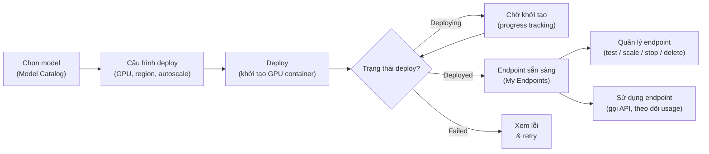

# SRS — FPT DDI: Tính năng "My Endpoints" (Quản lý Endpoint sau Deploy)

**Phiên bản:** 1.0
**Ngày:** 18/08/2026
**Trạng thái:** Draft
**Chủ sở hữu:** Thuan Luu Thi (BA/PO)
**Phạm vi:** Tính năng quản lý endpoint sau khi deploy model — màn hình `/ddi/my-endpoints`
**Liên quan:** `docs/market-research-fpt-ddi.md` (bối cảnh sản phẩm DDI)

---

## 1. Giới thiệu

### 1.1 Mục đích

Tài liệu này mô tả yêu cầu chức năng (functional) và phi chức năng (non-functional) cho tính năng **"My Endpoints"** của dịch vụ **Dedicated Inference (DDI)**. Tính năng này là điểm kết thúc của luồng deploy model: sau khi khách hàng deploy một model từ **Model Catalog** lên GPU container riêng, hệ thống tạo ra một **endpoint** (điểm truy cập API). Màn hình "My Endpoints" cho phép khách hàng xem, quản lý, giám sát và vận hành các endpoint đã triển khai.

### 1.2 Người dùng mục tiêu

| Vai trò | Mô tả |
|---------|-------|
| **Developer / Data Scientist** | Deploy model, lấy API key, test endpoint, theo dõi usage |
| **DevOps / MLOps Engineer** | Quản lý vòng đời endpoint (scale, stop, delete), giám sát SLA |
| **Admin / Billing** | Xem chi phí, quota, hóa đơn theo endpoint |

### 1.3 Thuật ngữ

| Thuật ngữ | Định nghĩa |
|-----------|------------|
| **Endpoint** | Điểm truy cập API duy nhất trỏ tới một model đã deploy trên GPU container riêng |
| **Deploy** | Hành động triển khai model từ Model Catalog lên hạ tầng GPU container |
| **Dedicated** | Tài nguyên GPU riêng, không chia sẻ với tenant khác |
| **BYOM** | Bring-Your-Own-Model — deploy model do khách hàng cung cấp |
| **GPU container** | Container chạy trên hạ tầng GPU (H100, H200, B300, A30) |

---

## 2. Tổng quan luồng nghiệp vụ

**Mô tả:** Sau khi deploy thành công, hệ thống tạo endpoint và đưa vào màn hình **My Endpoints**. Từ đây người dùng quản lý toàn bộ vòng đời endpoint.

---

## 3. Yêu cầu chức năng (Functional Requirements)

### FR-EP-001: Danh sách Endpoint (List Endpoints)

**Ưu tiên:** Must Have
**Trạng thái:** Draft

#### Mô tả
Hệ thống **phải** hiển thị danh sách tất cả endpoint đã deploy của người dùng hiện tại trên màn hình `/ddi/my-endpoints`.

#### Yêu cầu con
- **FR-EP-001.1**: Hệ thống **phải** hiển thị các cột tối thiểu: Tên endpoint, Model, GPU, Region, Trạng thái, Ngày tạo, Hành động.
- **FR-EP-001.2**: Hệ thống **phải** hỗ trợ phân trang khi số endpoint vượt quá 20 mỗi trang.
- **FR-EP-001.3**: Hệ thống **phải** hỗ trợ tìm kiếm endpoint theo tên hoặc model.
- **FR-EP-001.4**: Hệ thống **phải** hỗ trợ lọc theo trạng thái (Deployed / Deploying / Failed / Stopped).
- **FR-EP-001.5**: Hệ thống **phải** hiển thị badge trạng thái với màu sắc phân biệt rõ ràng.

#### Tiêu chí chấp nhận
1. Người dùng mở `/ddi/my-endpoints` → hệ thống hiển thị danh sách endpoint của chính người dùng (không hiển thị endpoint của người khác).
2. Khi có >20 endpoint, hệ thống phân trang và cho phép điều hướng.
3. Khi nhập từ khóa tìm kiếm, danh sách lọc theo tên/model tương ứng.
4. Mỗi endpoint hiển thị đúng trạng thái hiện tại với badge màu phân biệt.

---

### FR-EP-002: Chi tiết Endpoint (Endpoint Detail)

**Ưu tiêu:** Must Have
**Trạng thái:** Draft

#### Mô tả
Hệ thống **phải** cho phép người dùng xem chi tiết một endpoint, bao gồm thông tin cấu hình, thông tin truy cập và thông tin sử dụng.

#### Yêu cầu con
- **FR-EP-002.1**: Hệ thống **phải** hiển thị **Endpoint URL** (điểm truy cập API) cho endpoint đã deploy.
- **FR-EP-002.2**: Hệ thống **phải** hiển thị **API Key** cho endpoint, với nút sao chép và cơ chế che giấu (masked) mặc định.
- **FR-EP-002.3**: Hệ thống **phải** hiển thị thông tin cấu hình: Model, GPU type, Region, Autoscaling, Version model.
- **FR-EP-002.4**: Hệ thống **phải** hiển thị thông tin sử dụng: số request, token usage, latency trung bình, uptime.
- **FR-EP-002.5**: Hệ thống **phải** hiển thị thông tin chi phí ước tính theo thời gian thực.

#### Tiêu chí chấp nhận
1. Endpoint ở trạng thái "Deployed" hiển thị URL hợp lệ và có thể sao chép.
2. API Key hiển thị dạng masked (ví dụ `sk-****abcd`) và chỉ hiện đầy đủ khi người dùng bấm "Show".
3. Người dùng xem được đầy đủ cấu hình GPU, region, autoscale.
4. Số liệu usage (request, token, latency) cập nhật trong vòng 60 giây.

---

### FR-EP-003: Test Endpoint (Playground)

**Ưu tiên:** Must Have
**Trạng thái:** Draft

#### Mô tả
Hệ thống **phải** cung cấp giao diện test nhanh (playground) để người dùng gửi request thử nghiệm tới endpoint và xem response.

#### Yêu cầu con
- **FR-EP-003.1**: Hệ thống **phải** cho phép nhập prompt/test input và gửi tới endpoint.
- **FR-EP-003.2**: Hệ thống **phải** hiển thị response, thời gian phản hồi (latency) và token usage.
- **FR-EP-003.3**: Hệ thống **phải** hiển thị mã lệnh mẫu (sample code) cho nhiều ngôn ngữ (Python, cURL, JavaScript).
- **FR-EP-003.4**: Hệ thống **phải** hiển thị lỗi rõ ràng khi request thất bại (HTTP status + message).

#### Tiêu chí chấp nhận
1. Người dùng gửi test request → nhận response trong thời gian theo SLA của model.
2. Sample code hiển thị đúng Endpoint URL và API Key của endpoint hiện tại.
3. Khi endpoint lỗi, hệ thống hiển thị mã lỗi và thông điệp mô tả.

---

### FR-EP-004: Quản lý vòng đời Endpoint

**Ưu tiên:** Must Have
**Trạng thái:** Draft

#### Mô tả
Hệ thống **phải** cho phép người dùng quản lý vòng đời endpoint: scale, stop, start, delete.

#### Yêu cầu con
- **FR-EP-004.1 (Scale)**: Hệ thống **phải** cho phép tăng/giảm số GPU replica của endpoint.
- **FR-EP-004.2 (Stop)**: Hệ thống **phải** cho phép dừng (stop) endpoint, giải phóng tài nguyên GPU.
- **FR-EP-004.3 (Start)**: Hệ thống **phải** cho phép khởi động lại endpoint đã dừng.
- **FR-EP-004.4 (Delete)**: Hệ thống **phải** cho phép xóa endpoint, yêu cầu xác nhận trước khi xóa.
- **FR-EP-004.5**: Hệ thống **phải** ghi log lịch sử thao tác (audit trail) cho mọi thay đổi trạng thái.

#### Tiêu chí chấp nhận
1. Người dùng scale endpoint → hệ thống cập nhật số replica và phản ánh trong vòng 5 phút.
2. Stop endpoint → trạng thái chuyển sang "Stopped", tài nguyên GPU được giải phóng (ngừng tính phí GPU).
3. Start endpoint đã dừng → khôi phục cấu hình trước đó và chuyển sang "Deploying" rồi "Deployed".
4. Delete endpoint → hệ thống hiển thị dialog xác nhận; sau xóa endpoint không còn trong danh sách và không thể gọi API.
5. Mọi thao tác đều có bản ghi audit (ai, khi nào, hành động gì).

---

### FR-EP-005: Giám sát & Metrics

**Ưu tiên:** Should Have
**Trạng thái:** Draft

#### Mô tả
Hệ thống **phải** cung cấp biểu đồ giám sát hiệu năng và sử dụng cho từng endpoint.

#### Yêu cầu con
- **FR-EP-005.1**: Hệ thống **phải** hiển thị biểu đồ request rate (requests/phút) theo thời gian.
- **FR-EP-005.2**: Hệ thống **phải** hiển thị biểu đồ latency (p50, p95, p99) theo thời gian.
- **FR-EP-005.3**: Hệ thống **phải** hiển thị biểu đồ GPU utilization và token throughput.
- **FR-EP-005.4**: Hệ thống **phải** hỗ trợ chọn khoảng thời gian (1h, 24h, 7d, 30d).
- **FR-EP-005.5**: Hệ thống **phải** hiển thị cảnh báo (alert) khi latency hoặc error rate vượt ngưỡng.

#### Tiêu chí chấp nhận
1. Biểu đồ request rate và latency hiển thị dữ liệu chính xác theo khoảng thời gian đã chọn.
2. Khi error rate > ngưỡng (mặc định 5%), hệ thống hiển thị cảnh báo trên màn hình.
3. Dữ liệu metrics được lưu tối thiểu 30 ngày.

---

### FR-EP-006: API Keys Management

**Ưu tiên:** Should Have
**Trạng thái:** Draft

#### Mô tả
Hệ thống **phải** cho phép người dùng quản lý API key cho endpoint: tạo mới, xoay vòng (rotate), thu hồi (revoke).

#### Yêu cầu con
- **FR-EP-006.1**: Hệ thống **phải** cho phép tạo nhiều API key cho một endpoint.
- **FR-EP-006.2**: Hệ thống **phải** cho phép thu hồi (revoke) API key, key bị thu hồi ngừng hoạt động ngay lập tức.
- **FR-EP-006.3**: Hệ thống **phải** hiển thị API key đầy đủ **chỉ một lần** khi tạo mới.
- **FR-EP-006.4**: Hệ thống **phải** ghi log thời điểm tạo/revoke key.

#### Tiêu chí chấp nhận
1. Người dùng tạo key mới → hệ thống hiển thị key đầy đủ đúng một lần, sau đó chỉ hiển thị masked.
2. Revoke key → request dùng key đó trả về 401 trong vòng 60 giây.
3. Một endpoint có thể có nhiều key hoạt động song song.

---

### FR-EP-007: Thông báo trạng thái

**Ưu tiên:** Could Have
**Trạng thái:** Draft

#### Mô tả
Hệ thống **phải** gửi thông báo cho người dùng khi có sự kiện quan trọng liên quan tới endpoint.

#### Yêu cầu con
- **FR-EP-007.1**: Hệ thống **phải** thông báo khi deploy thành công / thất bại.
- **FR-EP-007.2**: Hệ thống **phải** thông báo khi endpoint ngừng hoạt động (downtime) hoặc vượt ngưỡng.
- **FR-EP-007.3**: Hệ thống **phải** hỗ trợ kênh thông báo: in-app notification, email (tùy chọn webhook).

#### Tiêu chí chấp nhận
1. Khi deploy hoàn tất, người dùng nhận thông báo trong vòng 5 phút.
2. Khi endpoint downtime > 1 phút, hệ thống gửi cảnh báo.
3. Người dùng có thể cấu hình kênh nhận thông báo.

---

## 4. Yêu cầu phi chức năng (Non-Functional Requirements)

### NFR-EP-001: Hiệu năng (Performance)

**Ưu tiên:** Must Have

| Yêu cầu | Giá trị |
|---------|---------|
| **NFR-EP-001.1**: Thời gian tải danh sách endpoint | ≤ 3 giây (p95) |
| **NFR-EP-001.2**: Thời gian phản hồi giao diện thao tác | ≤ 1 giây (p95) |
| **NFR-EP-001.3**: Cập nhật metrics hiển thị | ≤ 60 giây |
| **NFR-EP-001.4**: Hỗ trợ đồng thời | ≥ 1.000 người dùng active |

### NFR-EP-002: Bảo mật (Security)

**Ưu tiên:** Must Have

- **NFR-EP-002.1**: Mọi truy cập tới My Endpoints **phải** qua xác thực (authentication) và phân quyền (authorization) theo tài khoản người dùng.
- **NFR-EP-002.2**: API Key **phải** được lưu trữ mã hóa (encrypted at rest), không lưu plaintext.
- **NFR-EP-002.3**: Truyền tải dữ liệu **phải** dùng TLS/HTTPS.
- **NFR-EP-002.4**: Người dùng chỉ xem/quản lý endpoint thuộc về chính mình (tenant isolation).
- **NFR-EP-002.5**: Tuân thủ nguyên tắc least-privilege — API key chỉ truy cập endpoint được cấp.

### NFR-EP-003: Độ tin cậy & Sẵn sàng (Reliability & Availability)

**Ưu tiên:** Must Have

- **NFR-EP-003.1**: Uptime của màn hình My Endpoints ≥ 99,9%.
- **NFR-EP-003.2**: Dữ liệu endpoint **phải** được persist (không mất khi container restart).
- **NFR-EP-003.3**: Audit log **phải** được lưu tối thiểu 1 năm.

### NFR-EP-004: Khả năng sử dụng (Usability)

**Ưu tiên:** Should Have

- **NFR-EP-004.1**: Giao diện **phải** tương thích responsive (desktop ≥ 1280px, tablet ≥ 768px).
- **NFR-EP-004.2**: Tuân thủ WCAG 2.1 AA về độ tương phản và khả năng truy cập bàn phím.
- **NFR-EP-004.3**: Mọi thông báo lỗi **phải** bằng ngôn ngữ dễ hiểu, kèm hướng khắc phục.

### NFR-EP-005: Khả năng mở rộng (Scalability)

**Ưu tiên:** Should Have

- **NFR-EP-005.1**: Hệ thống **phải** hỗ trợ tối thiểu 10.000 endpoint active trên toàn hệ thống.
- **NFR-EP-005.2**: Kiến trúc **phải** cho phép mở rộng ngang (horizontal scaling) mà không gián đoạn dịch vụ.

### NFR-EP-006: Tuân thủ (Compliance)

**Ưu tiên:** Should Have

- **NFR-EP-006.1**: Xử lý dữ liệu cá nhân tuân thủ Nghị định 13/2023/NĐ-CP (bảo vệ dữ liệu cá nhân).
- **NFR-EP-006.2**: Hỗ trợ data residency — dữ liệu endpoint nằm tại region người dùng chọn (Việt Nam mặc định).
- **NFR-EP-006.3**: Audit trail đầy đủ phục vụ kiểm toán (SOX/ISO 27001 readiness).

---

## 5. User Stories

### US-EP-001: Xem danh sách endpoint sau deploy

> **As a** Developer
> **I want** xem danh sách endpoint đã deploy trên màn hình My Endpoints
> **So that** tôi biết trạng thái và truy cập được endpoint sau khi deploy xong

**Acceptance Criteria:**
- [ ] Sau khi deploy model thành công, endpoint xuất hiện trong danh sách với trạng thái "Deployed"
- [ ] Mỗi endpoint hiển thị model, GPU, region, trạng thái, ngày tạo
- [ ] Người dùng chỉ thấy endpoint của chính mình

**Business Rules:**
- BR-EP-001: Mỗi lần deploy thành công tạo đúng một endpoint.
- BR-EP-002: Endpoint thuộc về đúng tenant đã deploy.

---

### US-EP-002: Sao chép Endpoint URL & API Key

> **As a** Developer
> **I want** sao chép Endpoint URL và API Key
> **So that** tôi tích hợp endpoint vào ứng dụng của mình

**Acceptance Criteria:**
- [ ] Nút sao chép URL hoạt động và copy đúng URL
- [ ] API Key hiển thị masked, có nút "Show" để hiện đầy đủ
- [ ] Sample code tự động điền URL + key hiện tại

**Business Rules:**
- BR-EP-003: API Key đầy đủ chỉ hiển thị khi người dùng chủ động bấm "Show".

---

### US-EP-003: Test endpoint từ giao diện

> **As a** Data Scientist
> **I want** test endpoint bằng playground
> **So that** tôi xác nhận model hoạt động đúng trước khi đưa vào sản xuất

**Acceptance Criteria:**
- [ ] Gửi test input → nhận response + latency + token usage
- [ ] Hiển thị sample code Python/cURL/JavaScript
- [ ] Lỗi hiển thị rõ ràng kèm HTTP status

---

### US-EP-004: Scale endpoint theo nhu cầu

> **As a** DevOps Engineer
> **I want** tăng/giảm số GPU replica của endpoint
> **So that** tôi đáp ứng lưu lượng thay đổi mà không gián đoạn

**Acceptance Criteria:**
- [ ] Tăng replica → hệ thống cấp thêm GPU và cập nhật trong 5 phút
- [ ] Giảm replica → giải phóng GPU, ngừng tính phí phần dư
- [ ] Endpoint vẫn phục vụ request trong quá trình scale

**Business Rules:**
- BR-EP-004: Số replica tối thiểu = 1, tối đa theo quota người dùng.

---

### US-EP-005: Dừng / khởi động lại endpoint

> **As a** DevOps Engineer
> **I want** dừng endpoint khi không dùng và khởi động lại khi cần
> **So that** tôi tối ưu chi phí GPU

**Acceptance Criteria:**
- [ ] Stop → trạng thái "Stopped", ngừng tính phí GPU
- [ ] Start → khôi phục cấu hình, chuyển "Deploying" → "Deployed"
- [ ] Cấu hình (model, GPU, region) giữ nguyên qua stop/start

---

### US-EP-006: Xóa endpoint

> **As a** Admin
> **I want** xóa endpoint không còn dùng
> **So that** tôi giải phóng tài nguyên và dọn dẹp

**Acceptance Criteria:**
- [ ] Xóa yêu cầu xác nhận (dialog)
- [ ] Sau xóa, endpoint biến mất khỏi danh sách và API trả 404
- [ ] Thao tác xóa được ghi vào audit log

---

## 6. Data Dictionary

### Bảng `endpoint`

| Thuộc tính | Kiểu dữ liệu | Bắt buộc | Mô tả |
|------------|--------------|----------|-------|
| `endpoint_id` | UUID | ✓ | Khóa chính, định danh duy nhất endpoint |
| `tenant_id` | UUID | ✓ | Định danh tenant (người dùng/tổ chức) sở hữu |
| `name` | String (≤128) | ✓ | Tên hiển thị endpoint |
| `model_id` | String | ✓ | Model từ Model Catalog (vd `llama-3.1-70b`) |
| `model_version` | String | ✓ | Phiên bản model |
| `gpu_type` | Enum | ✓ | `H100` \| `H200` \| `B300` \| `A30` |
| `region` | String | ✓ | Region triển khai (vd `vn-hanoi`, `jp-tokyo`) |
| `replica_count` | Integer (≥1) | ✓ | Số GPU replica hiện tại |
| `status` | Enum | ✓ | `deploying` \| `deployed` \| `failed` \| `stopped` |
| `endpoint_url` | URL | ✓ (khi deployed) | Điểm truy cập API |
| `autoscale_enabled` | Boolean | ✓ | Bật/tắt autoscaling |
| `created_at` | Timestamp | ✓ | Thời điểm tạo |
| `updated_at` | Timestamp | ✓ | Thời điểm cập nhật cuối |
| `last_deployed_at` | Timestamp | | Thời điểm deploy thành công cuối |

### Bảng `api_key`

| Thuộc tính | Kiểu dữ liệu | Bắt buộc | Mô tả |
|------------|--------------|----------|-------|
| `key_id` | UUID | ✓ | Khóa chính |
| `endpoint_id` | UUID | ✓ | FK → endpoint |
| `key_hash` | String | ✓ | Hash của API key (không lưu plaintext) |
| `key_prefix` | String | ✓ | Tiền tố hiển thị (vd `sk-****abcd`) |
| `status` | Enum | ✓ | `active` \| `revoked` |
| `created_at` | Timestamp | ✓ | Thời điểm tạo |
| `revoked_at` | Timestamp | | Thời điểm thu hồi |

### Bảng `endpoint_metric` (time-series)

| Thuộc tính | Kiểu dữ liệu | Mô tả |
|------------|--------------|-------|
| `endpoint_id` | UUID | FK → endpoint |
| `ts` | Timestamp | Mốc thời gian (bucket) |
| `request_count` | Integer | Số request trong bucket |
| `token_in` | Integer | Token input |
| `token_out` | Integer | Token output |
| `latency_p50` | Float | Latency phân vị 50 (ms) |
| `latency_p95` | Float | Latency phân vị 95 (ms) |
| `latency_p99` | Float | Latency phân vị 99 (ms) |
| `error_count` | Integer | Số request lỗi |
| `gpu_utilization` | Float | GPU utilization (%) |

### Bảng `endpoint_audit_log`

| Thuộc tính | Kiểu dữ liệu | Mô tả |
|------------|--------------|-------|
| `log_id` | UUID | Khóa chính |
| `endpoint_id` | UUID | FK → endpoint |
| `actor_user_id` | UUID | Người thực hiện |
| `action` | Enum | `create` \| `scale` \| `stop` \| `start` \| `delete` \| `key_create` \| `key_revoke` |
| `detail` | JSON | Chi tiết thay đổi |
| `ts` | Timestamp | Thời điểm thực hiện |

---

## 7. Requirements Traceability Matrix (RTM)

| Requirement | User Story | NFR liên quan | Ưu tiên |
|-------------|------------|---------------|---------|
| FR-EP-001 | US-EP-001 | NFR-EP-001.1, NFR-EP-002.4 | Must |
| FR-EP-002 | US-EP-002 | NFR-EP-002.2 | Must |
| FR-EP-003 | US-EP-003 | NFR-EP-001.2 | Must |
| FR-EP-004 | US-EP-004, US-EP-005, US-EP-006 | NFR-EP-003.2, NFR-EP-003.3 | Must |
| FR-EP-005 | — | NFR-EP-001.3 | Should |
| FR-EP-006 | US-EP-002 | NFR-EP-002.2, NFR-EP-002.5 | Should |
| FR-EP-007 | — | — | Could |

---

## 8. Out of Scope

- Triển khai cơ chế kỹ thuật serving engine (HOW — thuộc về thiết kế kỹ thuật)
- Quản lý hóa đơn/thanh toán chi tiết (module riêng)
- Fine-tuning platform (module riêng, roadmap Phase 3)
- Multi-provider routing (roadmap dài hạn)
- Quản lý người dùng/phân quyền RBAC chi tiết (module riêng)

---

## 9. Giả định & Phụ thuộc

- Người dùng đã có tài khoản và được xác thực trước khi truy cập My Endpoints
- Model Catalog và luồng deploy model đã có (tính năng nền tảng)
- Hạ tầng GPU container (H100/H200/B300/A30) đã sẵn sàng
- Phụ thuộc: FR-EP-002 (chi tiết endpoint) phụ thuộc FR-EP-001 (danh sách)
- Phụ thuộc: FR-EP-005 (metrics) phụ thuộc dữ liệu metrics từ serving engine

---

## 10. Nguồn tham khảo

- `docs/market-research-fpt-ddi.md` — bối cảnh sản phẩm DDI, hạ tầng GPU, đối thủ (Together AI, Fireworks, Baseten — benchmark UX endpoint management)
- Nghị định 13/2023/NĐ-CP — bảo vệ dữ liệu cá nhân (NFR-EP-006)
- WCAG 2.1 AA — khả năng truy cập (NFR-EP-004)