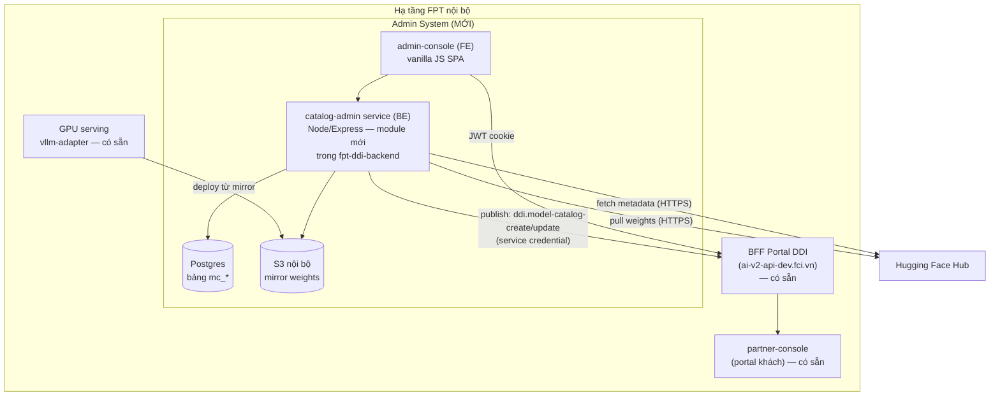
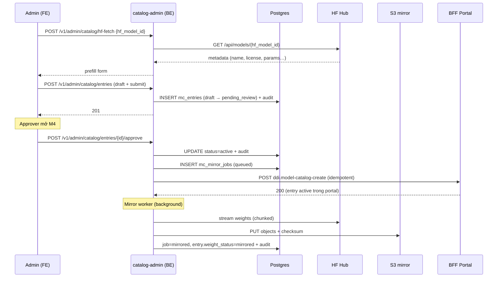
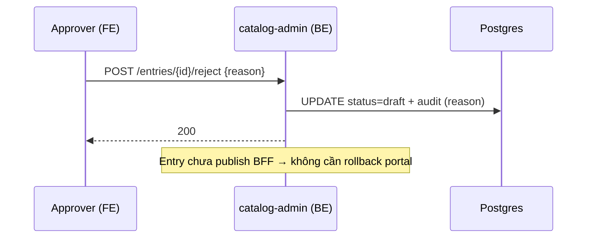
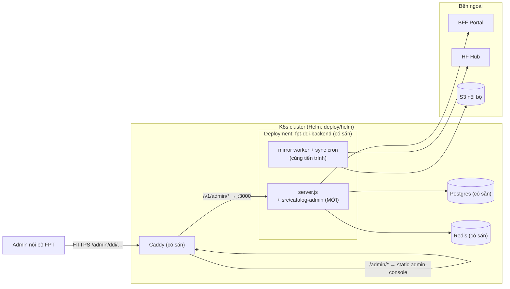

# System Design — Hệ thống Admin Model Catalog (DDI)

**Phiên bản:** 1.0
**Ngày:** 27/08/2026
**Trạng thái:** Draft
**Chủ sở hữu:** Thuan Luu Thi (BA/PO)
**Căn cứ:** `docs/srs-ddi-model-catalog-admin.md`, `docs/brd-ddi-model-catalog-admin.md`, `docs/task-breakdown-ddi-model-catalog-admin.md`, `docs/prototype-ddi-model-catalog-admin.md`
**Stack hiện có:** Node.js (Express, CommonJS) · Postgres (`src/db/pool.js`) · partner-console (vanilla JS SPA) · Helm + Caddy + podman-compose

---

## 1. Overview

### 1.1 Mục tiêu

Thiết kế hệ thống **Admin Model Catalog** cho DDI, gồm 4 lớp: **FE (admin UI) · BE (catalog-admin service) · DB (Postgres) · Deployment**, tái sử dụng tối đa hạ tầng và code hiện có:

| Tái dụng | Từ đâu |
|----------|--------|
| Postgres + pool + migration pattern | `src/db/pool.js`, `db/migrations/001-014` |
| Express router/store pattern | `src/catalog/`, `src/endpoints/`, `src/keys/` |
| **Pull weights từ HF/S3 + validate** | `src/byom/processor.js` (đã có sẵn) |
| Auth JWT cookie + refresh | Hệ thống portal hiện có |
| Deploy Helm + Caddy + podman-compose | `deploy/helm/`, `deploy/podman-compose.prod.yaml` |
| API portal catalog (publish) | BFF `ddi.model-catalog-*` (Postman collection) |

### 1.2 Nguyên tắc thiết kế

1. **Tái sử dụng trước, xây mới sau** — mọi thứ đã có trong repo hoặc BFF đều không build lại.
2. **Portal catalog (BFF) là nguồn sự thật cho khách hàng** — admin service không tự ý sửa dữ liệu catalog khách, chỉ **publish** qua API có sẵn.
3. **Admin service là nguồn sự thật cho workflow nội bộ** — draft, duyệt, mirror, audit.
4. **Không build step cho FE** — giữ vanilla JS như partner-console (nhất quán, deploy đơn giản).
5. **Mọi trạng thái phải truy vết được** — audit log append-only.

---

## 2. Kiến trúc tổng thể

### 2.1 Context diagram



### 2.2 Phân chia trách nhiệm

| Thành phần | Trách nhiệm | Trạng thái |
|-----------|-------------|:----------:|
| **admin-console (FE)** | UI admin 7 màn hình (M1–M7) | Mới |
| **catalog-admin service (BE)** | Workflow: draft → submit → approve → publish; HF fetch; mirror pull; audit; sync | Mới (module trong repo hiện có) |
| **Postgres** | Bảng `mc_*` (entry, audit, mirror job, pending update) | Mở rộng |
| **S3 nội bộ** | Lưu weights mirror | Mới (bucket) |
| **BFF Portal** | Catalog khách + endpoint CRUD có sẵn | Tái dụng |
| **vllm-adapter / GPU** | Deploy từ mirror | Tái dụng |

### 2.3 ADR-001: Admin service riêng vs. mở rộng BFF

| Tiêu chí | A. Module trong fpt-ddi-backend (khuyến nghị) | B. Mở rộng BFF portal trực tiếp |
|----------|:---------------------------------------------:|:-------------------------------:|
| Tốc độ triển khai | Nhanh — tự chủ code | Chậm — phụ thuộc team BFF |
| Nguồn sự thật | Tách: admin (workflow) vs. BFF (catalog khách) | Gộp — 1 nguồn |
| Rủi ro | Sync drift giữa admin ↔ BFF (giảm bằng publish idempotent) | Ít |
| Quyền kiểm soát | 100% | Chia sẻ với team BFF |

**Quyết định:** **Phương án A** — module `src/catalog-admin/` trong `fpt-ddi-backend`. Admin service lưu metadata + workflow trong Postgres riêng; khi entry được **approve**, service gọi BFF `ddi.model-catalog-create/update` (idempotent theo `id`) để publish. Nếu sau này team BFF nhận hỗ trợ mở rộng enum `status_code` + field mới, có thể gộp về phương án B (ADR review lại).

**Hệ quả:**
- (+) Triển khai nhanh, không chặn bởi team khác.
- (−) Phải đảm bảo **publish idempotent** (cùng `id` gọi lại = update, không duplicate).
- (−) Entry `active` trong BFF nhưng admin service bị lỗi → cần job đối chiếu (reconciliation) định kỳ.

### 2.4 ADR-002: Tái dụng `byom/processor.js` cho mirror pull

`src/byom/processor.js` đã có logic tải weights từ HF/S3 + validate `config.json`/`tokenizer.json`. Mirror pull **sẽ tái dụng** logic này (trích xuất thành module chung `src/mirror/downloader.js`), khác biệt:
- Lưu về **S3** (thay vì `/data/byom/<id>/weights/`).
- Thêm **checksum SHA-256** + progress tracking + retry 3 lần.
- Chạy như **background job** trong tiến trình backend (queue in-DB), không cần worker container riêng ở phase 1.

### 2.5 ADR-003: FE vanilla JS (không framework)

Khớp partner-console (vanilla JS, không build step):
- Deploy = copy static files, Caddy serve.
- Team không cần học framework mới.
- 7 màn hình admin có độ phức tạp UI vừa phải → vanilla JS đủ.
- **Rủi ro:** app.js partner-console đã 194KB — admin-console phải tách file theo màn hình (`m1-list.js`, `m2-hf-form.js`…) để tránh lặp lại lỗi này.

### 2.6 ADR-004: JSONB cho hardware_profiles / benchmarks / categories

Khớp schema BFF hiện có (array object trong JSON). Postgres JSONB cho phép:
- Lưu đúng shape API BFF (không map lại khi publish).
- Query theo `gpu_sku_code` bằng GIN index khi cần lọc.

### 2.7 ADR-005: Mirror lưu S3, giữ nguyên weights gốc

- Bucket: `ddi-models-{region}` (VD: `ddi-models-hanoi`).
- Path: `ddi-models/{hf_model_id}/{revision}/` (slug hóa `hf_model_id`: `/` → `__`).
- Không nén/quantize lại — deploy dùng đúng weights đã mirror (khớp FR-MC-012.7).
- S3 lifecycle: object của entry `inactive` > 90 ngày → chuyển IA storage (tiết kiệm chi phí).

---

## 3. Thiết kế component

### 3.1 FE — `admin-console/`

```
admin-console/
├── index.html            # Shell + nav (Model Catalog / Categories / Sync & Mirror)
├── styles.css            # Theme khớp partner-console
├── js/
│   ├── api.js            # Client gọi BE + BFF (fetch, JWT cookie, 401 → refresh)
│   ├── state.js          # Badge legend, constants
│   ├── m1-list.js        # M1 — danh sách + lọc + phân trang
│   ├── m2-hf-form.js     # M2 — form nhập từ HF (fetch + prefill)
│   ├── m3-manual-form.js # M3 — form manual
│   ├── m4-detail.js      # M4 — detail + panel duyệt + tabs
│   ├── m5-categories.js  # M5 — CRUD category
│   ├── m6-sync.js        # M6 — mirror jobs + pending updates
│   └── m7-import.js      # M7 — batch import (Phase 2)
└── assets/
```

**Quy tắc UI:**
- Mọi danh sách: skeleton loading + empty state + error banner + retry.
- Badge trạng thái dùng 1 class duy nhất (`.badge--draft`, `.badge--active`…) — legend §1.3 prototype.
- Modal xác nhận cho mọi hành động không thể hoàn tác (xóa, disable có endpoint).
- Role-based rendering: FE ẩn nút theo role trong JWT claims (chỉ UX — **bảo mật thật ở BE**).

### 3.2 BE — module `src/catalog-admin/` trong fpt-ddi-backend

```
src/catalog-admin/
├── routes.js             # /v1/admin/catalog/* (Xem §4 API Contract)
├── store.js              # Query Postgres bảng mc_*
├── publish.js            # Gọi BFF ddi.model-catalog-* (idempotent, retry)
├── hf.js                 # Fetch metadata HF (timeout 10s, backoff, cache 24h)
├── mirror/
│   ├── downloader.js     # Tái dụng logic byom/processor (HF/S3 → S3 mirror)
│   ├── checksum.js       # SHA-256 verify
│   └── worker.js         # Background job: poll mc_mirror_jobs, retry 3 lần
├── audit.js              # Ghi mc_audit_log (append-only)
├── sync.js               # Daily job: kiểm tra revision HF (Phase 2)
└── rbac.js               # Middleware: role catalog_admin / catalog_approver
```

**Điểm tích hợp vào server.js hiện có:**
- Mount router: `app.use("/v1/admin/catalog", catalogAdminRoutes)` — sau middleware auth JWT.
- Khởi động `mirror/worker.js` + `sync.js` (cron) cùng tiến trình backend.
- Health check: `/v1/health` thêm trạng thái mirror worker.

**Quy tắc BE:**
- Mọi mutation ghi audit log **trong cùng transaction** với cập nhật entry.
- Publish sang BFF là **best-effort + retry** (queue trong DB): publish fail không làm mất duyệt — job retry, dashboard cảnh báo.
- Validate giá ≥ 0, đúng 1 GPU profile `is_recommended`, `hf_model_id` bắt buộc (khớp SRS).

### 3.3 DB — bảng mới (Postgres)

> Migration kế tiếp: `db/migrations/015-mc-admin-catalog.sql`, `016-mc-audit.sql`.

#### `mc_entries` — entry catalog admin (nguồn sự thật workflow)

| Column | Kiểu | Ghi chú |
|--------|------|---------|
| `id` | TEXT PK | Khóa entry (khớp `id` khi publish BFF) |
| `catalog_type` | TEXT | `public` / `proprietary` |
| `status_code` | TEXT | `draft` / `pending_review` / `active` / `inactive` |
| `hf_model_id` | TEXT NOT NULL | RF bắt buộc mọi entry |
| `revision` | TEXT | SHA revision HF |
| `display_name` | TEXT NOT NULL | |
| `short_description` | TEXT | |
| `parameters_display` | TEXT | |
| `context_length_display` | TEXT | |
| `license` | TEXT NOT NULL | |
| `badge_code` | TEXT | |
| `sort_order` | INT | |
| `from_price` | NUMERIC(10,2) | |
| `categories` | TEXT[] | Khớp BFF |
| `benchmarks` | JSONB | `[{benchmark_name, score, max_score, sort_order}]` |
| `hardware_profiles` | JSONB | `[{gpu_sku_code, gpus_per_instance, is_recommended, per_gpu_hourly_price_usd_micros, sort_order, precision, vram_required_gb}]` |
| `weight_status` | TEXT | `not_mirrored` / `mirroring` / `mirrored` / `mirror_failed` |
| `mirror_path` | TEXT | `s3://…` |
| `mirror_checksum` | TEXT | SHA-256 |
| `sync_enabled` | BOOLEAN | Default true |
| `published_at` | TIMESTAMPTZ | Lần publish BFF thành công cuối |
| `created_by` | TEXT NOT NULL | |
| `created_at` / `updated_at` | TIMESTAMPTZ | |

Index: `idx_mc_entries_status (status_code)`, `idx_mc_entries_catalog_type (catalog_type)`, GIN trên `hardware_profiles` (lọc theo `gpu_sku_code`).

#### `mc_audit_log` — append-only

| Column | Kiểu | Ghi chú |
|--------|------|---------|
| `id` | BIGSERIAL PK | |
| `entry_id` | TEXT | FK mc_entries (ON DELETE CASCADE) |
| `actor` | TEXT NOT NULL | user id |
| `action` | TEXT NOT NULL | create/update/submit/approve/reject/disable/enable/delete/mirror_retry/publish |
| `detail` | JSONB | `{field: {from, to}}` hoặc lý do reject |
| `created_at` | TIMESTAMPTZ | |

> **Append-only:** không có endpoint UPDATE/DELETE; DB role của app không có quyền UPDATE/DELETE trên bảng này (grant SELECT/INSERT only).

#### `mc_mirror_jobs`

| Column | Kiểu | Ghi chú |
|--------|------|---------|
| `id` | UUID PK | |
| `entry_id` | TEXT FK | |
| `revision` | TEXT | |
| `status` | TEXT | `queued` / `downloading` / `mirrored` / `failed` / `cancelled` |
| `progress_pct` | INT | |
| `attempts` | INT | Max 3 |
| `error` | TEXT | |
| `started_at` / `finished_at` | TIMESTAMPTZ | |

#### `mc_pending_updates` (Phase 2)

| Column | Kiểu | Ghi chú |
|--------|------|---------|
| `id` | UUID PK | |
| `entry_id` | TEXT FK | |
| `old_revision` / `new_revision` | TEXT | |
| `detected_at` | TIMESTAMPTZ | |
| `status` | TEXT | `pending` / `approved` / `rejected` |
| `decided_by` / `decided_at` | TEXT / TIMESTAMPTZ | |

### 3.4 Data flow chính

#### 3.4.1 Luồng tạo model từ HF → publish



**Lưu ý hiển thị cho khách:** portal chỉ hiển thị entry khi BFF publish **và** `weight_status=mirrored` — FE admin ghi chú trạng thái; phía BFF/portal cần filter `weight_status` (đồng bộ với team portal, hoặc admin **chỉ publish khi mirrored** — khuyến nghị phase 1: publish khi mirrored để không cần sửa portal).

#### 3.4.2 Luồng reject



### 3.5 API Contract (BE mới — `/v1/admin/catalog/*`)

> Auth: JWT cookie (khớp portal). RBAC: `catalog_admin` / `catalog_approver`.

| Method | Path | Role | Mô tả | FR |
|--------|------|------|-------|----|
| GET | `/v1/admin/catalog/entries` | admin, approver | List + filter (status, catalog_type, category, query, limit, page) | FR-MC-001 |
| GET | `/v1/admin/catalog/entries/{id}` | admin, approver | Detail + history | FR-MC-001, 008 |
| POST | `/v1/admin/catalog/hf-fetch` | admin | `{hf_model_id}` → metadata prefill (timeout 10s) | FR-MC-002 |
| POST | `/v1/admin/catalog/entries` | admin | Create (draft) — body = schema BFF + `catalog_type` | FR-MC-002, 003 |
| PUT | `/v1/admin/catalog/entries/{id}` | admin | Update (chỉ draft/inactive) | FR-MC-006 |
| POST | `/v1/admin/catalog/entries/{id}/submit` | admin | draft → pending_review | FR-MC-005 |
| POST | `/v1/admin/catalog/entries/{id}/approve` | approver | → active + publish BFF + kick mirror | FR-MC-005, 012 |
| POST | `/v1/admin/catalog/entries/{id}/reject` | approver | `{reason}` → draft | FR-MC-005 |
| POST | `/v1/admin/catalog/entries/{id}/disable` | admin | active → inactive + publish BFF (status inactive) | FR-MC-006 |
| POST | `/v1/admin/catalog/entries/{id}/enable` | admin | inactive → active (nếu mirrored) | FR-MC-006 |
| DELETE | `/v1/admin/catalog/entries/{id}` | admin | Chỉ draft | FR-MC-006 |
| GET | `/v1/admin/catalog/categories` | admin, approver | Reuse BFF category list | FR-MC-014 |
| POST/PUT/DELETE | `/v1/admin/catalog/categories[/{code}]` | admin | Proxy BFF category CRUD + guard delete | FR-MC-014 |
| GET | `/v1/admin/catalog/mirror-jobs` | admin, approver | List jobs + progress | FR-MC-012 |
| POST | `/v1/admin/catalog/mirror-jobs/{id}/retry` | admin | Retry job failed | FR-MC-012 |
| POST | `/v1/admin/catalog/mirror-jobs/{id}/cancel` | admin | Hủy job mirroring | FR-MC-012 |
| GET | `/v1/admin/catalog/audit?entry_id=` | admin, approver | Query audit log | FR-MC-008 |
| **Phase 2** | | | | |
| POST | `/v1/admin/catalog/import` | admin | Multipart file CSV/YAML/JSON (≤500) | FR-MC-004 |
| GET | `/v1/admin/catalog/pending-updates` | admin, approver | List đề xuất revision | FR-MC-011 |
| POST | `/v1/admin/catalog/pending-updates/{id}/approve` | approver | Approve → re-mirror | FR-MC-011, 013 |
| POST | `/v1/admin/catalog/pending-updates/{id}/reject` | approver | Reject | FR-MC-011 |

**Shape response chuẩn:** `{ "ok": true, "data": … }` / `{ "ok": false, "error": { "code": "…", "message": "…" } }` — khớp convention repo.

**Service credential:** BE gọi BFF bằng service account (API key nội bộ, scope `ddi.model-catalog-*`) — lưu trong secret manager, **không** hardcode.

---

## 4. Security Architecture

| Lớp | Biện pháp |
|-----|-----------|
| **Auth** | JWT cookie (khớp portal); 401 → refresh; session admin chỉ cho user nội bộ FPT |
| **RBAC** | Middleware `rbac.js` kiểm tra role trong JWT claims: `catalog_admin`, `catalog_approver`; 403 nếu thiếu |
| **Segregation of duties** | BE chặn creator tự approve (so sánh `created_by` với actor, khi ≥ 2 admin) |
| **Audit** | Bảng append-only; DB grant chỉ SELECT/INSERT cho app role |
| **Secrets** | BFF service credential, S3 keys, HF token (repo gated) — qua secret manager / env injection ở Helm; không commit |
| **S3** | Bucket private; IAM policy cho phép backend PUT/GET prefix `ddi-models/`; presigned URL không expose ra public |
| **Egress** | Backend cần outbound HTTPS tới `huggingface.co` + BFF; S3 nội bộ |
| **Admin UI** | Chỉ truy cập nội bộ (VPN/IP allowlist ở Caddy) — không public internet |

---

## 5. Scalability & Performance

| Hạng mục | Thiết kế |
|----------|----------|
| **Danh sách catalog** | Query Postgres có index (status, catalog_type); pagination; cache metadata HF 24h (Redis — `ioredis` đã có trong dependencies) |
| **Mirror pull** | Chunked download, resume; 1 job/entry tại 1 thời điểm (unique constraint); parallelism max 2 jobs để không nghẽn bandwidth |
| **Publish BFF** | Idempotent theo `id`; retry exponential backoff 3 lần; job reconciliation hàng giờ đối chiếu `mc_entries.active` ↔ BFF catalog |
| **NFR-MC-001** | List ≤ 2s với 5.000 entry — đạt nhờ index + limit; load test trong T4.2 |
| **Giới hạn** | Batch import ≤ 500/lần; HF fetch timeout 10s |

---

## 6. Deployment Architecture

### 6.1 Topology



### 6.2 Thay đổi deployment cụ thể

| Hạng mục | Thay đổi | Ghi chú |
|----------|----------|---------|
| **Helm chart** | Không thêm container — module chạy trong deployment backend hiện có | Thêm env: `S3_ENDPOINT`, `S3_BUCKET`, `BFF_URL`, `BFF_SERVICE_KEY` (secret), `HF_API_TOKEN` (optional) |
| **Caddy** | Thêm route `/admin/ddi/*` → serve static `admin-console/` + restrict IP/VPN | File `Caddyfile.prod` |
| **podman-compose (dev/preview)** | Thêm volume mount `admin-console/` + env S3 dev (MinIO) cho local | `podman-compose.preview.vibeflow.yaml` |
| **Migrations** | Chạy `015-mc-admin-catalog.sql`, `016-mc-audit.sql` qua job migration hiện có | Idempotent (IF NOT EXISTS) |
| **S3** | Tạo bucket `ddi-models-hanoi` + lifecycle policy | Ops setup 1 lần |
| **Secrets** | `BFF_SERVICE_KEY` vào Helm secret / external secret | Không commit |

### 6.3 Môi trường

| Env | BFF target | S3 | Ghi chú |
|-----|-----------|-----|---------|
| dev (podman-compose) | `ai-v2-api-dev.fci.vn` | MinIO local | Dev tự chạy |
| stg | `ai-v2-stg.fptcloud.net` | S3 stg | UAT (T4.4) |
| prod | BFF prod | S3 prod | GA sau gate Phase 1 |

### 6.4 Rollback

- **FE:** revert static files (Caddy serve) — không ảnh hưởng data.
- **BE:** module mới mount riêng — tắt bằng flag env `CATALOG_ADMIN_ENABLED=false` nếu cần khẩn cấp.
- **DB:** migration thêm bảng mới (không alter bảng cũ) — rollback = drop bảng `mc_*` (chỉ khi chưa có data thật).

---

## 7. Monitoring & Alerting

| Signal | Nguồn | Alert khi |
|--------|-------|-----------|
| Mirror job `failed` (3 retries) | `mc_mirror_jobs` | Ngay — thông báo admin (log + dashboard) |
| Publish BFF fail sau 3 retry | queue publish | Ngay — drift catalog |
| Reconciliation drift (active ≠ BFF) | Job hàng giờ | Cảnh báo |
| HF fetch timeout > 10s / rate limit | log `hf.js` | Cảnh báo (không chặn user) |
| Backend health (mirror worker alive) | `/v1/health` | K8s liveness |
| S3 usage | Cloud console | Ngưỡng dung lượng bucket |

---

## 8. Risks & Mitigations

| Rủi ro | Xác suất | Tác động | Mitigation |
|--------|:--------:|:--------:|------------|
| Drift giữa admin ↔ BFF catalog | Trung bình | Cao | Publish idempotent + reconciliation job hàng giờ + alert |
| Team portal không filter `weight_status` ở phía khách | Trung bình | Cao | Phase 1: **chỉ publish khi mirrored** (không cần sửa portal) |
| Mirror model lớn (100GB+) nghẽn bandwidth | Trung bình | Trung bình | Parallelism max 2 jobs; chunked + resume; lịch pull off-peak |
| BFF service credential bị lộ | Thấp | Cao | Secret manager, scope tối thiểu, rotation định kỳ |
| `partner-console` pattern (file 194KB) lặp lại ở admin | Trung bình | Thấp | Quy tắc tách file theo màn hình + code review gate |
| HF thay đổi API schema | Thấp | Trung bình | Adapter `hf.js` cô lập; cache metadata; test contract |

---

## 9. Mapping thiết kế ↔ tài liệu

| Thiết kế | FR | Task (breakdown) | Màn hình (prototype) |
|----------|----|------------------|----------------------|
| FE admin-console | FR-MC-001..014 | T2.1-T2.6, T3.2, T3.5, T5.2 | M1–M7 |
| BE routes + RBAC | FR-MC-005, 009 | T1.2, T3.1 | M1, M4 |
| HF fetch service | FR-MC-002 | T2.3 | M2 |
| Mirror worker + S3 | FR-MC-012, 013 | T3.3, T3.4 | M4 (tab Mirror), M6 |
| Audit log | FR-MC-008 | T1.3 | M4 (tab History) |
| Publish BFF idempotent | FR-MC-005, 006 | T3.1 (kèm) | — |
| Reconciliation job | NFR-MC-006 | T4.2 (kèm) | M6 (banner drift) |
| Helm/Caddy/S3 deploy | NFR-MC-002, 003 | T4.1 | — |

---

## 10. Open items (cần đồng bộ team)

1. **Team BFF/portal:** xác nhận service credential + scope `ddi.model-catalog-*`; xác nhận hành vi idempotent của `model-catalog-create` (gọi lại cùng `id` = update?).
2. **Ops:** tạo bucket S3 `ddi-models-hanoi` + IAM + lifecycle; mở egress `huggingface.co` cho backend.
3. **Team auth:** xác nhận role `catalog_admin` / `catalog_approver` được cấp như thế nào trong JWT claims.
4. **Team portal:** (Phase 2) filter `weight_status` phía khách nếu chuyển sang publish-trước-mirror-sau.