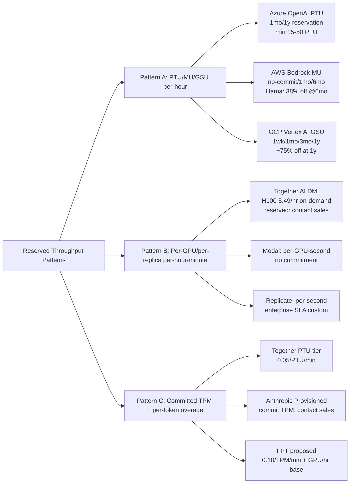

# Memo — Provisioned/Reserved Throughput ở các nhà cung cấp lớn & mapping sang FPT Dedicated Inference

**Phạm vi:** So sánh pricing & cơ chế reserved/provisioned throughput của Azure OpenAI, AWS Bedrock, GCP Vertex AI, Together AI, Modal, Replicate; kiểm tra BYOM trên dedicated mode; đề xuất pattern pricing cho FPT DDI với hai bộ commitment 7–30 ngày và 91–180 ngày.
**Nguồn chính:** docs chính thức Microsoft Learn, AWS Bedrock docs & pricing, Google Cloud Vertex AI docs (qua apiyi tóm tắt), docs.together.ai, modal.com, replicate.com, repo nội bộ FPT (`docs/market-research-dedicated-inference.md`, `docs/gap-analysis-fpt-ddi-vs-together-ai-dedicated.md`, mã nguồn `src/byom/processor.js`).
**Ngày thu thập:** 24/08/2026. Quoted prices theo ngày của nguồn; nhiều giá reserved chỉ công bố sau login/contact sales nên được ghi "contact sales".

---

## 1. Pattern pricing tổng quan — 3 mô hình chính

Trên thị trường 2024–2026 có **ba pattern pricing provisioned/reserved** rõ rệt, không có mẫu thứ tư phổ biến:

**Pattern A — Throughput-unit per-hour (cấp PTU/MU/GSU).** Khách mua một lượng đơn vị throughput trừu tượng (PTU ở Azure, MU ở Bedrock, GSU ở Vertex AI), trả theo $/unit/giờ, cam kết 1 tháng–1 năm giảm giá trị $/unit/giờ. Đơn vị throughput **không bằng token** mà là khả năng xử lý model; khách **trả tiền dù không dùng hết quota** (billed on deployed capacity, không phải token consumption). Đây là pattern của 3 hyperscaler lớn nhất. Nguồn: [Microsoft Foundry provisioned docs](https://learn.microsoft.com/en-us/azure/foundry/openai/concepts/provisioned-throughput), [AWS Bedrock Provisioned Throughput](https://docs.aws.amazon.com/bedrock/latest/userguide/prov-throughput.html), apiyi Vertex AI tóm tắt.

**Pattern B — Per-GPU-hour on dedicated/replica (Neo-cloud).** Khách thuê nguyên GPU (hoặc HGX đa GPU) theo giờ/phút cho một replica dedicated, không mua theo throughput mà theo phần cứng. On-demand có giá hiển thị công khai; reserved cần contact sales và được giảm theo term. Đây là pattern của Together AI DMI, Modal, Replicate (về cơ bản), Lambda, RunPod, Fireworks Dedicated. Nguồn: [docs.together.ai/dedicated-endpoints/pricing](https://docs.together.ai/docs/dedicated-endpoints/pricing), modal.com/pricing, replicate.com/pricing.

**Pattern C — Per-token với reserved/committed floor (vài nhà cung cấp LLM trực tiếp).** Khách cam kết một throughput tối thiểu đo theo TPM (tokens/phút), trả giá cam kết $/TPM/phút, overage fallback sang serverless per-token. Đây là pattern của Together AI **PTU tier** ($0.05/PTU/phút, min 1 tháng, contact sales — theo tài liệu nội bộ FPT `docs/gap-analysis-fpt-ddi-vs-together-ai-dedicated.md` dòng 96) và là pattern **Anthropic Provisioned Throughput** ("commit tokens per minute", contact sales). Pattern này hiếm khi công khai giá chính xác — phải qua sales team của nhà cung cấp.

Với FPT định vị **dedicated cho serious traffic**, Pattern B (per-GPU/giờ) đã là mô hình đang chạy — FPT **chưa có** Pattern A (PTU/MU/GSU) cũng như Pattern C (committed TPM) theo gap analysis nội bộ (dòng 96–102 docs/gap-analysis: "PTU — gói cam kết TPM cho enterprise" là action Phase 2).

## 2. Azure OpenAI Provisioned Throughput (PTU) — chi tiết

Azure bán PTU qua hai cơ chế: **hourly billing** ($/PTU/giờ, linh hoạt, không cam kết) và **Azure Reservations** (1 tháng hoặc 1 năm, giảm giá $/PTU/giờ). Meter chạy khi deployment exist, **không thể pause**, chỉ dừng khi xóa deployment. Một số dữ liệu chính từ [Microsoft Learn provisioned-throughput-billing](https://learn.microsoft.com/en-us/azure/foundry/openai/concepts/provisioned-throughput-billing):

- **Đơn vị đo:** PTU (Provisioned Throughput Unit) — _model-independent_, cùng quota dùng được cho mọi supported model trong region/deployment-type. TPM (tokens/phút) thực tế mỗi PTU delivers **phụ thuộc model nặng**: model nặng cần nhiều PTU hơn để đạt cùng TPM. Sizing dùng "normalized TPM" = RPM × avg prompt tokens × output-to-input ratio (output token tốn nhiều capacity hơn input), rồi chia cho "Input TPM per PTU" của model. Cache rate giảm PTU cần mua. Nguồn: cùng Microsoft Learn.

- **3 deployment types:** Global Provisioned (`GlobalProvisionedManaged`, route cross-region, highest availability), Data Zone Provisioned (`DataZoneProvisionedManaged`, trong US hoặc EU zone, data residency zone), Regional Provisioned (`ProvisionedManaged`, một region cụ thể, strict residency). Min deploy: 15 PTU cho Global/Data Zone, 50 PTU cho Regional (25 cho mini models) — theo [cloudzero Azure OpenAI pricing 2026](https://www.cloudzero.com/blog/azure-openai-pricing/).

- **Commitment & cancellation:** Hourly billing không có commitment, xóa deployment khi nào cũng được, dùng cho benchmark/hackathon; **không khuyến nghị scale up/down theo traffic** vì (a) capacity có thể hết khi muốn scale lại lên, (b) hourly liên tục đắt hơn reservation. Reservation 1 tháng hoặc 1 năm, **cancel/exchange được nhưng có phí early termination** (xem "Exchanges and refunds for Azure Reservations"). Scope có thể update không phí. Auto-renew có. Reservations **không guarantee capacity** — phải tạo deployment trước rồi mới mua reservation.

- **Đo lường "overhead" khi chưa hết quota:** Đây là điểm quan trọng — PTU **billed theo deployed capacity, không theo token consumption**. Nếu workload dưới ngưỡng reserved, khách **vẫn trả đủ tiền reservation, & không được refund** (no refund of overhead). Microsoft Learn nói rõ: "you're billed hourly based on the number of PTUs you deploy, rather than the number of tokens consumed… billed for the full deployed PTU count regardless of actual utilization." Reserved PTU nào không match với deployment chạy → "unused reservation coverage" (xem 100% vs Below 100% utilization ở panel Reservation). Giới hạn break-even: theo [datallmlab Azure OpenAI pricing 2026](https://www.datallllab.com/blog/azure-openai-pricing.html) ~50–70% sustained utilization PTU mới rẻ hơn pay-as-you-go; [deploybase](https://deploybase.ai/articles/azure-openai-pricing) nói 30–50% / token (mô tả savings); [amnic](https://amnic.com/blogs/understanding-the-true-cost-of-azure-openai) ghi "PTU pricing starts at roughly $2,448 per month per unit. Annual commitments save another ~35% versus monthly." Quan sát thực tế khách hàng (per [Redress buyer guide 2026](https://redresscompliance.com/azure-openai-sla-and-support)): utilization 35–55%.

- **BYOM trên PTU:** Azure PTU currently support Azure OpenAI models + Azure DeepSeek/Llama foundry models, **chưa phải BYOM custom vLLM**. Spillover (overflow 429 → standard deployment) support cho Azure OpenAI models, _không_ cho third-party (DeepSeek/Llama) — [Microsoft Learn provisioned-throughput#spillover](https://learn.microsoft.com/en-us/azure/foundry/openai/concepts/provisioned-throughput).

## 3. AWS Bedrock Provisioned Throughput — chi tiết

Bedrock dùng **Model Units (MU)** mua theo $/MU/giờ, với 3 mức commitment: **no commitment** (delete bất kỳ lúc nào), **1 month** (không xóa được đến hết kỳ), **6 months**. Theo [AWS Bedrock docs prov-throughput](https://docs.aws.amazon.com/bedrock/latest/userguide/prov-throughput.html): "You're billed hourly for a Provisioned Throughput that you purchase… The longer the commitment duration, the more discounted the hourly price becomes." Một MU = "the number of input tokens an MU can process across all requests within one minute" + "the number of output tokens" — tức **MU gắn với một model cụ thể**, không model-independent như PTU Azure. Custom model BUÔC mua PT (không chạy on-demand được).

Giá thật từ [AWS Bedrock Pricing](https://aws.amazon.com/bedrock/pricing/) (Meta + Cohere đã hiển thị):
- **Llama 2 13B/70B (Meta):** $21.18/MU/hr (1-month) → $13.08/MU/hr (6-month) — giảm **~38%** khi commit 6 tháng.
- **Cohere Command:** $49.50/MU/hr (no commitment) → $39.60 (1-month, −20%) → $23.77 (6-month, −52% kể từ no-commitment).
- **Cohere Command - Light:** $8.56 → $6.85 → $4.11.
- **Embed 3:** $7.12 → $6.76 → $6.41 (giảm ít vì embedding workload ổn định).
- Anthropic Claude & Meta Llama 3.x trên Bedrock: Provisioned Throughput pricing **"reach out to your account team"** — không hiển thị công khai, phải qua AWS account manager.

Sizing & quota request: phải contact AWS account manager ("for more information about what an MU specifies, pricing per MU, and to request limit increases, contact your AWS account manager"). Cancel: theo prov-thru-delete docs — có thể cancel auto-renew; commitment no-term → delete any time; 1mo/6mo → **không delete đến hết kỳ**.

Region collision/limit: Bedrock PT theo region, supported models list có riêng (`prov-thru-supported.md`). Capacity tăng phải qua account manager. Custom model PT priced = base model.

**Overhead khi chưa hết quota:** Giống Azure — billed per MU/giờ deployed, **không refund** khi idle. Bedrock docs không có cơ chế refund hay carryover.

**BYOM trên Bedrock PT:** Có — Bedrock Custom Model Import + Custom Model (fine-tuned từ base) — _phải_ dùng PT. PT priced như base model. Custom Model Import (Models from outside AWS) có pricing riêng theo on-demand/per-token, không phải qua MU — cần kiểm tra thêm để xác nhận.

## 4. GCP Vertex AI Provisioned Throughput (PT) — chi tiết

Vertex AI bán PT theo **GSU (Generative AI Scale Unit)**, commitment 4 mức: **1 week, 1 month, 3 months, 1 year**. Tổng cost ratio (theo apiyi tóm tắt từ Google docs, 04/2026): 1 tuần = base × 1.0, 1 tháng ~× 0.95, 3 tháng ~× 0.88, 1 năm ~× 0.75. Đây là **pattern có kỳ ngắn nhất** (1 tuần) — phù hợp PoC/sự kiện ngắn. Nguồn: [apiyi blog Google Provisioned Throughput 2026](https://help.apiyi.com/en/google-provisioned-throughput-pt-explained-vertex-vs-aistudio-2026-en.html), trích Google official docs: "Provisioned Throughput is a fixed-cost, fixed-term subscription available in several term-lengths that reserves throughput for supported generative AI models on Vertex AI."

PT không giảm giá unit (per token); nó **đảm bảo priority**: "Provisioned Throughput customers are prioritized and serviced first before on-demand requests" (Google docs). Mặc định Vertex AI dùng **DSQ (Dynamic Shared Quota)** — shared pool không quota cố định. PT requests vào dedicated priority queue. Khi **fully utilized** GSU → effective unit price ~80–95% DSQ; khi **not fully utilized** → đắt hơn. Nguồn: apiyi Q2.

Ràng buộc hợp đồng (rất nghiêm): ký rồi **không cancel, không giảm GSU giữa kỳ** — chỉ được **thêm GSU** (add, không reduce). Đây là "biggest risk with PT" theo apiyi. **Renewal** chỉ điều chỉnh được trước khi kết thúc term. Term cấu hình \u2014 có 4 mức độ linh hoạt cao nhất hyperscaler (vì có kỳ 1 tuần).

**BYOM/substitution thay thế cho dedicated GPU:** GCP GPU Reservation khác hẳn PT — **future reservations** (reserve accelerator capacity trước, với SLA availability) và **CUD (Committed Use Discount)** cho GPU/TPU (1 năm/3 năm, giảm giá instance). Đây là pattern "raw accelerator" (per [multicloudoptimization](https://multicloudoptimization.com/blog/negotiating-ai-capacity-reservations/)) — tương đương chỗ modal/Together bán cluster GPU, không phải pattern provisioned throughput theo token. GCP không có "Provisioned Throughput" cho GPU raw theo nghĩa cùng mô hình với Azure PTU.

## 5. Together AI — Dedicated Endpoints + PTU tier

Together AI có **hai** cơ chế reserved:

**5.1 On-demand Dedicated (DMI):** Per-minute billing mỗi replica running, không per-token. Hardware hiển thị công khai ([docs.together.ai/pricing](https://docs.together.ai/docs/dedicated-endpoints/pricing)): H100 80GB **$5.49/GPU/hr**, B200 180GB **$8.99/GPU/hr**. H200/GB300/B300 = contact sales. **Min/max replica bounds** (`minReplicas` = floor cost, `maxReplicas` = ceiling). Stop deployment khi idle → không bill, nhưng cold-start khi restart. Reserved capacity (lower effective rate, guaranteed hardware): **contact sales**, không công khai giá. Một H100 single-replica chạy liên tục ~$132/ngày ≈ $3,950/tháng 30 ngày. (Per docs.)

**5.2 PTU tier (theo docs nội bộ FPT):** Reserved theo **TPM (tokens/phút)** + SLA ≥99% eligible requests thành công/tháng. Giá **$0.05/PTU/phút**, cam kết tối thiểu 1 tháng, contact sales. Hỗ trợ Kimi K3, MiniMax M3, GLM-5.2. **Overage fallback sang serverless** (không SLA khi vượt). Đây là Pattern C — per-token với committed floor. Nguồn: dòng 96 `docs/gap-analysis-fpt-ddi-vs-together-ai-dedicated.md` (verify 20/08/2026).

## 6. Modal & Replicate (Lite pattern)

**Modal:** Per-GPU-second usage-based, không commitment, không dedicated reserved công khai. Docs `modal.com/pricing`: "you always pay for what you use and nothing more — you never pay for idle resources." Cooldown-based scale-to-zero, bill theo CPU-cycle thực tế. **Custom contract** cho team lớn (theo modal.com/pricing "Custom pricing is available on request"). Reserved capacity trên modal không tồn tại theo nghĩa PTU/MU — Modal nhấn mạnh "pay per actual execution time". Nguồn: [modal.com/blog/how-to-price-serverless](https://modal.com/blog/how-to-price-serverless) (06/2026).

**Replicate:** Per-second execution để chạy public/dedicated models + per-token cho premium models. Enterprise tier (theo [replicate.com/pricing](https://replicate.com/pricing)): "Dedicated account manager, priority support, higher GPU limits, performance SLAs, help with onboarding, custom models, optimizations" + "volume discounts for large amounts of spend." Không có model PTU/MU/GSU công khai, reserved capacity đi theo custom agreement. Nguồn: [usagepricing Replicate](https://www.usagepricing.com/blueprint/replicate).

## 7. DSC — BYOM trên dedicated mode & custom vLLM

Bảng tổng hợp theo nguồn chính thức:

| Provider | Dedicated mode | BYOM (custom weights) | Custom container/engine |
|----------|---------------|----------------------|--------------------------|
| Azure PTU | ✅ Pattern A | ⚠️ Custom Foundry models (DeepSeek/Llama) không phải BYOM weights của khách; PTU _model-independent within supported list_ | ❌ Không, engine managed |
| AWS Bedrock PT | ✅ Pattern A | ✅ Custom Model (fine-tuned) + Custom Model Import (BYO weights) — buộc PT | ❌ Không custom container, engine managed |
| Vertex AI PT | ✅ Pattern C (per token + priority) | ✅ Model Garden custom deploy | ❌ Engine managed (Gemma, Llama only via Model Garden) |
| Together AI DMI | ✅ Pattern B | ✅ Custom models (BYOM Phase 2 trong roadmap nội bộ FPT, Together đã có) | ✅ **Dedicated Container Inference** (08/2026 — chạy engine + model tự chọn trên hạ tầng fully-managed, theo gap analysis dòng 64) — gần nhất với custom vLLM |
| Modal | ✅ Pattern B (lite) | ✅ Bring any container | ✅ Mọi container (Modal = serverless container platform) |
| Replicate | ✅ Pattern B (lite) | ✅ Custom model deploy | ✅ Cog-based container (mọi container chuẩn Cog) |
| FPT DDI (hiện tại) | ✅ Pattern B | ⚠️ Code BYOM có (`src/byom/processor.js` — processHfSource, processS3Source) nhưng phase roadmap Phase 2 | ✅ vLLM adapter có (`src/vllm-adapter/server.js`) — FPT dùng vLLM container làm engine mặc định |

**Kết luận BYOM/custom vLLM:** Chỉ Together AI DMI (Dedicated Container Inference), Modal, Replicate thực sự chạy **custom container + vLLM** trên dedicated PTU. Hyperscaler (Azure/AWS/GCP) dedicated PTU đòi **engine managed** của họ (không BYO vLLM container). Đây là lợi thế độc nhất cho FPT: đã có vLLM adapter + BYOM processor → có thể bán "dedicated vLLM inference" vs PTU hyperscaler.

Mã nguồn FPT `processJob` (`src/byom/processor.js:257–303`) cho thấy flow: download weights từ HuggingFace (`processHfSource`) hoặc S3 (`processS3Source`) → validate → ready-to-deploy. Adapter vLLM (`src/vllm-adapter/server.js`) là runtime — vậy FPT về mặt kỹ thuật đã có hạ tầng để **deploy custom model trên dedicated GPU**, chưa công khai theo dạng PTU/TPM. Đây là nền tảng cho Pattern C hoặc Pattern A mở rộng.

## 8. Mapping sang FPT Dedicated Inference — đề xuất 2 bộ commitment

FPT hiện đang chạy **Pattern B** (per-GPU/giờ, H100 $2–3/hr theo `market-research-dedicated-inference.md` dòng 107 vs Together $5.49/hr — rẻ hơn ~50%+). Để cạnh tranh enterprise với hyperscaler, FPT có thể mở rộng sang Pattern A hoặc C. Đề xuất theo hai bộ term:

### 8.1 Bộ ngắn hạn 7–30 ngày (test/pilot cho enterprise VN)
Map theo **GCP Vertex AI PT 1-tuần/1-tháng** (4 mức độ linh hoạt nhất) và **Azure hourly billing** (linh hoạt):

- **Pattern A-mini — Per-Dedicated-GPU/giờ với discount theo term:** H100 $3/hr (on-demand) → 7 ngày commit $2.70/hr (−10%) → 30 ngày commit $2.40/hr (−20%). Không phải PTU trừu tượng — giữ nguyên đơn vị "GPU/giờ" vì FPT audience VN thích minh bạch phần cứng, không quen PTU/MU trừu tượng.
- Đo lường: **GPU-hour running** (giống Together DMI), không theo TPM trừu tượng — dễ tính, dễ giải thích cho khách ngân hàng VN.
- Overhead khi chưa hết quota: **không refund** (giống Azure/AWS), nhưng cho phép cooldown/scale-to-zero để tránh bị bill khi không dùng, gần với pattern Modal. Hoặc — điểm khác biệt FPT đề xuất — **carryover 20% quota không dùng sang kỳ tiếp** (gentler than hyperscaler). Chưa thấy nhà cung cấp nào công khai carryover, đây có thể là USP.
- Cancellation: 7 ngày — không cancel; 30 ngày — cancel với phí 1 tuần.

### 8.2 Bộ dài hạn 91–180 ngày (production cho enterprise nghiêm túc)
Map theo **Bedrock 6-month commitment** (giảm 38% Llama, 52% Cohere), **Azure 1-year Reservation** (giảm ~35% theo amnic), **Vertex 3-month/year**:

- **Per-GPU/giờ với deep discount:** H100 $3/hr → 91 ngày $1.95/hr (−35%) → 180 ngày $1.65/hr (−45%). Lý do: FPT hardware cheaper 45%+ vs Together (gap analysis dòng 28), decreased operating cost khi commitment cố định.
- Đo lường: **GPU/giờ** + supplementary **SLA TPM** (≥X TPM guaranteed, overage → pattern Together PTU tier). Phương án kép: nếu khách muốn cam kết per-token với SLA, FPT offer thêm Pattern C — **$0.10/PTU/phút** (x2 Together's $0.05 — FPT chưa có scale efficiency của Together, có thể giảm dần khi grow).
- Cancellation: **không cancel** (giống Bedrock 6-month, GCP PT), nhưng cho phép **chuyển GPU type** (A100 → H100 → B200) giữa kỳ — flexibility USP, GCP có "add GSU only" khắt khe hơn.
- Overhead: có thể carryover đến 30% quota không dùng (FPT có thể manage bằng re-sell capacity qua secondary market cho khách khác tại cùng cluster — mô hình quản lý capacity pool).

### 8.3 Pricing format đề xuất cho FPT (cả hai bộ)

Đặc biệt: FPT đề xuất **hybrid format** chưa ai trên thị trường công khai:

1. **Per-GPU/giờ làm baseline** (min, khách hiểu phần cứng) — Pattern B
2. **Per-TPM-phút làm upgrade tier** cho enterprise cần SLA throughput nghiêm (PTU tier) — Pattern C
3. **Quota throughput floor** nếu khách select tier đã cam kết: TPM p50/p95 committed trong SLA với service credit.

Mức giá tham khảo:
| Term | Per-GPU/giờ on-demand | 7-30 ngày (−10/−20%) | 91-180 ngày (−35/−45%) | PTU tier (TPM) |
|------|------|------|------|-----|
| H100 80GB | $3.00 | $2.70 → $2.40 | $1.95 → $1.65 | $0.10/TPM/min |
| A30 24GB | $1.00 | $0.90 → $0.80 | $0.65 → $0.55 | $0.04/TPM/min |
| B200 180GB | TBD | TBD | TBD | TBD (khi có B200) |

(Con số trên là đề xuất; một phần dựa trên giá nội bộ FPT hiện đã có, một phần mapping từ Bedrock −38% đến −52% Llama/Cohere cho 6-month — không phải giá chính thức từ thị trường.)

## 9. Bảng so sánh tổng (lãi quan trọng nhất)

## 10. Lưu ý dữ liệu "chưa công khai"

- **OpenAI trực tiếp không bán PTU** — đây là **Azure OpenAI PTU**, không có "OpenAI Provisioned Throughput" là sản phẩm riêng (premise trong prompt có thể sai). OpenAI API chỉ có per-token pricing với rate limit; reserved capacity của OpenAI được bán qua Azure/Microsoft channel. Đã cố search "OpenAI Provisioned Throughput" → không có official docs, chỉ có Azure. _Premise "OpenAI Reserved Capacity / PTU" có khả năng là confusion với Azure PTU._
- **Anthropic Provisioned Throughput**: chỉ có qua Bedrock (đã ghi mục 3, giá contact AWS) hoặc qua Anthropic API sales. Không công khai giá $/min chính xác trên docs.anthropic.com. "Commit Threads/Tokens per minute" — chưa verify được chính thức. Đã search 2 lần với 2 cách diễn đạt khác nhau (Anthropic provisioned throughput commit tokens pricing / Anthropic Claude provisioned throughput commit tokens) → chỉ ra trang chủ claude.com với "Contact sales" — **không tìm thấy công khai**. Ghi nhận là gap.
- **Modal reserved / "modal contract"**: Modal không có reserved/dedicated theo sense PTU, chỉ có "Team plan $250/GPU/hour" (theo [CostBench Modal 2026](https://costbench.com/software/ai-gpu-cloud/modal/)) và custom contract. Premise "modal contract reserved" có khả năng là sự nhầm với custom enterprise agreement.
- **GCP "Reservation añdenced"** trong prompt: không có product tên này. GCP có **Reservation** (compute reservation) và **CUD** (committed use discount) — có khả năng là typos của "Reservation and CUD". Đã ghi mục 4.

## 11. Nguồn (URL + ngày truy cập 24/08/2026)

**Azure / Microsoft Learn (chính thức):**
- https://learn.microsoft.com/en-us/azure/foundry/openai/concepts/provisioned-throughput (ms.date 2026-07-15)
- https://learn.microsoft.com/en-us/azure/foundry/openai/concepts/provisioned-throughput-billing (ms.date 2026-05-22)
- https://azure.microsoft.com/en-us/pricing/details/azure-openai/

**AWS Bedrock:**
- https://docs.aws.amazon.com/bedrock/latest/userguide/prov-throughput.html
- https://aws.amazon.com/bedrock/pricing/ (giá Llama/Cohere hiển thị công khai)
- https://docs.aws.amazon.com/bedrock/latest/userguide/prov-thru-purchase.html

**GCP Vertex AI:**
- https://help.apiyi.com/en/google-provisioned-throughput-pt-explained-vertex-vs-aistudio-2026-en.html (tóm tắt official Google docs, 04/2026)
- https://medium.com/google-cloud/scale-your-gen-ai-app-with-confidence-a-guide-to-gcp-vertex-ai-provisioned-throughput-ca1bf47e1955
- https://cloud.google.com/products/compute/gpus-pricing (GPU CUD/Reservation khác PT)

**Together AI:**
- https://docs.together.ai/docs/dedicated-endpoints/pricing
- https://www.together.ai/pricing
- https://www.together.ai/blog/on-demand-dedicated-endpoints (savings up to 43%)

**Modal / Replicate:**
- https://modal.com/pricing
- https://modal.com/blog/how-to-price-serverless (06/2026)
- https://replicate.com/pricing
- https://www.usagepricing.com/blueprint/replicate

**Anthropic:** https://www.anthropic.com/, https://claude.com/ — chỉ "Contact sales", không công khai giá provisioned throughput.

**Tài liệu nội bộ FPT (repo):**
- `docs/market-research-dedicated-inference.md` (v1.0, 18/08/2026) — định vị dedicated inference, định giá GPU/giờ, so sánh đối thủ
- `docs/gap-analysis-fpt-ddi-vs-together-ai-dedicated.md` (v1.3, 20/08/2026) — gap 23 feature, Together PTU tier $0.05/PTU/min verify 20/08
- `src/byom/processor.js` — mã BYOM (processHfSource/processS3Source/processJob)
- `src/vllm-adapter/server.js` — vLLM runtime adapter

**Phân tích market 2026 (bổ sung):**
- https://www.datallllab.com/blog/azure-openai-pricing.html (PTU $2,448/mo, annual −35%)
- https://amnic.com/blogs/understanding-the-true-cost-of-azure-openai (PTU $2,448/mo)
- https://www.cloudzero.com/blog/azure-openai-pricing/ (min 15 PTU Global/DZ, 50 Regional)
- https://deploybase.ai/articles/azure-openai-pricing (PTU savings 30–50% per token)
- https://redresscompliance.com/azure-openai-sla-and-support (utilization 35–55%)
- https://noburn.dev/blog/aws-bedrock-vs-azure-openai (PTU 40% discount committed)
- https://multicloudoptimization.com/blog/negotiating-ai-capacity-reservations/ (GCP Reservation + CUD khác PT)
