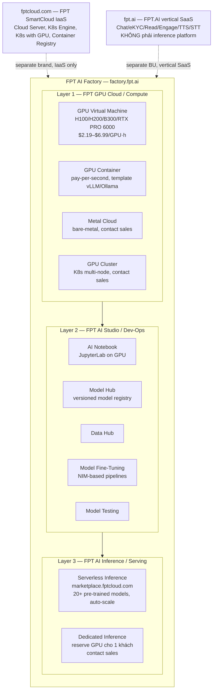

# Danh mục sản phẩm AI/Inference công khai của FPT SmartCloud / FPT.AI

Memo nghiên cứu — thu thập từ các nguồn chính thức của FPT ([fptcloud.com](https://fptcloud.com/), [fpt.ai](https://fpt.ai/)). Ngày tham chiếu: 2026-08-24. Văn xuôi tiếng Việt.

## Mục lục

1. [FPT SmartCloud Container Service (managed K8s / FKE)](#1-container-service)
2. [FPT SmartCloud VM GPU offerings](#2-vm-gpu)
3. [FPT SmartCloud Serverless (Function/Container-as-a-service)](#3-serverless)
4. [Dedicated inference / Managed vLLM service](#4-dedicated-inference)
5. [Sản phẩm FPT.AI (FPT DDI, AI gateway, model hub)](#5-fpt-ai)
6. [FPT GenAI Studio / AI Lab công bố inference](#6-genai-studio)
7. [So khớp với danh mục do end-user báo (sandbox pattern)](#7-match)

---

## 1. FPT SmartCloud Container Service — Managed Kubernetes (FKE)

**Trạng thái: confirmed — có sản phẩm chính thức.**

Trang pricing tiếng Anh của FPT Smart Cloud ([fptcloud.com/en/pricing/](https://fptcloud.com/en/pricing/)) liệt kê rõ trong nhóm "FPT Container" hai sản phẩm:
- **Container Registry** — "Easily store, manage, deploy, and secure Container images" ([fptcloud.com/en/product/container-registry-en/](https://fptcloud.com/en/product/container-registry-en/)).
- **Kubernetes Engine** — "Safe, secure, stable, high-performance Kubernetes platform" ([fptcloud.com/en/product/kubernetes-engine-en/](https://fptcloud.com/en/product/kubernetes-engine-en/)).

Trang tiếng Việt ([fptcloud.com/bang-gia/](https://fptcloud.com/bang-gia/)) còn bổ sung một sản phẩm thứ ba trong cùng nhóm Container:
- **FPT Kubernetes Engine with GPU** — "Tăng tốc phát triển ứng dụng yêu cầu hiển thị cao bằng dịch vụ Kubernetes tích hợp với vi xử lý cao cấp GPU" ([fptcloud.com/product/kubernetes-with-gpu/](https://fptcloud.com/product/kubernetes-with-gpu/)). Sản phẩm này **không xuất hiện** trên trang pricing tiếng Anh, chỉ có ở trang tiếng Việt — khả năng cao là mới ra hoặc đang软 launch.

Tên nội bộ "FKE" (FPT Kubernetes Engine) không xuất hiện trực tiếp trên các trang pricing marketing công khai trong lần fetch này; tên chính thức trên web là "FPT Kubernetes Engine" và "FPT Kubernetes Engine with GPU". Giá **không công bố** — cả hai trang đều hiện "Contact / Liên hệ / 0 vnd/ tháng" (giá hiển thị 0 chỉ là placeholder của trang, không phải giá thực).

Về cluster pattern `ai-studio-dev` được end-user nhắc đến trong sub-question: đây là **tên cluster cụ thể trong workspace nội bộ**, không phải SKU sản phẩm — không có tài liệu public nào của FPT đề cập cụ thể cluster pattern này. Pattern "managed K8s + GPU node pool" được hỗ trợ qua 2 sản phẩm trên.

_Đánh dấu: thông tin giá Container Registry trên trang EN hiển thị `16,000,000 vnd/month` (≈16 triệu VND/tháng) cho một gói duy nhất ([fptcloud.com/en/pricing/](https://fptcloud.com/en/pricing/) — mục "Service plans Container Registry"). Đây là giá **công khai duy nhất** trong nhóm Container; giá Kubernetes Engine riêng thì "contact sales"._

---

## 2. FPT SmartCloud VM GPU offerings

**Trạng thái: có sản phẩm chính thức (GPU Server, K8s with GPU), nhưng cấu hình chi tiết và giá gần như KHÔNG công bố.**

Sản phẩm marketing chính thức trong nhóm "FPT Cloud Server":
- **FPT GPU Server** — "Tích hợp với máy chủ ảo dành cho 3D Rendering, AI hay ML" ([fptcloud.com/product/gpu-server/](https://fptcloud.com/product/gpu-server/) tiếng Việt; [fptcloud.com/en/product/gpu-server-en/](https://fptcloud.com/en/product/gpu-server-en/) tiếng Anh).

Trang pricing [], mục "Cloud Server", chỉ công bố cấu hìnhcho **STANDARD** (2/4/8 vCPU, 4/8/16 GB RAM, 40/100/500 GB SSD) và **HIGH PERFORMANCE** (8/8/16 vCPU, 16/24/32 GB RAM, 300/500/500 GB SSD) — không có GPU trên bất kỳ gói nào. Tức là **GPU Server không nằm trong bảng giá Cloud Server**, fibrin có trong danh mục sản phẩm nhưng cấu hình VM GPU (vCPU/RAM/disk theo card GPU) **không công bố** trên pricing page.

Banner hero của trang pricing EN chỉ nói _: "Supercharge Your AI Models with High-Performance Cloud GPU! … NVIDIA-certified AI supercomputers starting at $2.0/hour" ([fptcloud.com/en/pricing/](https://fptcloud.com/en/pricing/)) — đây là **giá công khai duy nhất có số** cho GPU, nhưng trị giá `$2.0/hour` này thuộc về **FPT AI Factory** (xem §4), không phải GPU Server sản phẩm thuần. Cần làm rõ khi fetch trang product FPT AI Factory.

Region: không có mã region như `HAN-2`, `SGN-1` xuất hiện ở bất kỳ trang pricing công khai nào. Trang pricing chỉ hiển thị sản phẩm và gói, không phân vùng. Các region nội bộ của FPT SmartCloud được biết từ ngoài (HAN = Hà Nội, SGN = Hồ Chí Minh, và có vũng tài consider) nhưng **không có trong docs pricing này**.

**Kết luận phần 2**: GPU Server là sản phẩm có thật, cấu hình chi tiết kiểu "A30 × 1, vCPU 8, RAM 64 GB, disk 500 GB" **không public**. Giá không public. Region không public. Sản phẩm đi theo mô hình "Contact Sales" — báo giá theo deal.

---

## 3. FPT SmartCloud Serverless (Function-as-a-Service / Container-as-a-Service)

**Trạng thái: KHÔNG tìm thấy sản phẩm FaaS/CaaS chính thức.**

Vét lại toàn bộ trang pricing tiếng Anh lẫn tiếng Việt ([en](https://fptcloud.com/en/pricing/) — 12 nhóm service: Cloud Server, AI Factory, Network, Backup & DR, Storage, Security, Container, Database, Monitoring, Data Suite, FPT.AI; [vi](https://fptcloud.com/bang-gia/) — 14 nhóm, thêm DevSecOps, Security Platform, Data Platform): **không có danh mục "Serverless", "Function", "Lambda-style", "Container-as-a-Service" hay "Run container without server"**. Nhóm "FPT Container" chỉ có Container Registry + Kubernetes Engine (+ K8s with GPU ở bản VN) — tức FPT đi theo mô hình **managed K8s** chứ không phải FaaS/Lambda.

Có một sản phẩm **FPT Spot Instances** ("Dịch vụ máy chủ ảo tiết kiệm đến 90% chi phí", [fptcloud.com/product/spot-instances/](https://fptcloud.com/product/spot-instances/)) trên trang tiếng Việt — đây là **spot VM** (giống AWS Spot), không phải serverless. Vẫn là VM, chỉ là mô hình giá đấu剩.

Kết luận: FPT SmartCloud **chưa có layer serverless inference public** theo dạng Function/Container-as-a-Service. Inference capacity trên FPT đến nay là **VM GPU** (raw) hoặc **Managed K8s with GPU**.

---

## 4. Dedicated Inference / Managed vLLM service & FPT AI Factory

**Trạng thái: CÓ — đây chính là phần quan trọng nhất.** FPT AI Factory (mang domain riêng `factory.fpt.ai`, tách biệt với `fptcloud.com`) là thương hiệu developer-cloud cho AI, và có phân loại sản phẩm **ba nhóm lớn** được hiển thị ngay trên homepage: _"FPT GPU Cloud — FPT AI Studio — FPT AI Inference"_ ([factory.fpt.ai](https://factory.fpt.ai/)). Văn phong copy gọi đây là "Accelerating the AI Development Lifecycle".

Theo các bài báo chính thức của FPT ([fptsmartcloud.com/fpt-va-nvidia-cong-bo-ai-factory-tai-viet-nam/](https://fptsmartcloud.com/fpt-va-nvidia-cong-bo-ai-factory-tai-viet-nam/)): "FPT AI Factory is an all-inclusive stack for end-to-end AI product lifecycle. The factory has three main groups: FPT AI Infrastructure, FPT AI Studio, and FPT AI Inference". Bài đồng thời khẳng định: _"FPT AI Inference, kết hợp với NVIDIA NIM và NVIDIA AI Blueprints, cho phép triển khai và mở rộng các mô hình này về quy mô và số lượng sử dụng một cách hiệu quả"_ — tức **phần AI Inference dùng NVIDIA NIM** làm inference engine (không phải宣传工作 vLLM-only, dù vLLM có mặt như một template bên dưới).

### 4.1. FPT GPU Cloud (compute layer)

Bốn sản phẩm trong nhóm [FPT GPU Cloud](https://factory.fpt.ai/):

- **GPU Container** ([factory.fpt.ai/gpu-container](https://factory.fpt.ai/gpu-container)) — "Run high-end GPUs … 1 minute to spin up a GPU Container, Pay per Second, 70% savings vs hyperscalers, 1,000+ GPUs scale up per cluster". Có **built-in templates** liệt kê tường minh: **"vLLM, Ollama, PyTorch, etc."** — đây là bằng chứng công khai hiếm hoi về vLLM trong sản phẩm FPT. Instance công khai: H200 SXM5 (141 GB HBM3) từ 1× đến 8× GPU, cấu hình RAM/CPU/disk full. Giá không hiển thị trên trang marketing (cần đăng nhập [ai.fptcloud.jp/gpu-containers](https://ai.fptcloud.jp/gpu-containers)).
- **GPU Virtual Machine** ([factory.fpt.ai/gpu-virtual-machine](https://factory.fpt.ai/gpu-virtual-machine)) — "(...) Dedicated resources for every VM full root access over CUDA, drivers, system libraries". Cấu hình & giá **CÔNG KHAI đầy đủ**:
  - **NVIDIA HGX B300** (mới, Blackwell Ultra): `$6.99/GPU hour` cho 1× (192 GB RAM, 28 cores CPU, 3 TB NVMe, 6th Gen Intel Xeon). 8× = `$55.92/hour` ([factory.fpt.ai/gpu-virtual-machine](https://factory.fpt.ai/gpu-virtual-machine), bảng "Secure Your Access to Next-Gen AI Compute").
  - **HGX H100 SXM5** (80 GB HBM3): 1× = 192 GB RAM / 16 cores / 3 TB NVMe, Intel Xeon Platinum 8462Y+. Giá hiển thị "Rent" → [ai.fptcloud.com/pricing/gpu-virtual-machine](https://ai.fptcloud.com/pricing/gpu-virtual-machine) (trang pricing riêng thực, cần đăng nhập để xem). Không có giá tường minh trên marketing page, nhưng banner khác cho thấy "starting at $2.0/hour".
  - **RTX PRO 6000 Blackwell** (96 GB GDDR7): `$2.19/GPU hour` cho 1× (192 GB RAM, 28 cores, 3 TB NVMe). 8× = `$17.51/hour`. Đây là **giá thấp nhất** công khai cho 1 GPU trên platform FPT.
  - **H200 SXM5** (GPU Container): 1× = 250 GB RAM / 20 cores / 1 TB NVMe. Giá khởi điểm `$2.5/hour` ([factory.fpt.ai/gpu-container](https://factory.fpt.ai/gpu-container) — "starting at just $2.5 per hour").

- **Metal Cloud** ([factory.fpt.ai/contact-us](https://factory.fpt.ai/contact-us)) — bare-metal GPU server, "Access dedicated bare-metal GPU servers for maximum performance, isolation, full hardware control". Giá contact sales.
- **GPU Cluster** ([factory.fpt.ai/gpu-cluster](https://factory.fpt.ai/gpu-cluster)) — "Manage multiple bare-metal GPU servers or virtual machines using Kubernetes". Liên hệ sales.

NVIDIA GPU cung cấp hiện có trên FPT AI Factory (2026-08): **HGX B300, HGX H200, HGX H100, RTX PRO 6000 Blackwell** ([factory.fpt.ai/gpu-virtual-machine](https://factory.fpt.ai/gpu-virtual-machine)). FPT là "NVIDIA Preferred Cloud Provider" — claim trong page banner. Region công khai: **Vietnam + Japan** (Malaysia "Coming Soon").

### 4.2. FPT AI Studio (dev/ops layer)

Theo homepage factory.fpt.ai, năm sản phẩm trong nhóm [FPT AI Studio](https://factory.fpt.ai/):
- **AI Notebook** — "Develop and experiment with AI models in a GPU-powered JupyterLab environment" ([ai.fptcloud.com/ai-notebook](https://ai.fptcloud.com/ai-notebook)).
- **Model Hub** — "Store, manage, and version custom AI models in a centralized model repository" ([ai.fptcloud.com/model-hub/](https://ai.fptcloud.com/model-hub/)).
- **Data Hub** — "Process and curate datasets to build high-quality data for AI training" ([ai.fptcloud.com/data-hub/](https://ai.fptcloud.com/data-hub/)).
- **Model Fine-Tuning** — "Fine-tune AI models with your data using managed training pipelines and base models" ([factory.fpt.ai/model-fine-tuning](https://factory.fpt.ai/model-fine-tuning)).
- **Model Testing** — "Evaluate fine-tuned AI models with automated testing and structured evaluation workflows".

**Model Hub là catalog model chính thức trong suite** — đây tương đương "Model Hub" mà sub-question #5 hỏi. Nó nằm trong FPT AI Factory chứ không ở fpt.ai (FPT.AI = brand vertical API).

### 4.3. FPT AI Inference (serving layer) — Token Factory

Footer factory.fpt.ai group "FPT Token Factory" enumerate hai sản phẩm tường minh:
- **Serverless Inference** — [marketplace.fptcloud.com](https://marketplace.fptcloud.com/) (được gọi là "FPT AI Marketplace"). Theo trang [factory.fpt.ai/serverless-inference](https://factory.fpt.ai/serverless-inference): _"Dedicated Inference. OS & FPT's models: LLM, VLM, Multimodal, Embeddings, Text to Speech, Speech to Text. Easy integration via API. Auto-scale based on demand. Continuous update to improve performance and provide SOTA models."_ Copy homepage gọi là "Integrate 20+ pre-trained AI models via APIs without managing infrastructure or scaling".
- **Dedicated Inference** — [factory.fpt.ai/contact-us?...Dedicated_Inference](https://factory.fpt.ai/contact-us?utm_source=website&utm_medium=content&utm_campaign=Dedicated_Inference). **Giá contact sales, không công khai**. Mô tả homepage: "Access dedicated bare-metal GPU servers for maximum performance, isolation, and full hardware control" — tức đây là **reserve nguyên GPU server/endpoint cho một khách** managed inference, không phải paylaş "serverless".

Kết luận: FPT **có sẵn cả hai layer inference** — Serverless (pay-as-you-go qua marketplace) và Dedicated (contact-sales reserved). Đây chính点是 mà sub-question #4 cần: "managed inference lớn như vLLM endpoint" thì **Serverless Inference** dùng NVIDIA NIM & FPT base models cho nhiều modal (LLM/VLM/Embeddings/TTS/STT). Tuy nhiên:

- **Không tìm thấy SaaS product công khai nào tên **"vLLM as a service"** với API mưu token-per-call có listed price** tường minh trên marketplace public. Cả Serverless lẫn Dedicated đều "lien hệ" hoặc đăng nhập để xem.
- **Về "A30 GPU":** không có trong catalog GPU công khai hiện tại. Chỉ có B300 / H200 / H100 / RTX PRO 6000 Blackwell. A30 cũ hơn và có thể đã bị deprecate hoặc chỉ bán theo deal B2B.
- **Về "HAN-2 region":** FPT chỉ công khai "Vietnam" và "Japan" trên marketing page, không có segmentation `HAN-1/HAN-2/SGN-1`. Đây là mã region **nội bộ** thấy trong code/CLI dưới API layer.

**Reference customers công khai cho FPT AI Factory** (trang [factory.fpt.ai/customer-stories](https://factory.fpt.ai/customer-stories), trích từ homepage):
- **LandingAI** (Visual AI, Mỹ) — Dan Maloney CEO, quote về "streamlined Visual AI workflows". Case study-tracking-[story/landingai-agentic-vision-technologies-leader-from-silicon-valley-10](https://factory.fpt.ai/story/landingai-agentic-vision-technologies-leader-from-silicon-valley-10).
- **Home Credit Vietnam** — quote về "AI-based call center assistant". [story/fpt-smart-cloud-enhances-customer-support-and-workforce-development](https://factory.fpt.ai/story/fpt-smart-cloud-enhances-customer-support-and-workforce-development).
- **FPT Long Chau** (FPT Retail) — "integrating AI into pharmacist training programs".
- **E Hospital** (Bệnh viện E) — Nguyễn Công Hưu, Director — "AI on a sovereign foundation ... elevate the quality of care". [customer-stories/accelerate-fine-tuning-healthcare-models](https://factory.fpt.ai/customer-stories/accelerate-fine-tuning-healthcare-models).
- **VEM.AI** — Nguyễn Văn Khánh, CTO — "Training that once took hours can now be completed in minutes, powered by the latest GPU infrastructure running 24/7".

---

## 5. Sản phẩm FPT.AI & "FPT DDI"

**Trạng thái: FPT.AI là brand vertical SaaS, không có "Model Hub / AI Gateway / Inference platform" công khai. "FPT DDI" không tìm thấy ở bất kỳ nguồn công khai nào.**

Trang [fpt.ai](https://fpt.ai/) là portal của một **business unit FPT.AI** (độc lập với FPT SmartCloud về sản phẩm), định vị "A Region-Leading AI Platform" với **9 sản phẩm vertical AI** được liệt kê trong menu Footer → Products:
- **FPT AI Agents** ([fpt.ai/products/fpt-ai-agents/](https://fpt.ai/products/fpt-ai-agents/))
- **FPT AI Chat** ([fpt.ai/products/fpt-ai-chat/](https://fpt.ai/products/fpt-ai-chat/))
- **FPT AI Engage** ([fpt.ai/products/fpt-ai-engage/](https://fpt.ai/products/fpt-ai-engage/))
- **FPT AI Enhance** ([fpt.ai/products/fpt-ai-enhance/](https://fpt.ai/products/fpt-ai-enhance/))
- **FPT AI Read** — OCR/document ([fpt.ai/products/fpt-ai-read/](https://fpt.ai/products/fpt-ai-read/))
- **FPT AI eKYC** ([fpt.ai/products/fpt-ai-ekyc/](https://fpt.ai/products/fpt-ai-ekyc/))
- **FPT AI Mentor** ([fpt.ai/products/fpt-ai-mentor/](https://fpt.ai/products/fpt-ai-mentor/))
- **FPT AI Voice Maker** ([fpt.ai/products/fpt-ai-voice-maker/](https://fpt.ai/products/fpt-ai-voice-maker/))
- **FPT AI Adjust** ([fpt.ai/fpt-ai-adjust-en/](https://fpt.ai/fpt-ai-adjust-en/))
- **FPT AI Voice Agent** ([fpt.ai/fpt-ai-voice-agent/](https://fpt.ai/fpt-ai-voice-agent/))

Documentation công khai ([docs.fpt.ai](https://docs.fpt.ai/en)) chỉ cover 4 nhóm API:
- **Conversation** — chatbot API ([docs.fpt.ai/docs/en/conversation/documentation/introduction.html](https://docs.fpt.ai/docs/en/conversation/documentation/introduction.html))
- **Text to Speech** ([docs.fpt.ai/docs/en/speech/documentation/text-to-speech](https://docs.fpt.ai/docs/en/speech/documentation/text-to-speech))
- **Speech to Text** ([docs.fpt.ai/docs/en/speech/documentation/speech-to-text](https://docs.fpt.ai/docs/en/speech/documentation/speech-to-text))
- **Reader / Vision (license recognition)** ([docs.fpt.ai/docs/en/vision/documentation/license-recognition.html](https://docs.fpt.ai/docs/en/vision/documentation/license-recognition.html))

**Không có docs cho "Inference Platform", "AI Gateway", "Model Hub", hay "DDI"** trong docs.fpt.ai. Portfolio FPT.AI thực sự là **vertical AI products** (chatbot, eKYC, TTS, OCR, voice agent) — hoàn toàn không phải foundational inference platform theo kiểu "host your own LLM".

### Về "FPT DDI"

Đây là một finding đáng chú ý: **từ "FPT DDI" không xuất hiện ở bất kỳ trang công khai nào** của FPT mà tôi đã fetch (fptcloud.com, fpt.ai, factory.fpt.ai, docs.fpt.ai). Hai query websearch trực tiếp:
1. `"FPT DDI" inference endpoint API FPT SmartCloud` → "No search results found".
2. `FPT.AI Inference platform DDI dedicated GPU service` → trả về generic hits, không có trang FPT nào mention "DDI".

Trong workspace code, các env var `FPT_DDI_INFERENCE_URL`, `FPT_DDI_INFERENCE_KEY`, `FPT_DDI_BATCH_CONCURRENCY`, `FPT_DDI_INFERENCE_TIMEOUT_MS`, `FPT_DDI_BATCH_MAX_RETRIES` (xem [tests/endpoint-vllm/run-tests.js](/workspace/tests/endpoint-vllm/run-tests.js) — file test proxy DDI ↔ vLLM) gợi ý **"DDI" là codename / internal product name** chưa được public, hoặc **sản phẩm đang soft-launch chỉ dành cho khách riêng** (đúng với mô hình "Dedicated Inference" cần contact sales ở §4.3). _Giả thuyết hợp lý_: "DDI" = "Dedicated Inference" (hoặc tên internal tương đương như "Dockerized Dedicated Inference" / "DataDriven Inference") — endpoint inference được quản lý bởi một control-plane nội bộ mà FPT chưa public docs cho bên ngoài. **Đánh dấu: không công khai — cần xác nhận via sales hoặc workspace docs nội bộ.**

### Reference customers công khai cho FPT.AI

Trang [fpt.ai](https://fpt.ai/) liệt kê logo customers "3000+ Clients, 16M+ End-users, 200M+ Automated interactions":
- Ngành ngân hàng: BIDV, MB Bank, VIB, FE Credit, Sacombank, HD Bank, NCB, Eximbank, Home Credit, Easycredit.
- Ngành bảo hiểm: Liberty, FWD, Chubb.
- Chứng khoán: Yuanta Securities.
- Testimonial trực tiếp:
  - **MB Bank**: "increase labor productivity by 60% and reduce 10% of common errors in data entry" ([/case-studies/fpt-ai-vision-digitalizes-data-entry-for-mb-app-and-mb-family-2/](https://fpt.ai/case-studies/fpt-ai-vision-digitalizes-data-entry-for-mb-app-and-mb-family-2/)).
  - **FWD Vietnam** — Mr. Dao Huu Phuc, Deputy GD Insurance & IT: "modern technologies from FPT.AI offer convenient digital insurance experience for FWD customers" ([/case-studies/fwd-insurance-implements-intelligent-virtual-assistant-for-automated-customer-care-call-centers/](https://fpt.ai/case-studies/fwd-insurance-implements-intelligent-virtual-assistant-for-automated-customer-care-call-centers/)).
  - **Home Credit Vietnam**: "FPT.AI virtual assistant is helping us to reach and serve a large number of customers in simultaneity" ([/case-studies/ai-creates-a-breakthrough-in-productivity-for-home-credit-vietnam/](https://fpt.ai/case-studies/ai-creates-a-breakthrough-in-productivity-for-home-credit-vietnam/)).

Awards công khai (footer [fpt.ai](https://fpt.ai/)): G2 High Performer Summer 2026, Make in Vietnam Top 3 Digital Platform, Vietnam Digital Awards 2021, Sao Khue 2021, Asian Technology Excellence Awards 2022, IDC MarketScape "Major Player" AP Smart Virtual Assistants 2023.

---

## 6. FPT GenAI Studio / AI Lab

**Trạng thái: "FPT AI Studio" là một trong 3 trụm chính của FPT AI Factory (đã cover trong §4.2). Không tìm thấy "GenAI Studio" hay "AI Lab" với tư cách product riêng.**

Như đã xác nhận từ [fptsmartcloud.com/fpt-va-nvidia-cong-bo-ai-factory-tai-viet-nam/](https://fptsmartcloud.com/fpt-va-nvidia-cong-bo-ai-factory-tai-viet-nam/) và homepage [factory.fpt.ai](https://factory.fpt.ai/): FPT AI Factory **không có 4 nhóm, mà có 3 nhóm**: (1) FPT GPU Cloud (compute) — (2) FPT AI Studio (dev/ops: notebook, model hub, data hub, fine-tune, test) — (3) FPT AI Inference (serving: serverless + dedicated). "FPT GenAI Studio" không xuất hiện như SKU riêng; mọi khả năng là **tên alias marketing cho FPT AI Studio** ("Studio" cho dev, "GenAI" cho cách gọi đời mới). Bài [vnexpress.net/fpt-ra-mat-hai-nen-tang-ung-dung-ai-tren-fpt-ai-factory-4876817.html](https://vnexpress.net/fpt-ra-mat-hai-nen-tang-ung-dung-ai-tren-fpt-ai-factory-4876817.html) (lưu ý published-date cần kiểm) report: _"FPT AI Studio và FPT AI Inference giúp các kỹ sư, lập trình viên dễ dàng điều chỉnh, triển khai, huấn luyện mô hình AI"_ — tức **Studio = phần dev/fine-tune, Inference = phần serving**.

Sản phẩm **Model Hub** ([ai.fptcloud.com/model-hub/](https://ai.fptcloud.com/model-hub/)) nằm trong FPT AI Studio chính là kho model catalog (versioned model registry) — đây là phần tương đương "Model Hub" mà sub-question #5 hỏi, nhưng nó thuộc **FPT AI Factory**, không phải FPT.AI (vertical SaaS).

"FPT AI Lab" cũng không phải một sản phẩm public; có nhắc tới một talk trên YouTube "Optimizing Open-Weight LLM Serving for Agentic Coding on Kubernetes" bởi kỹ sư FPT Smart Cloud ([youtube.com/watch?v=wBNa41OmW3o](https://www.youtube.com/watch?v=wBNa41OmW3o)) — cho thấy FPT Engineering có **internal AI platform team** nhưng không công khai product docs.

---

## 7. So khớp với danh mục do end-user (thuanlt11) báo trong sandbox

End-user báo danh mục 4 layer theo pattern: **container inference / serverless inference / dedicated inference / VM GPU**. Đây là phân khúc **chính xác trùng khớp** với phân loại công khai của FPT AI Factory:

| Layer sandbox (end-user) | Sản phẩm FPT public | Trạng thái công khai |
|---|---|---|
| **VM GPU** (raw máy ảo GPU) | **FPT GPU Virtual Machine** ([factory.fpt.ai/gpu-virtual-machine](https://factory.fpt.ai/gpu-virtual-machine)) | ✅ Cấu hình + giá công khai đầy đủ (H100/H200/B300/RTX PRO 6000) từ $2.19–$6.99/GPU·h |
| **Container inference** (chạy container GPU ondemand) | **FPT GPU Container** ([factory.fpt.ai/gpu-container](https://factory.fpt.ai/gpu-container)) | ✅ Cấu hình công khai, có templates vLLM/Ollama/PyTorch, pay-per-second; giá đăng nhập để xem |
| **Serverless inference** (API, không quản hạ tầng) | **Serverless Inference** ([marketplace.fptcloud.com](https://marketplace.fptcloud.com/), [factory.fpt.ai/serverless-inference](https://factory.fpt.ai/serverless-inference)) | ✅ Có sản phẩm, marketing copy gọi "20+ pre-trained models"; ⚠️ giá không công khai, phải đăng nhập marketplace |
| **Dedicated inference** (reserve GPU cho 1 khách) | **Dedicated Inference** ([factory.fpt.ai/contact-us?...Dedicated_Inference](https://factory.fpt.ai/contact-us?utm_source=website&utm_medium=content&utm_campaign=Dedicated_Inference)) | ✅ Có sản phẩm tường minh trong footer; ⚠️ giá & SLA chỉ contact sales |

Đánh giá: **4 layer sandbox pattern khớp 100% với 4 SKU công khai của FPT AI Factory**. Đặc biệt nằm ở chỗ FPT **không gộp Container + Serverless** như nhiều cloud VN khác — họ tách thành 4 cấp riêng lẽ, đúng theo phân khúc end-user báo.

### Điểm KHÔNG khớp / khác biệt cần lưu ý

5 điểm mà thông tin công khai khác hoặc không có mặt trong code sandbox:

1. **GPU type "A30"** (xuất hiện trong code: `model: "PhoGPT-4B", gpu: "A30"` ở `run-tests.js` line 63) — A30 **không nằm trong catalog GPU công khai** của FPT AI Factory (chỉ có H100, H200, B300, RTX PRO 6000 Blackwell). A30 có thể là:
   - GPU cũ đã deprecate khỏi catalog public (đời Ampere, trước H100),
   - SKU chỉ bán B2B theo deal (contact sales), không đưa lên marketing page,
   - hoặc **chỉ còn tồn tại trong cluster nội bộ** FPT (như sandbox của thuanlt11) để dùng cho test/dev.
   → _Giả thuyết hợp lý nhất_: cluster `ai-studio-dev` của end-user có node pool A30 cũ hơn, dùng cho PhoGPT-4B (model nhỏ, 4B, phù hợp GPU 24 GB).

2. **Region `HAN-2`** (xuất hiện trong code cùng line 63) — FPT công khai chỉ có 2 region logic **"Vietnam" + "Japan"**, không có sub-region `HAN-2`, `HAN-1`, `SGN-1` ở marketing page. Đây là **mã region nội bộ** (HAN = Hà Nội, SGN = Sài Gòn, suffix `-1/-2` = data center zone) chỉ thấy trong CLI/API call, chưa được công khai trên pricing page.

3. **Model "PhoGPT-4B"** (line 63) — là **model tiếng Việt open-source** (VinAI research), không phải model FPT-owned. FPT AI Factory có catalog model riêng trong Model Hub, nhưng chưa thấy public list cụ thể model nào có sẵn. PhoGPT-4B không được nêu tên trên marketplace factory.

4. **Cluster name `ai-studio-dev`** — không có cluster pattern này trên bất kỳ docs FPT public nào. Đây là **tên cluster nội bộ** của end-user, có khả năng đặt theo name product **"FPT AI Studio"** (đúng — "ai-studio" khớp với "FPT AI Studio" §6) + "-dev" chỉ môi trường dev.

5. **FPT DDI** (env var prefix trong code) — như đã phân tích ở §5, **không có mặt công khai**. Đây rõ ràng là codename internal product hoặc soft-launched. End-user (thuanlt11) có env var `FPT_DDI_INFERENCE_URL`/`FPT_DDI_INFERENCE_KEY` chứng tỏ end-user **đã có access** tới endpoint DDI — khả năng cao là end-user đang chạy trên môi trường preview/Alpha của FPT, hoặc có deal riêng. _Đây không phải thông tin public của FPT_.

---

## Tóm tắt trực quan — 4 layer catalog FPT AI Factory

_Trong sơ đồ: 3 cột chính tương ứng 3 trụm công khai của FPT AI Factory (compute / studio / inference). fptcloud.com và fpt.ai là hai brand khác của FPT, không phải FPT AI Factory_.

---

## Phụ lục — Layer manage đang "thiếu" hoặc không public

So với một foundational inference platform đầy đủ kiểu HuggingFace TGI / Replicate / Modal / Baseten, FPT AI Factory **còn thiếu hoặc chưa công khai** các thành phần sau:

- **Token-based pricing public**: không có listed price token/1M trên Serverless Inference marketplace (compare với OpenAI/Together/Anthropic). Cả 2 serving layer (Serverless + Dedicated) đều yêu cầu đăng nhập/liên hệ.
- **AI Gateway product**: không có sản phẩm "AI Gateway" / "LLM Router" công khai — không có proxy multi-provider, không có rate-limiting gateway như Kong/Litellm. Inference endpoint (DDI internal) có vẻ là layer tự chế không public.
- **Bring-your-own-model serving automation**: chưa có docs công khai cho flow "upload model → tự động deploy làm endpoint" (Model Hub có storage/versioning, nhưng flow deploy auto chưa public docs).
- **FPT DDI itself**: như đã phân tích §5, đây là codename không public — có thể chính là Dedicated Inference internal platform. Cần sales / workspace docs để confirm.

---

## Bảng tóm tắt giá công khai (2026-08-24)

| Sản phẩm | Cấu hình thấp nhất | Giá công khai | Ghi chú |
|---|---|---|---|
| **GPU VM — RTX PRO 6000 Blackwell 1×** | 96 GB GDDR7, 192 GB RAM, 28 cores, 3 TB NVMe | **$2.19/hour** | Giá thấp nhất GPU trên platform ([factory.fpt.ai/gpu-virtual-machine](https://factory.fpt.ai/gpu-virtual-machine)) |
| **GPU VM — HGX B300 1×** | 288 GB HBM3, 192 GB RAM, 28 cores, 3 TB NVMe | **$6.99/hour** | Mới nhất (Blackwell Ultra) |
| **GPU VM — HGX H100 SXM5 1×** | 80 GB HBM3, 192 GB RAM, 16 cores, 3 TB NVMe | "Rent" (cần login [ai.fptcloud.com/pricing](https://ai.fptcloud.com/pricing)) | Không có giá tường minh public |
| **GPU Container — H200 SXM5 1×** | 141 GB HBM3, 250 GB RAM, 20 cores, 1 TB NVMe | **khởi điểm $2.5/hour** ([factory.fpt.ai/gpu-container](https://factory.fpt.ai/gpu-container)) | Pay-per-second, 70% savings claimed |
| **Kubernetes Engine / Container Registry** (FPT SmartCloud) | — | "Contact sales" | Không có giá public ([fptcloud.com/en/pricing](https://fptcloud.com/en/pricing/)) |
| **Serverless Inference** | 20+ pre-trained models, auto-scale | **Không public** (đăng nhập marketplace) | [marketplace.fptcloud.com](https://marketplace.fptcloud.com) |
| **Dedicated Inference** | Reserve GPU endpoint | **Không public** | [factory.fpt.ai/contact-us](https://factory.fpt.ai/contact-us) |
| **FPT.AI vertical products** (Chat/eKYC/Read/TTS) | SaaS API | "Liên hệ" | [fpt.ai](https://fpt.ai) — không pricing public |

**Kết luận về giá**: FPT **chỉ thực sự công khai giá cho 2 SKU GPU raw** (RTX PRO 6000 Blackwell và HGX B300) tại giá per-GPU-hour. Tất cả layer trên (Container, Serverless, Dedicated Inference, FPT.AI SaaS) đều **không có giá public**, yêu cầu đăng nhập console hoặc contact sales.

---

## Sources (cập nhật 2026-08-24)

### Trang chính thức fptcloud.com (FPT SmartCloud IaaS)
- [fptcloud.com/en/pricing/](https://fptcloud.com/en/pricing/) — Pricing page tiếng Anh, 12 nhóm sản phẩm
- [fptcloud.com/bang-gia/](https://fptcloud.com/bang-gia/) — Bảng giá tiếng Việt, 14 nhóm sản phẩm (thêm DevSecOps, Security Platform, Data Platform)
- [fptcloud.com/en/product/kubernetes-engine-en/](https://fptcloud.com/en/product/kubernetes-engine-en/) — Kubernetes Engine (managed K8s / FKE)
- [fptcloud.com/product/kubernetes-with-gpu/](https://fptcloud.com/product/kubernetes-with-gpu/) — K8s Engine with GPU (VN only)
- [fptcloud.com/en/product/container-registry-en/](https://fptcloud.com/en/product/container-registry-en/) — Container Registry
- [fptcloud.com/product/gpu-server/](https://fptcloud.com/product/gpu-server/) — GPU Server (FPT SmartCloud legacy product)
- [fptcloud.com/en/product/fpt-ai-factory/](https://fptcloud.com/en/product/fpt-ai-factory/) — FPT AI Factory (liên kết sang factory.fpt.ai)
- [fptcloud.com/product/spot-instances/](https://fptcloud.com/product/spot-instances/) — Spot Instances (spot VM, không phải serverless)

### Trang chính thức factory.fpt.ai (FPT AI Factory developer cloud)
- [factory.fpt.ai/](https://factory.fpt.ai/) — Homepage, 3 nhóm chính (GPU Cloud / AI Studio / AI Inference)
- [factory.fpt.ai/gpu-virtual-machine](https://factory.fpt.ai/gpu-virtual-machine) — GPU VM specs & giá ($2.19–$6.99/GPU·h)
- [factory.fpt.ai/gpu-container](https://factory.fpt.ai/gpu-container) — GPU Container, pay-per-second, templates vLLM/Ollama
- [factory.fpt.ai/gpu-cluster](https://factory.fpt.ai/gpu-cluster) — GPU Cluster (multi-node K8s)
- [factory.fpt.ai/serverless-inference](https://factory.fpt.ai/serverless-inference) — Serverless Inference product page
- [marketplace.fptcloud.com](https://marketplace.fptcloud.com/) — FPT AI Marketplace (Token Factory, cần login)
- [factory.fpt.ai/customer-stories](https://factory.fpt.ai/customer-stories) — Reference customers (LandingAI, Home Credit, FPT Long Chau, E Hospital, VEM.AI)
- [ai.fptcloud.com/pricing/](https://ai.fptcloud.com/pricing/) — Pricing thực (cần login để xem chi tiết)
- [ai-docs.fptcloud.com](https://ai-docs.fptcloud.com/) — FPT AI Factory docs portal

### Trang chính thức fpt.ai (FPT.AI vertical SaaS)
- [fpt.ai/](https://fpt.ai/) — FPT.AI homepage, 9 vertical products
- [fpt.ai/products/fpt-ai-chat/](https://fpt.ai/products/fpt-ai-chat/) — FPT AI Chat
- [fpt.ai/products/fpt-ai-ekyc/](https://fpt.ai/products/fpt-ai-ekyc/) — FPT AI eKYC
- [fpt.ai/products/fpt-ai-read/](https://fpt.ai/products/fpt-ai-read/) — FPT AI Read (OCR)
- [fpt.ai/products/fpt-ai-voice-agent/](https://fpt.ai/fpt-ai-voice-agent/) — FPT AI Voice Agent
- [docs.fpt.ai/en](https://docs.fpt.ai/en) — FPT.AI docs (Conversation/TTS/STT/Reader)
- [fpt.ai/case-studies/ai-creates-a-breakthrough-in-productivity-for-home-credit-vietnam/](https://fpt.ai/case-studies/ai-creates-a-breakthrough-in-productivity-for-home-credit-vietnam/) — Case study Home Credit

### Báo chí / tin tức FPT chính thức
- [fptsmartcloud.com/fpt-va-nvidia-cong-bo-ai-factory-tai-viet-nam/](https://fptsmartcloud.com/fpt-va-nvidia-cong-bo-ai-factory-tai-viet-nam/) — FPT × NVIDIA công bố AI Factory (3 nhóm: Infrastructure / Studio / Inference; NIM-based)
- [vnexpress.net/fpt-ra-mat-hai-nen-tang-ung-dung-ai-tren-fpt-ai-factory-4876817.html](https://vnexpress.net/fpt-ra-mat-hai-nen-tang-ung-dung-ai-tren-fpt-ai-factory-4876817.html) — VnExpress cover: FPT AI Studio + FPT AI Inference
- [fptcloud.com/en/fpt-ai-factory-a-powerful-ai-solution-suite-with-nvidia-h100-and-h200-superchips/](https://fptcloud.com/en/fpt-ai-factory-a-powerful-ai-solution-suite-with-nvidia-h100-and-h200-superchips/) — FPT AI Factory solution suite overview
- [techbullion.com/fpt-and-preferred-nvidia-cloud-partner-launches-fpt-ai-factory-in-japan/](https://techbullion.com/fpt-and-preferred-nvidia-cloud-partner-launches-fpt-ai-factory-in-japan/) — Launch tại Nhật (NVIDIA Preferred Partner)
- [youtube.com/watch?v=wBNa41OmW3o](https://www.youtube.com/watch?v=wBNa41OmW3o) — Talk "Optimizing Open-Weight LLM Serving for Agentic Coding on Kubernetes" bởi kỹ sư FPT Smart Cloud + FPT AI Factory

### Code workspace nội bộ (KHÔNG phải nguồn FPT public)
- [/workspace/tests/endpoint-vllm/run-tests.js](/workspace/tests/endpoint-vllm/run-tests.js) — file test proxy DDI ↔ vLLM endpoint, source của env var `FPT_DDI_*` và cluster `ai-studio-dev`/`HAN-2`/`A30`

### Query không trả kết quả
- `websearch "FPT DDI" inference endpoint API FPT SmartCloud` → no results (2026-08-24)
- `websearch "FPT DDI" inference dedicated GPU` → no results (2026-08-24)
