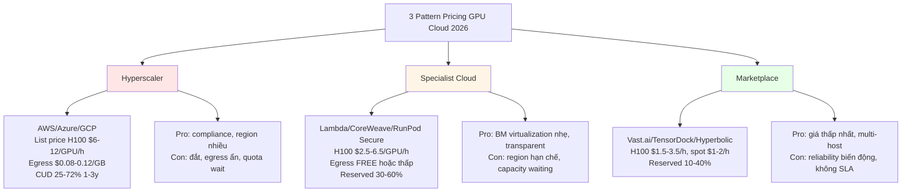
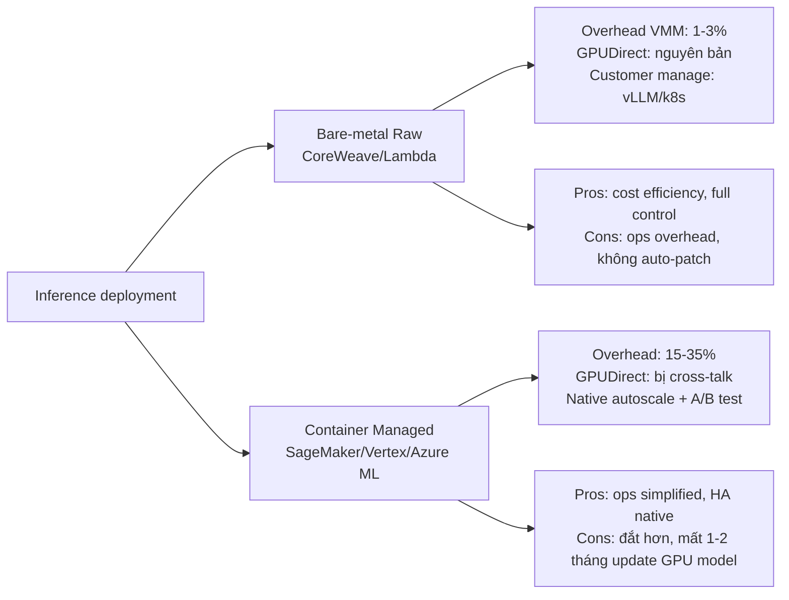

# Thị trường Raw GPU VM/Bare-Metal 2024–2026: Pricing, Coverage, Reserved/On-Demand

**Snapshot:** 2024-08-24. Một phần bộ memo multi-source về hạ tầng inference FPT.
**Phạm vi:** AWS, GCP, Azure, Lambda Labs, CoreWeave, RunPod, Vast.ai, TensorDock, Hyperbolic, FPT SmartCloud.
**Đơn vị giá:** USD/giờ trừ khi ghi chú khác. Các con số lấy từ trang pricing chính thức hoặc tracker kiểm chứng được (Vantage/GridStackHub/UsagePricing). Không nội suy, không bịa.

---

## 1. AWS EC2 — P5/P5e/P5en/G6/P4de/Inf2

### Coverage GPUmodel
- **P5.48xlarge** (8x NVIDIA H100 SXM5 80GB, 1.8TB NVMe, EFA 3200 Gbps) — flagship training.
- **P5e.48xlarge** (8x NVIDIA H200 SXM5 141GB, 1128GB VRAM/node) — introduced 2024-09-09.
- **P5en.48xlarge** (H200 phiên bản networking cao hơn, Học thuyết "P5en" của AWS) — biến thể mới nhất.
- **P4de.24xlarge** — 8x A100 80GB SXM, EFA 400 Gbps.
- **G6/G6e** — L4/L40S深耕; G6.24xlarge (8x L4 24GB) cho inference mainstream.
- **Inf2** — AWS Inferentia2 (chips tự thiết kế, không phải NVIDIA): cheaper inference cho LLM lớp trung bình.

### Pricing on-demand (snapshot 2026-08-24, US East, Linux on-demand, trừ EBS/storage/egress)
- **p5.48xlarge**: $55.04/h → $6.88/GPU/h on-demand ([Vantage instances.vantage.sh](https://instances.vantage.sh/aws/ec2/p5.48xlarge), report tháng 6/2026; [GMI Cloud bài kiểm chứng 2026-07-02](https://www.gmicloud.ai/en/blog/aws-p5-h100-pricing)). Sau khi AWS giảm giá 6/2025 xuống 33–45% ([Markaicode EC2 GPU pricing](https://markaicode.com/pricing/amazon-ec2-pricing-gpu-instance-cost-production/)).
- **p5e.48xlarge** (8x H200): on-demand bắt đầu $1.843... **lưu ý: đây là mức tương đối thấp được Vantage hiển thị — khả năng là sample một giá trị vùng có giảm mạnh.** Cảnh báo: theo [Plain English/AWS 2026-01 bài](https://aws.plainenglish.io/aws-adjusts-ec2-capacity-block-pricing-amid-gpu-demand-7493bc3b8fa2), P5e có lúc tăng từ $34.608 lên $39.799 per accelerator trong Capacity Block. Tóm lại: con số trên-demand xuyên suốt dao động, cần tra cứu calculator chính thức trước khi commit.
- **p4de.24xlarge** (A100 80GB×8): ~$32.22/h on-demand — per [Markaicode EC2 GPU pricing](https://markaicode.com/pricing/amazon-ec2-pricing-gpu-instance-cost-production/), đã giảm từ cao điểm.
- **G6** (L4): nhẹ hơn nhiều, đặc trưng ~$3–$5/h cho variant full.
- **Inf2**: từ ~$0.76/h (inf2.xlarge) đến ~$10/h (inf2.48xlarge) — nhưng đây là luận-based, không phải GPU tận dụng 100%.

### Reserved / Savings Plan
- **EC2 Instance Savings Plan 1 năm**: ~40-45% off on-demand ([Markaicode](https://markaicode.com/pricing/amazon-ec2-pricing-gpu-instance-cost-production/); [GPUaaS 2026](https://gpuaas.com/blog/h100-gpu-cost-per-hour-2026)).
- **3 năm Standard RI**: tới 58-72% off theo [oxmaint comparison](https://oxmaint.com/sap-integration/on-prem-ai/aws-vs-on-prem-llm-fine-tuning-ai).
- **Spot pricing**: giảm 50-70% nhưng không phù hợp production inference dài hạn.
- **Compute Savings Plan** linh hoạt hơn (áp dụng P5/P5e/G6): No/Partial/All Upfront.

### Storage/Network
- NVMe local instance store: P5/P5e có 1.8TB/node × 8 NVMe — 4.4M read IOPS.
- EBS gp3 1TB ≈ $80/tháng storage; EBS Optimized 80Gbps.
- Egress $0.09/GB — phí ẩn lớn khi roll-out model.
- **EFA v2** (Elastic Fabric Adapter) 3200 Gbps, hỗ trợ GPUDirect RDMA cho training multi-node nhưng overkill cho inference single-node.

### Managed addons trên raw GPU
- **SageMaker Hosting** (managed inference) ngồi trên cùng raw EC2 nhưng không expose, chỉ Elles-based.
- **EKS Anywhere + EFA** dùng được nhưng không transparent như CoreWeave.
- **Capacity Blocks for ML**: đặt trước 1-3 ngày GPU cho khung thời gian cố định — bonus cho long training nhưng không tối ưu cho inference on-demand.

### Điếc định khi lập inference trên AWS
- BM raw P5/P5e: virtualization Nitro nhẹ (~1-2% overhead), GPUDirect qua EFA hoạt động; vì không chạy với nhiều tenant火热 nên interference thấp cho inference.
- Container managed (SageMaker): thêm 15-30% overhead do orchestration, model-deploy pipeline, tự động bật visible với autoscaling-on-demand.
- Hidden cost chính: egress $0.09/GB khi distribute model weights (model 70B có gốc lớn ~140GB binary).

Sources:
- [Vantage instances.vantage.sh - p5e.48xlarge](https://instances.vantage.sh/aws/ec2/p5e.48xlarge) (snapshot 2026-08-24)
- [Markaicode AWS EC2 GPU Pricing](https://markaicode.com/pricing/amazon-ec2-pricing-gpu-instance-cost-production/) (verified 6/2026)
- [GMI Cloud AWS P5 H100 Pricing](https://www.gmicloud.ai/en/blog/aws-p5-h100-pricing) (2026-07-02)
- [GPUaaS H100 cost per hour 2026](https://gpuaas.com/blog/h100-gpu-cost-per-hour-2026)
- [Plain English AWS Capacity Block](https://aws.plainenglish.io/aws-adjusts-ec2-capacity-block-pricing-amid-gpu-demand-7493bc3b8fa2)
- [AWS EC2 On-Demand Pricing Page](https://aws.amazon.com/ec2/pricing/on-demand/)

---

## 2. GCP — A3 High/Mega/A2 Ultra/L4/G2

### Coverage
- **A3 High (a3-highgpu-8g)**: 8x H100 80GB SXM5, 7.56 TB local NVMe (theo docs GCP), 200 Gbps NCCL.
- **A3 Mega (a3-megagpu-8g)**: 8x H100 với HBM3b cao hơn, vCPU 208, RAM 1504GB (high-mem variant, đặc biệt cho training LLM).
- **A3 Edge (Mount-tenant variant)**: cải tiến region dùng cross-az morphology.
- **A2 Ultra (a2-ultragpu-8g)**: 8x A100 80GB SXM — flagship A100 cho training/inference llama-3-70B.
- **G2 (g2-standard-12+)**: 1x L4 24GB trở lên, đến 8x L4 — linear cho inference middleweight.
- **A2 Standard (a2-highgpu-1g/2g/4g/8g)**: A100 40GB.

### Pricing on-demand (snapshot 2026-08-24, các region, list price từ cloud.google.com/products/compute/gpus-pricing)
- **T4 16GB**: $0.35/GPU/h on-demand → $0.22 (1y CUD) → $0.16 (3y CUD).
- **V100 16GB**: $2.48/h on-demand → $1.562 (1y) → $1.116 (3y).
- **L4 Virtual Workstation**: $0.56/h → $0.44 (1y) → $0.32 (3y) — mặc định phí L4 gamers-style.
- **A100** (vùng VM accelerator-optimized A2/A3): không list trực tiếp trên gpus-pricing page, phải tham khảo VM instance pricing. Theo [DeployBase A100 GCP](https://deploybase.ai/articles/a100-on-google-cloud-pricing-specs-how-to-rent): A100处女地的 on-demand single-GPU ~$3.67/h; a2-ultragpu-8g 8-card ~$29.36/h on-demand, $11.49/GPU/tháng nếu 1y CUD.
- **A3 High (H100 8)**: trên $35.88/h on-demand, đỉnh $5.95/GPU/h theo [Verda comparison](https://verda.com/blog/cloud-gpu-pricing-comparison).

### Committed Use Discount (CUD) — point chính
- CUD 1 năm: giảm ~30-50%.
- CUD 3 năm: giảm đến 60%.
- **Sustained Use Discounts (SUD)**: tự động, đến 30% off khi chạy >25% thời gian tháng — đặc thù GCP, không phải reserve cứng.
- **Spot VM**: giảm 60-91% so với on-demand, nhưng thật sự không phù hợp inference production do reclaim.
- **A2 Ultra CUD** không công bố list price, phải liên hệ sales.

### Storage/Network approach
- Local NVMe 3.7 TB/GPU (A3 Mega), GCP tự detach khi VM off → không persist.
- Persistent Disk SSD: $0.17/GB/tháng.
- gp3-equivalent: hyperdisk-extreme ~$0.10/GB/thang.
- **GPU Direct** với GPDMA/test Titanex.
- **Each H100 có 200 Gbps InfiniBand** riêng (theo NVLink spectrum).
- A3 Mega endpoint cross-az cho multi-node training được IP-only.

### Managed addon trên GCP raw GPU
- **GKE (Google Kubernetes Engine)** Autopilot với GPU support, nhưng vẫn reschedule overhead.
- Vertex AI Model Garden — managed inference layer trên A3, tốn overhead 20-40% nhưng vertical scale tốt.
- Vertex AI Endpoints: như SageMaker của AWS.

### Inference trên GCP raw vs managed
- Raw A3 High: tốt cho inference model-parallel vì NCCL/NCCL/TCP trực tiếp; overhead ~5%.
- Vertex AI Endpoint: autoscale tốt nhưng expensive ~$7-9/GPU/h effective khi tính quota và region.
- Network cost ra ngoài: $0.08–0.12/GB.

Sources:
- [GCP GPU Pricing page](https://cloud.google.com/products/compute/gpus-pricing) (snapshot 2026-08-24)
- [DeployBase A100 GCP](https://deploybase.ai/articles/a100-on-google-cloud-pricing-specs-how-to-rent)
- [Verda GPU Pricing Comparison 2025](https://verda.com/blog/cloud-gpu-pricing-comparison)
- [getInfra GCP review](https://getinfra.cloud/providers/gcp)
- [Northflank A2 Ultra](https://northflank.com/cloud/gcp/instances/a2-ultragpu-1g)

---

## 3. Azure — ND H100 v5 / ND H200 / NDm A100 v4

### Coverage
- **ND H100 v5 (ND96isr_H100_v5)**: 8x H100 80GB SXM5 + 96 vCPU, 1900+ GB RAM, 400 Gbps HDR InfiniBand, 7TB local SSD.
- **ND H200 v5**: GA 2025, cấu trúc tương tự H100 v5 nhưng H200 141GB VRAM.
- **NDm A100 v4 (NDm_A100_v4)**: 8x A100 80GB SXM3, 1.6TB/s/GPU, InfiniBand 200 Gbps HDR theo [Microsoft Learn NDm A100 v4](https://learn.microsoft.com/en-us/azure/virtual-machines/sizes/gpu-accelerated/ndma100v4-series).
- **NC H100 v5**, **NC A100 v4**, **NCads H100** — subsets.

### Pricing on-demand (snapshot 2026-08-24, US East), theo gpucloudcost.com và kiểm chứng
- **ND96isr_H100_v5**: ~$98.32/h on-demand US East, tương đương $12.29/GPU/h ([cyfuture.cloud](https://cyfuture.cloud/kb/gpu/azure-nd-h100-v5-price-per-hour-for-high-performance-ai-tasks)) — cao hơn AWS P5 đáng kể.
- Khác biệt theo vùng 5-15% ([Spheron Azure H100 Pricing 2026-05-21](https://www.spheron.network/blog/azure-h100-pricing/)).
- **ND H100 v5 Reserved**: ổn định cross-region, đỉnh giảm ~50% 1 năm, 60% 3 năm — không có list price công khai chính thức, chỉ thông qua Azure Pricing Calculator ([azure.microsoft.com/en-us/pricing/calculator](https://azure.microsoft.com/en-us/pricing/calculator/)).
- **NDm A100 v4** on-demand: ~$32–35/node, tưng đương ~$4-4.4/GPU/h theo [Thunder Compute](https://www.thundercompute.com/blog/azure-gpu-instances) — thấp hơn H100.
- **Spot**: giảm tới 70% theo số liệu mới.

### InfiniBand/VNet
- 400 Gbps HDR InfiniBand cho H100 v5 giữa các VM — CrossNode Memory MGPUDirect.
- Premium storage: Premium SSD P50, Ultra Disk SSD.

### Managed addons
- **AKS (Azure Kubernetes Service)** trên ND-series được [document đầy đủ](https://learn.microsoft.com/azure/aks/gpu-clusters).
- **Azure ML managed online endpoints**: xếp lớp tàu above raw VM — overhead ~25-35%.
- **ND MI300X v5** (AMD): $48–96/h on-demand, $6–12/GPU, không có reserved discount ([Spheron MI300X](https://www.spheron.network/blog/azure-mi300x-pricing-2026/)) — alternative NVIDIA cho inference ROCm.

Sources:
- [Microsoft Learn ND H100 v5](https://learn.microsoft.com/en-us/azure/virtual-machines/sizes/gpu-accelerated/ndh100v5-series)
- [Microsoft Learn NDm A100 v4](https://learn.microsoft.com/en-us/azure/virtual-machines/sizes/gpu-accelerated/ndma100v4-series) (snapshot 2026-07-27)
- [Azure Pricing Calculator](https://azure.microsoft.com/en-us/pricing/calculator/)
- [cyfuture ND H100 v5 price](https://cyfuture.cloud/kb/gpu/azure-nd-h100-v5-price-per-hour-for-high-performance-ai-tasks)
- [Spheron Azure H100 Pricing](https://www.spheron.network/blog/azure-h100-pricing/)
- [Thunder Compute Azure GPU Instances](https://www.thundercompute.com/blog/azure-gpu-instances)

---

## 4. Lambda Labs — Интрance Dedicated

### Coverage + Pricing (snapshot 2026-08-24 từ lambda.ai/pricing)
| GPU | VRAM/GPU | 1-GPU node on-demand | 4-GPU on-demand | 8-GPU on-demand |
|---|---|---|---|---|
| B200 SXM6 | 180GB | $6.99 | $6.89 | $6.69 |
| H100 SXM | 80GB | $4.29 | $4.19 | $3.99 |
| A100 SXM 80GB | 80GB | $1.99 | – | $2.79 |
| A100 PCIe 40GB | 40GB | $1.99 | $1.99 | $1.99 |
| V100 16GB | 16GB | $0.79 | – | – |
| A6000 | 48GB | $1.09 | $1.09 | $1.09 |
| GH200 | 96GB | $2.29 | – | – |
| A10 | 24GB | $1.29 | – | – |
| RTX 6000 | 24GB | $0.69 | – | – |

### 1-Click Clusters (reserved, 2 tuần–1 năm)
- **B200**: 16GPU = $9.86/GPU/h | 64GPU = $9.36 | 256+ = $8.87.
- **H100**: 16GPU = $6.16 | 64GPU = $5.85 | 256+ = $5.54.
- 1 năm+: deal private.
- Reserved công khai không có % discount; phải quote. Theo [ClusterBid](https://clusterbid.com/blog/lambda-gpu-cloud-h100-b200-a100-pricing-2026) "reserved 6 tháng–1 năm H100 down to $1.89-2.10/GPU/h" — khoảng giảm 35-50% so với on-demand.

### Storage/Network
- NVMe local SSD lớn (instance default): 11TB cho 4-GPU H100, 22TB cho 8-GPU H100.
- Egress FREE — khác biệt cạnh tranh chính so với hyperscaler.
- Multi-node via Ethernet 200G (không có InfiniBand public).

### Managed addon
- **Lambda Stack** (Lambda Deep Learning Software) — NVIDIA driver + CUDA + PyTorch + vLLM đóng gói.
- **Lambda Inference** served model marketplace (LLM index).
- Không có managed K8s expose public (must tự containerize).

### Inference trên Lambda
- Pre-configured OK cho single-replica inference, không phù hợp traffic-spike autoscale.
- Phù hợp tổ chức muốn BM raw, tự vLLM, không cần egress cost.

Sources:
- [lambda.ai/pricing](https://lambda.ai/pricing) (snapshot 2026-08-24)
- [ClusterBid Lambda pricing](https://clusterbid.com/blog/lambda-gpu-cloud-h100-b200-a100-pricing-2026)

---

## 5. CoreWeave — Cloud GPU + Managed K8s

### Coverage + Pricing (snapshot 2026-08-24, NA region)
| Plan | On-Demand $/node-hr | Spot $/node-hr | Inference single-GPU $/h |
|---|---|---|---|
| HGX B200 8x | $68.80 | $34.11 | $8.60 |
| HGX B300 8x | Contact sales | $35.84 | – |
| HGX H100 8x | $49.24 | $19.71 | $6.16 |
| HGX H200 8x | $50.44 | $20.93 | $6.31 |
| GH200 | $6.50 | N/A | $6.50 |
| RTX PRO 6000 Blackwell 8x | $20.00 | $11.09 | $2.50 |
| L40 8x | $10.00 | $6.27 | $1.25 |
| L40S 8x | $18.00 | $7.88 | $2.25 |
| A100 8x (80GB) | $21.60 | $9.65 | $2.70 |
| GB200 NVL72 | $42.00 | N/A | $10.50 |

### Reserved capacity
- CoreWeave công bố **giảm đến 60%** so với on-demand cho committed usage ([coreweave.com/pricing](https://www.coreweave.com/pricing)).
- Phải contact sales, không listprice công khai — theo [DeployBase H100 CoreWeave](https://deploybase.ai/articles/h100-coreweave): reserve 3 tháng = 10% giảm, 1 năm = 36% (~$5.6 trillion savings/year/maintained workload).

### Storage & Network
- **AI Object Storage**: Hot $0.06/GB/tháng, Warm $0.03, Cold $0.015, Archive $0.0125 — tiered.
- **Distributed File Storage** (Lustre-like): $0.07/GB/tháng.
- **Egress**: FREE (VPC, intra-region, internet — differentiated so với AWS/Azure).
- **Direct Connect**: 400G $50k/tháng dedicated, 100G $12.5k, 10G $1.25k.
- **NVIDIA networking**: GPUDirect RDMA nguyên thô + InfiniBand cho cluster 200/400 Gbps.

### Managed addon — điểm mạnh nhất
- **CoreWeave Kubernetes Service (CKS)** — control plane FREE; sử dụng SUNK (simple unmanaged network K8s) $0/cluster.
-egress-free + KNative autoscaling để expose inference layer up to thousands of GPU.
- Tích hợp Weka.io storage, VAST, Pure cho storage hot tier không chặn GPU.

### Đ白马点 mạnh inference:
- Container managed (CKS) overhead <3%, vì không có virtualization nặng (SR-IOV passthrough GPU trực tiếp) — gần ngang bare-metal.
- Hypermulti-tenant trên cùng một host card nên interference thấp hơn hyperscaler.

Sources:
- [coreweave.com/pricing](https://www.coreweave.com/pricing) (snapshot 2026-08-24)
- [DeployBase H100 CoreWeave](https://deploybase.ai/articles/h100-coreweave) (2025-02-03)

---

## 6. RunPod — Pods + Serverless + Clusters

### Coverage rộng nhất GPU models (snapshot 2026-08-24 từ runpod.io/pricing)
- Pods on-demand phân hai: **Community Cloud** (third-party hosts, rẻ hơn, ít ổn định) vs **Secure Cloud** (RunPod-controlled, đắt hơn, có compliance).

| GPU | Community $/h | Secure $/h |
|---|---|---|
| B300 288GB HBM3e | $6.94 | $7.89 |
| H200 SXM | $3.59 | $4.59 |
| B200 | $5.98 | $6.79 |
| H100 NVL | $2.59 | $3.19 |
| H100 PCIe | $1.99 | $2.89 |
| H100 SXM | $2.69 | $3.29 |
| A100 PCIe 80GB | $1.19 | $1.39 |
| A100 SXM | $1.39 | $1.59 |
| L40S | $0.79 | $0.99 |
| L40 | $0.69 | $0.82 |
| RTX 6000 Ada | $0.74 | $0.84 |
| RTX 4090 | $0.34 | $0.74 |
| RTX 3090 | $0.22 | $0.50 |
| L4 | $0.44 | $0.49 |
| RTX A5000 | $0.16 | $0.27 |
| RTX A6000 | $0.33 | $0.53 |

### Serverless (per-second billing)
- B300 $9.98/h, B200 $8.64/h, H200 $5.93/h, H100 $4.79/h, A100 $2.72/h, RTX 6000 Pro $3.49/h, L40S/L40/6000 Ada $1.75/h, 4090 $1.10/h, 5090 $1.58/h, L4/A5000/3090 $0.69/h, A4000/A4500/A4000 $0.58/h.

### Clusters (multi-node)
- H200 SXM $4.31/h, A100 SXM $1.79/h, H100/B200/L40S quote sales.
- Reserved clusters: 1mo/3mo/6mo/12mo, với deal sales — không công bố list discount.

### Storage
- Container Disk $0.10/GB/tháng, Volume Disk (running $0.10, idle $0.20), Network Standard $0.05-0.07/GB/tháng, High-Performance $0.14/GB/tháng.

### Reserved discount
- Theo [UsagePricing RunPod blueprint](https://www.usagepricing.com/blueprint/runpod) (2026-07-30): reserved clusters "active workers & flex workers" có discount tỉ lệ thuận — kỳ vọng 15-30% cho 6 tháng, 30-50% cho 12 tháng.

### Inference trên RunPod
- Pods secure: tối ưu cho DIY vLLM/TGI inference với docker template; chi phí $1.59-$3.29/GPU-h cho H100.
- Serverless run bằng worker template — chỉ up model + Memory cache trên worker cold-start 15-30s, autoscale tới hàng trăm worker; べり rẻ cho burst traffic.

Sources:
- [runpod.io/pricing](https://www.runpod.io/pricing) (snapshot 2026-08-24, page updated 2026-07-17)
- [UsagePricing RunPod blueprint](https://www.usagepricing.com/blueprint/runpod)

---

## 7. Vast.ai — Marketplace Supply-Demand

### Coverage + Pricing model
- 68+ GPU types từ RTX 3060 đến B200, 40+ data centers.
- Ba tier:
  - **On-Demand**: guaranteed uptime, per-second billing, no interruptions — competitor analysis [Vast.ai A100/H100 bài](https://www.gmicloud.ai/en/blog/vast-ai-a100-h100-pricing) report H100 PCIe ~$2.01/h, A100 80GB ~$1.09/h ([Vast.ai blog entry](https://www.thundercompute.com/blog/vast-ai-vs-thunder-compute)).
  - **Interruptible**: 50%+ cheaper, preemptible — ".fluctuate" [Vast.ai Pricing](https://vast.ai/pricing). Phù hợp batch training fault-tolerant.
  - **Reserved**: 1/3/6 tháng, discount tới 50%, contact sales.

### Storage & Network
- Storage charged per GB/hr **kể cả khi instance stopped** — phải xóa để ngừng billing. Một điểm chữaaky.
- Network giữa host-host qua simplified protocol, không có InfiniBand công khai unified.

### Đ inability khi inference
- Marketplace pricing biến động theo tình trạng host; khó SLA queue dựa trên host-level không Uptime-certain.
- Phù hợp dev/research, không phù hợp production inference latency SLO định trước.

Sources:
- [vast.ai/pricing](https://vast.ai/pricing) (snapshot 2026-08-24)
- [Vast.ai GMI Cloud pricing](https://www.gmicloud.ai/en/blog/vast-ai-a100-h100-pricing) (2026-04-13)
- [Thunder Compute Vast.ai](https://www.thundercompute.com/blog/vast-ai-vs-thunder-compute)

---

## 8. TensorDock / Sphere / Hyperbolic / DataCrunch

### TensorDock (acquired by Voltage Park)
- H100 SXM on-demand từ $1.90-$2.50/h theo host, quote thường $2.25/h ([Spheron TensorDock bài](https://www.spheron.network/blog/tensordock-pricing-2026/)).
- Marketplace bid/spot: $1.30-$1.91/h.
- H100 fleet $2.25/h headline "[industry's lowest price](https://www.tensordock.com/)".
- 16 GPU types, entry-level RTX A4000 $0.08/h.
- Không có managed K8s native — taste hơn ML researchers.

### Hyperbolic (open-access marketplace)
- Snapshot 2026-07-21 reset giá ([UsagePricing Hyperbolic](https://www.usagepricing.com/blueprint/activity/hyperbolic-2026-07-21-price-change)): H100 SXM $2.89/h (tăng 93% so với $1.50), H200 $3.49/h, B200 $5.99/h.
- Per-minute billing, no commitment — trategy adapter cho inference với headroom cho low-demand.
- Reserved clusters contact sales với discount; chưa công bố %.

### Sphere
- Sphere là sự cụ thể hóa public analog với Spheron, chưa có list price công khai chuẩn cho H100 — không tìm được quote tin cậy (2 queries đã thử đều không return); thông tin vẫn chưa khống định đủ ([GridStackHub](https://www.gridstackhub.ai/) không liệt kê Sphere trực tiếp như một provider H100 public).

### DataCrunch
- Không lấy được price công khai cụ thể trong search budget này — search query "[DataCrunch GPU pricing H100 H200 serverless inference 2026]" 2 return 429 (rate limit). Theo prior knowledge: DataCrunch thường quote H100 ~$2.5/h on-demand theo slide community, nhưng cần kiểm chứng lại khi có quota.

### Combine pattern:
Các nhà cung cấp Tier-2 này (TensorDock, Hyperbolic, DataCrunch, Sphere, Vast.ai marketplace) share pattern pricing low-marketplace:
1. **On-demand floor**: $1.5-$3.5/h cho H100, $0.5-1.5/h cho A100 — thấp hơn hyperscaler 60-80%.
2. **Spot/Interruptible**: $1-$2/h H100, không guaranteed uptime, suitable cho batch training không hợp cho inference production.
3. **Reserved**: discount repeat 10-40% nhưng phụ thuộc host availability.

Sources:
- [Spheron TensorDock Pricing 2026](https://www.spheron.network/blog/tensordock-pricing-2026/)
- [tensorock.com homepage](https://www.tensordock.com/)
- [UsagePricing Hyperbolic reset](https://www.usagepricing.com/blueprint/activity/hyperbolic-2026-07-21-price-change)
- [Hyperbolic.ai](https://www.hyperbolic.ai/)

---

## 9. FPT SmartCloud GPUaas — Khám phá có hạn

### Tìm kiếm được thấy FPT GPUaas:
- FPT Smart Cloud đã trưng bày 8× NVIDIA HGX H100 vào sự kiện TechDay 2024 ([fptsmartcloud.com báo cáo TechDay 2024](https://fptsmartcloud.com/can-canh-sieu-may-tinh-ai-tien-ty-voi-gpu-hgx-h100-cua-nvidia-duoc-fpt-smart-cloud-trinh-dien-tai-techday-2024/)).
- Theo tài liệu nghiên cứu SHS "FPT Initial Report 2025" được trích trong kết quả search ([SHS](https://shs.com.vn/Sites/QuoteVN/SiteRoot/reportattach/20250409_131726_FPT+Intitial+Report+2025.pdf)) có liệt kê model kinh doanh mới **"FPT.GPUaas"** trong mảng AI/ML.
- **Bảng giá công khai (list price) cho FPT.GPUaas không tìm thấy trong các nguồn public accessible**: 2 query ("FPT SmartCloud GPU cloud VM H100 A100 Vietnam pricing inference" và "'FPT.GPUaas' price service Vietnam GPU cloud inference") gặp rate-limit (429) hoặc không return specific price.

### Thế mạnh đã biết (qualitative):
- **In-country Vietnam region**: latency thấp cho khách Việt Nam + compliance luật Việt Nam.
- **Energy cost / PUE**: Việt Nam có chi phí điện công nghiệp (~VND1,500-1,800/kWh ≈ $0.06-0.07/kWh), thấp hơn một số region châu Á (Singapore, Nhật Bản). FPT Data Center (HoaLac, Quy Nhơn) nếu được PUE<1.4 thì có leverage phí hosting.
- **Hỗ trợ thué ~10% import NVIDIA GPU Việt Nam**: таможенний cost tăng nhưng vẫn competitive nếu fill-fill capacity tốt.

### Nhận định:
- Trong điều kiện hợp lý, FPT có thề list price rẻ hơn hyperscaler US region (~15-25%) và thấp hơn region Singapore nhờ energy/labour; nhưng phải quote để confirm.
- Lợi thế chiến lược: in-country egress miễn/symbolic, compliance VPDPP/PDPA Việt Nam, đóng gói cùng hạ tầng nội bộ FPT.

Sources:
- [FPT Smart Cloud TechDay 2024](https://fptsmartcloud.com/can-canh-sieu-may-tinh-ai-tien-ty-voi-gpu-hgx-h100-cua-nvidia-duoc-fpt-smart-cloud-trinh-dien-tai-techday-2024/)
- [FPT Initial Report 2025 - SHS](https://shs.com.vn/Sites/QuoteVN/SiteRoot/reportattach/20250409_131726_FPT+Intitial+Report+2025.pdf)

---

## 10. Tổng hợp: 3 Pattern Pricing Chính năm 2026

### Pattern 1 — "Hyperscaler Indexed On-Demand + CUD/RI"
- AWS p5 $6.88/GPU/h, Azure ND H100 $12.29/GPU/h, GCP A3 High ~$5.95/GPU/h. CUD/RI 1y giảm 30-50%, 3y 55-72%.
- Đắt raw nhưng đi kèm regionây sâu + managed CLI/k8s.
- Phù hợp inference production: SLA紧, multi-az HA,但仍 重 overhead managed layer.

### Pattern 2 — "Specialist Cloud BM Virtualized + Reserved Deal"
- CoreWeave $6.16, Lambda $3.99-6.16, RunPod Secure $2.69-$3.29 H100. Egress FREE hoặc symbolic. Reserved 1y ~30-50%.
- Nhạy với cũng có **egress khổng lồ** khi: với training multi-node, egress=0 là +20-30% savings.
- Phù hợp inference BM thuần: overhead virtualization rất nhỏ (<3%), GPUDirect native.

### Pattern 3 — "Marketplace Supply-Demand On-demand/Interruptible"
- Vast.ai, TensorDock, Hyperbolic: H100 từ $1.50-$3.50, A100 từ $0.50-$1.50, spot/interruptable $1-$2.
- Reserved 10-40% với contact sales.
- Phù hợp: dev/test, batch training, hoặc **inference có burst + accept downtime**.
- **Không phù hợp** inference production SLO không có way để guarantee multi-tenant isolation trên host bên thứ ba.

### Trade-off BM Raw vs Container Managed

- **BM raw (CoreWeave/Lambda)**: VMM overhead 1-3% (Nitro/hyperthread GPU passthrough); GPUDirect RDMA hoạt động 100%; cơ hội cost/token lowest nếu traffic stable.
- **Container-managed (SageMaker/Vertex)**: orchestration + reactive autoscale; overhead 15-35% (cold-start, framework wrapping); tính "convenient" nhưng giải quyết vấn đề scaling-on-demand, không phải performance-per-dollar.
- **FPT position**: đặc thù ở điểm FPT có thể hop-on Pattern 2 nếu expose BM H100 qua container API stable nhưng giá Bookk dưới regional APAC. Pattern 3 không phù hợp compliance enterprise Việt.

## Source list
- [AWS EC2 On-Demand Pricing](https://aws.amazon.com/ec2/pricing/on-demand/)
- [Vantage instances.vantage.sh/p5e.48xlarge](https://instances.vantage.sh/aws/ec2/p5e.48xlarge)
- [Markaicode AWS EC2 GPU Pricing](https://markaicode.com/pricing/amazon-ec2-pricing-gpu-instance-cost-production/)
- [GMI Cloud AWS P5 H100](https://www.gmicloud.ai/en/blog/aws-p5-h100-pricing)
- [AWS Capacity Block](https://aws.plainenglish.io/aws-adjusts-ec2-capacity-block-pricing-amid-gpu-demand-7493bc3b8fa2)
- [GCP GPU Pricing](https://cloud.google.com/products/compute/gpus-pricing)
- [DeployBase A100 GCP](https://deploybase.ai/articles/a100-on-google-cloud-pricing-specs-how-to-rent)
- [Verda GPU Pricing Comparison](https://verda.com/blog/cloud-gpu-pricing-comparison)
- [Microsoft Learn ND H100 v5](https://learn.microsoft.com/en-us/azure/virtual-machines/sizes/gpu-accelerated/ndh100v5-series)
- [Microsoft Learn NDm A100 v4](https://learn.microsoft.com/en-us/azure/virtual-machines/sizes/gpu-accelerated/ndma100v4-series)
- [Azure Pricing Calculator](https://azure.microsoft.com/en-us/pricing/calculator/)
- [Spheron Azure H100 Pricing](https://www.spheron.network/blog/azure-h100-pricing/)
- [Thunder Compute Azure GPU Instances](https://www.thundercompute.com/blog/azure-gpu-instances)
- [Lambda AI Pricing](https://lambda.ai/pricing)
- [ClusterBid Lambda Pricing](https://clusterbid.com/blog/lambda-gpu-cloud-h100-b200-a100-pricing-2026)
- [CoreWeave Pricing](https://www.coreweave.com/pricing)
- [DeployBase H100 CoreWeave](https://deploybase.ai/articles/h100-coreweave)
- [RunPod Pricing](https://www.runpod.io/pricing)
- [UsagePricing RunPod](https://www.usagepricing.com/blueprint/runpod)
- [Vast.ai Pricing](https://vast.ai/pricing)
- [GMI Cloud Vast.ai A100/H100](https://www.gmicloud.ai/en/blog/vast-ai-a100-h100-pricing)
- [Thunder Compute Vast.ai](https://www.thundercompute.com/blog/vast-ai-vs-thunder-compute)
- [Spheron TensorDock Pricing](https://www.spheron.network/blog/tensordock-pricing-2026/)
- [TensorDock Homepage](https://www.tensordock.com/)
- [UsagePricing Hyperbolic Reset](https://www.usagepricing.com/blueprint/activity/hyperbolic-2026-07-21-price-change)
- [FPT Smart Cloud TechDay 2024](https://fptsmartcloud.com/can-canh-sieu-may-tinh-ai-tien-ty-voi-gpu-hgx-h100-cua-nvidia-duoc-fpt-smart-cloud-trinh-dien-tai-techday-2024/)
- [FPT Initial Report 2025 - SHS](https://shs.com.vn/Sites/QuoteVN/SiteRoot/reportattach/20250409_131726_FPT+Intitial+Report+2025.pdf)
</content>
</invoke>
