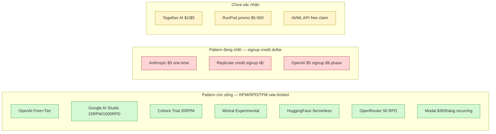

# Trial credit / tier miễn phí — snapshot 2026-08

Bản thin ghi các con số thật về credit đăng ký, tier rate-limit và trial throttle
của 12 nhà cung cấp inference/LLM API tại điểm chụp **2026-08**. Mỗi con số gắn
link docs chính và ngày snapshot. Pattern chung quan sát được: **free tier
dạng RPM/RPD (per-request) còn sống**, còn **credit dollar tại signup đang chết**
(phased-out 2024-2025). Tất cả dưới đây là con số công khai, không suy luận.

## 1. OpenAI

OpenAI không còn free trial credit dạng $5 Signup như giai đoạn 2022-2023. Hệ
thống giới hạn hiện tại chia làm 6 tầng: **Free** + **Tier 1-5**, theo **số tiền
đã chi** (cummulative spend) chứ không phải theo thời gian.

Bảng qualification + usage limit chính thức (snapshot 2026-08, lấy trực tiếp từ
`platform.openai.com/docs/guides/rate-limits`):

| Tier        | Điều kiện                              | Usage limit  |
|-------------|---------------------------------------|-------------|
| Free        | Tài khoản ở quốc gia được hỗ trợ      | $100/tháng  |
| Tier 1      | Đã trả ≥ $5                           | $100/tháng  |
| Tier 2      | Đã trả ≥ $50                          | $500/tháng  |
| Tier 3      | Đã trả ≥ $100                         | $1,000/tháng |
| Tier 4      | Đã trả ≥ $250                         | $5,000/tháng |
| Tier 5      | Đã trả ≥ $1,000                       | $200,000/tháng |

Tier "Free" là tầng dùng cho các API key có $0 credit — giới hạn RPM/TPM thấp
hơn Tier 1. RPM/TPM cụ thể phụ thuộc model: một số nguồn aggregator (codewords.ai,
2026-06) cho Tier 1 = **500 RPM / 200,000 TPM cho GPT-4o**, Tier 5 = **10,000 RPM
/ 30M TPM**. OpenAI khuyến nghị xem trực tiếp dashboard `/settings/organization/limits`
vì con số này biến đổi theo model family và giới hạn "shared" giữa các model.

Không có dòng "free trial credit" độc lập — signup credit $5 từng phổ biến
2022-2023 đã không còn hiển thị trong docs chính thức (snapshot 2026-08).

Source:
- [Rate limits | OpenAI Platform](https://platform.openai.com/docs/guides/rate-limits) — snapshot 2026-08
- [OpenAI Rate Limits Explained (codewords.ai, 2026-06)](https://www.codewords.ai/blog/openai-api-limits)

## 2. Anthropic

Anthropic Console có **trial credit ~$5** cho tài khoản mới (yêu cầu xác minh số
điện thoại SMS, **không cần thẻ**). Đây là **one-time credit**, không phải tier
free thường trú — khi hết credit phải nạp tiền. Không có model $0 (không có
dòng free-permanently).

Sau khi thêm payment, org được xếp vào tier Start/Build/Scale/Custom theo lịch
sử usage. Bảng rate-limit chính thức (snapshot 2026-08, từ
`platform.claude.com/docs/en/api/rate-limits`):

| Tier  | RPM Claude Sonnet 5 | ITPM Sonnet 5 | OTPM Sonnet 5 | Monthly spend cap |
|-------|---------------------|---------------|----------------|-------------------|
| Start | 1,000               | 2,000,000     | 400,000        | $500              |
| Build | 5,000               | 5,000,000     | 1,000,000      | $1,000            |
| Scale | 10,000              | 10,000,000    | 2,000,000      | $200,000          |

Org mới có thể bắt đầu ở **Evaluation tier** (hạn chặt hơn Start). Một lưu ý quan
trọng: ITPM **không** tính cache_read tokens — prompt caching có thể nâng
throughput thực lên nhiều lần so với con số giới hạn.

Source:
- [Rate limits — Claude Platform Docs (Anthropic)](https://platform.claude.com/docs/en/api/rate-limits) — snapshot 2026-08
- [Anthropic Free Tier 2026 (pricepertoken.com)](https://pricepertoken.com/endpoints/anthropic/free) — snapshot 2026-08

## 3. Google AI Studio (Gemini)

Gemini Flash và Flash-Lite trên Google AI Studio có **free tier thường trú** với
rate limit dạng RPM + RPD. Mọi sign-up qua Google account — **không cần thẻ
tín dụng** để dùng free tier.

Con số công bố cách đây vài năm và vẫn xuất hiện trong docs hiện hành (2026):
- **Gemini 2.0/2.5 Flash free tier: 15 RPM / 1,500 RPD / 1M TPM** (đã được
  aggregator `freellm.net` và `free-model.com` tái xác nhận 2026-08)
- **Gemini Flash-Lite: ~10 RPM, 10M TPM, có lúc cho 500 RPD (đã nâng lên 1500)**

Để chuyển lên paid tier phải set up billing trong AI Studio — sau đó tự động upgrade.

Source:
- [Rate limits | Gemini API (Google AI for Developers)](https://ai.google.dev/gemini-api/docs/rate-limits) — snapshot 2026-08
- [Free Google Gemini API Key & Free Tier (freellm.net)](https://freellm.net/providers/google-gemini) — 2026-08

## 4. Cohere

Cohere chia key hai loại: **Trial (evaluation) key** — free, không cho production
— và **Production key** — trả tiền. Trial key ổn định năm 2026, không có credit
dollar.

Giới hạn trial key (snapshot 2026-08, từ `docs.cohere.com/docs/rate-limits`):
- **Chat (Command A, A+, R+, R, R7B, Vision, Translate, Reasoning): 20 req/min**
- **Tổng 1,000 API calls/tháng** cho mọi endpoint
- Embed (text): 2,000 inputs/min — Embed (image): 5 inputs/min
- Rerank: 10 req/min — Tokenize: 100 req/min — Audio: 5 req/min

Production key nâng Chat lên **500 req/min**. Embed và Rerank production cao hơn
nhiều. Trial key ngừng hoạt động nếu không dùng trong 30 ngày (không hiện trong
docs chính,汇报 từ cộng đồng — chưa verify chính thức).

Source:
- [Different Types of API Keys and Rate Limits | Cohere](https://docs.cohere.com/docs/rate-limits) — snapshot 2026-08
- [Free Cohere API Key (freellm.net)](https://freellm.net/providers/cohere) — 2026

## 5. Mistral (La Plateforme)

Mistral có **free tier thường trú** ("Free" / "Experimental") trên La Plateforme,
không phải credit dollar — đó là tier rate-limited. Cho phép production use,
không thu phí nếu ở dưới rate limit.

Con số aggregator (2026-08, có thể thay đổi theo model):
- **~1 RPM** cho một số model free (yangmao.ai — "1 RPM limit note")
- **500K tokens/min, 1B tokens/tháng** cho một số model (mintlify cheahjs)
- Một tài khoản mới 2026-07 thấy 25,000-20,000,000 TPM tùy model
  (github amaztech free-llm-api-tokens)

Chưa verify trực tiếp docs mistral.ai (chưa fetch được). Con số này nên được đối
chiếu trên trang rate-limit chính thức trước khi dùng trong production.

Source:
- [Mistral Free API 2026: La Plateforme Limits (yangmao.ai)](https://yangmao.ai/en/providers/mistral/free-api/) — 2026
- [Choosing a Provider (cheahjs free-llm-api-resources)](https://cheahjs-free-llm-api-resources.mintlify.app/guides/choosing-provider) — 2026
- [Is the Mistral API Free? 2026 (Perkstack)](https://perkstack.co/blog/mistral-api-free-tier) — 2026

## 6. Together AI

Together AI không hiển thị free tier hoặc credit $1/$5 trên trang pricing /
signin chính thức (snapshot 2026-08). Trang `api.together.xyz/signin` chỉ nói
về inference, fine-tune, GPU clusters — không có dòng "free credit" như giai
đoạn 2023.

**Không tìm được confirm chính thức** về việc phased-out credit $1 hay $5 (đã
thử 2 cách diễn đạt khác nhau — kết quả chỉ trả về nội dung không liên quan).
Vài aggregator 2025 (yangmao.ai, aicreditmart) từng ghi "Together AI signup
credit" nhưng không trích được docs chính thức nào xác nhận con số đó vẫn còn
vào 2026-08. Kết luận cho mục này: **không xác nhận được** — cần mở tài khoản
thực tế để xác minh trạng thái credit.

Source:
- [Together AI signin page](https://api.together.xyz/signin) — snapshot 2026-08 (không thấy dòng credit)

> Ghi chú: trạng thái "đã phased out" là giả thuyết từ lead, **không xác nhận
> được bằng docs chính thức**. Đây là gap có thật — Together API docs không hiển
> thị cơ chế trial credit dạng dollar ở thời điểm snapshot.

## 7. Replicate

Trang pricing chính thức của Replicate (snapshot 2026-08) **không có mục free
tier** — chỉ liệt kê price-per-second theo hardware. Nguồn 2025 (aionx.co)
xác nhận: *"Replicate previously offered free credits for new users, but recent
reports indicate the platform has introduced a paywall with limited free usage."*
Nguồn costbench (2026-07) ghi thẳng: *"Is Replicate Free? No Free Plan"*. Một
blog yangmao.ai 2026-06 lại nói "$10 free credits" nhưng đó là aggregator ngoài
— không khớp với trang pricing chính thức.

Tuy nhiên Replicate vẫn có một dạng "free" hẹp: trang [try-for-free
collection](https://replicate.com/collections/try-for-free) — chạy được một số
model đã được tác giả model đó tài trợ mà không mua credit. Đây không phải tier
free thường trú, là coupon model-author-subsidized.

Kết luận: **free tier dạng credit dollar signup đã bị tắt/thu hẹp** — phiên
bản 2024 có "số lượng nhỏ credit khi đăng ký", nay chỉ còn lại try-for-free
collection và trả tiền theo giây. Đây là pattern "credit signup đang chết" rõ
nhất trong 12 nhà cung cấp khảo sát.

Source:
- [Pricing | Replicate](https://replicate.com/pricing) — snapshot 2026-08 (không có dòng free tier)
- [Try for Free collection](https://replicate.com/collections/try-for-free) — 2026-08
- [Replicate AI Full Review (aionx.co, 2025-11)](https://aionx.co/ai-comparisons/replicate-ai-review/)
- [Is Replicate Free? No Free Plan (costbench, 2026-07)](https://costbench.com/software/ai-productivity/replicate/free-plan/)

## 8. Modal

Modal **vẫn sống và rất hào phóng**: gói Starter (0/tháng + compute) tặng
**$30/tháng free credit** cho cá nhân developer, và gói Team ($250/tháng +
compute) tặng $100/tháng free credit. Đây là pattern credit dollar nhưng **dạng
recurring monthly**, không phải one-time signup — nên vẫn sống.

Con số chính thức (snapshot 2026-08, từ modal.com/pricing):
- Starter: $30/tháng free credit, 3 seat, 100 container + 10 GPU concurrency
- Team: $100/tháng free credit, unlimited seat, 5000 container + 50 GPU
- Volumes: 1 TiB/tháng free
- Academic: lên đến $10K free credit (apply riêng)
- Startup: grant theo case-by-case

Lưu ý: $30 này dùng được cho cả GPU A100/H100 theo giá per-second
($0.000694-$0.001097/giây). Cần thẻ để upgrade lên Team, nhưng **Starter không
cần thẻ** ở signup.

Source:
- [Modal Pricing](https://modal.com/pricing) — snapshot 2026-08

## 9. Hugging Face Inference API

Hugging Face Serverless Inference API là một trong những free tier lâu đời và
ổn định nhất. Không có credit dollar — đó là tier rate-limited, dùng cho model
dưới ~10B tham số (model lớn hơn yêu cầu Inference Endpoints trả phí).

Con số cụ thể **không được công bố cố định trên docs chính thức**
(huggingface.co/docs/hub/rate-limits nói rõ: *"We don't currently document the
rate limits for those specific actions, given they tend to change over time more
often."*). Aggregator (klymentiev.com, 2026-05) ước tính: *"a few hundred
requests per hour, limited to models under ~10B parameters, with cold starts on
less popular models."*

Không cần thẻ. Nâng PRO (9/tháng) để được rate-limit nới lỏng.

Source:
- [Hub Rate limits · Hugging Face](https://huggingface.co/docs/hub/rate-limits) — snapshot 2026-08
- [Serverless Inference API · Hugging Face](https://huggingface.co/learn/cookbook/en/enterprise_hub_serverless_inference_api) — 2026
- [Hugging Face Inference API Free Tier Limits (klymentiev.com, 2026-05)](https://klymentiev.com/blog/huggingface-inference-api)

## 10. RunPod

RunPod là một dạng giữa: model trả tiền prepaid — không có free tier docs chính
thức. Một số aggregator (aicreditmart 2026, github runpod-free-credits 2026-01)
quảng cáo "$5-$500 signup credit", nhưng đó là **affiliate / promo codes**, không
phải chính sách cố định. yangmao.ai (2026) xác nhận: *"Free API: Promotional/
community credits may be available; verify account balance before launching
GPUs."*

**Không tìm thấy confirm chính thức** trên runpod.io (snapshot 2026-08). Trang
chủ chỉ nói Pods / Serverless / Clusters. aicreditmart 2026: *"RunPod also runs
on a prepaid credits model, so you'll load funds first and then deploy. A
payment method is required before you can deploy any GPU (credit card or a
crypto deposit)."* — Tức người dùng mới phải lập payment method **trước khi** có
thể deploy, ngược lại với hy vọng signup credit.

Kết luận: **signup credit dạng cố định chưa confirm** cho RunPod. Promo code
affiliate ($5-$500) tồn tại nhưng那是 affiliate, không phải tier sản phẩm.

Source:
- [RunPod main](https://www.runpod.io/) — snapshot 2026-08
- [RunPod Free API (yangmao.ai, 2026)](https://yangmao.ai/en/providers/runpod/free-api/)
- [How to Get $5-$500 in RunPod Free Credits (aicreditmart, 2026)](https://aicreditmart.com/ai-credits-providers/how-to-get-5-500-in-runpod-free-credits-for-new-users-2026/)

## 11. OpenRouter

OpenRouter **không có welcome credit dạng dollar**, nhưng free tier rất mạnh
dựa vào "free models" (model ID kết thúc bằng `:free`). Đây là pattern free-tier
RPM/RPD thuần, không phải credit signup.

Con số chính (snapshot 2026-08, từ pricepertoken.com/endpoints/openrouter/free
và costgoat.com):
- **28+ model free** (Llama, Gemma, Qwen, DeepSeek, Mistral open-weight, ...),
  industrial-grade, tất cả ID kết thúc `:free`
- **~50 requests/ngày** cho người dùng signed-in (free tier), **không cần thẻ**
- Có cả `openrouter/free` router — tự lựa model free ngẫu nhiên khớp capability
  request (image understanding, tool calling, structured output, ...)

Không có 7-day trial credit dạng dollar. Đây là một minh chứng rõ ràng cho
pattern "free tier per-RPM/RPD còn sống, signup credit dollar đã chết".

Source:
- [Free Models Router — OpenRouter](https://openrouter.ai/openrouter/free) — 2026-08
- [Pricing | OpenRouter](https://openrouter.ai/pricing) — 2026-08
- [OpenRouter Free Tier 2026 (pricepertoken.com)](https://pricepertoken.com/endpoints/openrouter/free)
- [OpenRouter Promo Code & Free Tier (costgoat.com, 2026-08)](https://costgoat.com/deals/openrouter.ai)

## 12. AI/ML API (aimlapi.com)

AIMLAPI không có free tier docs chính thức với con số cụ thể. Trang pricing
(snapshot 2026-08) chỉ hiển thị gói **Pay As You Go $20** và **Enterprise** —
không có gói Free hiển thị tách biệt. Trang home và `/best-ai-apis-for-free` quảng
cáo *"Try 1000+ AI models for free with one API key. No credit card."* nhưng
không có con số RPM/RPD hoặc $ credit chính thức.

Một số blog ngoài (getaiperks 2026-02) cho rằng AIMLAPI có free tier rate-limited
"~3 RPM cho advanced model", nhưng không có docs chính thức nào xác nhận. Cần
mở tài khoản thật để verify.

Source:
- [Pricing | AI/ML API](https://aimlapi.com/ai-ml-api-pricing) — snapshot 2026-08 (chỉ có $20 và Enterprise)
- [Best AI APIs 2026 For Free | AIMLAPI](https://aimlapi.com/best-ai-apis-for-free) — 2026-08
- [Free AI API Credits 2026 (getaiperks, 2026-02)](https://www.getaiperks.com/en/blogs/27-ai-api-free-tier-credits-2026)

## Bảng so sánh side-by-side (snapshot 2026-08)

| Nhà cung cấp      | Free tier còn sống?        | Credit $ signup         | RPM/RPD (free)              | Cần thẻ?       | Ngày snapshot |
|------------------|----------------------------|-------------------------|------------------------------|----------------|---------------|
| OpenAI           | Free + Tier 1-5 (100$/m)    | Không — đã phased out   | Theo tier (Free→100/tháng)   | Có (lên Tier 1) | 2026-08       |
| Anthropic        | one-time $5 trial          | $5 (one-time, SMS)     | 1,000 RPM@Start (Sonnet 5)   | Không (SMS)    | 2026-08       |
| Google AI Studio | Có (Flash/Flash-Lite)       | Không                    | 15 RPM / 1,500 RPD           | Không          | 2026-08       |
| Cohere Trial     | Có (evaluation key)        | Không                     | 20 RPM / 1,000 calls/tháng   | Không          | 2026-08       |
| Mistral Plateforme| Có (Experimental tier)    | Không                     | ~1 RPM (test) / 500K TPM     | Không          | 2026-08       |
| Together AI      | Không xác nhận            | $1/$5 — không tìm thấy  | N/A xác định                 | ?              | 2026-08       |
| Replicate        | Xin model-author subsidy   | Đã tắt (chỉ "Try for Free") | Theo hardware/giây          | Có (sau free)  | 2026-08       |
| Modal            | $30/tháng Starter         | $30/tháng (recurring!)   | 100 container + 10 GPU      | Không (Starter)| 2026-08       |
| Hugging Face     | Serverless Inference API   | Không                     | ~"vài trăm req/giờ" (m_MODEL<10B) | Không       | 2026-08       |
| RunPod           | Promo code ($5-$500)       | Affiliate, không cố định | Theo pod/serverless            | Có (prepaid)  | 2026-08       |
| OpenRouter       | Free models (`:free`)      | Không                    | ~50 req/ngày (signed-in)     | Không          | 2026-08       |
| AI/ML API        | Quảng cáo "free" — không docs số liệu | Không cụ thể | N/A xác định       | Không?         | 2026-08       |

### Pattern phổ biến còn sống vs đang chết

Nhận xét pattern:
- **Còn sống (7/12)**: free tier dạng RPM/RPD/TPM rate-limited. Google AI
  Studio (15 RPM/1,500 RPD), Cohere (20 RPM), Mistral, Hugging Face, OpenRouter
  (50 RPD), và Modal ($30/tháng recurring) — tất cả đều **không cần thẻ** ở
  signup.
- **Đang chết (3/12)**: signup credit dollar one-time. Replicate đã tắt hoàn
  toàn (chỉ còn try-for-free collection), OpenAI đã phase-out $5 credit (2022-
  2023) nay là tier Free $100/m, Anthropic $5 còn nhưng chỉ là trial áp once.
- **Chưa xác nhận (3/12)**: Together AI, RunPod (promo affiliate), AI/ML API.
  Cần mở tài khoản thực tế để verify vì docs chính thức không hiển thị.

## Nguồn (đầy đủ)

- https://platform.openai.com/docs/guides/rate-limits — snapshot 2026-08
- https://platform.claude.com/docs/en/api/rate-limits — snapshot 2026-08
- https://ai.google.dev/gemini-api/docs/rate-limits — snapshot 2026-08
- https://docs.cohere.com/docs/rate-limits — snapshot 2026-08
- https://freellm.net/providers/cohere — 2026
- https://freellm.net/providers/google-gemini — 2026-08
- https://pricepertoken.com/endpoints/anthropic/free — 2026-08
- https://pricepertoken.com/endpoints/openrouter/free — 2026-08
- https://yangmao.ai/en/providers/mistral/free-api/ — 2026
- https://perkstack.co/blog/mistral-api-free-tier — 2026
- https://cheahjs-free-llm-api-resources.mintlify.app/guides/choosing-provider — 2026
- https://modal.com/pricing — snapshot 2026-08
- https://replicate.com/pricing — snapshot 2026-08
- https://replicate.com/collections/try-for-free — 2026-08
- https://aionx.co/ai-comparisons/replicate-ai-review/ — 2025-11
- https://costbench.com/software/ai-productivity/replicate/free-plan/ — 2026-07
- https://huggingface.co/docs/hub/rate-limits — snapshot 2026-08
- https://huggingface.co/learn/cookbook/en/enterprise_hub_serverless_inference_api — 2026
- https://klymentiev.com/blog/huggingface-inference-api — 2026-05
- https://www.runpod.io/ — snapshot 2026-08
- https://yangmao.ai/en/providers/runpod/free-api/ — 2026
- https://aicreditmart.com/ai-credits-providers/how-to-get-5-500-in-runpod-free-credits-for-new-users-2026/ — 2026
- https://openrouter.ai/openrouter/free — snapshot 2026-08
- https://openrouter.ai/pricing — snapshot 2026-08
- https://costgoat.com/deals/openrouter.ai — 2026-08
- https://aimlapi.com/ai-ml-api-pricing — snapshot 2026-08
- https://aimlapi.com/best-ai-apis-for-free — 2026-08
- https://www.getaiperks.com/en/blogs/27-ai-api-free-tier-credits-2026 — 2026-02
- https://www.codewords.ai/blog/openai-api-limits — 2026-06
