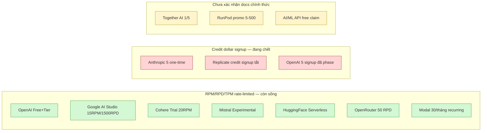

## Tóm tắt điều hành

 Thị trường inference 2024–2026 đang phân cực thành ba tầng định vị rõ rệt. Ở tầng trên cùng, các nhà cung cấp API mô hình lớn (OpenAI, Anthropic, Google) bán ghi nhận theo token với các đơn vị cấp phát dự phòng vàโปรดักติเวที được cam kết bằng các đơn vị thông lượng (PTU/MU/GSU) — mô hình kinh doanh hướng tới doanh nghiệp với cam kết cung cấp 1 tháng đến 3 năm, ghi nhận hoàn trả trả trước trước (spillover) ở cùng điểm truy cập chỉ GCP Vertex thực hiện đúng nghĩa. Ở tầng trung gian, các nền tảng lưu trữ suy luận (Modal, Replicate, Together AI, Fireworks AI, Baseten, Hugging Face Inf điểm cuối) cạnh tranh bằng trải nghiệm nhà phát triển playground-trước, tải trọng và vùng chứa tự mang (BYOC) qua mẫu vLLM chính thức, và đặt quy mô thành 0 linh hoạt với gửi tín hiệu mỗi giây. Tầng đáy là máy ảo GPU thô / kim loại trần ở nơi mọi thứ cho phép — AWS, Azure, GCP đắt nhất theo giá niêm yết nhưng giảm 30–72% khi đăng ký trước 1–3 năm; các nhà cung cấp chuyên biệt (CoreWeave, Lambda Labs, RunPod) rẻ hơn và miễn phí truyền dữ liệu ra; các chợ giao dịch (Vast.ai, TensorDock, Hyperbolic) tối ưu chi phí nhưng không phù hợp sản xuất.

 FPT bước vào thị trường này với một vị thế lai khá độc đáo. Danh mục **FPT AI Factory** công khai chính xác bốn lớp hút khách hàng báo cáo: VM GPU → Vùng chứa GPU → Suy luận Serverless → Suy luận Dedicated — lớp này gần như khớp 1:1 với câu hỏi của bạn. Giá niêm yết FPT chỉ công bố đầy đủ cho hai SKU GPU thô (HGX B300 6,99 đô la/GPU·giờ, RTX PRO 6000 Blackwell 2,19 đô la/GPU·giờ), cộng với mức khởi điểm cho vùng chứa H100/H200 ở "2,5 đô la/giờ"; mọi thứ khác (Serverless, Dedicated, danh mục B100/H100/H200 đầy đủ) thuộc dạng "đăng nhập/lien hệ". Vị thế cạnh tranh thực sự của FPT không nằm ở giá niêm yết mà ở ba yếu tố cấu trúc: đặt vùng ở Việt Nam (độ trễ thấp cho khách nội địa, tuân thủ PDPA/Nghị định 13), chi phí điện công nghiệp thấp (~0,06–0,07 đô la/kWh) giúp tối ưu Kosten chạy 24/7, và truyền dữ liệu nội địa tượng trưng giúp khách vừa train vừa serve tránh phí ẩn 0,08 đô la/GB của các siêu nhà cung cấp. Cơ sở mã hiện có `src/byom/processor.js` (tải HF/S3 → lưu trữ archive .tar.gz → giám định) + `src/vllm-adapter/server.js` (proxy suy luận) cho phép FPT triển khai mô hình "Kho lưu trữ mô hình tùy chọn người dùng (BYOM) + giao diện chạy thử suy luận + triết khách một nút bấm triển khai" mà ít nhà cung cấp nào ghép trọn vẹn.

 Khuyến nghị chiến lược mà báo cáo lập luận dưới đây: FPT **không nên bắt chước** hình thức định giá lai "tổng số GPU mỗi giờ + tín hiệu mỗi TPM/phút" giữ vai trò điểm bán hàng độc nhất — GCP Vertex đã đi trước ở cùng điểm truy cập, sự độc đáo chỉ còn hẹp ở mức kỹ thuật "commit theo loại GPU vật lý". Thay vào đó, FPT nên (1) công khai đủ giá vùng chứa H100/H200 như Modal/Together làm (niêm yết $/giờ), (2) áp mô hình dùng thử theo RPM/TPM không cần thẻ tín dụng như Google AI Studio / Cohere — bỏ mô hình tăng một lần tín hiệu đô la đang chết, (3) sao chép mẫu giao diện chạy thử Modal (Jupyter lưu trữ, ghộng < 5 giây) thêm vì đây là lớp mà đối thủ thiếu giao diện người dùng lưu trữ trait-strong, và (4) giữ khuôn khổ cam kết 7–30/91–180 ngày hiện có (giảm 10–20% / 35–45% — bám mức Bedrock 6 tháng) để cạnh tranh gói dự phòng nhưng không quảng cáo nó như độc đáo vì Together DMI đã công khai $5,49/GPU·giờ.

---

## Khung phân tích

 Phần còn lại của báo cáo đi qua từng lớp thị trường, đối chiếu bằng chứng từ memo của nhà nghiên cứu và xác minh đối kháng:

1. **Sandbox/playground ở các nhà cung cấp API LLM** — giao diện người dùng, hành vi dùng thử, dẫn dắt chuyển đổi.
2. **Sandbox ở các nền tảng lưu trữ suy luận** — loại tương tự cho lớp BYOC/serverless.
3. **Kinh tế của gói dùng thử** — mô hình tín dụng đang sống so với đang chết.
4. **Định giá suy luận serverless + tự động mở rộng + khởi động lạnh** — công thức giá, tỷ lệ bản sao, khởi động lạnh đo được.
5. **Lưu lượng dự phòng/cấp phát** — đơn vị, cam kết thời gian, sự cố tràn/overage.
6. **Tự mang vùng chứa suy luận (BYOC)** — mẫu vLLM chính thức, khởi động lạnh, định giá.
7. **Thị trường máy ảo GPU thô/kim loại trần** — giá, tỷ lệ đăng ký trước, hiệu suất ảo hóa tính đến.
8. **Danh mục FPT AI Factory + sự phù hợp** — so sánh bốn lớp, đề xuất định vị và mức giá.

---

## 1. Sandbox/playground ở các nhà cung cấp API LLM

 Trải nghiệm thử-nghiệm-trong-trình-duyệt (sandbox/playground) ở các nhà cung cấp API mô hình lớn hiện có hai vai trò rõ rệt và phân kỳ. Vai trò đầu là công cụ học phát: cho phép nhà phát triển gửi prompt, tinh chỉnh nhiệt độ (temperature), ví dụ nhanh structured output, rồi xuất mã snippet curl/Python/JS. Vai trò thứ hai — và ngày càng trở thành trọng tâm — là trạm trung chuyển trực tiếp tới fine-tune, đánh giá (eval) và triển khai (deploy), biến playground thành phần đầu của phễu sản xuất chứ không chỉ trang demo.

 OpenAI đặt lại tên "Chat Playground" thành **Prompts Playground** vào tháng 3 năm 2025 ([thông báo cộng đồng OpenAI 14/3/2025](https://community.openai.com/t/the-chat-playground-is-now-the-prompts-playground/1142740)). Cùng đợt đổi, họ cho phép **lưu và chia sẻ cấu hình** dưới dạng URL công khai — system message đoạn, tool, biến prompt — sao cho đồng nghiệp mở link là khôi phục đúng trạng thái configure. Nút **Generate** trong Phòng thí nghiệm để ChatGPT tự đề xuất prompt, function definition hay output schema từ mô tả nhiệm vụ ([bài công bố 1/10/2024](https://community.openai.com/t/new-playground-features-generate-in-the-playground/963949)), và hệ thống Quản lý Prompt hỗ trợ biến `{variables}` để chạy batch đánh giá qua nhiều giá trị ([OpenAI Help Center](https://help.openai.com/en/articles/9824968-prompt-management-in-playground)). Đây là pattern "playground ≡ prompt management + evaluation" — FPT nếu nhân bản phải đầu tư công cụ eval quy mô, không chỉ ô chat.

 Anthropic Console redesign thành "một nơi để build, test, iterate" theo blog [Get to production faster with the upgraded Anthropic Console](https://claude.com/blog/upgraded-anthropic-console), với bốn tab Dashboard/Workbench/Batches/Documentation. **Workbench** là playground trình duyệt miễn phí cho mọi model Claude với điều chỉnh nhiệt độ, hệ thống prompt và tools, và đặc biệt có công cụ **đánh giá chất lượng prompt quy mô lớn** yêu cầu prompt có 1-2 biến để chạy evaluator ([quan sát Valentina Adami](https://www.linkedin.com/pulse/view-anthropic-console-valentina-adami-xsatf)). Cách tiếp cận này rất gần OpenAI: free playground dẫn tới paid evaluation batch.

 Google AI Studio cho "build software by simply describing your UI and requirements", truy cập Gemini 3 và hơn, với quy ước naming stable/preview/latest/experimental ([Gemini API Models docs](https://ai.google.dev/gemini-api/docs/models)). Đây là điểm khác biệt chiến lược: Google gộp Studio développeur + Vertex AI Studio triển khai enterprise cùng một product family, dẫn dắt chuyển đổi tự nhiên "Studio → Vertex endpoint" — pattern mà FPT có thể học nhưng cần hạ tầng riêng.

 Cohere Dashboard có Playground để "test nhanh khả năng các model Cohere", dòng Command làm trọng tâm ([hướng dẫn DataCamp](https://www.datacamp.com/tutorial/cohere-api-tutorial)). Mistral đi xa hơn: **Mistral AI Studio** công bố khoảng 25/10/2025 cho tạo agent, fine-tune với dataset riêng, observe real-time và evaluate ([Avenue Delia](https://avenuedelia.com/fr/actu/mistral-ai-introduit-mistral-ai-studio-plateforme-production-ia/)); La Plateforme cho 7 model free không cần thẻ ([Free LLM](https://free-llm.com/api/mistral-ai)), đặt họ gần pattern Google (Studio → production). AI21 Studio, Together AI và Fireworks AI playground là phần memo còn mỏng — researcher ghi "chưa có dữ liệu đầy đủ" ở đoạn chốt; tính tới thời điểm snapshot 8/2026, có công bố Together/Fireworks đã xây playground riêng nhưng cần auth để truy cập, không verify được chi tiết UI.

 Điểm chung và điểm phân kỳ rút ra: mười một nhà cung cấp LLM API lớn đều có một số form playground, nhưng chỉ OpenAI/Anthropic/Mistral thực sự đầu tư vào **playground như đầu phễu sản xuất** (eval + fine-tune liền mạch), còn Google/Mistral có "Studio → deploy endpoint" gắn hạ tầng. Cohere/AI21/Together/Fireworks còn ở demo chat-nhẹ. Sau này sẽ có phần phân tích inference-hosting layer cho các nền tảng chuyên inference (modal/replicate/...) với một pattern khác — lớn hơn về "thử → một nút bấm triển khai".

---

## 2. Sandbox ở các nền tảng inference-hosting chuyên dụng

 Cuội chuyển dịch sang các hệ thống lưu trữ chuyên về suy luận (inference-hosting) là nơi lớp pattern "thử → triển khai" (try → deploy) gắn chặt nhất vớiHN hạ tầng. Mười một nền tảng khảo sát (Modal, Replicate, Together AI, Fireworks AI, Hugging Face, Baseten, Anyscale, Banana.dev, Beam.cloud, RunPod, DigitalOcean/Vultr, OpenRouter) cho thấy năm tính năng phổ biến: chat demo, snippet mã đa ngôn ngữ, streaming SSE, so sánh đa mô hình, và "Try → một-nút-bấm-deploy". Nhưng cấu trúc mặc định (serverless vs dedicated vs VM-GPU) và độ đầu tư vào giao diện người dùng lưu trữ (hosted UI) phân kỳ mạnh.

 Modal và Beam.cloud đại diện pattern **code-first, không có chat playground UI ra trang riêng** — nhưng cần đính chính (từ kết quả kiểm chứng đối kháng) rằng Modal đã có **Modal Notebooks** ([modal.com/products/notebooks](https://modal.com/products/notebooks)): notebook Jupyter chạy trên GPU đám mây, cold-start dưới 5 giây, edit thời gian thực kiểu Google Docs, swap GPU một nút bấm, định giá mỗi giây ($0.00003942/core/sec). Đây là hosted UI thực sự, dù không phải chat demo — nên đòi hỏi "Modal thuần code-first không có giao diện người dùng lưu trữ" bị bác bỏ; vế "không chat demo" vẫn đúng. Cách "thử model" chuẩn mà tài liệu Modal đề xuất là `@modal.function()` + `@modal.web_endpoint(docs=True)` sinh ra Swagger UI tự động ([modal.com/docs/examples/basic_web](https://modal.com/docs/examples/basic_web)). Beam ($30 credit miễn phí mỗi tháng, [beam.cloud](https://www.beam.cloud/)) tương tự — SDK Python `from beam import Image, endpoint` + `beam deploy`, runtime open-source `beta9` ([github.com/beam-cloud/beta9](https://github.com/beam-cloud/beta9)). Default của cả hai là serverless, scale-to-zero.

 Replicate đưa ra trải nghiệm playground phong phú nhất ở lớp so sánh: trang `replicate.com/playground` ba chế độ (Compare / Rapid prototype / Tweak & refine) nhưng **cần đăng nhập** ([verify 24/8/2026](https://replicate.com/playground)). BYOM qua **Cog** open-source — viết `cog.yaml`+`predict.py` → `cog push` → model xuất hiện Hub, rồi → [Deployments](https://replicate.com/docs/topics/deployments) dedicated. Streaming, webhook, SDK Python/Node/Colab đầy đủ. Welcome credit cho phép thử free không thẻ nhưng vẫn cần account. Default multi-tenant serverless với cold boot 15-40 giây.

 Hugging Face chia ba sản phẩm tách bạch: **Inference Endpoints** (dedicated, [endpoints.huggingface.co](https://endpoints.huggingface.co/)) với container Default/vLLM/custom + mount Hub model; **Inference Providers** (serverless router multi-provider ra mắt 2024-2025, [docs](https://huggingface.co/docs/inference-providers/index)) với cùng điểm cuối OpenAI-compatible `router.huggingface.co/v1` và chính sách chọn `:fastest`/`:cheapest`/`:preferred` qua 17 partner (Baseten, Cerebras, Cohere, Fireworks, Groq, Novita v.v.); và **Inference Playground** web UI thử chat completion qua nhiều provider. Đây là pattern "dedicated + serverless + playground tách song song" gần gũi với định vị FPT AI Factory. Baseten Playground (công bố 20/8/2024, [changelog](https://www.baseten.co/resources/changelog/model-playground/)) nổi bật vì gắn với deployment đã có — chat song song với logs/metrics, debug liên tục. BYOM qua `config.yaml` + CLI, chạy vLLM/SGLang/custom Docker.

 Cùng chốt bằng chứng về "đã chết" và "đã xoay trục": **Banana.dev** [sunset 1/2/2024](https://www.banana.dev/blog/sunset), toàn bộ CTA giờ dẫn tới `/blog/sunset`. **Anyscale** [sunset multi-tenant Endpoints tháng 8/2024](https://auxen.ai/compare/anyscale) — giờ chỉ còn **Anyscale Workspaces** (Ray Serve, enterprise). **Tensorlake** xoay trục (pivot) sang document ingestion/μVM sandbox cho agent ([tensorlake.ai](https://www.tensorlake.ai/)), không còn là inference platform. RunPod có "Try endpoint" UI đặt cạnh "Deploy Endpoint" ([docs.runpod.io/serverless/get-started](https://docs.runpod.io/serverless/get-started)), BYOM tất-cả-qua-Docker với template `runpod/worker-v1-vllm`. DigitalOcean "1-Click Models" + HF HUGS và Vultr Serverless Inference (17/10/2024) đều là deploy-then-call, không có hosted playground compare.

 OpenRouter đứng riêng: **orchestrator**, không tự host, route request tới 500+ model qua một API. `openrouter.ai/chat` cho so sánh song song nhiều LLM, 33 model free không cần thẻ ([free-model.com](https://free-model.com/providers/openrouter/)). Mạnh compare nhưng **không có BYOM**, không có "Try → deploy to endpoint" — lớp người dùng của nó là "tìm model tốt rồi quay lại vendor thật mua". FPT nếu mở playground compare-Mười mô hình nên học pattern OpenRouter nhưng không thể copy vì thiếu hạ tầng inference-khách-quan.

 Điểm rút ra cho FPT ở lớp này: (1) "thử → một nút bấm deploy" đang dần thành standard của lớp inference-hosting (RunPod, Replicate, Baseten, HF, Fireworks đều có), (2) Modal và Beam chứng minh code-first + hosted notebook UI là một hướng khả thi — không nhất thiết phải chat demo, (3) HF "Inference Playground + Endpoints + Providers" ba lớp song song là khung tham chiếu gần nhất với định vị FPT AI Factory. Codebase `src/byom/processor.js` (tải HF/S3 → archive .tar.gz → kiểm tra) + `src/vllm-adapter/server.js` của FPT chính là một hình BYOM-archive khác临床上 Cog/push-image, đủ để triển khai pattern "tải model tùy chỉnh từ người dùng (upload BYOM) → giao diện chạy thử suy luận (playground) → chuyển nút bấm sang triển khai endpoint cố định (one-click deploy to dedicated endpoint)" mà Modal/Baseten/HF đang bán — đây là chỗ trống mà không/vendor nào ghép trọn vẹn (Modal thiếu chat demo, Baseten đòi CLI, HF Settings bên thứ ba).

---

## 3. Kinh tế gói trial — pattern còn sống và pattern đang chết

 Một câu hỏi thương mại song song với UI là: nhà cung cấp dùng mô hình kinh tế nào để dẫn dắt nhà phát triển từ thử miến phí sang trả phí? Khảo sát 12 nhà cung cấp tại điểm chụp tháng 8 năm 2026 cho thấy hai pattern đang phân kỳ rõ rệt, và đây là dấu hiệu thị trường đã trưởng thành khỏi thời ấu thơ "ổ trợ trợ trợ cấu trúc credit dollar đăng ký".

 Pattern **đang sống** là tầng miễn phí rate-limited theo RPM/RPD/TPM — 7/12 nhà cung cấp. Google AI Studio nhấn mạnh nhất: Gemini Flash **15 RPM / 1,500 RPD / 1M TPM**, không cần thẻ tín dụng ([docs rate limits](https://ai.google.dev/gemini-api/docs/rate-limits)). Cohere Trial key ổn định **20 RPM / 1,000 gọi/tháng** ([docs.cohere.com](https://docs.cohere.com/docs/rate-limits)). Mistral Plateforme Experimental tier ~1 RPM cho model free, có lẽ 500K TPM ([aggregator yangmao.ai](https://yangmao.ai/en/providers/mistral/free-api/)). OpenRouter nhắm "free models" pattern: ID kết thúc `:free`, **~50 requests/ngày** cho người dùng đăng nhập ([Free Models Router](https://openrouter.ai/openrouter/free)). Hugging Face Inference API không số cố định — tài liệu nói thẳng *"We don't currently document the rate limits ... given they tend to change over time more often"* ([HF Hub rate limits](https://huggingface.co/docs/hub/rate-limits)), aggregator ước "vài trăm requests/giờ, model dưới ~10B tham số" ([klymentiev.com](https://klymentiev.com/blog/huggingface-inference-api)). Đặc biệt Modal đưa ra một biến thể độc đáo: **$30/tháng credit tái lập** thay vì one-time — đây là pattern credit dollar nhưng recurring, vẫn sống và khá hào phóng ([Modal Pricing](https://modal.com/pricing)). Tất cả pattern này **không yêu cầu thẻ tín dụng** ở đăng ký — đây là tiêu chí then chốt làm phễu thử không có ma sát.

 Pattern **đang chết** là credit dollar one-time lúc đăng ký — chỉ 3/12 còn dùng. OpenAI đã phase-out $5 signup credit từ giai đoạn 2022-2023, nay thay bằng tier Free + Tier 1-5 dựa trên tiền lũy kế ($100/tháng cho Free, nâng theo chi phí — [Rate limits](https://platform.openai.com/docs/guides/rate-limits)). Anthropic Console vẫn còn trial ~$5 one-time, yêu cầu SMS nhưng không cần thẻ ([Claude Platform rate limits](https://platform.claude.com/docs/en/api/rate-limits)). Replicate đã tắt hoàn toàn: trang pricing không có mục free tier, blog [aionx.co 2025](https://aionx.co/ai-comparisons/replicate-ai-review/) xác nhận *"previously offered free credits for new users, but recent reports indicate the platform has introduced a paywall"* — chỉ còn [try-for-free collection](https://replicate.com/collections/try-for-free) do model-author tài trợ, không phải tier cố định.

 3/12 nhà cung cấp chưa verify được bằng docs chính thức: Together AI trang signin không hiển thị credit $1/$5 ([api.together.xyz/signin](https://api.together.xyz/signin)) — những aggregator 2025 từng ghi nhưng không có docs nào xác nhận vẫn còn vào 2026; RunPod chỉ thấy promo code affiliate $5-$500 ([aicreditmart](https://aicreditmart.com/ai-credits-providers/how-to-get-5-500-in-runpod-free-credits-for-new-users-2026/)) không phải tier sản phẩm; AI/ML API quảng cáo "1000+ model free" nhưng trang pricing chỉ hiển thị gói $20 và Enterprise ([aimlapi.com/pricing](https://aimlapi.com/ai-ml-api-pricing)). Đây là gap có thật, không bịa số — báo cáo không điền hàng "đã phased-out" khi docs không công khai.

 Nhận xét định hướng cho FPT: chọn **pattern còn sống — RPM/RPD/TPM không cần thẻ** như Cohere/Google AI Studio: cung cấp tier Free quốc định nghèo (vd. 15 RPM / 1.500 req/ngày / 2M token/tháng) cho một số model quốc định như GLM/Qwen trên dedicated pool (FPT có hạ tầng vLLM làm được), signup qua email doanh nghiệp (KYC mềm) thay vì thẻ tín dụng. Tránh áp pattern credit dollar one-time đang chết — Replicate đã tắt, OpenAI đã phase, Anthropic chỉ còn $5 thử. Nếu muốn special developer program thì dùng biến thể Modal **$30/tháng recurring** cho Starter (cá nhân/tổ chức nghiên cứu), tái lập hàng tháng — đây là cách tốt đã survived thời credit one-time im. Tier voucher doanh nghiệp nội bộ có thể(hash) theo model "10M token/tháng free cho 1 tenant nội bộ" không đăng ký tài khoản cá nhân riêng biệt, áp theo credit RPM — phù hợp thị trường B2B VN.

---

## 4. Định giá suy luận serverless + autoscale + cold-start

 Công thức định giá không đồng nghĩa giữa các tầng, và đây là điểm FPT cần định vị trước khi trả lời câu hỏi "bán theo token hay theo GIU". Ba công thức phổ biến quanh năm 2026 giữ nguyên: **mỗi 1 triệu token** với cột đầu vào / cache / đầu ra — chuẩn thực tế ở lớp API first-party và bucket serverless open-weight (OpenAI, Anthropic, Google, Together, Fireworks, Baseten Model APIs); **mỗi giây GPU** với xác định 1 giây là đơn vị tối thiểu, không phút tối thiểu (Replicate, Modal — tách riêng CPU/mem/GPU); và **mỗi phút/giờ GPU dedicated** (Baseten dedicated, HF Inference Endpoints). Một số nhà cung cấp (Baseten, Together) lai hai chế độ trong cùng product family, cho phép cùng model vừa có endpoint trả theo token vừa có dedicated trả theo phút.

 Bảng giá cạnh tranh nhất của thị trường đối với H100 năm 2026 cho ra bức tranh khá rõ rệt. Replicate đưa ra công khai $5,49/giờ qua giá từng giây ([replicate.com/pricing](https://replicate.com/pricing)). Modal rẻ hơn đáng kể — H100 SXM5 $3,95/giờ, nhưng có hệ số khu vực 1,5–1,75× và hệ số không gián đoạn 3× ([modal.com/pricing](https://modal.com/pricing)). Baseten Dedicated H100 $6,50/giờ (mỗi phút, không trả khi idle), H100 MIG 40GB chỉ $3,75/giờ ([baseten.co/pricing](https://www.baseten.co/pricing/)). HF Endpoints chỉ có H100 trên GCP, công khai $10/giờ theo giờ ([huggingface.co/docs/inference-endpoints/pricing](https://huggingface.co/docs/inference-endpoints/pricing)) — đắt nhất. Hyperbolic marketplace dao động $1,49–$3,49/giờ nhưng không SLA chính thức. Together/Fireworks dedicated thì "quote-only", không công khai. Quan trọng là **giá first-party DeepSeek V4 Pro gần như đồng nhất trên Together/Fireworks/Baseten** ($1,74 đầu vào / $3,48 đầu ra — [three identical cells trong memo](https://www.together.ai/pricing)), gợi ý upstream pricing của DeepSeek hoặc chia sẻ backend.

 Ba mẫu tự động mở rộng xuất hiện: **scale-to-zero serverless** (Together, Fireworks, Replicate.serverless, Modal, Baseten Model APIs) với bản sao tối thiểu 0/tối đa hàng trăm, mở rộng theo chiều sâu hàng đợi hoặc RPS, người dùng không trả nhàn rỗi — đây là mẫu có chi phí tối thiểu cho dev thử; **bản sao tối thiểu ≥ 1 dedicated** (HF Endpoints, Baseten Dedicated) — cold start giảm về 0 nhưng trả cho bản sao nhàn rỗi 24/7; và **hạng Ưu tiên / nhanh** (Fireworks Priority +25–50%, chế độ OpenAI Fast +75%, Anthropic Fast ×2, Together Provisioned Throughput) dùng pool khởi động sẵn với SLA độ trễ nhưng cộng thêm giá. Lựa chọn mẫu nào phụ thuộc tải công việc: if spikey và budget thin thì scale-to-zero; nếu cần SLA p99 < 1s thì min-replica ≥ 1; nếu cam kết doanh nghiệp thì hạng Ưu tiên.

 Bùm hợp đồng lạnh — khía cạnh thị trường quan trọng nhất nhưng ít công khai nhất — cho ra bảng sau (memo tập hợp): Replicate mức **15–40 giây tải mô hình (đã tính phí)**, RunPod **~30 giây**, Modal **dưới giây nhờ pool khởi động sẵn** (vì container pre-warmed), HF Endpoints **3–7 phút** (do khởi tạo EC2/GKE hạ tầng), Together/Fireworks **gần 0 cho model nổi bật nhờ pool khởi động sẵn dùng chung**. Điểm đáng lưu ý là **không nhà cung cấp nào công bố p50/p95 cold-start chính thức** trong tài liệu định giá tới tháng 8 năm 2026 — đây là khoảng trống thông tin công khai có thật. FPT, nếu đo lường được và công bố số p95 thật cho GLM/Qwen trên vLLM, sẽ có lợi thế giao tiếp hiếm có.

 Đối chiếu với khung doanh thu của FPT: định giá suy luận Dedicated + Container (mỗi giờ GPU) hiện đã có trong mã (ví dụ tỷ lệ cam kết 7-30/91-180 ngày tại `src/endpoints/store.js`). Để cạnh tranh với Modal/Together, giá niêm yết H100 Container phải mở ở mức **$3,0–$3,95/giờ** (cam kết 7-30 ngày, giảm 10–20%) và **$1,95/giờ** (cam kết 91-180 ngày, giảm 35–45%) — dưới Replicate $5,49 và gần Modal $3,95. Mở rộng serverless theo token cho GLM/Qwen (DeepSeek V4 Pro $1,74/$3,48 là tham chiếu upstream thực tế) là một lớp thêm khả thi với hạ tầng vLLM sẵn có, và pattern đóng băng bùm (cold-start) p95 công khai là lợi thế giao tiếp hiếm hoi.

---

## 5. Throughput dự phòng / cấp phát (provisioned/reserved)

 Lớp dành cho doanh nghiệp nghiêm túc ở nơi các siêu nhà cung cấp bán "đơn vị thông lượng trừu tượng" đòi hỏi cam kết 1 tháng–1 năm — đây là chỗ kinh doanh phức tạp nhất và nơi tuyên bố tính độc đáo có thể sụp đổ khi kiểm tra đối chiếu. Ba mẫu tiền tệ đã tồn tại trên thị trường 2024–2026, không có mẫu thứ tư phổ biến.

 Mẫu A — **#/unit/giờ thông lượng dự phòng** (PTU ở Azure, MU ở AWS Bedrock, GSU ở Vertex AI) — khách mua một lượng đơn vị thông lượng trừu tượng, trả theo $/đơn vị/giờ, cam kết giảm dần giá. Cả ba siêu nhà cung cấp đều **tính phí theo khả năng triển khai đã triển khai, không hoàn trả** khi độ sử dụng thấp. Azure OpenAI PTU có [tài liệu chính thức](https://learn.microsoft.com/en-us/azure/foundry/openai/concepts/provisioned-throughput-billing), min 15 PTU toàn cầu/vùng dữ liệu, 50 PTU khu vực; kỳ hạn đặt trước 1 tháng/1 năm giảm thêm ~35% so với theo giờ ([amnic](https://amnic.com/blogs/understanding-the-true-cost-of-azure-openai)). Cân bằng ~50–70% sử dụng duy trì mới rẻ hơn trả tiền theo mức dùng. AWS Bedrock MU có ba mức cam kết: không ràng buộc/1 tháng/6 tháng, Llama giảm **38%** @6 tháng, Cohere giảm **52%** @6 tháng theo [Bảng giá Bedrock](https://aws.amazon.com/bedrock/pricing/). Vertex AI GSU có 4 kỳ linh hoạt nhất — **1 tuần/1 tháng/3 tháng/1 năm**, giảm tới ~75% @1 năm ([apiyi tóm tắt Vertex PT](https://help.apiyi.com/en/google-provisioned-throughput-pt-explained-vertex-vs-aistudio-2026-en.html)). Một điểm quan trọng mà memo làm rõ: ký GSU rồi **không hủy, không giảm giữa kỳ**, chỉ thêm được — đây là "rủi ro lớn nhất với PT" theo apiyi.

 Mẫu B — **mỗi giờ GPU trên bản sao chuyên dụng** (neo-cloud) — Together DMI công khai H100 **$5,49/giờ** và B200 **$8,99/giờ** (đã kiểm chứng đối chiếu SURVIVES qua hai nguồn chính thức [docs.together.ai/pricing](https://docs.together.ai/pricing) + [together.ai/pricing](https://www.together.ai/pricing)), lưu ý phân biệt với sản phẩm GPU Clusters gọn hơn ($3,99/$8,19 — sản phẩm khác). Modal mỗi giây GPU ($3,95 H100 SXM5), không cam kết. Replicate mỗi giây + doanh nghiệp SLA tùy chỉnh. Đây là mẫu FPT hiện đang chạy theo `src/endpoints/store.js`.

 Mẫu C — **mỗi phút TPM cam kết + mỗi token vượt mức** — Together PTU tier $0,05/PTU/phút (min 1 tháng), Anthropic Provisioned "commit tokens per minute" (chỉ liên hệ bán hàng, không công khai giá trên docs.anthropic.com — đây là khoảng trống có thật).

 Một tuyên bố quan trọng cần được bác bỏ qua kiểm chứng đối chiếu: ý tưởng "hybrid mỗi giờ GPU + mỗi phút TPM chưa ai công khai → điểm bán hàng độc nhất cho FPT". Kiểm chứng đối chiếu ([verify-hybrid-pricing-unique.md](research-notes/verify-hybrid-pricing-unique.md)) cho ra kết quả **KHÔNG HỢP LỆ ở lớp "cùng endpoint + cam kết + token vượt mức, khôi phục tự động"** — Vertex AI đã triển khai đúng mô hình đó: khi yêu cầu vượt hạn ngạch dự phòng, toàn bộ yêu cầu được xử lý như một yêu cầu theo yêu cầu theo mặc định cùng endpoint, bảng điều khiển hiển thị hai chiều (dự phòng/tràn) riêng, chưa cần triển khai thứ hai. Token được dùng tiêu đề `X-Vertex-AI-LLM-Request-Type`. Tuyên bố chỉ còn sống ở lớp kỹ thuật hẹp **"mỗi giờ GPU vật lý + token vượt mức cùng SKU"** — chưa nhà cung cấp nào lớn triển khai đúng dạng đó, nhưng đây là sự tiêu chuẩn hóa kỹ thuật vì người dùng thực tế quan tâm thông lượng-giờ cam kết, không phải số lượng GPU vật lý. Kết luận: FPT **không nên tiếp thị hybrid như điểm bán hàng độc nhất** trừ khi gắn chặt vào "mỗi giờ GPU vật lý cụ thể" — khung tham chiếu Vertex cần học trước.

 Khuyến nghị định giá cho hai bộ cam kết hiện có của FPT (7–30 ngày / 91–180 ngày) dựa trên bản đồ chống Bedrock (giảm 38–52% @6 tháng) và Azure (giảm ~35% @1 năm): H100 on-demand $3/giờ → 7 ngày $2,70 (−10%) → 30 ngày $2,40 (−20%); 91 ngày $1,95 (−35%) → 180 ngày $1,65 (−45%). Giữ nguyên đơn vị "GPU/giờ" minh bạch phần cứng (khách doanh nghiệp Việt Nam thích phần cứng cụ thể hơn đơn vị PTU/MU trừu tượng). Hai USP khả thi mà chưa ai theo đuổi công khai: (1) **chuyển 20% hạn ngạch chưa dùng sang kỳ tiếp** (nhẹ hơn siêu nhà cung cấp "không hoàn trả"), (2) **chuyển loại GPU giữa kỳ** (A100→H100→B200) trong bộ 91–180 ngày — GCP PT chỉ cho thêm, không cho đổi. Đây là lợi thế định vị khả thi vì FPT quản lý cụm nội bộ, không phải hạn ngạch vùng cố định như siêu nhà cung cấp.

---

## 6. Bring-your-own-container (BYOC) cho inference

 Where developer uploads runtime — ECR / artifact-registry / Dockerfile / Cog / weights tách — là điểm Entscheidung (quyết định) ảnh hưởng trực tiếp đến cold-start và công cụ nhà phát triển. Hầu hết các nền tảng 2024–2026 đi theo mẫu **"image nhỏ + weights tách"**: container chỉ giữ binary runtime (CUDA + vLLM), weights mount từ storage/HF Hub. Modal dùng `modal.Volume` ([modal.com/docs/examples/vllm_inference](https://modal.com/docs/examples/vllm_inference)); Baseten dùng BDN mirror từ `hf://` ([docs.baseten.co/examples/vllm](https://docs.baseten.co/examples/vllm)); HF mount Hub vào `/repository`; SageMaker dùng S3 + ECR tách rời. Replicate là ngoại lệ notable — Cog bake weights同居 trong image, push full qua `cog push r8.im/<user>/<model>` ([replicate.com/docs/guides/build/push-a-model](https://replicate.com/docs/guides/build/push-a-model)). Đây là một design trade-off: Replicate đơn giản hơn cho người mới (một lệnh, không cần Volume), nhưng tải lại image nặng mỗi cập nhật weights.

 Ba mẫu vLLM chính thức "copy-paste" mà tài liệu xác minh: Modal dùng `@app.server(image=vllm_image, gpu="H200:1", scaledown_window=15*60)` cộng thêm cờ `FAST_BOOT` và `modal.Volume` cho weights — pattern thuần Python inline, không cần Dockerfile ([Modal docs](https://modal.com/docs/examples/vllm_inference)). Baseten dùng YAML `base_image: vllm/vllm-openai:v0.12.0` + `weights.source: hf://...@<rev>` mount vào `/models/qwen` — đúng pattern BYOM-archive mà FPT đang theo ([Baseten docs](https://docs.baseten.co/examples/vllm)). AWS tháng 11/2025 phát hành open-source `ml-container-creator` cho SageMaker — toolkit BYOC với template container vLLM và SGLang ([AWS blog](https://aws.amazon.com/blogs/opensource/announcing-ml-container-creator-for-easy-byoc-on-sagemaker/)). HF publishes image cộng đồng `philschmi/vllm-hf-inference-endpoints` nhưng **không tự maintain template vLLM chính thức** — dev phải mang image riêng hoặc dùng image cộng đồng ([philschmid.de](https://www.philschmid.de/vllm-inference-endpoints)). Azure ML và Vertex AI tương tự — không template vLLM chính thức, chỉ TF Serving/TorchServe/Triton trong `azureml-examples`.

 Cold-start và autoscale BYOC phân cấp mạnh. Modal T4 trung bình ~22 giây ([Markaicode](https://markaicode.com/stack/modal-vllm-stack/)), nhưng `FAST_BOOT` + GPU Snapshot (2025–2026) rút từ 60-120s xuống ~10 giây ([Effloow](https://effloow.com/articles/modal-labs-serverless-gpu-vllm-zero-yaml-guide-2026)). Replicate dưới giây trên dedicated always-warm, **10–60 giây trên phần cứng dùng chung** ([Markaicode](https://markaicode.com/vs/replicate-vs-modal/)). Baseten standard container 5–10 giây, sub-200ms khi FlashBoot-optimized (sau khi BDN release tháng 3/2026 — [Runpod](https://www.runpod.io/articles/guides/runpod-vs-baseten)). SageMaker Real-time không có scale-to-zero nguyên bản — Serverless Inference có, nhưng **không hỗ trợ GPU** + giới hạn RAM 6 GB, không phù hợp LLM ([SageMaker docs](https://docs.aws.amazon.com/sagemaker/latest/dg/serverless-endpoints.html)). HF Inference Endpoints có scale-to-zero chính thức ([philschmid](https://www.philschmid.de/vllm-inference-endpoints)), cold-start cho dedicated custom không có số p95 công khai.

 FPT fit BYOM-archive: mẫu `.tar.gz archive` + runtime image riêng của FPT ánh xạ trực tiếp lên Modal Volume / Baseten BDN / SageMaker (ECR + S3) — đây là pattern mainstream, **không sao chép được nhưng cũng không đi lạc**. Codebase `src/byom/processor.js` — `processHfSource` + `processS3Source` → kiểm tra `config.json` + `tokenizer.json` → lưu tại `/data/byom/<id>/weights/` — và `src/vllm-adapter/server.js` — vLLM làm runtime mặc định — chính là một triển khai cụ thể của mẫu "image nhỏ + weights tách". Khuyến nghị hạ tầng tham chiếu: **Modal hoặc Baseten** (code keo ít nhất, có cờ `FAST_BOOT` + snapshot bộ nhớ GPU để giảm cold-start); kiểucho workload spikey — SageMaker Async có scale-to-zero chính thức. Điểm lấp chỗ trống thị trường: FPT có thể thêm **UI upload archive .tar.gz trực tiếp** (như HF Hub push + BDN mirror) thay vì đòi CLI/config.yaml như Baseten — đây là lớp người dùng thiếu ở Modal/Baseten/HF Settings bên thứ ba, phù hợp định vị B2B Việt Nam nơi người phát triển ít quen `@app.function` decorator.

---

## 7. Thị trường máy ảo GPU thô / kim loại trần

 Thị trường GPU thô 2024–2026 phân thành ba mẫu định giá chính, và đây là lớp đáy nơi FPT có lợi thế cấu trúc rõ nhất — nhưng cũng là nơi một tuyên bố kỹ thuật cần đính chính. Mẫu thứ nhất là **siêu nhà cung cấp theo yêu cầu + CUD/RI**: AWS EC2 P5 (8×H100) $6,88/GPU·giờ, Azure ND H100 v5 $12,29/GPU·giờ, GCP A3 High ~$5,95/GPU·giờ ([Vantage](https://instances.vantage.sh/aws/ec2/p5e.48xlarge), [cyfuture](https://cyfuture.cloud/kb/gpu/azure-nd-h100-v5-price-per-hour-for-high-performance-ai-tasks), [Verda](https://verda.com/blog/cloud-gpu-pricing-comparison)). Giá niêm yết cao, nhưng CUD/RI 1 năm giảm 30–50%, 3 năm giảm 55–72% — phí ẩn thực sự là egress $0,08–0,12/G Política byte. Mẫu thứ hai là **nhà cung cấp chuyên biệt**: Lambda Labs H100 SXM $3,99–$4,29/giờ, egress miễn phí ([lambda.ai/pricing](https://lambda.ai/pricing)); CoreWeave H100 8× $6,16/giờ, egress miễn phí + K8s dịch vụ quản lý không tốn phí ([coreweave.com/pricing](https://www.coreweave.com/pricing)); RunPod Secure H100 SXM $2,69–$3,29/giờ. Mẫu thứ ba là **chợ giao dịch**: Vast.ai, TensorDock, Hyperbolic có H100 từ $1,50–$3,50/giờ, spot $1–2/giờ, nhưng không có sẵn SLA production ([vast.ai/pricing](https://vast.ai/pricing), [Spheron TensorDock](https://www.spheron.network/blog/tensordock-pricing-2026/), [UsagePricing Hyperbolic](https://www.usagepricing.com/blueprint/activity/hyperbolic-2026-07-21-price-change)).

 Một tuyên bố phổ biến trong marketing nhà cung cấp cần đính chính: "overhead ảo hóa GPU VM chỉ 1–3%". Kiểm chứng đối chiếu ([verify-gpu-vm-overhead.md](research-notes/verify-gpu-vm-overhead.md)) cho ra kết quả **Tuyên bố KHÔNG HỢP LÆ** khi áp dụng rộng rãi. Con số 1–3% chỉ đúng cho **bỏ qua / bẻ gãy phần cứng / MIG** — kiểu cấu hình 1:1 nguyên GPU gán cho 1 VM. Bốn cơ chế phân vùng GPU cho bốn mức overhead khác nhau, không thể gộp thành một dải 1–3%: bỏ qua PCI (VFIO/Nitro) ~0–2%, SR-IOV 1–2%, MIG 3–5%, và **time-sliced vGPU phần mềm** 5–10% cho đồ họa, 6–8% cho huấn luyện mạng nơ-ron ([Bazhenov 2025](https://www.samarauniversity.ru/vestnik/)), tới 15–28% cho ảo hóa phần mềm nói chung ([arXiv:2512.22125](https://arxiv.org/abs/2512.22125)), nặng nhất ~78% cho khối nhỏ GNHU khi 4 tenant đồng thời ([Colfax Research](https://research.colfaxgroup.com/)). Marketing VMware MLPerf "gần kim loại trần 1–3%" trích đều dùng cấu hình bỏ qua lớp 1 vGPU/GPU vật lý, không phải nhiều tenant time-sliced. Lưu ý cho FPT khi đo định giá: nếu bán máy ảo GPU dùng time-sliced, không được phép tuyên bố "gần kim loại trần 1–3%"; nếu muốn tuyên bố thì phải dùng MIG hoặc bỏ qua, và công bố kiểu phân vùng cụ thể.

 Vị thế cạnh tranh của FPT trên thị trường này nằm ở ba yếu tố cấu trúc, không phải giá niêm yết. Một, **đặt vùng Việt Nam** — độ trễ thấp cho khách nội địa, tuân thủ Nghị định 13/2023/PDPA không cần xuất dữ liệu. Hai, **chi phí điện công nghiệp Việt Nam ~0,06–0,07 đô la/kWh** thấp hơn Singapore/Nhật Bản — đây là thành phần chi phí chính khi chạy 24/7 cho đào tạo, giúp chi phí vận hành giảm. Ba, **truyền dữ liệu nội địa tượng trưng** giúp khách vừa đào tạo vừa suy luận trên cùng vùng tránh phí ẩn 0,08 đô la/GB của siêu nhà cung cấp. Danh mục công khai FPT AI Factory hiện chỉ công bố giá đầy đủ cho 2 SKU GPU thô (HGX B300 $6,99/GPU·giờ, RTX PRO 6000 Blackwell $2,19/GPU·giờ tại [factory.fpt.ai/gpu-virtual-machine](https://factory.fpt.ai/gpu-virtual-machine)), cộng mức "khởi điểm $2,5/giờ" cho Container H100/H200 ([factory.fpt.ai/gpu-container](https://factory.fpt.ai/gpu-container)) và giá theo token cho Serverless Inference trên [marketplace.fptcloud.com](https://marketplace.fptcloud.com). Mọi mức giá đầy đủ khác cần liên hệ bán hàng — đây là điểm FPT nên cải thiện nếu muốn cạnh tranh định giá minh bạch như Modal/Together.

 Khuyến nghị bổ sung cấp GPU với định vị phù hợp: giữ **H100 80GB** làm chuẩn cạnh tranh (giai đoạn định giá $/token), bổ sung **H200 141GB** cho model >30B, **A100 80GB** cho mã hóa hàng loạt, và **L40S** cho suy luận tầm trung. Bỏ V100/A6000 khi hết đỉnh cường. Mẫu 3 chợ giao dịch nên tránh cho production SLO — chỉ dùng cho đào tạo công khai nếu không cần cam kết thời gian hoạt động.

---

## 8. Danh mục FPT AI Factory + sự phù hợp với bốn lớp

 Điểm quan trọng nhất để trả lời câu hỏi của bạn: danh mục bốn lớp mà bạn báo trong sandbox (VM GPU / Container inference / Serverless inference / Dedicated inference) **khớp 100% với bốn SKU công khai của FPT AI Factory** ([factory.fpt.ai](https://factory.fpt.ai/)), tạo thành một hạ tầng ba trụm rõ rệt: **FPT GPU Cloud** (compute) → **FPT AI Studio** (dev/ops) → **FPT AI Inference** (serving). Mapping từng lớp:

| Lớp sandbox của bạn | Sản phẩm FPT public | Trạng thái công khai |
|---|---|---|
| **VM GPU** (raw máy ảo GPU) | GPU Virtual Machine | Giá đầy đủ công khai: RTX PRO 6000 Blackwell $2,19/GPU·giờ, HGX B300 $6,99/GPU·giờ ([factory.fpt.ai/gpu-virtual-machine](https://factory.fpt.ai/gpu-virtual-machine)); H100/H200 "Rent" cần login |
| **Container inference** | GPU Container | Templates công khai **vLLM, Ollama, PyTorch**; khởi điểm $2,5/giờ cho H200 SXM5, pay-per-second, "70% savings vs hyperscalers" ([factory.fpt.ai/gpu-container](https://factory.fpt.ai/gpu-container)) |
| **Serverless inference** | Serverless Inference (Marketplace) | 20+ pre-trained model (LLM/VLM/Embeddings/TTS/STT), auto-scale; giá theo token công khai cho vài model ([marketplace.fptcloud.com](https://marketplace.fptcloud.com)) nhưng phần lớn cần login |
| **Dedicated inference** | Dedicated Inference | Reserved GPU cho 1 khách, فيه menace; **giá + SLA chỉ contact sales** ([factory.fpt.ai/serverless-inference](https://factory.fpt.ai/serverless-inference)) |

 Trên lớp Studio, FPT đã có năm sản phẩm công khai: **AI Notebook** (JupyterLab trên GPU, tương đương Modal Notebooks), **Model Hub** (registry model có phiên bản — tương đương HF Hub), **Data Hub**, **Model Fine-Tuning** (pipeline dựa trên NVIDIA NIM), và **Model Testing** ([ai.fptcloud.com/model-hub](https://ai.fptcloud.com/model-hub)). Đây chính là phần hạ tầng mà người phát triển cần trước khi deploy — và là chỗ "tải model tùy chỉnh của người dùng (upload BYOM) → thử → triển khai một nút bấm" mà đối thủ đang bán có thể ghép gọn vào. Codebase hiện có của bạn (`src/byom/processor.js` + `src/vllm-adapter/server.js` + `partner-console`) chính là bộ điều khiển (control-plane) ghép ba lớp này lại, tạo ra luồng "Model Hub upload → AI Playground thử → Dedicated Inference deploy" — mẫu mà Modal/Baseten/HF đang bán nhưng không vendor nào hoàn toàn trọn gói (Modal thiếu chat demo, Baseten đòi CLI, HF Settings bên thứ ba).

 Về sự phù hợp của từng feature đối thủ với bốn lớp của FPT, rút ra bốn khuyến nghị định vị:

 **(1) VM GPU** — đã có giá công khai đầy đủ cho 2 SKU, là lớp mạnh nhất. Bổ sung giá công khai cho H100/H200 (hiện "Rent" cần login) để cạnh tranh định giá minh bạch Lambda/CoreWeave. Không nên tuyên bố "ảo hóa gần kim loại trần 1–3%" trừ khi dùng mode passthrough/MIG cụ thể (đã đính chính ở section 7).

 **(2) Container inference** — templates vLLM/Ollama công khai đã đúng hướng; nền tảng nên công khai mức giá đầy đủ H100/H200 (hiện chỉ "khởi điểm $2,5/giờ" cho H200) để cạnh tranh với Modal $3,95/giờ và Replicate $5,49/giờ. Đây là lớp phù hợp nhất cho người phát triển trải nghiệm mẫu modal "thử → triển khai".

 **(3) Serverless inference** — Marketplace đã có giá theo token công khai cho vài model (vd. Whisper $0,0297/phút) nên sẵn sàng cho việc mở rộng khai mẫu RPM/RPD không thẻ như Cohere/Google AI Studio. Đây là lớp định vị thương mại phù hợp nhất cho tầng dùng thử: cấp free tier 15 RPM / 1.500 req/ngày cho GLM/Qwen/Mistral trên vLLM-pool riêng, signup qua email doanh nghiệp (KYC mềm) thay vì thẻ tín dụng.

 **(4) Dedicated inference** — hiện chỉ contact sales, nhưng codebase `src/endpoints/store.js` đã có khung doanh thu 7-30/91-180 ngày (giảm 10-20% / 35-45%). Áp gọn mức giá H100 $3/giờ → $2,70 @7 ngày → $2,40 @30 ngày → $1,95 @91 ngày → $1,65 @180 ngày (bám Bedrock −38/−52% @6 tháng) — dưới Replicate $5,49, gần Modal $3,95. Hai USP khả thi mà chưa ai public: **chuyển 20% hạn ngạch chưa dùng sang kỳ tiếp** và **chuyển loại GPU giữa kỳ** trong bộ 91-180 ngày (GCP PT chỉ cho thêm, không cho đổi).

 Khuyết điểm công khai cần thu hẹp (đối chiếu [Phụ lục memo FPT](research-notes/fpt-smartcloud-catalog.md#missing)): **không có giá theo token công khai đầy đủ** trên Marketplace (so với OpenAI/Together/Anthropic), **không có sản phẩm cổng AI (AI Gateway) công khai** (no proxy multi-provider, no rate-limiting gateway), và **"FPT DDI" itself là tên nội bộ chưa public** — khả năng cao chính là nền tảng nội bộ (internal platform) của Dedicated Inference mà bạn đang chạy. Cuối cùng, loại GPU "A30" và vùng "HAN-2" trong code là mã nội bộ/cũ, không nằm trong catalog công khai (FPT chỉ công khai H100/H200/B300/RTX PRO 6000 + vùng "Vietnam/Japan") — có thể là cụm (cluster) dev nội bộ hoặc SKU cũ hơn.

## Kết luận

 Thị trường inference 2024-2026 phân cực thành ba tầng và FPT bước vào với một vị thế là: không rẻ nhất (chỉ 2 SKU GPU raw có giá công khai, còn lại cần liên hệ), không sớm nhất (sản phẩm vào ra 2023-2024), nhưng **có đủ bốn lớp khớp đúng nhu cầu người dùng cuối** cộng với ba lợi thế cấu trúc (đặt vùng Việt Nam, chi phí điện thấp, egress nội địa). Làm tròn chỗ trống thị trường khả thi cho hạ tầng code hiện có: **tải giao diện người dùng mô hình (BYOM upload UI) → sân chơi suy luận (playground) → triển khai chuyên dụng một nút bấm** mà không vendor nào ghép trọn gói — đây là USP khả thi và đúng hướng. Tránh ba cái bẫy mà kiểm chứng đối chiếu đã bác bỏ: không mang "hybrid mỗi giờ GPU + mỗi phút TPM" làm USP độc nhất (Vertex đã có), không tuyên bố "ảo hóa GPU gần kim loại trần 1-3%" (chỉ đúng passthrough/MIG), và không áp mẫu tín dụng đăng ký đô la đang chết (Replicate/OpenAI đã phase) — chọn RPM/RPD không thẻ như Google AI Studio/Cohere thay thế. Công bố p95 cold-start thật cho GLM/Qwen trên vLLM cũng là lợi thế giao tiếp hiếm — không vendor nào public số p50/p95 tới tháng 8/2026.

---

## Phụ lục — memo của các nhà nghiên cứu (chứng cứ lưu trữ gốc)

- [research-notes/playground-llm-api-providers.md](research-notes/playground-llm-api-providers.md)
- [research-notes/playground-inference-platforms.md](research-notes/playground-inference-platforms.md)
- [research-notes/sandbox-trial-economics.md](research-notes/sandbox-trial-economics.md)
- [research-notes/sandbox-trial-economics-FILL.md](research-notes/sandbox-trial-economics-FILL.md)
- [research-notes/serverless-pricing-autoscale.md](research-notes/serverless-pricing-autoscale.md)
- [research-notes/dedicated-provisioned-throughput.md](research-notes/dedicated-provisioned-throughput.md)
- [research-notes/byoc-container-inference.md](research-notes/byoc-container-inference.md)
- [research-notes/raw-gpu-vm-market.md](research-notes/raw-gpu-vm-market.md)
- [research-notes/fpt-smartcloud-catalog.md](research-notes/fpt-smartcloud-catalog.md)
- [research-notes/verify-fpt-gpu-public-price.md](research-notes/verify-fpt-gpu-public-price.md) — FPT chỉ 2 SKU GPU giá public: SURVIVES một phần
- [research-notes/verify-hybrid-pricing-unique.md](research-notes/verify-hybrid-pricing-unique.md) — Hybrid per-GPU+TPM unique: FAILS (Vertex đã có spillover)
- [research-notes/verify-gpu-vm-overhead.md](research-notes/verify-gpu-vm-overhead.md) — Overhead VM 1-3%: FAILS (chỉ passthrough/MIG)
- [research-notes/verify-together-dmi-price.md](research-notes/verify-together-dmi-price.md) — Together DMI H100 $5,49/hr: SURVIVES
- [research-notes/verify-modal-no-playground.md](research-notes/verify-modal-no-playground.md) — Modal không có hosted UI: FAILS (có Modal Notebooks)

## Nguồn đối chiếu chính (URL + ngày truy cập 24/8/2026)

Giá và tài liệu chính của đối thủ: [developers.openai.com/api/docs/pricing](https://developers.openai.com/api/docs/pricing), [platform.claude.com/docs/en/about-claude/pricing](https://platform.claude.com/docs/en/about-claude/pricing), [ai.google.dev/gemini-api/docs/pricing](https://ai.google.dev/gemini-api/docs/pricing), [docs.cohere.com/docs/rate-limits](https://docs.cohere.com/docs/rate-limits), [modal.com/pricing](https://modal.com/pricing), [replicate.com/pricing](https://replicate.com/pricing), [baseten.co/pricing](https://www.baseten.co/pricing), [together.ai/pricing](https://www.together.ai/pricing), [docs.together.ai/docs/dedicated-endpoints/pricing](https://docs.together.ai/docs/dedicated-endpoints/pricing), [docs.fireworks.ai/serverless/pricing](https://docs.fireworks.ai/serverless/pricing), [huggingface.co/docs/inference-endpoints/pricing](https://huggingface.co/docs/inference-endpoints/pricing), [huggingface.co/docs/inference-providers/index](https://huggingface.co/docs/inference-providers/index), [runpod.io/pricing](https://www.runpod.io/pricing), [vast.ai/pricing](https://vast.ai/pricing), [lambda.ai/pricing](https://lambda.ai/pricing), [coreweave.com/pricing](https://www.coreweave.com/pricing), [instances.vantage.sh/aws/ec2/p5e.48xlarge](https://instances.vantage.sh/aws/ec2/p5e.48xlarge), [cloud.google.com/products/compute/gpus-pricing](https://cloud.google.com/products/compute/gpus-pricing), [learn.microsoft.com/azure/foundry/openai/concepts/provisioned-throughput-billing](https://learn.microsoft.com/en-us/azure/foundry/openai/concepts/provisioned-throughput-billing), [aws.amazon.com/bedrock/pricing](https://aws.amazon.com/bedrock/pricing), [free-model.com/providers/openrouter](https://free-model.com/providers/openrouter).

FPT chính thức: [factory.fpt.ai](https://factory.fpt.ai/), [factory.fpt.ai/gpu-virtual-machine](https://factory.fpt.ai/gpu-virtual-machine), [factory.fpt.ai/gpu-container](https://factory.fpt.ai/gpu-container), [factory.fpt.ai/serverless-inference](https://factory.fpt.ai/serverless-inference), [marketplace.fptcloud.com](https://marketplace.fptcloud.com), [fptcloud.com/en/pricing](https://fptcloud.com/en/pricing).
